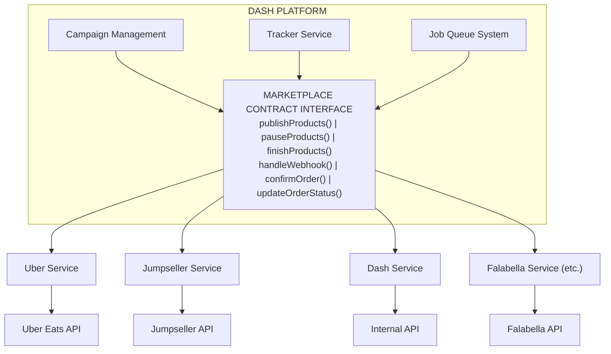
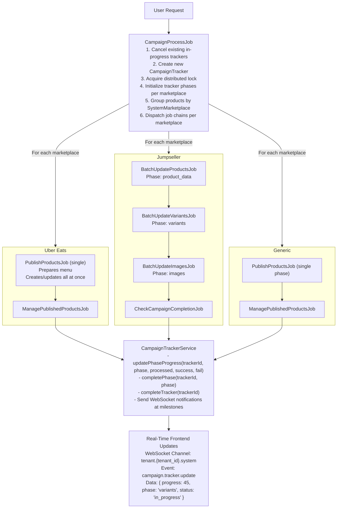
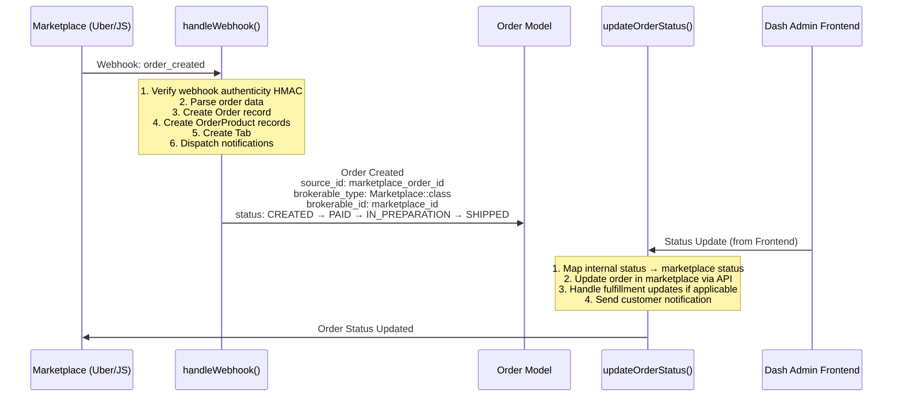

# Marketplace Service Architecture - Technical Documentation

## Table of Contents

1. [Overview](#1-overview)
2. [Architecture Diagram](#2-architecture-diagram)
3. [Directory Structure](#3-directory-structure)
4. [Core Components](#4-core-components)
5. [Job Queue System](#5-job-queue-system)
6. [Database Models](#6-database-models)
7. [Key Design Patterns](#7-key-design-patterns)
8. [Configuration](#8-configuration)
9. [Available Integrations](#9-available-integrations)

---

## 1. Overview

The **Marketplace Service** is a comprehensive e-commerce integration layer that enables the Dash platform to publish products, synchronize inventory, and manage orders across multiple external marketplaces. It provides a unified API for interacting with diverse marketplace platforms while handling the complexity of different APIs, rate limits, and data formats.

### Key Capabilities

| Capability | Description |
|------------|-------------|
| **Multi-Marketplace Publishing** | Publish products to multiple marketplaces simultaneously |
| **Campaign Management** | Group products into campaigns for batch operations |
| **Phase-Based Processing** | Execute operations in phases (products → variants → images) |
| **Real-Time Progress Tracking** | WebSocket notifications for operation progress |
| **Order Synchronization** | Bi-directional order management with marketplaces |
| **Webhook Integration** | Handle marketplace events (orders, inventory updates) |
| **Rate Limiting** | Automatic request throttling per marketplace |

### Design Philosophy



---

## 2. Architecture Diagram

### Campaign Publishing Flow



### Order Processing Flow



---

## 3. Directory Structure

### Backend File Organization

```
domain/
├── app/
│   ├── Contracts/
│   │   └── Marketplace.php                      # Core marketplace interface
│   │
│   ├── Services/
│   │   ├── Campaign/
│   │   │   ├── CampaignTrackerService.php      # Progress tracking orchestration
│   │   │   ├── CampaignNotificationService.php # WebSocket notifications
│   │   │   └── CampaignProgressTracker.php     # Progress utilities
│   │   │
│   │   └── ECommerce/
│   │       └── Marketplaces/
│   │           ├── Abstracts/
│   │           │   └── Manager.php              # Base manager class
│   │           │
│   │           ├── Dash/
│   │           │   ├── DashService.php          # Internal marketplace
│   │           │   ├── Helpers/
│   │           │   ├── OAuth/
│   │           │   ├── Resources/
│   │           │   └── ServiceTraits/
│   │           │
│   │           ├── Jumpseller/
│   │           │   ├── JumpsellerService.php    # Main service
│   │           │   ├── Jobs/                    # Phase-specific jobs
│   │           │   │   ├── BatchUpdateProductsJob.php
│   │           │   │   ├── BatchUpdateVariantsJob.php
│   │           │   │   ├── BatchUpdateImagesJob.php
│   │           │   │   ├── BatchPauseProductsJob.php
│   │           │   │   ├── BatchFinishProductsJob.php
│   │           │   │   └── BatchDeleteProductsJob.php
│   │           │   ├── OAuth/
│   │           │   │   └── OAuthClient.php
│   │           │   └── Traits/
│   │           │       ├── PublishServiceMethods.php
│   │           │       ├── PauseServiceMethods.php
│   │           │       ├── FinishServiceMethods.php
│   │           │       ├── DeleteServiceMethods.php
│   │           │       ├── OrdersServiceMethods.php
│   │           │       ├── CategoryServiceMethods.php
│   │           │       └── NotificationServiceMethods.php
│   │           │
│   │           ├── Uber/
│   │           │   ├── UberService.php          # Main service (2400+ lines)
│   │           │   ├── Helpers/
│   │           │   │   └── UberApiException.php
│   │           │   ├── OAuth/
│   │           │   │   └── OAuthClient.php
│   │           │   ├── Resources/
│   │           │   │   ├── MenuResource.php
│   │           │   │   ├── OrderResource.php
│   │           │   │   ├── StoreResource.php
│   │           │   │   └── ReportResource.php
│   │           │   └── ServiceTraits/
│   │           │       ├── Api.php
│   │           │       ├── Menu.php
│   │           │       ├── OrderTrait.php
│   │           │       ├── Store.php
│   │           │       ├── WebhookTrait.php
│   │           │       └── ...
│   │           │
│   │           ├── Falabella/    # (Disabled)
│   │           ├── MercadoLibre/ # (Disabled)
│   │           ├── Paris/        # (Disabled)
│   │           └── Ripley/       # (Disabled)
│   │
│   ├── Jobs/
│   │   └── ECommerce/
│   │       ├── Campaigns/
│   │       │   ├── CampaignProcessJob.php       # Main orchestrator
│   │       │   ├── CheckCampaignCompletionJob.php
│   │       │   └── ManageCampaign.php
│   │       │
│   │       └── CampaignMarketplaceProducts/
│   │           ├── ActionJobCommonTrait.php     # Shared job functionality
│   │           ├── PublishProductsJob.php
│   │           ├── PauseProductsJob.php
│   │           ├── FinishProductsJob.php
│   │           ├── DeleteProductsJob.php
│   │           ├── ManagePublishedProductsJob.php
│   │           ├── ManagePausedProductsJob.php
│   │           ├── ManageFinishedProductsJob.php
│   │           ├── ManagePreparedProductsJob.php
│   │           └── RepublishErroredProductsJob.php
│   │
│   └── Models/
│       ├── Campaign/
│       │   └── CampaignTracker.php              # Progress tracking model
│       │
│       ├── ECommerce/
│       │   ├── Campaign.php                     # Campaign entity
│       │   ├── CampaignMarketplace.php          # Campaign-marketplace pivot
│       │   ├── CampaignMarketplaceProduct.php   # Product tracking
│       │   └── CampaignMarketplaceProductStack.php
│       │
│       └── Marketplace/
│           ├── Marketplace.php                  # Marketplace instance
│           ├── SystemMarketplace.php            # System-level marketplace
│           ├── TenantSystemMarketplace.php      # Tenant association
│           ├── MarketplaceCall.php              # API call tracking
│           ├── MarketplaceNotification.php      # Webhook tracking
│           └── OutputCategoryMapping.php        # Category mappings
│
└── routes/
    └── api/
        └── marketplace_routes.php               # API endpoints
```

---

## 4. Core Components

### 4.1 Marketplace Contract Interface

**Location:** `domain/app/Contracts/Marketplace.php`

The `MarketplaceContract` defines the standard interface all marketplace services must implement:

```php
interface Marketplace
{
    // Authentication
    public static function oAuthClientClass(): string;
    public function oAuthClient(): OAuthClient;
    public function getMarketplace(): MarketplaceModel;

    // Product Operations
    public function publishProducts($user, $campaignMarketplaceProducts, ...): void;
    public function pauseProducts($user, $campaignMarketplaceProducts, ...): void;
    public function finishProducts($user, $campaignMarketplaceProducts, ...): void;

    // Category & Metadata Sync
    public function handleSyncCategories(?string $hashUpdate): string;
    public function handleSyncMetadataFormats(?string $hashUpdate): string;

    // Webhooks
    public function handleWebhook(string $type, array $payload): array;
    public static function handleNotificationCallback(string $instanceUrlId, array $payload);
    public static function getNotificationHashForAvoidOverlapping(string $id, array $payload): string;
    public static function getNotificationCallbackResponse(array $payload): array;

    // Order Management
    public function confirmOrder($payload): array;
    public function rejectOrder($payload): array;
    public function notifyOrderUpdate(Order $order): void;
    public function updateOrderStatus(Tab $tab, string $orderId, string $status, array $payload = []): array;

    // Rate Limiting
    public function hasRequestsLimiter($action, $extra = []): bool;
    public function getDateTimeForSendNextRequest($action, $extra = []): Carbon;

    // Export
    public function getExportMetadataMappers(): array;
    public function exportCampaignMarketplaceProductHeaders(): array;
    public function getSystemMarketplaceConfigs(): array;
}
```

### 4.2 CampaignTrackerService

**Location:** `domain/app/Services/Campaign/CampaignTrackerService.php`

Orchestrates progress tracking for campaign operations with real-time WebSocket notifications.

**Key Features:**
- Phase-based progress tracking
- Cache management for tracker data
- Milestone notifications (10%, 25%, 50%, 75%, 90%, 100%)
- WebSocket notifications via `AppNotificationBuilder`

**Core Methods:**

| Method | Purpose |
|--------|---------|
| `createTracker($campaign, $action, $user, $marketplace)` | Initialize new tracker |
| `initializeTrackerPhases($trackerId, $phases, $metadata)` | Set up phase structure |
| `startPhase($trackerId, $phase)` | Mark phase as started |
| `updatePhaseProgress($trackerId, $phase, $processed, $success, $failed)` | Update progress |
| `completePhase($trackerId, $phase)` | Mark phase complete |
| `failPhase($trackerId, $phase, $reason)` | Mark phase failed |
| `completeTracker($trackerId, $hasErrors)` | Finalize tracker |
| `failTracker($trackerId, $reason)` | Fail entire tracker |
| `getTrackerProgress($trackerId)` | Get current progress |
| `cleanupOldTrackers($daysOld)` | Maintenance cleanup |

### 4.3 CampaignNotificationService

**Location:** `domain/app/Services/Campaign/CampaignNotificationService.php`

Sends WebSocket notifications for campaign status changes, progress updates, and errors.

**Notification Types:**
- `campaign.status` - Status transitions (PENDING → PUBLISHING → PUBLISHED)
- `campaign.progress` - Processing progress updates
- `campaign.error` - Error notifications
- `campaign.tracker.update` - Tracker phase updates

---

## 5. Job Queue System

### 5.1 Job Architecture

The campaign processing uses a **job chaining pattern** with phase-based execution:

```
CampaignProcessJob (Orchestrator)
    │
    ├── Initialize CampaignTracker with phases
    │
    ├── Group products by SystemMarketplace
    │
    └── For each marketplace:
        │
        ├── Get marketplace-specific phases
        │   └── service::getProcessPhases($action)
        │
        ├── Create job chain:
        │   ├── Phase 1 Job (e.g., BatchUpdateProductsJob)
        │   ├── Phase 2 Job (e.g., BatchUpdateVariantsJob)
        │   ├── Phase 3 Job (e.g., BatchUpdateImagesJob)
        │   └── CheckCampaignCompletionJob
        │
        └── Bus::chain($jobChain)->dispatch()
```

### 5.2 Queue Configuration

| Queue Name | Purpose | Priority |
|------------|---------|----------|
| `campaigns` | Default campaign jobs | Normal |
| `campaign-publishing-phase` | Phase-specific publishing jobs | High |
| `default` | General background jobs | Low |

### 5.3 Key Jobs

#### CampaignProcessJob

**Purpose:** Main orchestrator for campaign publish/pause/finish operations.

**Key Features:**
- Distributed locking to prevent concurrent processing
- Phase-based tracker initialization
- Marketplace-specific phase resolution
- Job chaining with completion checking
- Chunked processing support

#### Generic Product Jobs (ActionJobCommonTrait)

**Implementing Jobs:**
| Job | Action |
|-----|--------|
| `PublishProductsJob` | Publish products to marketplaces |
| `PauseProductsJob` | Pause products on marketplaces |
| `FinishProductsJob` | Remove products from marketplaces |
| `DeleteProductsJob` | Delete products from marketplaces |
| `RepublishErroredProductsJob` | Retry failed products |

#### Manage Jobs

| Job | Purpose |
|-----|---------|
| `ManagePublishedProductsJob` | Post-publish status management |
| `ManagePausedProductsJob` | Post-pause status management |
| `ManageFinishedProductsJob` | Post-finish status management |

---

## 6. Database Models

### 6.1 Campaign Model

**Location:** `domain/app/Models/ECommerce/Campaign.php`

**Statuses:**
```php
const STATUS_PENDING    = 'PENDING';
const STATUS_PUBLISHING = 'PUBLISHING';
const STATUS_PUBLISHED  = 'PUBLISHED';
const STATUS_PAUSING    = 'PAUSING';
const STATUS_PAUSED     = 'PAUSED';
const STATUS_FINISHING  = 'FINISHING';
const STATUS_FINISHED   = 'FINISHED';
```

**Relationships:**
```php
tenant()                    → BelongsTo Tenant
campaignMarketplaces()      → HasMany CampaignMarketplace
marketplaces()              → BelongsToMany Marketplace (through pivot)
campaignMarketplaceProducts() → HasManyThrough CampaignMarketplaceProduct
```

### 6.2 CampaignMarketplaceProduct Model

**Location:** `domain/app/Models/ECommerce/CampaignMarketplaceProduct.php`

**Statuses:**
```php
const STATUS_PENDING   = 'PENDING';
const STATUS_PUBLISHED = 'PUBLISHED';
const STATUS_PAUSED    = 'PAUSED';
const STATUS_WARNING   = 'WARNING';
const STATUS_ERRORED   = 'ERRORED';
const STATUS_FINISHED  = 'FINISHED';
```

**Key Scopes:**
- `scopeValidForUpdateOnMarketplaces()` - Products that can be updated
- `scopeValidForPause()` - Products that can be paused
- `scopeValidForRepublish()` - Products that can be republished
- `scopeValidForPublish()` - Products that can be published
- `scopeValidForFinish()` - Products that can be finished

### 6.3 CampaignTracker Model

**Location:** `domain/app/Models/Campaign/CampaignTracker.php`

**Process Types:**
```php
const PROCESS_TYPE_MAIN = 'main';
const PROCESS_TYPE_MARKETPLACE = 'marketplace';
```

**Actions:**
```php
const ACTION_PUBLISHING = 'publishing';
const ACTION_PAUSING = 'pausing';
const ACTION_FINISHING = 'finishing';
const ACTION_REPUBLISHING = 'republishing';
const ACTION_VALIDATING = 'validating';
```

**Statuses:**
```php
const STATUS_PENDING = 'pending';
const STATUS_AWAITING_PROVISION = 'awaiting_provision';
const STATUS_IN_PROGRESS = 'in_progress';
const STATUS_COMPLETED = 'completed';
const STATUS_FAILED = 'failed';
const STATUS_PAUSED = 'paused';
const STATUS_CANCELLED = 'cancelled';
```

**Key Fields:**
| Field | Type | Description |
|-------|------|-------------|
| `phases_config` | array | Ordered list of phase names |
| `phases_status` | JSON | Per-phase progress data |
| `progress` | int | Overall progress (0-100) |
| `total_tasks` | int | Total tasks to process |
| `completed_tasks` | int | Successfully completed |
| `failed_tasks` | int | Failed tasks |

### 6.4 SystemMarketplace Model

**Location:** `domain/app/Models/Marketplace/SystemMarketplace.php`

**Available Service Classes:**
```php
public static function getAvailableClasses()
{
    return [
        JumpsellerService::class,
        UberService::class,
        DashService::class,
    ];
}
```

---

## 7. Key Design Patterns

### 7.1 Phase-Based Progress Tracking

Each marketplace can define custom phases for operations:

```php
// In marketplace service
public static function getProcessPhases(string $action = 'publish'): array
{
    return match($action) {
        'publish' => [
            'product_data' => BatchUpdateProductsJob::class,
            'variants' => BatchUpdateVariantsJob::class,
            'images' => BatchUpdateImagesJob::class
        ],
        'pause' => ['processing' => BatchPauseProductsJob::class],
        // ...
    };
}
```

### 7.2 Trait-Based Service Composition

Marketplace services use traits for modular functionality:

```php
class JumpsellerService implements MarketplaceContract
{
    use OrdersServiceMethods;       // Order handling
    use CategoryServiceMethods;     // Category sync
    use FinishServiceMethods;       // Product finishing
    use PublishServiceMethods;      // Product publishing
    use PauseServiceMethods;        // Product pausing
    use DeleteServiceMethods;       // Product deletion
    use NotificationServiceMethods; // Webhook handling
}
```

### 7.3 Distributed Locking Pattern

```php
$lockKey = "{$this->action}_campaign_lock_{$this->campaign->id}";
$lock = Cache::lock($lockKey, $lockDuration);

if (!$lock->get()) {
    // Handle lock failure or force acquire
}

try {
    // Process campaign
} finally {
    $lock->release();
}
```

### 7.4 Job Chaining Pattern

```php
$jobChain = [];

foreach ($phases as $phaseName => $phaseJobClass) {
    $job = new $phaseJobClass(
        $this->user,
        $chunk,
        false,        // shouldNotify
        false,        // shouldThrowErrors
        true,         // allowZeroStock
        false,        // isRecursiveDispatch
        $this->trackerId,
        $marketplaceName,
        $phaseName
    );
    $job->onQueue('campaign-publishing-phase');
    $jobChain[] = $job;
}

// Add completion check at end
$jobChain[] = new CheckCampaignCompletionJob(...);

Bus::chain($jobChain)->dispatch();
```

### 7.5 WebSocket Notification Pattern

```php
AppNotificationBuilder::send(
    notificationClass: CampaignTrackerNotification::class,
    data: $info,
    type: 'campaign.tracker.update',
    channel: "tenant.{$tenant_id}.system",
    scope: "channel",
    modelInstance: $tracker,
    targets: ['admin'],
    targetType: "role"
);
```

---

## 8. Configuration

### 8.1 Environment Variables

```bash
# Uber Eats
UBER_API_URL=https://api.uber.com
UBER_CLIENT_ID=your_client_id
UBER_CLIENT_SECRET=your_client_secret

# Jumpseller
JUMPSELLER_API_URL=https://api.jumpseller.com

# Queue Configuration
QUEUE_CONNECTION=redis
CAMPAIGN_QUEUE_NAME=campaigns
```

### 8.2 System Marketplaces Configuration

**Location:** `config/system_marketplaces.php`

```php
return [
    'uber' => [
        'api_url' => env('UBER_API_URL', 'https://api.uber.com'),
        'oauth_url' => 'https://auth.uber.com/oauth/v2',
        'token_exchange_url' => 'https://auth.uber.com/oauth/v2/token',
        'client_id' => env('UBER_CLIENT_ID'),
        'client_secret' => env('UBER_CLIENT_SECRET'),
        'scopes' => [...],
        'webhooks' => [...]
    ],
    'jumpseller' => [
        'api_url' => 'https://api.jumpseller.com',
        'rate_limit' => [
            'requests_per_minute' => 800,
            'requests_per_second' => 20
        ]
    ],
    // ...
];
```

---

## 9. Available Integrations

| Marketplace | Service Class | Status | Description |
|-------------|---------------|--------|-------------|
| **Uber Eats** | `UberService` | ✅ Active | Restaurant menu management |
| **Jumpseller** | `JumpsellerService` | ✅ Active | E-commerce product sync |
| **Dash** | `DashService` | ✅ Active | Internal marketplace |
| Falabella | `FalabellaService` | ⏸️ Disabled | Chilean retail marketplace |
| MercadoLibre | `MercadoLibreService` | ⏸️ Disabled | Latin American marketplace |
| Paris | `ParisService` | ⏸️ Disabled | Chilean retail marketplace |
| Ripley | `RipleyService` | ⏸️ Disabled | Chilean retail marketplace |

### Integration Comparison

| Feature | Uber Eats | Jumpseller |
|---------|-----------|------------|
| Publishing Style | Single menu upload | Multi-phase (product → variants → images) |
| Rate Limiting | 50 req/sec | 800 req/min |
| Chunking | No | Yes (5 products/chunk) |
| Webhooks | Orders, Inventory | Orders, Products |
| Order Management | Full lifecycle | Full lifecycle |
| OAuth | Client Credentials | Basic Auth |

---

## Related Documentation

- [Uber Integration Documentation](./UBER_INTEGRATION.md)
- [Jumpseller Integration Documentation](./JUMPSELLER_INTEGRATION.md)

---

*Last Updated: December 2024*
