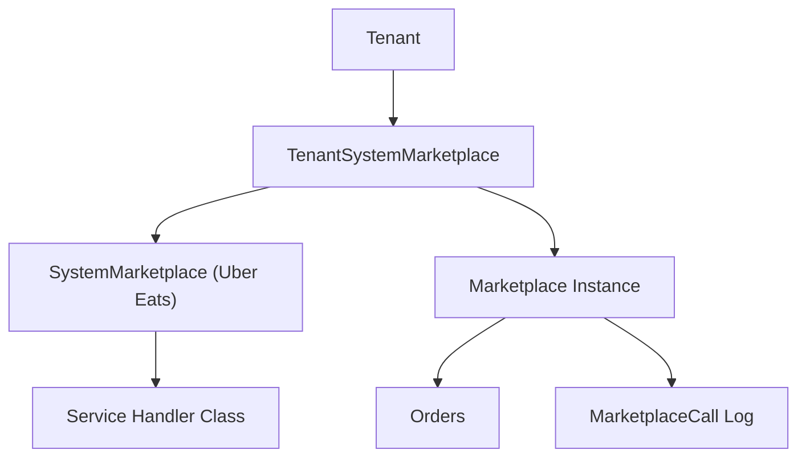

# Marketplace Module

> Third-party marketplace integrations and order brokering.

## Overview

The Marketplace module handles integrations with external sales channels (e.g., Uber Eats, Rappi, DoorDash) through a pluggable architecture.

## Models

### SystemMarketplace
System-level marketplace definitions (e.g., "Uber Eats", "Rappi").

**Key Fields:**
- `name`, `class` - Handler class name
- `icon_path`, `icon_url` - Branding

### TenantSystemMarketplace
Tenant-specific instances of system marketplaces (pivot).

**Key Fields:**
- `tenant_id`, `system_marketplace_id`

### Marketplace
Configured marketplace connections per tenant.

**Key Fields:**
- `hash_id` - 6-character unique identifier
- `tenant_system_marketplace_id` - Parent configuration
- `name`, `active`, `notified`
- `connection_params` - JSON credentials/settings

**Traits:** `HasHashId`, `ResourceVisibility`, `SoftDeletes`

### MarketplaceCall
API call logging for debugging.

### MarketplaceNotification
Incoming marketplace notifications.

### OutputCategoryMapping
Maps tenant categories to marketplace categories.

## Architecture



## Service Integration

Each `SystemMarketplace.class` points to a service handler:

```php
// Service handler interface
interface MarketplaceServiceInterface
{
    public function notifyOrderUpdate(Order $order): void;
    public function syncProducts(Campaign $campaign): void;
    public static function getOrderUrl(Order $order): string;
}
```

## Order Flow

1. External order received via webhook
2. `MarketplaceNotification` created
3. Order created with `brokerable_type = Marketplace::class`
4. Tab created for kitchen tracking
5. Status updates pushed back to marketplace

## Connection Parameters

```php
// Accessing marketplace credentials
$marketplace = Marketplace::find($id);

$apiKey = $marketplace->connection_params['api_key'];
$storeId = $marketplace->connection_params['store_id'];
```
