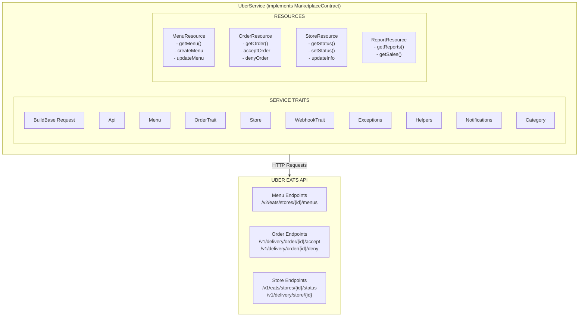
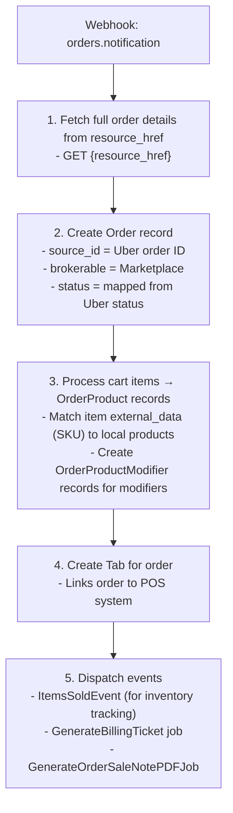

# Uber Eats Integration - Technical Documentation

## Table of Contents

1. [Overview](#1-overview)
2. [Architecture](#2-architecture)
3. [File Structure](#3-file-structure)
4. [Authentication & OAuth](#4-authentication--oauth)
5. [API Integration](#5-api-integration)
6. [Menu Management](#6-menu-management)
7. [Product Publishing Flow](#7-product-publishing-flow)
8. [Order Management](#8-order-management)
9. [Webhook Handling](#9-webhook-handling)
10. [Store Management](#10-store-management)
11. [Error Handling](#11-error-handling)
12. [Constants & Configuration](#12-constants--configuration)
13. [API Reference](#13-api-reference)
14. [Caveats & API Limitations](#14-caveats--api-limitations)
15. [Scheduled Tasks](#15-scheduled-tasks)

---

## 1. Overview

The **UberService** is a comprehensive integration with the Uber Eats API for managing restaurant menus, orders, and store operations. It implements the `MarketplaceContract` interface and provides full CRUD operations for publishing products (menu items) to Uber Eats.

### Key Capabilities

| Capability | Description |
|------------|-------------|
| **Menu Management** | Create, update, and manage restaurant menus |
| **Product Publishing** | Publish products as menu items with modifiers |
| **Order Processing** | Receive and process orders via webhooks |
| **Store Operations** | Control store online/offline status |
| **Real-time Updates** | WebSocket notifications for order events |

### Integration Characteristics

| Characteristic | Value |
|----------------|-------|
| Publishing Style | Single menu upload (all items at once) |
| Rate Limiting | 50 requests/second |
| Authentication | OAuth 2.0 Client Credentials |
| Data Format | Menu-based (categories → items → modifiers) |
| Chunking Support | No (menu uploaded as single entity) |

---

## 2. Architecture

### Component Diagram



### Data Flow Diagram

```
┌──────────────────────────────────────────────────────────────────────────────┐
│                         UBER EATS DATA FLOW                                   │
└──────────────────────────────────────────────────────────────────────────────┘

PUBLISHING FLOW:
================

```mermaid
flowchart TD
    subgraph MF["MENU FLOW"]
        CP["Campaign Products"] --> FP["Format Products<br/>(parse)"]
        FP --> PM["Prepare Menu Data"]
        PM --> UM["Upload Menu (API)"]
        CP --> R1["Products grouped by category"]
        FP --> R2["Products parsed to Uber format with modifiers"]
        PM --> R3["Menu JSON with categories, items, modifiers"]
        UM --> R4["POST/PUT to /v2/eats/stores/{id}/menus"]
    end

    subgraph OF["ORDER FLOW"]
        WE["Webhook Event (Uber)"] --> PO["Parse Order Data"]
        PO --> CO["Create Order Record"]
        CO --> CT["Create Tab Record"]
        WE --> RO1["orders.notification webhook received"]
        PO --> RO2["Map items to local products"]
        CO --> RO3["Order model with products"]
        CT --> RO4["Tab for POS system"]
    end

    subgraph SUF["STATUS UPDATE FLOW"]
        US["Update Status (Local)"] --> MS["Map Status to Uber"]
        MS --> UU["Update Uber (API)"]
        US --> RS1["Order status change in UI"]
        MS --> RS2["Map to Uber status enum"]
        UU --> RS3["POST to /v1/delivery/order/{id}/status"]
    end
```



---

## 3. File Structure

```
domain/app/Services/ECommerce/Marketplaces/Uber/
├── UberService.php                    # Main service class (2400+ lines)
│
├── Helpers/
│   └── UberApiException.php           # Custom exception class
│
├── OAuth/
│   └── OAuthClient.php                # OAuth authentication handler
│
├── Resources/
│   ├── MenuResource.php               # Menu API operations
│   ├── OrderResource.php              # Order API operations
│   ├── StoreResource.php              # Store API operations
│   └── ReportResource.php             # Reporting operations
│
├── ServiceTraits/
│   ├── Api.php                        # API execution with throttling
│   ├── BuildBaseRequest.php           # HTTP request building
│   ├── CanSendHttpRequests.php        # HTTP request execution
│   ├── CategoryTrait.php              # Category operations
│   ├── Exceptions.php                 # Exception utilities
│   ├── Export.php                     # Export functionality
│   ├── Helpers.php                    # General utilities
│   ├── Menu.php                       # Menu preparation logic
│   ├── MetadataTrait.php              # Metadata handling
│   ├── NotificationsTrait.php         # Notification handling
│   ├── OrderTrait.php                 # Order management
│   ├── Store.php                      # Store operations
│   └── WebhookTrait.php               # Webhook processing
│
└── KNOWN_BUGS.md                      # Known issues documentation
```

---

## 4. Authentication & OAuth

### OAuth Client

**Location:** `domain/app/Services/ECommerce/Marketplaces/Uber/OAuth/OAuthClient.php`

### Authentication Flow

The Uber integration uses **OAuth 2.0 Client Credentials** flow:

```
┌─────────────────────────────────────────────────────────────────────────────┐
│                       OAUTH AUTHENTICATION FLOW                              │
└─────────────────────────────────────────────────────────────────────────────┘

┌─────────────┐    ┌─────────────┐    ┌─────────────┐    ┌─────────────┐
│   Dash      │    │   Request   │    │   Uber      │    │   Store     │
│   Backend   │───▶│   Token     │───▶│   OAuth     │───▶│   Token     │
│             │    │             │    │   Server    │    │             │
└─────────────┘    └─────────────┘    └─────────────┘    └─────────────┘
                         │                  │                  │
                         │                  │                  │
                         ▼                  ▼                  ▼
                   ┌─────────────────────────────────────────────────┐
                   │ POST https://auth.uber.com/oauth/v2/token       │
                   │                                                 │
                   │ Body:                                           │
                   │   client_id: {CLIENT_ID}                        │
                   │   client_secret: {CLIENT_SECRET}                │
                   │   grant_type: client_credentials                │
                   │   scope: eats.store eats.order eats.report      │
                   └─────────────────────────────────────────────────┘
```

### Key OAuth Methods

| Method | Signature | Purpose |
|--------|-----------|---------|
| `getAuthUrl()` | `(): array` | Initiates OAuth flow, returns auth URL and token data |
| `oAuthCallback()` | `(string $code): string` | Handles OAuth callback with authorization code |
| `refreshToken()` | `(): string` | Refreshes expired access tokens |
| `isTokenRefreshRequired()` | `(): bool` | Checks if token needs refreshing |
| `syncWithMarketplaceSettings()` | `(): bool` | Syncs local settings with Uber data |
| `getSettings()` | `(): JsonResponse` | Retrieves marketplace settings |
| `publishSettings()` | `(): JsonResponse` | Publishes settings to Uber |

### Token Refresh Logic

```php
public function refreshToken(): string
{
    // Supports both refresh_token grant (if available) and client_credentials grant
    if ($refreshToken = $this->marketplace->connection_params['refresh_token'] ?? null) {
        // Use refresh_token grant
        $response = Http::asForm()->post($tokenUrl, [
            'client_id' => $clientId,
            'client_secret' => $clientSecret,
            'grant_type' => 'refresh_token',
            'refresh_token' => $refreshToken
        ]);
    } else {
        // Fall back to client_credentials grant
        $response = Http::asForm()->post($tokenUrl, [
            'client_id' => $clientId,
            'client_secret' => $clientSecret,
            'grant_type' => 'client_credentials',
            'scope' => $scopes
        ]);
    }
    
    // Store new tokens
    $this->marketplace->update([
        'connection_params' => array_merge($this->marketplace->connection_params, [
            'access_token' => $response['access_token'],
            'expires_in' => $response['expires_in'],
            'refresh_token' => $response['refresh_token'] ?? null
        ])
    ]);
    
    return $response['access_token'];
}
```

### Connection Parameters Format

```php
public static function getConnectionParamFormats($marketplaceId, $useOwnToken = false, $useCustomConnection = false): array
{
    return [
        'connection_params.use_custom_connection' => 'boolean',
        'connection_params.client_id' => 'string',
        'connection_params.client_secret' => 'string',
        'connection_params.access_token' => 'string',
        'connection_params.expires_in' => 'string',
        'connection_params.store_id' => 'string',
        'connection_params.menu_id' => 'string',
        'connection_params.webhook_token' => 'string',
        'connection_params.service_availability' => 'UberStoreAvailability'
    ];
}
```

---

## 5. API Integration

### API Trait

**Location:** `domain/app/Services/ECommerce/Marketplaces/Uber/ServiceTraits/Api.php`

### Rate Limiting Configuration

```php
private static float $lastCallTime = 0;
private static int $maxRetries = 3;
private static int $rateLimit = 50; // requests per second
```

### Core API Method

```php
protected function executeApiCall(
    string $method, 
    string $endpoint, 
    array $data = [], 
    int $maxRetries = null
): Response
```

**Features:**
- Automatic rate limiting (50 requests/second)
- Exponential backoff with jitter
- Automatic retries on server errors (5xx) and rate limiting (429)
- Supports both relative paths and full URLs
- JSON request/response handling

### Request Throttling

```php
protected function throttleRequest(): void
{
    $currentTime = microtime(true) * 1000;
    $minTimeBetweenCalls = 1000 / self::$rateLimit; // 20ms
    
    if (self::$lastCallTime > 0) {
        $elapsed = $currentTime - self::$lastCallTime;
        if ($elapsed < $minTimeBetweenCalls) {
            usleep((int)(($minTimeBetweenCalls - $elapsed) * 1000));
        }
    }
    
    self::$lastCallTime = microtime(true) * 1000;
}
```

### Retry Logic

```php
protected function shouldRetryRequest(int $statusCode): bool
{
    return $statusCode >= 500 || $statusCode === 429;
}

protected function calculateBackoff(int $attempt): int
{
    $baseDelay = 1000; // 1 second
    $maxDelay = 30000; // 30 seconds
    
    // Exponential: min(1000 * 2^(attempt-1), 30000) + jitter
    $delay = min($baseDelay * pow(2, $attempt - 1), $maxDelay);
    $jitter = rand(0, 1000);
    
    return $delay + $jitter;
}
```

### Request Flow Diagram

```
┌─────────────────────────────────────────────────────────────────────────────┐
│                         API REQUEST FLOW                                     │
└─────────────────────────────────────────────────────────────────────────────┘

┌──────────────┐    ┌──────────────┐    ┌──────────────┐    ┌──────────────┐
│ executeApi   │    │  throttle    │    │   execute    │    │   handle     │
│ Call()       │───▶│  Request()   │───▶│   HTTP       │───▶│   response   │
│              │    │              │    │              │    │              │
└──────────────┘    └──────────────┘    └──────────────┘    └──────────────┘
                                               │
                                               │ on 5xx or 429
                                               ▼
                                        ┌──────────────┐
                                        │  calculate   │
                                        │  backoff     │◀─┐
                                        │  + retry     │  │
                                        └──────┬───────┘  │
                                               │          │
                                               └──────────┘
                                               (max 3 retries)
```

---

## 6. Menu Management

### Menu Trait

**Location:** `domain/app/Services/ECommerce/Marketplaces/Uber/ServiceTraits/Menu.php`

### MenuResource Class

**Location:** `domain/app/Services/ECommerce/Marketplaces/Uber/Resources/MenuResource.php`

### Menu Data Structure

```json
{
  "menus": [
    {
      "id": "menu_{storeId}",
      "title": {
        "translations": {
          "en_us": "Menu Name"
        }
      },
      "service_availability": [
        {
          "day_of_week": "monday",
          "time_periods": [
            {"start_time": "00:00", "end_time": "23:59"}
          ]
        }
      ],
      "category_ids": ["cat_1", "cat_2"]
    }
  ],
  "categories": [
    {
      "id": "cat_1",
      "title": {"translations": {"en_us": "Category Name"}},
      "entities": [
        {"id": "item_123", "type": "ITEM"}
      ]
    }
  ],
  "items": [
    {
      "id": "item_123",
      "title": {"translations": {"en_us": "Item Name"}},
      "description": {"translations": {"en_us": "Description"}},
      "price_info": {"price": 999},
      "external_data": "SKU123",
      "image_url": "https://...",
      "modifier_group_ids": ["mod_group_1"]
    }
  ],
  "modifier_groups": [
    {
      "id": "mod_group_1",
      "title": {"translations": {"en_us": "Choose Size"}},
      "quantity_info": {
        "quantity": {"min_permitted": 1, "max_permitted": 1}
      },
      "modifier_options": [
        {
          "id": "mod_opt_1",
          "title": {"translations": {"en_us": "Small"}},
          "price_info": {"price": 0}
        }
      ]
    }
  ]
}
```

### Key Menu Methods

| Method | Signature | Purpose |
|--------|-----------|---------|
| `getMenu()` | `(string $storeId): array` | Fetch current menu for a store |
| `getMenuById()` | `(string $storeId, string $menuId): array` | Fetch specific menu by ID |
| `createMenu()` | `(string $storeId, array $menuData): array` | Create new menu |
| `updateMenu()` | `(string $storeId, array $menuData): bool` | Update existing menu |
| `updateMenuItem()` | `(string $storeId, string $itemId, array $data): bool` | Update specific item |
| `updateItemSuspensionStatus()` | `(string $storeId, string $itemId, bool $suspend): bool` | Suspend/unsuspend item |
| `menuExists()` | `(string $storeId): bool` | Check if menu exists |

### Menu Preparation Flow

```php
protected function prepareMenuData(
    CampaignMarketplace $campaignMarketplace,
    $productsByCategory, 
    $storeId, 
    $serviceAvailability = null
): array
```

**Process:**
1. Groups products by category
2. Creates category entities with item references
3. Formats items with prices, descriptions, images
4. Processes modifier groups and options
5. Validates and sanitizes menu data

### Service Availability Format

```php
protected function createServiceAvailability($serviceAvailability = null): array
{
    return [
        ['day_of_week' => 'monday', 'time_periods' => [['start_time' => '00:00', 'end_time' => '23:59']]],
        ['day_of_week' => 'tuesday', 'time_periods' => [['start_time' => '00:00', 'end_time' => '23:59']]],
        ['day_of_week' => 'wednesday', 'time_periods' => [['start_time' => '00:00', 'end_time' => '23:59']]],
        ['day_of_week' => 'thursday', 'time_periods' => [['start_time' => '00:00', 'end_time' => '23:59']]],
        ['day_of_week' => 'friday', 'time_periods' => [['start_time' => '00:00', 'end_time' => '23:59']]],
        ['day_of_week' => 'saturday', 'time_periods' => [['start_time' => '00:00', 'end_time' => '23:59']]],
        ['day_of_week' => 'sunday', 'time_periods' => [['start_time' => '00:00', 'end_time' => '23:59']]]
    ];
}
```

### Menu Validation

```php
protected function validateMenuData(array &$menuData): void
{
    // Fix negative prices
    foreach ($menuData['items'] as &$item) {
        if ($item['price_info']['price'] < 0) {
            $item['price_info']['price'] = 0;
        }
        // Ensure price limits (max 1,000,000 cents = $10,000)
        if ($item['price_info']['price'] > 100000000) {
            $item['price_info']['price'] = 100000000;
        }
    }
    
    // Remove modifier items from category entities (they shouldn't be listed)
    foreach ($menuData['categories'] as &$category) {
        $category['entities'] = array_filter($category['entities'], function($entity) use ($menuData) {
            return $entity['type'] === 'ITEM';
        });
    }
}
```

---

## 7. Product Publishing Flow

### Main Publishing Method

```php
public function publishProducts(
    $user,
    $campaignMarketplaceProducts,
    $shouldNotify = false,
    $shouldThrowErrors = false,
    $allowZeroStock = true,
    $trackerId = null
): void
```

### Publishing Flow Diagram

```
┌─────────────────────────────────────────────────────────────────────────────┐
│                       UBER EATS PUBLISHING FLOW                              │
└─────────────────────────────────────────────────────────────────────────────┘

┌─────────────┐
│ publishProd │
│ ucts()      │
└──────┬──────┘
       │
       ▼
┌──────────────────────────────────────────────────────────────────────────────┐
│ 1. Validate store_id exists in connection_params                             │
│    └── Throw exception if missing                                            │
└──────────────────────────────────────────────────────────────────────────────┘
       │
       ▼
┌──────────────────────────────────────────────────────────────────────────────┐
│ 2. Group campaigns and products                                              │
│    └── $campaignMarketplace->formatProducts($products)                       │
└──────────────────────────────────────────────────────────────────────────────┘
       │
       ▼
┌──────────────────────────────────────────────────────────────────────────────┐
│ 3. Group products by category                                                │
│    └── Products organized into category arrays                               │
└──────────────────────────────────────────────────────────────────────────────┘
       │
       ▼
┌──────────────────────────────────────────────────────────────────────────────┐
│ 4. Check for existing menu                                                   │
│    └── GET /v2/eats/stores/{storeId}/menus                                   │
└──────────────────────────────────────────────────────────────────────────────┘
       │
       ▼
┌──────────────────────────────────────────────────────────────────────────────┐
│ 5. Prepare menu data with categories, items, modifiers                       │
│    └── prepareMenuData($campaignMarketplace, $productsByCategory, $storeId)  │
└──────────────────────────────────────────────────────────────────────────────┘
       │
       ├── Menu exists?
       │       │
       │       ├── YES: PUT /v2/eats/stores/{storeId}/menus
       │       │
       │       └── NO:  POST /v2/eats/stores/{storeId}/menus
       │
       ▼
┌──────────────────────────────────────────────────────────────────────────────┐
│ 6. Update marketplace_info for each product                                  │
│    └── Store Uber item ID, permalink, publish date                           │
└──────────────────────────────────────────────────────────────────────────────┘
       │
       ▼
┌──────────────────────────────────────────────────────────────────────────────┐
│ 7. Dispatch ManagePublishedProductsJob                                       │
│    └── Updates product statuses, tracker progress                            │
└──────────────────────────────────────────────────────────────────────────────┘
```

### Product Parsing

```php
public function parseProduct($campaignMarketplaceProduct, $product): array
{
    $priceInCents = (int) ($product->price * 100);
    
    return [
        'id' => "item_{$product->id}",
        'title' => [
            'translations' => [
                'en_us' => $product->name
            ]
        ],
        'description' => [
            'translations' => [
                'en_us' => $product->description ?? ''
            ]
        ],
        'price_info' => [
            'price' => $priceInCents,
            'overrides' => []
        ],
        'external_data' => $product->sku,
        'suspended' => false,
        'image_url' => $product->getPrimaryImageUrl('large'),
        'modifier_group_ids' => $this->prepareModifierGroupIds($product),
        'tax_info' => [
            'tax_rate' => 0
        ],
        'nutritional_info' => [],
        'dish_info' => [
            'classifications' => []
        ]
    ];
}
```

### Modifier Group Handling

```php
protected function prepareModifierGroups($product): array
{
    $modifierGroups = [];
    
    foreach ($product->modifierGroups as $modifierGroup) {
        $modifierOptions = [];
        
        foreach ($modifierGroup->options as $option) {
            $modifierOptions[] = [
                'id' => "mod_opt_{$option->id}",
                'title' => [
                    'translations' => ['en_us' => $option->name]
                ],
                'price_info' => [
                    'price' => (int) ($option->price_adjustment * 100)
                ],
                'external_data' => $option->sku ?? null
            ];
        }
        
        $modifierGroups[] = [
            'id' => "mod_group_{$modifierGroup->id}",
            'title' => [
                'translations' => ['en_us' => $modifierGroup->name]
            ],
            'external_data' => $modifierGroup->external_id ?? null,
            'quantity_info' => [
                'quantity' => [
                    'min_permitted' => $modifierGroup->required ? 1 : 0,
                    'max_permitted' => $modifierGroup->max_selections ?? count($modifierOptions)
                ]
            ],
            'modifier_options' => $modifierOptions
        ];
    }
    
    return $modifierGroups;
}
```

### Pause Products

```php
public function pauseProducts(
    $user,
    $campaignMarketplaceProducts,
    $shouldNotify = false,
    $shouldThrowErrors = false,
    $shouldRepublishPushedProducts = false,
    $tracker_id = null
): void
```

**Suspension Info Structure:**

```php
'suspension_info' => [
    'suspension' => [
        'suspend_until' => $timestamp, // 1 week from now
        'reason' => 'Temporarily unavailable'
    ]
]
```

### Finish (Remove) Products

```php
public function finishProducts(
    $user,
    $campaignMarketplaceProducts,
    $shouldNotify = false,
    $shouldThrowErrors = false,
    $shouldRepublishPushedProducts = true,
    $tracker_id = null
): void
```

**Logic:**
- Products with `productUrls` for the marketplace are **paused** (not removed)
- Products without `productUrls` are **removed** from the menu entirely

---

## 8. Order Management

### Order Trait

**Location:** `domain/app/Services/ECommerce/Marketplaces/Uber/ServiceTraits/OrderTrait.php`

### Order Creation Flow



### Order Status Mapping

```php
$statusMap = [
    'CREATED' => 'confirmed',
    'ACCEPTED' => 'confirmed',
    'DENIED' => 'cancelled',
    'FINISHED' => 'paid',
    'CANCELED' => 'cancelled',
    'PENDING' => 'payment_required'
];
```

### Order Operations

| Method | Purpose |
|--------|---------|
| `confirmOrder($payload)` | Accept an order (POST `/v1/delivery/order/{id}/accept`) |
| `rejectOrder($payload)` | Reject/deny an order |
| `getOrderDetails($orderId)` | Get order details from Uber |
| `updateOrderStatus($tab, $orderId, $status)` | Update order status |

### Order Rejection Reasons

```php
$reasonCodeMap = [
    'OUT_OF_ITEMS' => 'ITEM_AVAILABILITY',
    'RESTAURANT_CLOSED' => 'STORE_CLOSED',
    'CANNOT_COMPLETE' => 'CAPACITY',
    'PRICING_ERROR' => 'OTHER',
    'SPECIAL_INSTRUCTIONS' => 'OTHER'
];
```

### Accept Order API Call

```php
public function confirmOrder($payload): array
{
    $orderId = $payload['order_id'];
    
    $response = $this->executeApiCall(
        'POST',
        "/v1/delivery/order/{$orderId}/accept",
        [
            'reason' => 'Order accepted'
        ]
    );
    
    return [
        'success' => $response->successful(),
        'data' => $response->json()
    ];
}
```

---

## 9. Webhook Handling

### Webhook Trait

**Location:** `domain/app/Services/ECommerce/Marketplaces/Uber/ServiceTraits/WebhookTrait.php`

### Main Webhook Handler

```php
public function handleUberWebhook(array $payload): array
{
    $eventType = $payload['event_type'] ?? null;
    
    return match($eventType) {
        'orders.notification' => $this->processOrderNotification($payload, $payload['resource_href'] ?? null),
        'orders.cancel' => $this->processOrderCancel($payload),
        'orders.scheduled.notification' => $this->processScheduledOrderNotification($payload),
        'orders.release' => $this->processOrderRelease($payload),
        'orders.failure' => $this->processOrderFailure($payload),
        'orders.fulfillment_issues.resolved' => $this->processFulfillmentIssuesResolved($payload),
        'delivery.state_changed' => $this->processDeliveryStateChanged($payload),
        default => ['status' => 'unhandled', 'event_type' => $eventType]
    };
}
```

### Supported Webhook Events

| Event Type | Handler Method | Status |
|------------|----------------|--------|
| `orders.notification` | `processOrderNotification()` | ✅ Implemented |
| `orders.cancel` | `processOrderCancel()` | ✅ Implemented |
| `orders.scheduled.notification` | `processScheduledOrderNotification()` | 🔄 Partial |
| `orders.release` | `processOrderRelease()` | 🔄 Partial |
| `orders.failure` | `processOrderFailure()` | 🔄 Partial |
| `orders.fulfillment_issues.resolved` | `processFulfillmentIssuesResolved()` | 🔄 Partial |
| `delivery.state_changed` | `processDeliveryStateChanged()` | 🔄 Partial |

### Webhook Authentication

```php
private function verifyWebhookAuthenticity(string $data, string $signature): bool
{
    $clientSecret = $this->marketplace->connection_params["webhook_token"];
    $calculatedSignature = hash_hmac('sha256', $data, $clientSecret);
    return hash_equals($calculatedSignature, $signature);
}
```

### Order Webhook Processing

```php
protected function processOrderNotification(array $payload, ?string $resourceHref): array
{
    // 1. Verify webhook authenticity
    if (!$this->verifyWebhookAuthenticity($payload['raw_body'], $payload['signature'])) {
        throw new UberApiException('Invalid webhook signature');
    }
    
    // 2. Fetch full order details from resource_href
    $orderData = $this->executeApiCall('GET', $resourceHref)->json();
    
    // 3. Check if order already exists
    $existingOrder = Order::where('source_id', $orderData['id'])->first();
    if ($existingOrder) {
        return $this->updateExistingOrder($existingOrder, $orderData);
    }
    
    // 4. Create new order
    return $this->createOrderFromUber($orderData);
}
```

### Webhook Payload Structure

```json
{
  "event_type": "orders.notification",
  "event_id": "evt_123456",
  "event_time": 1640000000,
  "meta": {
    "resource_id": "order_abc123",
    "status": "CREATED"
  },
  "resource_href": "https://api.uber.com/v1/delivery/order/abc123"
}
```

---

## 10. Store Management

### Store Trait

**Location:** `domain/app/Services/ECommerce/Marketplaces/Uber/ServiceTraits/Store.php`

### Store Operations

| Method | Signature | Purpose |
|--------|-----------|---------|
| `setStoreStatus()` | `(bool $online, ?string $reason): bool` | Set store online/offline |
| `getStoreStatus()` | `(): array` | Get current store status |
| `updateStoreInfo()` | `(array $data): array` | Update store information |
| `updateStorePrepTime()` | `(int $minutes): array` | Update default prep time |

### Store Status Flow

```
┌─────────────────────────────────────────────────────────────────────────────┐
│                         STORE STATUS MANAGEMENT                              │
└─────────────────────────────────────────────────────────────────────────────┘

┌──────────────────────────────────────────────────────────────────────────────┐
│ Set Store Online                                                             │
│                                                                              │
│ POST /v1/eats/stores/{storeId}/status                                        │
│ Body: { "status": "ONLINE" }                                                 │
└──────────────────────────────────────────────────────────────────────────────┘

┌──────────────────────────────────────────────────────────────────────────────┐
│ Set Store Offline                                                            │
│                                                                              │
│ POST /v1/eats/stores/{storeId}/status                                        │
│ Body: {                                                                      │
│   "status": "OFFLINE",                                                       │
│   "reason": "Store temporarily closed"                                       │
│ }                                                                            │
└──────────────────────────────────────────────────────────────────────────────┘

┌──────────────────────────────────────────────────────────────────────────────┐
│ Get Store Status                                                             │
│                                                                              │
│ GET /v1/delivery/store/{storeId}/status                                      │
│ Response: {                                                                  │
│   "status": "ONLINE",                                                        │
│   "accepting_orders": true,                                                  │
│   "prep_time": 15                                                            │
│ }                                                                            │
└──────────────────────────────────────────────────────────────────────────────┘
```

### Store Status Implementation

```php
public function setStoreStatus(bool $online, ?string $reason = null): bool
{
    $storeId = $this->marketplace->connection_params['store_id'];
    
    $data = ['status' => $online ? 'ONLINE' : 'OFFLINE'];
    
    if (!$online && $reason) {
        $data['reason'] = $reason;
    }
    
    $response = $this->executeApiCall(
        'POST',
        "/v1/eats/stores/{$storeId}/status",
        $data
    );
    
    return $response->successful();
}
```

---

## 11. Error Handling

### UberApiException

**Location:** `domain/app/Services/ECommerce/Marketplaces/Uber/Helpers/UberApiException.php`

```php
class UberApiException extends Exception
{
    protected int $statusCode;
    protected array $context;
    protected string $stackTrace;
    
    public function __construct(
        string $message, 
        int $statusCode = 0, 
        array $context = [], 
        ?Throwable $previous = null
    ) {
        parent::__construct($message, $statusCode, $previous);
        $this->statusCode = $statusCode;
        $this->context = $context;
        $this->stackTrace = $this->getTraceAsString();
    }
    
    public function getStatusCode(): int
    {
        return $this->statusCode;
    }
    
    public function getContext(): array
    {
        return $this->context;
    }
}
```

### Error Handling Strategies

| Strategy | Description |
|----------|-------------|
| **Retry on transient errors** | Automatically retry on 5xx and 429 status codes |
| **Graceful degradation** | Continue processing other products on single failures |
| **Fallback to simplified menu** | Try simplified menu structure on complex menu failures |
| **Silent handling of 404s** | Treat 404 as success for delete operations |
| **Comprehensive logging** | Log all API calls and errors |

### Error Flow Example

```php
try {
    $menuResponse = $this->menuResource()->updateMenu(
        $storeId,
        $menuData,
        $serviceAvailability
    );
} catch (Exception $e) {
    Log::error('Uber menu update failed', [
        'store_id' => $storeId,
        'error' => $e->getMessage()
    ]);
    
    // Try simplified menu as fallback
    try {
        $simpleMenuData = $this->simplifyMenuData($menuData, $serviceAvailability);
        $menuResponse = $this->menuResource()->createMenu(
            $storeId,
            $simpleMenuData
        );
    } catch (Exception $fallbackEx) {
        throw new UberApiException(
            "Menu operation failed: {$fallbackEx->getMessage()}",
            $fallbackEx->getCode(),
            ['original_error' => $e->getMessage()]
        );
    }
}
```

---

## 12. Constants & Configuration

### Class Constants

```php
class UberService implements MarketplaceContract
{
    const ALLOW_UPDATE_PRODUCTS_WITHOUT_UNPUBLISH = false;
    const AUTO_UPDATE_PRODUCTS_WITH_PRESALE = true;
    const DEFAULT_CATEGORY_SOURCE_ID = 'MLC3530'; // "otros"

    // Shipping modes
    const SHIPPING_MODE_FLEX = 'FLEX';
    const SHIPPING_MODE_FULL = 'FULL';
    const SHIPPING_MODE_ACORDAR = 'ACORDAR';
    const SHIPPING_MODE_ME1 = 'ME1';
    const SHIPPING_MODE_ME = 'ME';

    // Order statuses
    const ORDER_STATUS_CONFIRMED = 'confirmed';
    const ORDER_STATUS_PAID = 'paid';
    const ORDER_STATUS_CANCELLED = 'cancelled';
    const ORDER_STATUS_PAYMENT_REQUIRED = 'payment_required';
    const ORDER_STATUS_IN_PREPARATION = 'in_preparation';
    const ORDER_STATUS_SHIPPED = 'shipped';
    const ORDER_STATUS_DELIVERED = 'delivered';
}
```

### Configuration Keys

```php
// config/system_marketplaces.php -> 'uber'
return [
    'uber' => [
        'api_url' => env('UBER_API_URL', 'https://api.uber.com'),
        'oauth_url' => 'https://auth.uber.com/oauth/v2',
        'token_exchange_url' => 'https://auth.uber.com/oauth/v2/token',
        'client_id' => env('UBER_CLIENT_ID'),
        'client_secret' => env('UBER_CLIENT_SECRET'),
        'scopes' => [
            'eats.store',
            'eats.order',
            'eats.report',
            'eats.store.orders.read',
            'eats.store.orders.write'
        ],
        'webhooks' => [
            'orders.notification',
            'orders.cancel',
            'orders.scheduled.notification',
            'orders.release'
        ]
    ]
];
```

### Environment Variables

```bash
UBER_API_URL=https://api.uber.com
UBER_OAUTH_URL=https://auth.uber.com/oauth/v2
UBER_CLIENT_ID=your_client_id
UBER_CLIENT_SECRET=your_client_secret
```

---

## 13. API Reference

### Menu Endpoints

| Operation | Method | Endpoint |
|-----------|--------|----------|
| Get menus | GET | `/v2/eats/stores/{storeId}/menus` |
| Get menu by ID | GET | `/v2/eats/stores/{storeId}/menus/{menuId}` |
| Create menu | POST | `/v2/eats/stores/{storeId}/menus` |
| Update menu | PUT | `/v2/eats/stores/{storeId}/menus` |
| Update item | PATCH | `/v2/eats/stores/{storeId}/menus/items/{itemId}` |
| Suspend item | POST | `/v2/eats/stores/{storeId}/menus/items/{itemId}/suspend` |

### Store Endpoints

| Operation | Method | Endpoint |
|-----------|--------|----------|
| Get stores | GET | `/v1/eats/stores` |
| Get store | GET | `/v1/delivery/store/{storeId}` |
| Get store status | GET | `/v1/delivery/store/{storeId}/status` |
| Set store status | POST | `/v1/eats/stores/{storeId}/status` |
| Get POS data | GET | `/v1/eats/store/{storeId}/pos_data` |
| Update store | PATCH | `/v1/delivery/store/{storeId}` |

### Order Endpoints

| Operation | Method | Endpoint |
|-----------|--------|----------|
| Get orders | GET | `/v1/delivery/store/{storeId}/orders` |
| Get order | GET | `/v1/delivery/order/{orderId}` |
| Accept order | POST | `/v1/delivery/order/{orderId}/accept` |
| Deny order | POST | `/v1/delivery/order/{orderId}/deny` |
| Deny POS order | POST | `/v1/eats/orders/{orderId}/deny_pos_order` |
| Update order | PATCH | `/v1/delivery/order/{orderId}` |

### Webhook Events

| Event | Trigger | Contains |
|-------|---------|----------|
| `orders.notification` | New order created | Order details |
| `orders.cancel` | Order cancelled by customer | Cancellation reason |
| `orders.scheduled.notification` | Scheduled order reminder | Order details, scheduled time |
| `orders.release` | Order released for preparation | Order details |
| `orders.failure` | Order processing failed | Failure reason |
| `delivery.state_changed` | Delivery status changed | New delivery state |

---

## 14. Caveats & API Limitations

### No Ready-for-Pickup Endpoint for Uber Eats Marketplace Orders

**Critical Limitation:** The Uber Eats Marketplace API does **NOT** provide an endpoint to mark orders as "ready for pickup."

According to official Uber documentation:

> "Apart from initiating order cancellations, **there is no endpoint for stores to provide order updates after acceptance** (e.g. to mark an order as ready for pickup or to delay an order). For delivery orders, **a courier will be dispatched based on the Uber predicted order prep time**. This number will vary depending on various historical and real-time factors. For pickup orders, customers will be notified that their order is ready for pickup after the predicted order prep time has elapsed."

**Impact:**
- The `markOrderReady()` method in `OrderTrait.php` will skip the API call for `UBER_EATS` orders
- Local `broker_status` is updated to `READY_FOR_PICKUP` for internal tracking purposes
- Courier dispatch timing is entirely controlled by Uber's prediction algorithms
- There is no way to expedite or delay courier dispatch from the POS integration

**Workaround:**
- For Uber Eats orders, courier dispatch is automatic based on Uber's predicted prep time
- The only way to influence timing is via the `Update Ready Time` endpoint (`POST /v1/delivery/order/{id}/update-ready-time`) which adjusts the **expected** ready time, but does not trigger immediate dispatch

**Uber Direct vs Uber Eats:**
| Feature | Uber Eats (Marketplace) | Uber Direct (Delivery API) |
|---------|-------------------------|---------------------------|
| Ready for Pickup API | ❌ Not Available | ✅ Available (`POST /v1/delivery/order/{id}/ready`) |
| Courier Dispatch | Automatic (predicted) | Manual trigger via ready endpoint |
| Order Accept | `POST /v1/eats/orders/{id}/accept_pos_order` | `POST /v1/delivery/order/{id}/accept` |
| Order Deny | `POST /v1/eats/orders/{id}/deny_pos_order` | `POST /v1/delivery/order/{id}/deny` |

### Order State Validation Before Actions

All order-modifying actions (cancel, deny, ready) should fetch the live order state from Uber before execution. The local `broker_status` may be stale if webhooks were delayed or missed.

**Implementation:**
```php
// Always fetch live state before any action
$stateResult = $this->fetchAndValidateOrderState($orderId, 'action_name');
if ($stateResult['success']) {
    $liveState = $stateResult['current_state'];
    // Proceed with action based on live state
}
```

### Cancel vs Deny Endpoint Selection

The correct endpoint for cancelling/rejecting an order depends on the order's current state:

| Order State | Correct Endpoint | Action |
|-------------|-----------------|--------|
| `CREATED` | `/v1/delivery/order/{id}/deny` | Deny (before acceptance) |
| `ACCEPTED` | `/v1/delivery/order/{id}/cancel` | Cancel (after acceptance) |
| `READY`, `HANDED_OFF`, etc. | N/A | Too late to cancel |

**Implementation Note:** The `determineCancellationMethod()` helper in `OrderTrait.php` handles this logic automatically.

### Webhook Signature Verification

All incoming webhooks must be verified using HMAC-SHA256 signature validation:

```php
$calculatedSignature = hash_hmac('sha256', $webhookBody, $clientSecret);
$isValid = hash_equals($calculatedSignature, $receivedSignature);
```

The signature is provided in the `X-Uber-Signature` header.

### Rate Limiting

- **Limit:** 50 requests per second
- **Behavior:** Requests exceeding the limit receive HTTP 429 status
- **Retry:** Automatic exponential backoff with jitter is implemented

### Menu Upload Limitations

- Menus are uploaded as a **single entity** (not individual items)
- Maximum menu size varies by store configuration
- Item prices must be in **cents** (integer values)
- Maximum price: 100,000,000 cents ($1,000,000)
- Images must be publicly accessible URLs

---

## 15. Scheduled Tasks

### Auto-Cancel Unconfirmed Orders

**Command:** `uber:cancel-unconfirmed`

**Location:** `domain/app/Console/Commands/CancelUnconfirmedUberOrdersCommand.php`

**Purpose:** Automatically cancel Uber orders that have not been confirmed (accepted) within a specified time threshold. This prevents orders from timing out on Uber's side (which auto-cancels after 11.5 minutes) and ensures proper local status tracking.

**Schedule:** Runs every 5 minutes via Laravel scheduler

**Default Threshold:** 15 minutes

#### Command Signature

```bash
php artisan uber:cancel-unconfirmed {--minutes=15} {--dry-run}
```

| Option | Description |
|--------|-------------|
| `--minutes=15` | Time threshold in minutes for unconfirmed orders (default: 15) |
| `--dry-run` | Run without actually cancelling orders (for testing) |

#### How It Works

1. **Finds unconfirmed orders:** Queries orders where:
   - `brokerable_type` is `Marketplace`
   - `broker_status` is `CREATED` (not yet accepted)
   - `created_at` is older than the threshold
   - Marketplace is Uber (via `systemMarketplace.slug === 'uber'`)

2. **Cancels via Uber API:** Calls the deny endpoint since orders in `CREATED` state haven't been accepted yet

3. **Updates local records:**
   - Order status → `CANCELLED`
   - Order broker_status → `DENIED`
   - Tab status → `CANCELLED`
   - Adds cancellation note to Tab

4. **Stores cancellation metadata:** In order's `data` field:
```json
{
  "auto_cancel": {
    "reason": "CANNOT_COMPLETE",
    "note": "Order auto-cancelled: Not confirmed within 15 minutes",
    "cancelled_at": "2025-12-04T21:30:00+00:00",
    "minutes_threshold": 15,
    "cancelled_by": "system_scheduler"
  }
}
```

#### Scheduler Configuration

```php
// app/Console/Kernel.php
$schedule->command('uber:cancel-unconfirmed --minutes=15')
         ->everyFiveMinutes()
         ->withoutOverlapping()
         ->appendOutputTo(storage_path('logs/uber-cancel-unconfirmed.log'));
```

#### Example Output

```
========================================
Uber Unconfirmed Orders Auto-Cancel
========================================
Threshold: 15 minutes
Mode: LIVE
----------------------------------------
Found 2 unconfirmed Uber order(s) older than 15 minutes

Processing Order #67
  Uber Order ID: 4534b79d-3643-43c8-b699-1cd6bad9f90d
  Created: 2025-12-04 20:53:27 (18 minutes ago)
  Marketplace: Uber (ID: 2)
  ✓ Order cancelled successfully

Processing Order #68
  Uber Order ID: 8a2c1b3d-4e5f-6789-0abc-def123456789
  Created: 2025-12-04 20:45:12 (26 minutes ago)
  Marketplace: Uber (ID: 2)
  ✓ Order cancelled successfully

========================================
Summary:
  Total found: 2
  Cancelled: 2
  Failed: 0
========================================
```

#### Why This Is Needed

Uber's documentation states:
> "After acknowledging receipt of an orders.notification webhook, you must explicitly POST Accept Order, POST Adjust Fulfillment Issues, or POST Deny Order **within 11.5 minutes**. Otherwise the order will time out and auto-cancel."

This scheduled task ensures:
- Orders are properly denied before Uber's 11.5-minute timeout
- Local order/tab statuses are properly synchronized
- Clear audit trail of why orders were cancelled
- No "zombie" orders stuck in CREATED state

---

## Related Jobs

The UberService dispatches several jobs for async processing:

| Job | Purpose | Queue |
|-----|---------|-------|
| `ManagePublishedProductsJob` | Post-publish product status management | campaigns |
| `ManagePausedProductsJob` | Post-pause product status management | campaigns |
| `ManageFinishedProductsJob` | Post-finish product status management | campaigns |
| `GenerateBillingTicket` | Generate billing for paid orders | default |
| `GenerateOrderSaleNotePDFJob` | Generate order sale note PDF | default |

---

## Related Documentation

- [Marketplace Service Overview](./MARKETPLACE_SERVICE_OVERVIEW.md)
- [Jumpseller Integration Documentation](./JUMPSELLER_INTEGRATION.md)

---

*Last Updated: December 2024*

