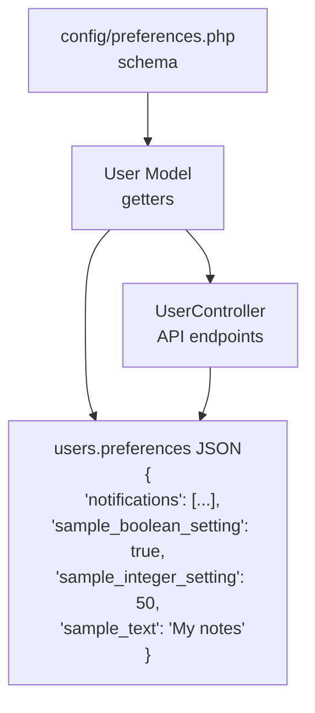

# User Preferences System

## Overview

The User Preferences System provides a flexible, extensible way to manage user-configurable settings in the Dash application. Preferences are stored as JSON in the `users.preferences` column and can be accessed both from the backend (PHP) and frontend (React).

## Architecture



## Backend

### Configuration File: `config/preferences.php`

This file defines the preference schema that determines:
- What preferences are available
- How they're grouped in the UI
- Validation rules
- Default values

#### Supported Types

| Type | Description | Frontend Component |
|------|-------------|-------------------|
| `boolean` | True/false toggle | Switch |
| `integer` | Numeric value with min/max | Slider + Number input |
| `string` | Single-line text | TextField |
| `textarea` | Multi-line text | TextField (multiline) |
| `select` | Dropdown selection | Select (not yet implemented) |
| `custom` | Custom component | Specified by `component` prop |

#### Adding a New Preference

```php
// config/preferences.php

'preference_formats' => [
    // Add your new preference here
    [
        'id'            => 'my_new_setting',      // Unique identifier
        'group'         => 'my_group',            // Group name for UI tabs
        'tab'           => 'my_group',            // Tab name (usually same as group)
        'attribute'     => 'settings.my_new',     // Dot notation path
        'label'         => 'My New Setting',      // Display label
        'visible'       => true,                  // Show in UI
        'required'      => false,                 // Is required
        'type'          => 'boolean',             // Type (see table above)
        'editable'      => true,                  // Can user edit
        'rules'         => 'nullable|boolean',    // Laravel validation rules
        'default_value' => false,                 // Default value
        'description'   => 'Description here',   // Help text
    ],
],

// If adding a new group, also add it to the groups array:
'groups' => [
    'my_group' => [
        'label' => 'My Group',
        'icon'  => 'settings',  // 'notifications' or 'settings'
        'order' => 3,           // Tab order
        'description' => 'Group description',
    ],
],
```

### User Model Getter Methods

The User model provides several methods to access preferences:

```php
// Get any preference by key (supports dot notation)
$user->getPreference('sample_boolean_setting');
$user->getPreference('notifications.TabCreatedNotification.email');

// Get all preferences
$user->getAllPreferences();

// Get preferences for a specific group
$user->getPreferencesByGroup('sample');

// Set a preference
$user->setPreference('sample_boolean_setting', true);
$user->save();

// Notification-specific getters
$user->getNotificationPreference('TabCreatedNotification', 'email');  // bool
$user->hasEmailNotification('TabCreatedNotification');  // bool
$user->hasPushNotification('TabCreatedNotification');   // bool
$user->getNotificationPreferences();  // array

// Generic setting getter
$user->getSetting('sample_integer_setting', 10);  // with default

// Boolean helper
$user->isPreferenceEnabled('sample_boolean_setting');  // bool
```

### API Endpoints

| Method | Endpoint | Description |
|--------|----------|-------------|
| GET | `/api/system/user/preferences` | Get preferences + schema |
| PUT | `/api/system/user/preferences` | Update preferences |

#### GET Response

```json
{
    "preferences": {
        "notifications": [...],
        "sample_boolean_setting": true,
        "sample_integer_setting": 50,
        "sample_text": "My notes"
    },
    "preference_formats": [...],
    "groups": {
        "notifications": { "label": "Notifications", "icon": "notifications", "order": 1 },
        "sample": { "label": "Sample Settings", "icon": "settings", "order": 2 }
    }
}
```

#### PUT Request

```json
{
    "preferences": {
        "notifications": [...],
        "sample_boolean_setting": true,
        "sample_integer_setting": 50,
        "sample_text": "My updated notes"
    }
}
```

## Frontend

### UserPreferences Component

Located at: `packages/dash-admin/src/components/user/UserPreferences.tsx`

The component:
1. Fetches preferences and schema from the API
2. Renders preferences grouped into tabs
3. Provides appropriate input components based on type
4. Handles save with validation

#### Accessing in Your Application

```tsx
import { UserPreferences } from 'dash-admin';

// Use in your settings page
const SettingsPage = () => (
    <div>
        <UserPreferences />
    </div>
);
```

## Integration with Notifications

### Backend Integration

When sending notifications, check user preferences:

```php
use App\AppNotifications\AppNotificationBuilder;

// The notification system automatically checks preferences
AppNotificationBuilder::send(
    notificationClass: MyNotification::class,
    data: [...],
    // ...
);

// Or check manually:
if ($user->hasEmailNotification('MyNotification')) {
    // Send email
}

if ($user->hasPushNotification('MyNotification')) {
    // Send push
}
```

### Notification Configuration

Notifications are configured in two places:

1. **Notification class config** (determines available channels):
```php
// In your notification class
public static function config()
{
    return [
        'name' => 'MyNotification',
        'hasEmail' => true,   // Can be sent via email
        'hasPush' => true,    // Can be sent via push
        'hasSocket' => true,  // Can be sent via WebSocket
        'hasDatabase' => true, // Can be stored in DB
    ];
}
```

2. **System values** (exposed to frontend):
```php
// In config/preferences.php or your auth response
'user_notifications' => [
    [
        'id' => 'my_notification',
        'name' => 'MyNotification',
        'className' => 'App\\Notifications\\MyNotification',
        'hasEmail' => true,
        'hasPush' => true,
        'hasSocket' => true,
        'hasDatabase' => true,
    ],
],
```

## Complete Example: Adding a "Theme" Preference

### 1. Add to Config

```php
// config/preferences.php

'preference_formats' => [
    // ... existing preferences ...
    
    [
        'id'            => 'theme',
        'group'         => 'appearance',
        'tab'           => 'appearance',
        'attribute'     => 'settings.theme',
        'label'         => 'Theme',
        'visible'       => true,
        'required'      => true,
        'type'          => 'boolean',  // false=light, true=dark
        'editable'      => true,
        'rules'         => 'required|boolean',
        'default_value' => false,
        'description'   => 'Enable dark mode',
    ],
],

'groups' => [
    // ... existing groups ...
    
    'appearance' => [
        'label' => 'Appearance',
        'icon'  => 'settings',
        'order' => 3,
        'description' => 'Customize the look and feel',
    ],
],
```

### 2. Use in Backend

```php
// In a controller or service
$user = auth()->user();

if ($user->getPreference('theme', false)) {
    // Dark mode enabled
} else {
    // Light mode
}
```

### 3. Use in Frontend

```tsx
// After saving preferences, the frontend can react
import { AuthPersistenceService } from 'dash-auth';

const user = AuthPersistenceService.getUser();
const isDarkMode = user?.preferences?.theme ?? false;
```

## Database Schema

Preferences are stored in the `users` table:

```sql
ALTER TABLE users ADD COLUMN preferences JSON DEFAULT NULL;
```

Example stored value:
```json
{
    "notifications": [
        {"id": "tab_created", "name": "TabCreatedNotification", "email": true, "push": false}
    ],
    "sample_boolean_setting": true,
    "sample_integer_setting": 50,
    "sample_text": "User's custom text"
}
```

## Files Modified/Created

### Backend
- `config/preferences.php` - Preference schema configuration
- `app/Models/User.php` - Getter methods added
- `domain/app/Http/Controllers/API/Extended/UserController.php` - API endpoints

### Frontend
- `packages/dash-admin/src/components/user/UserPreferences.tsx` - UI component

## Troubleshooting

### Preferences Not Saving

1. Check browser console for API errors
2. Verify validation rules in `config/preferences.php`
3. Check Laravel logs for validation failures

### Preferences Not Showing

1. Ensure `visible: true` in preference format
2. Check that the group exists in the `groups` array
3. Verify API returns the preference in `preference_formats`

### Notification Preferences Defaulting Wrong

1. Check `hasEmail`/`hasPush` values in notification config
2. Ensure `user_notifications` is populated in systemValues
3. Clear browser cache and re-login
