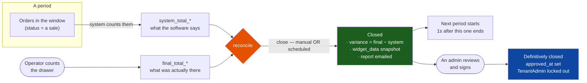
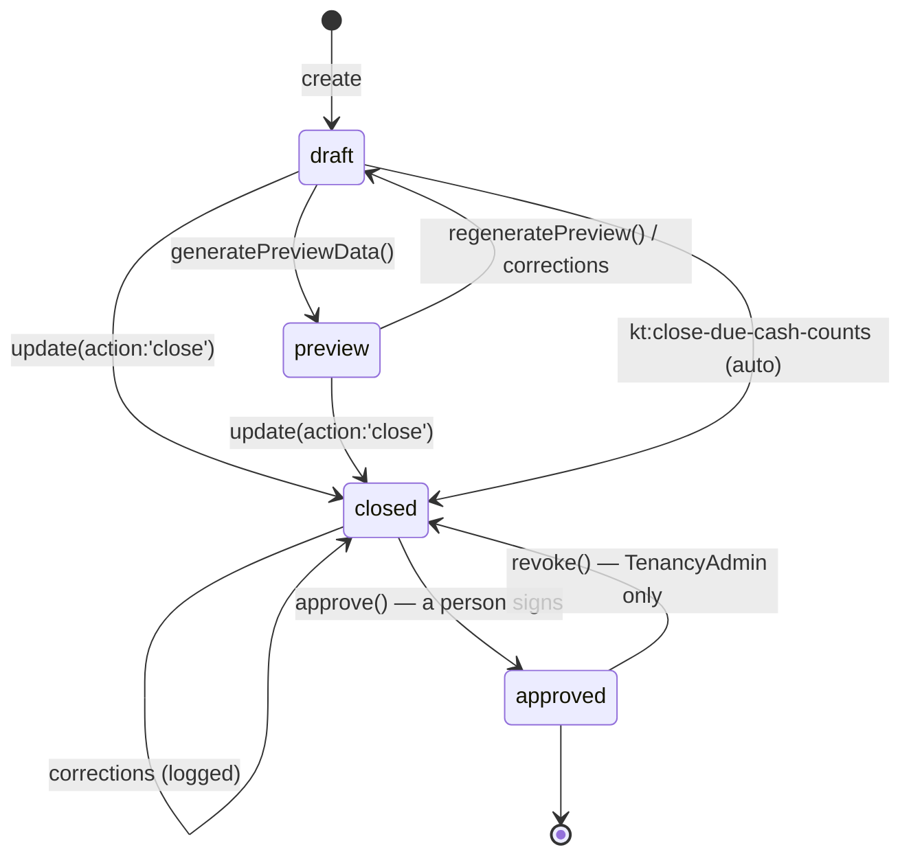
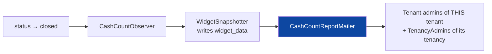
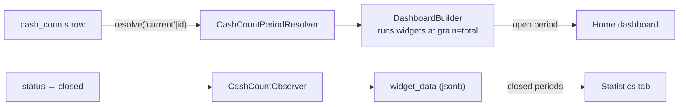
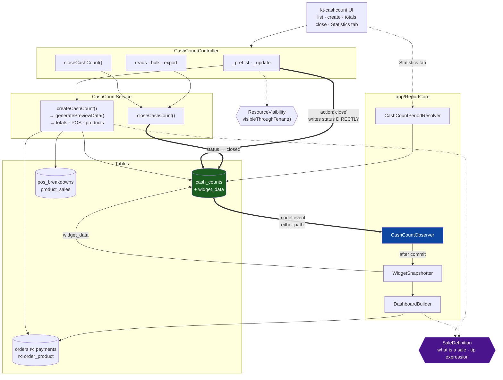
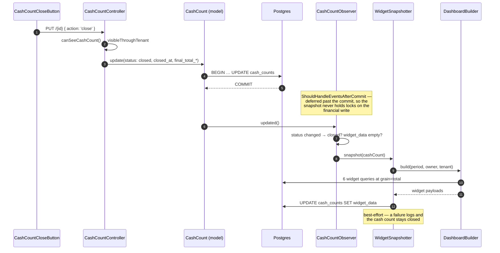

# Cash Counts

> **Layer:** `kitchntabs-backend-domain` (`app/Models/CashCount`,
> `app/Services/CashCount`, `app/Http/Controllers/API/CashCount`,
> `app/Exports/CashCount`) · `kitchntabs-frontend/packages/kt-cashcount`
> **Related:** [DASHADMIN-REPORTS-BI-TOOL.md](./DASHADMIN-REPORTS-BI-TOOL.md) ·
> [DASHADMIN-REPORTS-TECHNICAL-REFERENCE.md](./DASHADMIN-REPORTS-TECHNICAL-REFERENCE.md)

A **cash count** (*arqueo de caja*) is the reconciliation of one trading period:
what the system says was sold against what the operator actually counted in the
drawer. It is also the unit KitchnTabs measures a "period" in — the reporting
engine takes its windows from cash counts rather than from calendar days.

---

## 0. The solution at a glance



A cash count answers one question — **does the drawer match the system?** — and
its by-product is the unit everything else measures time in.

Closing freezes four things: the reconciliation, the variance, a snapshot of the
period's statistics, and an emailed report. It can be done by a person or, if
the tenant configured it, by the scheduler.

**Closing is not the end.** The period is over and the next one has begun, but
the record is not definitively closed until an admin signs it — and after that
signature the restaurant can no longer revise its own figures.

## 1. What a period is

Usually a day. **Not necessarily** — a period runs from the end of the last
closed one until this one is closed, so an operator who forgets to close leaves
a period spanning several days. Nothing in the system enforces a daily rhythm.

This is why every window in the reporting engine is *read from the data* rather
than assumed:

```php
// CashCountService::getCurrentPeriodSales() — and, deliberately identically,
// CashCountPeriodResolver::currentPeriod()
$periodStart = $lastClosed
    ? $lastClosed->period_end->copy()->addSecond()
    : Carbon::now()->subDays(30)->startOfDay();   // bootstrap fallback
$periodEnd = Carbon::now();
```

The **open period is not a row**. There is no cash count for "now" until someone
creates one; it is derived. Two places derive it and they must agree, or the
dashboard and the till would disagree about when "today" began.

## 2. Lifecycle



| Status | Meaning |
|---|---|
| `draft` | created; totals not yet computed, or being corrected |
| `preview` | system totals computed, awaiting the operator's counted figures |
| `closed` | period over, figures frozen; `closed_at` set |

**`approved` is not a status.** Definitive closing is `approved_at` +
`approved_by_user_id`, deliberately kept off the `status` column: roughly thirty
places test `status === 'closed'` to mean "this period is over", and a fourth
value would silently change every one of them. Approval is orthogonal — a
signature on an already-closed record.

|  | `closed_at` | `approved_at` |
|---|---|---|
| open | null | null |
| closed, awaiting sign-off | set | null |
| **definitively closed** | set | set |

Closing is allowed from any not-yet-closed status. (These guards used to
contradict each other, making the close endpoint unreachable — see §7.1.)

## 3. Data model

### `cash_counts`

| Column | Type | Notes |
|---|---|---|
| `id` | uuid (v7) | `HasUuids` |
| `tenant_id` | uuid | FK; **no `tenancy_id`** |
| `user_id`, `currency_id` | uuid | who closed it, and in what currency |
| `period_start`, `period_end` | datetime | the window |
| `status` | enum-ish string | `draft` \| `preview` \| `closed` |
| `system_total_sales` | int | order count the system computed |
| `system_total_amount` | decimal(15,2) | money the system computed |
| `system_total_tips` | decimal(15,2) | service fees the system computed |
| `final_total_*` | same, nullable | what the operator counted |
| `notes` | text | |
| `closed_at`, `archived_at` | datetime | |
| `widget_data` | jsonb | **added 2026-08-23** — the dashboard snapshot (§6) |
| `approved_at` | datetime, nullable | **added 2026-08-23** — the signature; null means awaiting sign-off |
| `approved_by_user_id` | uuid, nullable | who signed it |
| `auto_closed` | bool | the scheduler ended this period, not a person |

### Children

| Table | Rows | Purpose |
|---|---|---|
| `cash_count_pos_breakdowns` | per POS | system vs final sales/amount/tips per till |
| `cash_count_product_sales` | per product | quantity, total, average price, with **denormalised `product_name`/`product_sku`** so a deleted product still reports |
| `cash_count_products` | — | **orphan: 0 code references, 0 rows** |
| `cash_count_point_of_sales` | — | **orphan: 0 code references, 0 rows** |

## 4. How the totals are computed

`CashCountService::generatePreviewData()` →

1. `getOrdersForPeriod()` — orders for the tenant in the window whose status is
   in `['completed', 'paid', 'SHIPPED', 'CLOSED']`, eager-loading
   `payments.pointOfSale`, `orderProducts.product`, `brokerable`, `tabable`;
2. `calculateSystemTotals()` — count, `sum('total_amount')`, and service fees
   summed per payment;
3. `generatePosBreakdowns()` — grouped by `payments.source_id` (a
   `point_of_sales` id — that column *is* the payment method);
4. `generateProductSales()` — grouped by product, with name/sku snapshots;
5. status → `preview`.

The operator then enters `final_total_*`, and closing freezes the record.

## 5. API surface

Under `api/tab/cashcount`, middleware `access`, `auth:sanctum`, `verified`.
Standard CRUD comes from `config('react-admin-methods')`; on top of it:

| Method | Path | Purpose |
|---|---|---|
| GET | `/can-create` | may a new period be opened |
| GET | `/next-period-dates`, `/next-suggested-period` | proposed window |
| GET | `/current-period-sales` | live figures for the open period |
| GET | `/timeline`, `/last`, `/stats`, `/summary`, `/trends` | history and aggregates |
| GET | `/currencies`, `/health-check`, `/debug-point-of-sales` | support |
| POST | `/validate-period`, `/compare`, `/bulk-operation`, `/export`, `/archive-old` | operations |
| GET | `/{id}/report`, `/{id}/breakdown`, `/{id}/audit-trail` | one record |
| PUT | `/{id}` with `action: 'close'` | **the working close path** |
| PUT | `/{id}/close` | the explicit close path (§7.1) |
| PUT | `/{id}/approve` | **definitive close** — a person signs it (§5c) |
| PUT | `/{id}/revoke-approval` | reopen a signed record (TenancyAdmin only) |

---

## 5b. Automatic closing

A period can end without anyone pressing anything. Configured per tenant, and
editable from the tenant configuration screen with **no bespoke UI** — the five
fields are *declared* in `domain/config/cashcount_tenant_settings.php` and
`dash-auto-admin` renders the form from those declarations. See
[the tenant settings module §4b](../F21-Tenancy-Management/F21-Tenancy-Management_TENANT_SETTINGS_MODULE.md).

The whole policy is **one** `type: 'custom'` setting — `settings.cashcount`,
rendered by the `CashCountScheduleSettings` component (kt-cashcount, resolved by
name through the [component registry](../N2-Frontend-Framework/N2-Frontend-Framework_COMPONENT_REGISTRY.md)).

| Field | Stored at | Values | Shown when |
|---|---|---|---|
| Closing | `settings.cashcount.mode` | `manual` (default) · `automatic` | always |
| Frequency | `settings.cashcount.frequency` | `daily` · `weekly` · `monthly` | automatic |
| Closing time | `settings.cashcount.close_time` | `HH:MM`, tenant timezone | automatic |
| Weekday | `settings.cashcount.weekday` | 1=Mon … 7=Sun | frequency = weekly |
| Day of month | `settings.cashcount.day_of_month` | 1–31, clamped | frequency = monthly |

One component rather than five declared fields because the values are not
independent: `weekday` is meaningless unless the frequency is weekly, and none
of them do anything while the mode is manual. The declaration format has no
conditional visibility, so five plain fields would have shown every operator two
inputs that are silently ignored.

`CashCountSchedule::for($tenant)` reads it; absent settings mean **manual**, so
the feature cannot start closing periods for a customer who never configured it.
A malformed `close_time` falls back to `23:59` rather than stopping the
scheduler for every other tenant.

`kt:close-due-cash-counts` runs **every 15 minutes** — not at a fixed hour,
because the closing time is per-tenant and per-timezone, so there is no single
moment to run at.

**It closes at the scheduled boundary, not at "now."** A run that starts four
minutes late, or that did not happen yesterday at all, still produces a period
ending at 23:59. Otherwise every late run would smear the boundary and the day's
figures would stop matching the till.

**Times are the tenant's local time.** "Close at 00:00 on Tuesday" means midnight
where the restaurant is. A venue in Santiago closing at UTC midnight would cut
its Monday evening service in half.

**A monthly day is clamped to the month.** "The 31st" in a 30-day month is the
30th, never the 1st of the next.

**The scheduler never approves.** It leaves the record `closed`, `approved_at`
null, `auto_closed` true — an unattended job has no business signing a
reconciliation.

```bash
php artisan kt:close-due-cash-counts --dry-run          # report, change nothing
php artisan kt:close-due-cash-counts --tenant=<uuid>    # one tenant
```

## 5c. Approval — the definitive close

Closing ends the period. **Approving is a person putting their name to it.**
Until then the figures can still be corrected, and every correction is logged.

| actor | may approve | may edit before approval | may edit after |
|---|---|---|---|
| System | yes | yes | yes |
| TenancyAdmin | yes | yes | **yes** (exceptional) |
| TenantAdmin (`Tenant`) | yes | yes | **no** |
| anyone else | no | no | no |

A restaurant cannot quietly revise its own signed figures. The group's admin
keeps an override for genuine corrections — and every one of those edits lands
in the activity log with their name on it, which is the reason for allowing it
at all rather than pretending closed means immutable.

Revoking a signature is **TenancyAdmin and System only**: a tenant admin
un-signing its own record would make the lock decorative.

| Method | Path | Route permission granted to |
|---|---|---|
| PUT | `/{id}/approve` | `TenancyAdmin`, `Tenant` |
| PUT | `/{id}/revoke-approval` | `TenancyAdmin` only |
| GET | `/{id}/audit-trail` | `TenancyAdmin`, `Tenant` |

The lock is enforced in `CashCountController::_update()`, the endpoint the UI
actually reaches — not in the UI, and not only on the explicit close path.

**Two layers, deliberately.** `AccessMiddleware` does an exact `route_name`
lookup and fails closed with no warning, so the grants above decide *may you
call this endpoint at all*; `CashCountApproval` then decides *may you do it to
THIS record*. Revoke is granted to `TenancyAdmin` alone at both layers.

> Without those permission rows both endpoints are an unconditional 403 for
> everyone except System — including the admins the feature exists for. See
> `2026_08_23_001000_add_cash_count_approval_permissions.php`.

## 5d. History — who changed what

`CashCount` now uses Spatie's `LogsActivity`. `GET /{id}/audit-trail` returns the
real log, oldest first, with the causer resolved.

Logged: `status`, the period bounds, every `system_total_*` and `final_total_*`,
`notes`, `closed_at`, `approved_at`, `approved_by_user_id`, `auto_closed`.

Not logged: `widget_data`. It is a generated blob rewritten on close, and a diff
of it tells an operator nothing about who did what.

> **A phantom event, found and fixed while building this.** `auto_closed` has a
> DB default but had no model default, so a new instance carried `null` until it
> was refreshed and the next save looked like `null → false`. That put a fake
> "auto_closed changed" entry at the top of *every* cash count's history — in the
> one panel whose entire job is to be a clean record. Fixed with a matching
> `$attributes` default; a regression test pins it.

**The causer is null for a scheduled close.** Nobody did it, and saying so is
more useful than attributing it to whichever account the record happens to carry.

## 5e. The end-of-period email

When a cash count closes, a branded report goes out.



Contents: the reconciliation table (system vs counted vs variance), the per-till
breakdown, the period's statistics **read from the `widget_data` snapshot**, and
the top 20 products. Because the statistics come from the snapshot rather than a
fresh query, the email and the Statistics tab can never disagree.

**Strictly after the snapshot.** Mailing first would send an empty statistics
section — the mailer reads `widget_data`, which the snapshotter writes moments
earlier.

Branding comes from `layouts.emails` and the tenant's own logo and colours. The
template and its strings are **domain-owned**, under a `domain::` namespace
registered by `AppDomainServiceProvider` — the core's `resources/views` has no
reason to know what a cash count is.

> ### ⚠️ Recipients are resolved by the feature, never by role targeting
>
> `AppNotificationBuilder` resolves `targetType: "role"` as
>
> ```php
> User::whereHas('roles', fn ($q) => $q->whereIn('name', $targets))->get()
> ```
>
> — with **no tenant scope**. Sending this to the `Tenant` role would mail one
> restaurant's takings, product mix and payment breakdown to every Tenant user
> of every other customer on the platform. `CashCountReportMailer` therefore
> resolves the audience itself (this tenant's admins, plus the TenancyAdmins of
> its tenancy) and sends with `targetType: "user"`.
>
> **This applies to any future notification carrying tenant data.** Role
> targeting is safe only for platform-wide announcements.

Best-effort, exactly like the snapshot: a cash count is a financial record, and
failing to close it because SMTP was down would be a far worse operational
failure than a missing email. Gated by `APP_MAIL_ENABLED`.

## 5f. The UI

`kitchntabs-frontend/packages/kt-cashcount`:

| Piece | Component |
|---|---|
| **Approval** tab — state, approve / revoke, auto-close marker | `CashCountApproval` |
| **History** tab — the activity log, oldest first | `CashCountHistory` |
| Status chip — now shows *Aprobado* / *Pendiente aprobación* | `CashCountStatus` |
| Schedule settings | `CashCountScheduleSettings` — registered by name, referenced from the backend config |

The role checks in `CashCountApproval` mirror the server's, and decide **which
controls to show, never whether the action is allowed**. The API enforces it
regardless, so a stale token or a hand-made request still fails.

## 6. Reporting integration

Cash counts are what the reporting engine calls a **period**.

- `CashCountPeriodResolver implements PeriodResolverContract` — resolves
  `'current'` (derived, open) or a cash count id (fixed).
- On close, `CashCountObserver` snapshots every registered dashboard widget into
  `cash_counts.widget_data`.
- The show view's **Statistics** tab renders that snapshot, pinned to the record.



**Why a snapshot and not a recompute.** Rows behind a past period keep being
edited, refunded and backfilled. Recomputing a closed period would drift away
from the till figures printed on the same page. The snapshot is written *after*
the transaction commits (a reporting pass has no business holding locks on the
financial write) and is **best-effort** — a failure logs and the cash count
still closes, because refusing to close over a chart would be a far worse
operational failure.

**The observer is deliberately on the model, not the service.** Two code paths
close a cash count and only one goes through `CashCountService::closeCashCount()`
(`bulkOperation('close')` delegates to it, so it is not a third).
The path the UI actually reaches sets `status` directly. Hooking the service
meant the snapshot never ran in practice — verified, then fixed.

---

## 6b. Components and interactions

Every arrow below is a real call in the code, not an intention.



### Reading the diagram

**Two paths close a cash count**, and only one goes through the service:

| Path | Route | Goes through `CashCountService`? |
|---|---|---|
| `_update(action: 'close')` | `PUT /{id}` | **No** — writes `status` directly. This is the one the UI reaches. |
| `closeCashCount()` | `PUT /{id}/close`, and `bulkOperation('close')` | Yes |

That asymmetry is why the snapshot hangs off **`CashCountObserver`** (the thick
arrow) rather than off the service: an observer sits on the model, so it fires
whichever path wrote the row. Hooking the service alone meant the snapshot never
ran in the flow anyone actually used.

**`SaleDefinition`** (dotted arrows) is consulted rather than called into the
flow — it holds no state and performs no query. It exists so "what counts as a
sale" and "how a tip is computed" have exactly one answer, shared with the
reporting engine so the two reconcile.

**`ResourceVisibility`** gates the CRUD layer only. The service's own queries are
already tenant-bound by the cash count they were handed.

### Closing, in order



## 7. Design review — all findings, and their fixes

Every item was verified against running code and the database, not inferred.
None was introduced by the reporting work; the reporting work is how they
surfaced. **All are now fixed**, each with a regression test in
`CashCountIntegrityTest`.

> ### ⚠️ One fix changes financial figures
>
> §7.2 corrects a filter that was **silently dropping sales**. Totals will be
> **higher** than before for any period containing PAID, SALE_NOTE_GENERATED,
> IN_PREPARATION, PREPARED, PICKED_UP or SCHEDULE_SHIPPING orders. Demonstrated
> on real data: with 3 PAID + 2 PREPARED orders present, the old filter reported
> **0 sales / $0** and the corrected one **5 sales / $37,040**.
>
> Historical cash counts are **not** recomputed — a closed record is the
> operator's signed reconciliation, and rewriting it retroactively would be
> worse than leaving it. Expect a step change at the first period closed after
> this deploys.

### 7.1 The `/{id}/close` endpoint was unreachable ✅

Controller demanded `PREVIEW`, then called a service demanding `DRAFT` — no
status satisfied both. It was also typed `int $id` against **UUID** keys, which
raised `TypeError` before the status check.

**Fixed:** the service now accepts any not-yet-closed status (`PREVIEW` is the
correct one — it is reached once system totals exist); the duplicated guard is
removed so one rule lives in one place; `string $id`. Verified end to end:
`PUT /{id}/close` → **200**, status `closed`, snapshot stored.

### 7.2 Two of four "sale" statuses matched nothing ✅

`whereIn('status', ['completed','paid','SHIPPED','CLOSED'])` — neither
`'completed'` nor `'paid'` is in `Order::STATUSES`.

**Fixed:** a single `SaleDefinition` class now owns the answer, referenced by
constants, and is used by the cash count **and** the reporting engine — which
previously had a third definition of its own (`tabs.status = CLOSED`). A test
asserts every status it names is a real `Order::STATUSES` member, so a typo can
never silently match nothing again.

### 7.3 `archiveOldCashCounts` could not be called ✅

`stgring $tenantId` — a typo PHP reads as a class hint, raising `TypeError` on
every call to a routed endpoint. **Fixed:** `string`.

### 7.4 A TenancyAdmin saw the wrong scope ✅

Hand-rolled two-tier scoping (`where('tenant_id', $user->tenant_id)`) on a
three-tier platform, repeated in 27 places.

**Fixed:** the list uses `visibleThroughTenant()`; the seven per-record checks
collapse into one `canSeeCashCount()` delegating to the same scope; the
`$tenantId` resolution uses `TenantScopeResolver`. A record is now visible in a
detail view exactly when it is visible in the list.

### 7.5 Unbounded in-memory aggregation ✅

Totals were summed in PHP over every order in the period with four eager-loaded
relations. **Fixed:** `COUNT`/`SUM` pushed into SQL against an un-hydrated
query. The hydrated collection remains only where per-row detail is genuinely
needed (product sales, POS breakdown).

### 7.6 Float accumulation ✅

**Fixed:** aggregates cast to `numeric`, matching the reporting engine, so the
two reconcile exactly.

### 7.7 Four tip calculations ✅

**Fixed:** one SQL expression, `SaleDefinition::serviceFeeExpression()`,
COALESCEing the `service_fee` column over the legacy `data->service_fee` JSON.

### 7.8 Two orphan tables ✅

`cash_count_products` and `cash_count_point_of_sales` — zero references, zero
rows. **Fixed:** dropped by migration, guarded so a non-empty table in any
environment is skipped with a warning rather than destroyed.

### 7.9 Period gaps and overlaps unenforced ✅

**Fixed:** `CashCountObserver::saving()` refuses an overlapping period and an
inverted one, on create **and** on edit. Gaps are still allowed — a venue closed
for a week has no period to account for, whereas an overlap is always a double
count.

### 7.10 `STATUS_APPROVED` is lowercase ✅

**Fixed** by adding `Payment::scopeApproved()`. The constant's *value* is
deliberately unchanged — `'approved'` is what every existing row stores, so
"correcting" it would orphan the data. The scope is what stops anyone writing
the literal.

### Bonus: the snapshot never ran ✅

Found while documenting, and introduced by the reporting work rather than
pre-existing: the widget snapshot was hooked into
`CashCountService::closeCashCount()`, but **three** paths close a cash count and
the one the UI reaches sets `status` directly.

**Fixed:** a model observer, so every path is covered. It also no longer depends
on `auth()->user()` — it takes the cash count's own owner, so a close from a
queued job or console command still snapshots.

---

## 8. Remaining risk

- **Historical totals are not backfilled.** Cash counts closed before §7.2 were
  computed with the inert filter. They are left as signed records.
- **Cash counts closed before the snapshot existed** have no `widget_data`; the
  Statistics tab falls back to a live recompute and labels it
  `live-no-snapshot`.
- **`getOrdersForPeriod()` still hydrates** for the product and POS breakdowns.
  Bounded by a period rather than unbounded, but a very long open period is
  still a large collection.
- **Payment figures are unverified against real data** — `point_of_sales` is
  empty in dev, so the POS breakdown and payment-method widgets are exercised
  but not proven.
- **Cash counts closed before this work have no history.** The activity log
  starts from the day `LogsActivity` was added; older records show only what the
  columns still say, not who changed them.
- **The approval backlog is unbounded.** Nothing yet chases a tenant whose
  automatic periods keep closing unapproved — they simply accumulate. A reminder
  after N unapproved periods is the obvious follow-up.
- **`auto_closed` records intent, not provenance.** A period closed by the
  scheduler and then corrected by a person still reads `auto_closed = true`; the
  activity log is what distinguishes them.
- **The approval UI does not gate on the record's own tenancy.** The buttons key
  off the viewer's roles; the server is what actually enforces scope. A
  TenancyAdmin sees the controls on any cash count they can open, and the API
  rejects the ones that are not theirs.
