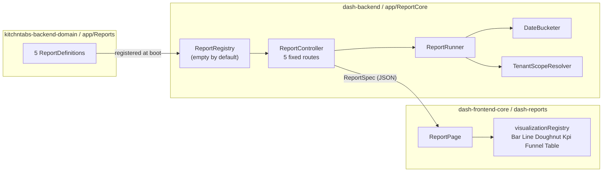

# DASHADMIN Reports — the domain-agnostic BI engine

> **Status:** ✅ Implemented end to end and verified against the local stack —
> seven reports behind one resource, six period-bounded dashboard widgets,
> tenant scoping proven over HTTP, xlsx export and the close-time snapshot both
> verified by reading the stored artefact back, 922 backend tests green.
> **Companion docs:**
> [DASHADMIN-REPORTS-TECHNICAL-REFERENCE.md](./DASHADMIN-REPORTS-TECHNICAL-REFERENCE.md)
> (every class, endpoint, payload and config key) ·
> [CASHCOUNTS.md](./CASHCOUNTS.md) (the period this engine measures in, and a
> design review of it)
>
> **Layer:** `dash-backend/app/ReportCore` (engine) ·
> `kitchntabs-backend-domain/app/Reports` (the reports) ·
> `dash-frontend-core/packages/dash-reports` (UI)
> **Branch:** `feature/stats` in all five repos.

---

## 1. What it is

A **reporting engine in the core** that knows nothing about any business, plus a
**declarative report definition** each domain writes for itself.

The core owns: bucketing time correctly, scoping to a tenant, validating the
request, running the aggregate, gap-filling the series, and serving a machine-
readable description of the report. A domain owns: which model, which columns,
which metrics.

> Adding a report is **one PHP class and one line of registration**. The
> frontend does not change — it renders whatever the spec describes.



## 2. The seven KitchnTabs reports

| Key | Answers | Source |
|---|---|---|
| `tabs-throughput` | How many tabs, per day/week/month/year, by status, delivery method or restaurant | `tabs` |
| `tabs-funnel` | How far tabs get and where they stop; conversion per stage | `tabs.date_*` |
| `orders-revenue` | Revenue, subtotal, discounts, average ticket over time | `orders` ⋈ `tabs` |
| `product-sales` | Best sellers, and the hour-of-day / day-of-week busy profile | `orders` ⋈ `order_product` |
| `cash-counts` | Drawer reconciliation: expected vs counted, and the **variance** | `cash_counts` |
| `tab-cycle-time` | Average minutes per stage hop, plus end-to-end, plus one caller-chosen pair | `tabs.date_*` |
| `payment-methods` | Sales and the till/payment-method split | `payments` ⋈ `point_of_sales` |

## 3. The four things that are easy to get wrong

### 3.1 Timezone — two `AT TIME ZONE`, not one

Laravel writes `timestamp without time zone` holding UTC. Postgres cannot know
that, so a single conversion is not a conversion:

```sql
-- WRONG: declares the stored value to already BE local time
created_at AT TIME ZONE 'America/Santiago'

-- RIGHT: declare the source zone, then convert
created_at AT TIME ZONE 'UTC' AT TIME ZONE 'America/Santiago'
```

Verified against the dev database: a tab stored at `2026-08-22 02:30` UTC buckets
to **2026-08-21** with the correct form and **2026-08-22** with the naive one.
Every late-evening sale would land on the following day's report, and nothing
about the output would look wrong. Pinned by `DateBucketerTest`.

### 3.2 Tenant scoping is not optional, and not the report author's job

The platform has **no global tenant scope** — scoping is an opt-in
`visibleThroughTenant()` call. An unscoped aggregate does not throw and does not
show another tenant's rows; it silently folds every tenant's data into one number
a restaurant owner reads as their own.

So `EloquentSource` applies the scope itself and **a report definition cannot
switch it off**. A model without a `ResourceVisibility` trait is refused outright:

```
Report source [Domain\App\Models\Order\OrderProduct] does not use a
ResourceVisibility trait, so its rows cannot be tenant-scoped.
```

That refusal is what caught `product-sales` during development — it was rebased
onto `Order` (properly scoped) and joins down to the lines.

Verified over HTTP:

| Caller | `X-Tenant-Id` | Result |
|---|---|---|
| TenancyAdmin | absent | 31 tabs — the whole tenancy |
| TenancyAdmin | PinoyWok | 25 |
| TenancyAdmin | Bilbao | 6 |
| TenancyAdmin | a tenant in **another** tenancy | **0 rows, not an error** |
| plain `User` | — | **403** |

Failing closed matters more than failing loudly: if an out-of-tenancy header fell
back to the tenancy-wide view, "ignore this header" would silently become "grant
everything".

### 3.3 A funnel counts stages reached, not current status

`status` says only where a tab is *now*. Counting by it shows a tab that ran the
whole flow as one `CLOSED` tab and nothing else — every earlier stage looks
empty. The funnel therefore counts non-null stage timestamps
(`COUNT(date_prepared)`), which says the tab passed through preparation whatever
became of it.

### 3.4 Money sums cast to `numeric`

`orders.total_amount` is declared `float` (Postgres `double precision`) while the
model casts it to `decimal:2`. Summing binary floating point drifts, and the
error moves when row order changes. Every sum emits `SUM(col::numeric)` so the
report and the cash count can agree.

---

## 4. The live bugs this fixed

Both in the tab status writer, both silently corrupting the timestamps the funnel
reads. Both now covered by `TabStatusTimestampsTest` — which was confirmed to
**fail** against the original code before the fix was restored.

**A missing `break`** (`TabsNotificationService`) — a transition *to* `CREATED`
fell through into `CONFIRMED` and stamped `date_confirmed`, inventing a
confirmation that never happened. Reachable because a TenantAdmin or SystemAdmin
bypasses the transition graph entirely.

**`date_canceled` was never written** — the CANCELLED branch wrote `date_closed`,
making a cancellation indistinguishable from a completed sale. Present in both
`TabsNotificationService` and `MallTabCrudOperationsTrait`.

> The dev dataset shows the damage plainly: all 31 tabs are `CANCELLED`, and all
> 31 have `date_closed` set with `date_canceled` empty. **There is no backfill** —
> the data to distinguish them was never written, so historical cancellations
> stay unknown rather than being guessed at.

### The ResourceVisibility contract (5 models)

`ResourceVisibility`'s tenancy-wide branch calls `whereHas('tenant', …)`, so a
model that uses the trait **without declaring a `tenant()` relation** works
perfectly for every plain tenant user and throws `BadMethodCallException` only
for a TenancyAdmin. It survives ordinary testing and surfaces in production —
which is exactly how it surfaced here, as a 500 on `payment-methods/series`.

An audit found **five** such models, not one:

| Model | Problem | Fix |
|---|---|---|
| `Order\Payment` | has `tenant_id`, no relation | added `tenant()` |
| `ECommerce\Payment` | same table, same gap | added `tenant()` |
| `ECommerce\ProductMetadata` | has `tenant_id`, no relation | added `tenant()` |
| `ECommerce\MetadataFormat` | `tenant()` **commented out** | restored |
| `ECommerce\ProductUrl` | **no `tenant_id` at all** | removed the trait — it is reached through `Product`, which is scoped, and nothing ever called the scope |

Two guards now exist so the next one cannot hide:

- `ResourceVisibility` throws a `LogicException` naming the model and the fix,
  instead of dying inside Laravel's `ForwardsCalls`.
- `ResourceVisibilityContractTest` sweeps every model using the trait — a
  sweep, not a list, so it catches the next model someone adds it to. (It
  carries a second test asserting the sweep finds models at all, so a broken
  regex cannot make it pass vacuously.)

A third defect surfaced while joining: `ResourceVisibility` filtered on an
**unqualified** `tenancy_id`, which becomes ambiguous the moment `tenants` is
joined (both tables have the column). Now qualified — a no-op when nothing is
joined, and it unblocks slicing any tenancy-scoped report by restaurant.

---

## 5. Why the routes look like this

```php
Route::get('/',               'index');    // reports I may see
Route::get('/{key}/spec',     'spec');
Route::get('/{key}/series',   'series');
Route::get('/{key}/table',    'table');
Route::get('/{key}/export',   'export');
```

**Five fixed routes, any number of reports.** The previous attempt generated one
route per report by resolving a report catalogue *out of the container while the
route file was loading* — which made routing depend on the database at boot and
made `route:cache` impossible. It shipped commented out with a `TODO`, and that
is why this feature did not exist until now.

Five route names also means **five `Permission` rows** however many reports get
added. Which reports a caller sees is decided from each definition's `roles()`
inside the controller, not by the router.

---

## 6. Writing a report

```php
class TabsThroughputReport extends ReportDefinition
{
    public function key(): string   { return 'tabs-throughput'; }
    public function title(): string { return 'reports.tabs_throughput.title'; }

    public function source(): ReportSourceContract {
        return EloquentSource::for(Tab::class)->dateField('created_at');
    }

    public function dimensions(): array {
        return [
            Dimension::column('status', 'tabs.status')->multiple()->values(...),
            app(DimensionLibrary::class)->make('tenant', 'tabs'),
        ];
    }

    public function metrics(): array {
        return [Metric::count('tabs')->label('reports.metrics.tabs')];
    }
}
```

Registered in `AppDomainServiceProvider::boot()`:

```php
$this->app->make(ReportRegistry::class)->register(new TabsThroughputReport());
```

Every `label` is a **translation key**, never display text — the previous engine
returned Spanish strings from PHP, which is precisely what made it unusable for a
second domain. Status labels reuse the keys the frontend already translates
(`tab.status.created`), rather than introducing a parallel set that would drift.

---

## 7. Frontend — ONE resource

`@dashadmin/dash-reports` renders every report from its spec, behind a **single**
admin resource at `/reports`:

- `/reports` — the picker, built from `GET /api/report`, each card showing a
  small preview of the report's declared default view.
- `/reports/{key}` — the report, with its filters in a right-hand drawer.

A resource per report would put the report list in two places and guarantee
drift: registering a sixth report would give you a working API and a menu entry
that 404s until someone shipped a frontend change. There is nothing to ship.

> **The trap that cost a round-trip:** `DASHAdmin.tsx` does
> `const ResourceComponent = resource.component || ResourceTemplate` and then
> calls it — so supplying `component` **replaces** `ResourceTemplate`. Since
> `customRoutes` is only evaluated *inside* `ResourceTemplate`, a resource that
> sets both registers no routes at all and every link 404s. Custom pages must
> set `customRoutes` and leave `component` alone.

### Translation: keys *and* resolved text

Every label travels twice — `label` (the translation key) and `labelText` (what
the backend resolved it to) — and the UI renders `translate(key, { _: labelText })`.

Neither half alone works. Keys only: every app must redeclare every report's
vocabulary, and a new report renders as `reports.x.title` until someone ships a
frontend change. (This is not hypothetical — the first cut put those keys in
`apps/kitchntabs-web/src/i18n/en.json`, which **nothing imports**: `import from
'./i18n/en'` resolves to `en.tsx`. Every label rendered as its raw key.) Text
only: the app can never override wording, and responses stop being
locale-independent.

With both, a newly registered report is readable immediately with no frontend
change, and an app that wants different wording still wins by defining the key.
Backend fallbacks live in `kitchntabs-backend-domain/resources/lang/{en,es}/`
(`reports.php`, `tab.php`).

Exports are the one place text is resolved outright: a spreadsheet leaves the
app, and nothing downstream of it can look a key up.

`@dashadmin/dash-reports` renders a report entirely from its spec.

- **`core/`** — hooks, types, the visualization registry. No MUI, no chart import.
- **`adapters/mui/`** — Chart.js widgets registered into that registry.
- **`makeReportResource()`** — produces the admin resource config, using the same
  `customRoutes` + `component` shape the framework already uses for non-CRUD pages.

The **palette is validated, not chosen by eye**: eight hues, worst adjacent
colour-vision-deficiency ΔE 9.1 light / 8.4 dark, with the dark column re-stepped
for a dark surface rather than flipped. Colours are assigned **per entity from the
spec's declared order**, so filtering a series out never repaints the survivors —
a reader must never see "delivered" change colour and read it as a different
thing. Past eight series, the tail folds into "Other" rather than generating a
ninth hue.

Three light-mode hues fall below 3:1 contrast, which is permitted only with
relief — hence a legend for every multi-series chart and a Table view on every
report, so no value is ever reachable by colour alone.

---

## 8. Dashboard widgets

Period-bounded tiles on the home dashboard — one panel per tenant a caller
manages, so a TenancyAdmin sees every restaurant and a tenant user sees one.

### The period is a cash count

Not a calendar day. A KitchnTabs period is one cash count, which is *usually*
daily but runs longer whenever an operator leaves one open — so the window is
read from the data, never assumed. `CashCountPeriodResolver` derives the OPEN
period exactly the way `CashCountService::getCurrentPeriodSales()` does (one
second after the last closed period ended, through to now), because a dashboard
whose "today" began at a different moment than the cash count's would quietly
disagree with it.

### Live vs snapshot — and why it is not caching

| Where | Source | Why |
|---|---|---|
| Home dashboard | **Always live** | The window is the open period; an operator watching mid-service wants what has happened so far |
| A closed cash count | **Stored snapshot** | Its numbers can never change again |

The snapshot is correctness, not performance. Rows behind a past period keep
being edited, refunded and backfilled, so recomputing a closed period would
drift away from the cash count it belongs to. It is written to a new
`cash_counts.widget_data` jsonb column on close, **after** the commit (a
reporting pass has no business holding a lock on the financial write) and
**best-effort** — a failed snapshot logs and the cash count still closes.

It is triggered by `CashCountObserver` on the model, **not** from
`CashCountService::closeCashCount()`. Three code paths close a cash count and
only one goes through that service; the path the UI actually reaches sets
`status` directly. Hooking the service meant the snapshot never ran in
practice — found by tracing the real close path, then fixed.
Periods closed before this feature have no snapshot and fall back to a live
recompute, which the response labels `live-no-snapshot` rather than passing off
as final.

### Where each view lives

| View | Period | Source |
|---|---|---|
| Home dashboard (`kitchntabs-web` `/`) | the tenant's **open** cash count | always live |
| Cash count **show** → *Statistics* tab | **that record's** period, pinned | snapshot if closed, live otherwise |

The show-view tab is how a closed period's stats are read back — without it the
`widget_data` written at closing would have no UI at all. It pins the period to
the record and hides the period picker: offering one there would let someone
navigate to a different period while the rest of the page still described the
original record.

### The widgets

`tabs-volume` (funnel) · `tab-cycle` (stage timings) · `tabs-origin` ·
`tabs-delivery` · `sales` · `payment-methods`.

None is a new query. Each is an existing ReportDefinition run at the new
`total` grain over the period, optionally pivoted — which is the whole point:

```php
Widget::make('tabs-origin', 'tabs-throughput', 'reports.widgets.tabs_origin')
    ->pivot('origin')->visualization('Doughnut')->size('sm');
```

Adding a tile is one line. Registering a new report makes it available to the
dashboard immediately.

### Origin: one flat list out of two levels

"Kiosk, Uber Eats, JumpSeller, staff" is not a column and does not sit at one
level. `orders.brokerable_type` gives the *channel*, but every marketplace order
shares the single `Marketplace` type — naming Uber vs JumpSeller means walking
`marketplaces → tenant_system_marketplaces → system_marketplaces`. `TabOrigin`
flattens both into one CASE.

It reads `brokerable_type`, **not** `orders.data->marketplace->id`, which
`Tab::getMarketplaceInfo()` prefers — that JSON path cannot be grouped cheaply.
An order whose marketplace exists only in that JSON reports as a generic
`marketplace` rather than by name.

### Cash count module visibility

Already correct, and needed no change: `kitchntabs-web` picks its resource
manifest by `active_tenant_id`, and `cashCountResource` is registered **only**
in the impersonated-tenant manifest. So a TenancyAdmin at tenancy level sees the
stats but no Cashcount menu; switching into a tenant reveals it. Reports are
registered in **both** manifests.

The dashboard routes carry their own permissions (`api.report.dashboard.*`)
rather than reusing the cash count module's — gating widgets behind cashcount
access would make "sees the stats, not the module" self-contradictory.

## 9. Export

`GET /api/report/{key}/export?format=xlsx` exports **exactly what is on screen**
— it runs the same `ReportResult` the series endpoint produced from the same
validated query, so the file always matches the chart, including its range,
granularity, split and filters. Re-deriving from raw request parameters is how
an export quietly stops agreeing with its report.

Two sheets: **Series** (the chart as a grid, gap-filled buckets included, so it
reconciles with what was on screen) and **Summary** (totals plus the parameters
that produced them — a spreadsheet with no record of its own range, grain,
timezone and filters cannot be reproduced or compared).

## 10. Still open

- **`dash-reports` is not published.** It is unpublished on any registry, so the
  root `kitchntabs-frontend/package.json` npm alias is deliberately **not** added
  — it would break `pnpm install`. Development works today through
  `LINK_DASH_CORE=true`, which aliases the package to source. Publishing once
  and adding the alias is what makes non-linked builds work.
- **Detail rows are not exported.** The xlsx carries the series and a summary;
  the paginated source rows are excluded because a tenancy-wide year of orders
  is not something to materialise inside a web request. That belongs behind a
  queued job, the way `ExportCashCountsJob` already does it.
- **Result caching is wired but off** (`report_core.cache_seconds` defaults to 0).
- **No `year` grain on the legacy path** and no activity-log source yet; both are
  additive behind the existing `ReportSourceContract`.
