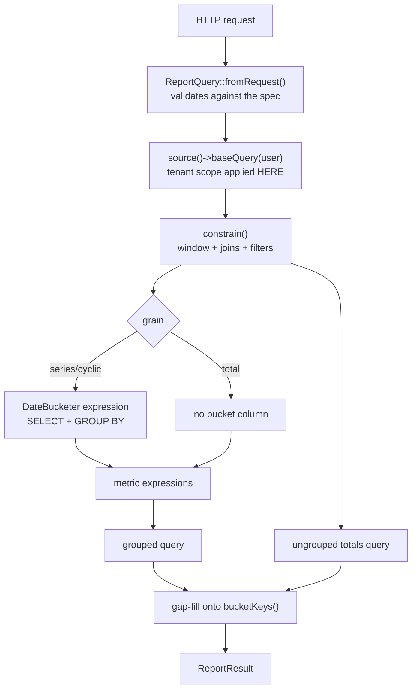

# DASHADMIN Reports — Technical Reference

> Companion to [DASHADMIN-REPORTS-BI-TOOL.md](./DASHADMIN-REPORTS-BI-TOOL.md),
> which explains *why* the design is what it is. This document is the *what*:
> every class, contract, endpoint, payload, config key and extension point.
>
> **Layer:** `dash-backend/app/ReportCore` ·
> `kitchntabs-backend-domain/app/Reports` ·
> `dash-frontend-core/packages/dash-reports`

---

## 1. Module map

```
dash-backend/app/ReportCore/
├── ReportCoreServiceProvider.php        registered from AppServiceProvider::register()
├── ReportDefinition.php                 abstract base with defaults
├── config/report_core.php               module-local config (see §9)
├── Contracts/
│   ├── ReportDefinitionContract.php     what a report is
│   ├── ReportSourceContract.php         where rows come from, already scoped
│   ├── ExporterContract.php             a downloadable rendering
│   ├── PeriodResolverContract.php       named business periods (optional)
│   └── AcceptsReportContext.php         opt-in request-dependent metrics
├── Services/
│   ├── ReportRegistry.php               singleton, empty by default
│   ├── WidgetRegistry.php               singleton, empty by default
│   ├── ReportRunner.php                 the query engine
│   ├── DateBucketer.php                 Postgres time bucketing
│   ├── TenantScopeResolver.php          which tenants am I looking at
│   └── DashboardBuilder.php             runs widgets for a period
├── Sources/EloquentSource.php           the only source today
├── Support/DimensionLibrary.php         shared + parameterised dimensions
├── ValueObjects/                        Dimension Metric Visualization
│                                        Granularity ReportQuery ReportResult
│                                        ReportPeriod Widget
├── Exporters/                           XlsxExporter + 2 sheets
├── Http/Controllers/                    ReportController, DashboardController
└── database/migrations/permissions/     2 PermissionMigration subclasses
```

Routes live in `dash-backend/routes/reports.php`, required from `routes/api.php`
behind a `file_exists` guard.

### Registration order

`AppServiceProvider::register()` registers `ReportCoreServiceProvider` **before**
`AppDomainServiceProvider` runs, so:

1. core binds `ReportRegistry`, `WidgetRegistry`, `DimensionLibrary`,
   `DateBucketer`, `TenantScopeResolver`, `ReportRunner`, `DashboardBuilder`
   as singletons;
2. the domain fills those registries in its own `register()` / `boot()`.

Core binds **no** `PeriodResolverContract`. A deployment without business periods
never binds one and the dashboard endpoints report periods as unavailable rather
than erroring.

---

## 2. HTTP API

All routes are under the `report.` group with middleware
`access`, `auth:sanctum`, and `verified` (production only).

| Method | Path | Route name | Purpose |
|---|---|---|---|
| GET | `/api/report` | `api.report.index` | reports visible to me |
| GET | `/api/report/{key}/spec` | `api.report.spec` | the report's contract |
| GET | `/api/report/{key}/series` | `api.report.series` | bucketed series + totals |
| GET | `/api/report/{key}/table` | `api.report.table` | paginated detail rows |
| GET | `/api/report/{key}/export` | `api.report.export` | file download |
| GET | `/api/report/dashboard` | `api.report.dashboard.index` | tenants + their periods |
| GET | `/api/report/dashboard/{tenantId}` | `api.report.dashboard.show` | one tenant's widgets |
| GET | `/api/report/dashboard/{tenantId}/periods` | `api.report.dashboard.periods` | period picker options |

> Literal segments (`/dashboard`) are registered **before** the `/{key}/…`
> routes. Reversed, the parameterised routes swallow `dashboard` as a report key.

### 2.1 Query parameters

Accepted by `series`, `table`, `export`, and validated by `ReportQuery::fromRequest()`
against the report's own spec.

| Param | Type | Default | Notes |
|---|---|---|---|
| `start` | date | `end - default_range_days` | inclusive, interpreted in the reporting timezone |
| `end` | date | today | inclusive to end of day |
| `granularity` | enum | report's `defaultGranularity()` | `total` is always allowed; the rest must be offered by the report |
| `pivot` | string | none | must be a declared dimension key; a single-element array is accepted |
| `<dimensionKey>` | string\|string[] | none | filters; unknown keys ignored, non-`multiple` dimensions take the first value |
| `page`, `perPage` | int | 1, `table_page_size` | `table` only, capped at `table_max_page_size` |
| `format` | string | `xlsx` | `export` only |
| `tenant_id` | uuid | — | SystemAdmin only; narrows the scope |

Header `X-Tenant-Id` narrows a TenancyAdmin to one tenant (validated against
their tenancy; invalid ⇒ zero rows).

Validation failures return **422**; an unknown or role-invisible report returns
**404**; a caller without the permission returns **403**.

### 2.2 `GET /api/report`

```jsonc
{
  "data": [{
    "key": "tabs-funnel",
    "title": "reports.tabs_funnel.title",     // translation key
    "titleText": "Embudo de tabs",            // backend-resolved fallback
    "metrics": [{ "key": "opened", "label": "reports.funnel.opened",
                  "labelText": "Abiertos" }],
    "visualizations": [{ "type": "Funnel" }, { "type": "Bar" }],
    "defaultVisualization": "Funnel",
    "previewGranularity": "monthly",
    "defaultRangeDays": 30
  }],
  "total": 7
}
```

Carries everything a list-page preview card needs, so a card renders from this
plus one `series` call rather than fetching every report's full spec.

### 2.3 `GET /api/report/{key}/spec`

```jsonc
{
  "key": "tabs-throughput",
  "title": "reports.tabs_throughput.title",
  "titleText": "Flujo de tabs",
  "granularities": ["total","daily","weekly","monthly","yearly","hourOfDay","dayOfWeek"],
  "defaultGranularity": "daily",
  "defaultVisualization": "Bar",
  "previewGranularity": "monthly",
  "timezone": "America/Santiago",
  "dimensions": [{
    "key": "status", "label": "tabs.status", "labelText": "Estado",
    "type": "column", "multiple": true,
    "values": [{ "value": "CREATED", "label": "tab.status.created",
                 "labelText": "Creado" }]
  }],
  "metrics": [{ "key": "tabs", "label": "reports.metrics.tabs",
                "labelText": "Tabs", "kind": "count",
                "decimal": false, "unit": null }],
  "visualizations": [{ "type": "Bar" }],
  "filters": { "start": {"type":"date"}, "end": {"type":"date"},
               "pivot": {"type":"select"} },
  "exporters": ["xlsx"],
  "defaultRangeDays": 30
}
```

`dimensions` is filtered by the caller's roles (`visibleTo`), and model-backed
`values` are resolved **tenant-scoped** — a TenancyAdmin's tenant filter lists
their restaurants and nobody else's.

### 2.4 `GET /api/report/{key}/series`

```jsonc
{
  "key": "tabs-throughput",
  "granularity": "weekly",
  "timezone": "America/Santiago",
  "buckets": ["2026-08-03 00:00:00", "2026-08-10 00:00:00"],
  "series": [{
    "key": "PinoyWok", "label": "PinoyWok", "labelText": "PinoyWok",
    "metric": "tabs", "data": [5, 19]
  }],
  "totals": { "tabs": 31 },
  "meta": { "start": "2026-08-01", "end": "2026-08-31",
            "pivot": "tenant_id", "scopedTenantIds": ["uuid", "uuid"] }
}
```

Invariants:

- `series[].data.length === buckets.length`, always — gap-filled server-side.
- Counts fill empty buckets with `0`; **averages, min and max fill with `null`**,
  because "nothing to average" is not "zero".
- `totals` comes from a **separate ungrouped query**, not a sum of the series —
  AVG/MIN/MAX do not compose across buckets.
- `buckets` is `["total"]` for the `total` grain, and the fixed domain
  (`0..23` / `1..7`) for cyclic grains regardless of the window.

### 2.5 `GET /api/report/{key}/table`

```jsonc
{ "data": [ { "id": "...", "status": "CLOSED" } ],
  "total": 31, "page": 1, "perPage": 50, "lastPage": 1 }
```

Columns come from `ReportDefinition::tableColumns()`; `['*']` selects the base
table's columns.

### 2.6 Dashboard endpoints

`GET /api/report/dashboard`

```jsonc
{
  "data": [{ "tenant": {"id":"uuid","name":"PinoyWok"},
             "period": {"id":"current","label":"reports.period.current",
                        "start":"2026-07-23T…","end":"2026-08-22T…","isOpen":true} }],
  "total": 2,
  "widgets": [{ "key":"sales", "reportKey":"payment-methods",
                "title":"reports.widgets.sales", "titleText":"Ventas del período",
                "metrics":["payments","amount","tips"],
                "visualization":"Kpi", "size":"full" }]
}
```

`GET /api/report/dashboard/{tenantId}?period=current|{cashCountId}`

```jsonc
{
  "tenantId": "uuid",
  "period": { "id":"...", "isOpen": false, … },
  "source": "live" | "live-no-snapshot" | "snapshot",
  "widgets": [ { …widget declaration…, "result": { …series payload… } },
               { …widget declaration…, "error": "…" } ]
}
```

`source` is explicit so a consumer never has to guess whether it is reading
final numbers. A widget that fails carries `error` instead of `result`; the rest
of the dashboard still renders.

---

## 3. `ReportDefinition` — the domain-facing API

| Method | Required | Default | Meaning |
|---|---|---|---|
| `key()` | ✅ | — | url-safe identifier |
| `title()` | ✅ | — | translation key |
| `source()` | ✅ | — | a `ReportSourceContract` |
| `metrics()` | ✅ | — | `Metric[]` |
| `granularities()` | | daily/weekly/monthly/yearly | offered grains (`total` is always allowed regardless) |
| `defaultGranularity()` | | `daily` if offered | grain when none requested |
| `defaultVisualization()` | | first visualization | opening tab + list preview |
| `previewGranularity()` | | monthly → weekly → daily | coarser grain for the card preview |
| `dimensions()` | | `[]` | `Dimension[]` |
| `visualizations()` | | Bar + Table | offered renderers |
| `exporters()` | | `[]` | `ExporterContract[]` |
| `roles()` | | `['*']` | role names that may see it |
| `tableColumns()` | | `['*']` | detail-table columns |

### 3.1 Metrics

| Factory | SQL | Notes |
|---|---|---|
| `count($key)` | `COUNT(*)` | |
| `countNotNull($key, $col)` | `COUNT(col)` | **the funnel primitive** — counts rows where the stage timestamp exists |
| `countDistinct($key, $col)` | `COUNT(DISTINCT col)` | |
| `sum($key, $col)` | `SUM(col::numeric)` | cast is deliberate — see §7.2 |
| `avg($key, $col)` | `AVG(col::numeric)` | |
| `min` / `max($key, $col)` | `MIN/MAX(col)` | |
| `sumDifference($key, $a, $b)` | `SUM(a::numeric - b::numeric)` | the variance form |
| `avgDuration($key, $from, $to)` | `AVG(EXTRACT(EPOCH FROM (to - from)) / 60.0)` | **minutes**; `unit: "minutes"` in the spec |

`isAverage()` metrics are never zero-filled. `isDecimal()` drives the frontend's
fraction digits.

### 3.2 Dimensions

| Factory | Expression | Use |
|---|---|---|
| `column($key, $col)` | `"tbl"."col"` | a plain column |
| `jsonPath($key, $col, $path)` | `"col"->'a'->>'b'` | a key inside JSON |
| `relation($key, $col, $joins)` | joined column | a value one join away |
| `raw($key, $sql, $joins)` | author-supplied SQL | a CASE or anything the above cannot express |

Modifiers: `->label()`, `->multiple()`, `->values([...])`,
`->optionsFrom($model, $valueCol, $labelCol)`, `->visibleTo([roles])`.

Joins are `[table, first, operator, second]` tuples; `table` may carry an alias
(`'marketplaces as x'`) and any element may be a `DB::raw()` expression — needed
whenever a cast is involved, because Laravel quotes a join column as an
identifier (`"x"."id::text"` is not a column).

Joins are applied **only for dimensions the query actually uses** (the pivot and
any filtered ones), de-duplicated by table/alias, and always as `leftJoin` — an
inner join would silently drop rows and turn one dimension's filter into an
invisible filter on every other metric.

`visibleTo` is a UI affordance, **not a security boundary** — the tenant scope
is applied regardless.

### 3.3 Granularity

| Value | SQL | Bucket keys |
|---|---|---|
| `total` | *(no bucket column)* | `["total"]` |
| `daily` / `weekly` / `monthly` / `yearly` | `date_trunc('day'…, <local>)` | walked from start to end, ISO-Monday weeks |
| `hourOfDay` | `EXTRACT(hour FROM <local>)::int` | `0..23`, always all 24 |
| `dayOfWeek` | `EXTRACT(isodow FROM <local>)::int` | `1..7` (Mon–Sun) |

`total` has **no bucket expression at all** — Postgres rejects a non-integer
constant in `GROUP BY`, so the runner omits the column and the grouping instead
of fabricating one. It is accepted for every report without opt-in.

### 3.4 Request-dependent metrics

```php
class TabCycleTimeReport extends ReportDefinition implements AcceptsReportContext
{
    public function withContext(array $context): static
    {
        $clone = clone $this;
        $clone->fromStatus = isset(self::STAGE_COLUMNS[$context['from'] ?? null])
            ? $context['from'] : null;   // validated against known values
        return $clone;
    }
}
```

The controller calls `withContext($request->query())` when the definition
implements the interface. Implementations **must** return a new instance —
definitions are registered once as singletons, so mutating one would leak a
request's context into every later request. Input **must** be validated against
known values, because metric columns are interpolated into SQL, not bound.

---

## 4. The query pipeline



Three queries per request at most: the grouped series, the ungrouped totals,
and (for `/table` only) the paginated detail rows.

### 4.1 Window filtering

The window is compared against the **raw** column using UTC bounds derived from
the reporting timezone:

```php
$startUtc = CarbonImmutable::parse($q->start->format('Y-m-d 00:00:00'), $timezone)->utc();
$builder->whereBetween($dateField, [$startUtc, $endUtc]);
```

Comparing against the timezone-converted expression instead would make the
predicate non-sargable and give up the index on `created_at`, while producing
the same rows.

---

## 5. Tenant scoping

`EloquentSource::baseQuery()` calls `visibleThroughTenant($user)`
**unconditionally**. A report definition cannot switch it off, and a model
without the scope is refused with a `RuntimeException` at query time.

| Caller | `X-Tenant-Id` | Result |
|---|---|---|
| `Tenant` | — | own tenant |
| `TenancyAdmin` | absent | every tenant in the tenancy |
| `TenancyAdmin` | valid | that tenant |
| `TenancyAdmin` | out-of-tenancy | `whereRaw('1 = 0')` — **zero rows, not an error** |
| `System` | — | everything, narrowable by `?tenant_id=` |

`TenantScopeResolver::tenantIdsFor()` mirrors the same branching and answers
"how many tenants am I looking at", which decides the reporting timezone
(exactly one tenant ⇒ that tenant's `timezone`; otherwise the platform default).
It returns `null` for "no restriction" — distinct from `[]`, which means scoped
to nothing.

> **Contract:** every model using `ResourceVisibility` **must** declare a
> `tenant()` relation — the tenancy branch calls `whereHas('tenant', …)`.
> Enforced by a `LogicException` naming the model, and swept by
> `ResourceVisibilityContractTest`.

---

## 6. Dashboard widgets

```php
Widget::make(key, reportKey, titleKey)
    ->pivot('origin')            // turns a total into a distribution
    ->metrics(['payments'])      // subset; omit for all
    ->visualization('Doughnut')
    ->size('sm');                // sm|md|lg|full → 4|6|8|12 of 12 columns
```

`DashboardBuilder` builds a synthetic `Request` carrying the period window,
`granularity=total`, the pivot, and `X-Tenant-Id`, then runs the report through
the **same** `ReportQuery` validation path as a normal API call — so there is no
second, laxer way in. Each widget is built independently; a failure yields
`error` on that tile only.

The result carries the report's `metrics` definitions so the tile can format its
figures (`decimal`, `unit`) and label them without a second request.

### Periods

`PeriodResolverContract` turns `'current'` or a period id into a `ReportPeriod`
(`id`, `label`, `start`, `end`, `isOpen`, `snapshot`). KitchnTabs binds
`CashCountPeriodResolver`; see [CASHCOUNTS.md](./CASHCOUNTS.md).

| Period state | Served from |
|---|---|
| open | live query |
| closed **with** `widget_data` | the stored snapshot (`source: snapshot`) |
| closed **without** (pre-feature) | live query (`source: live-no-snapshot`) |

---

## 7. Correctness rules

### 7.1 Timezone — two conversions, never one

```sql
-- stored: `timestamp without time zone`, holding UTC
created_at AT TIME ZONE 'UTC' AT TIME ZONE 'America/Santiago'
```

A single `AT TIME ZONE` *declares* the naive value to already be local and
returns a `timestamptz`, shifting every bucket by the offset. Verified: a row at
`2026-08-22 02:30` UTC buckets to **2026-08-21** correctly and **2026-08-22**
naively. Pinned by `DateBucketerTest`, which asserts exactly two `AT TIME ZONE`
occurrences per expression.

Source zone is `report_core.stored_timezone`; target is the resolved reporting
timezone.

### 7.2 Money

`orders.total_amount` is `float` in the migration but cast `decimal:2` on the
model. Every `SUM`/`AVG` casts to `numeric` so results are exact decimal
arithmetic and reconcile with the cash count.

### 7.3 Injection safety

`date_trunc`'s field, `AT TIME ZONE`'s zone, and every column name are
interpolated (Postgres will not bind them). Therefore:

- grains come from `Granularity`'s whitelist;
- timezones are checked against `DateTimeZone::listIdentifiers()`;
- columns must match `/^[A-Za-z_][A-Za-z0-9_]*(\.[A-Za-z_][A-Za-z0-9_]*)?$/`
  before being quoted;
- `Dimension::raw()` SQL is **author-supplied only** and never built from
  request input; what a caller controls (pivot choice, filter values) is
  validated against the declared dimension list, and filter *values* are bound.

---

## 8. Frontend package

```
dash-reports/src/
├── core/                    no MUI, no chart imports
│   ├── types.ts             the wire contract
│   ├── label.ts             translate(key, { _: labelText })
│   ├── useReportList / Spec / Series / Table / Preview / Export
│   ├── useDashboard.ts      tenants, one tenant, periods
│   ├── visualizationRegistry.ts
│   ├── visualizationLayout.ts   which types need a definite height
│   ├── formatBucket.ts      bucket → axis label
│   └── queryParams.ts
├── adapters/mui/            Bar Line Pie Doughnut Kpi Funnel Table Preview
├── ReportPage / ReportFilters / ReportFiltersDrawer
├── ReportsIndex / ReportsModule / createReportsResource
├── ReportsDashboard / TenantDashboard
└── i18n/{en,es}.ts          exported as reportsEn / reportsEs
```

### 8.1 Rules that are not obvious

- **`useAxios()` must never appear in a dependency array.** It calls
  `axios.create()` on every render, so `[axios]` re-fires the effect forever.
  Every hook holds it in a ref.
- **Canvas visualizations need a parent with a definite height.** Chart.js with
  `maintainAspectRatio: false` grows to fill its parent; `minHeight` is a floor,
  not a bound, and the result is an unbounded growth loop.
  `visualizationBoxSx()` supplies a height for `Bar|Line|Pie|Doughnut` and
  content height for `Kpi|Funnel|Table`.
- **Colour follows the entity, not its index.** `buildSlotMap()` assigns slots
  from the spec's declared dimension-value order (or metric order), so filtering
  a series out never repaints the survivors. Past 8 series the tail folds into
  "Other" rather than generating a 9th hue.
- **Translations merge at app entry.** Polyglot builds messages per locale at
  `getMessages` time, so a bundle registered from a lazy chunk arrives too late.
- **A custom resource sets `customRoutes` and NOT `component`** — `DASHAdmin`
  does `component || ResourceTemplate` and calls it, so setting `component`
  replaces the template that evaluates `customRoutes`, and every route 404s.
- **Widget grids use container queries**, not viewport breakpoints, so the block
  lays out correctly inside a half-width column.

### 8.2 Labels

Every label travels as `label` (key) + `labelText` (backend-resolved), rendered
via `translate(key, { _: labelText })`. Backend fallbacks live in
`kitchntabs-backend-domain/resources/lang/{en,es}/reports.php` and `tab.php`.
Exports resolve text outright — a spreadsheet has no translation layer.

---

## 9. Configuration

`config('report_core.*')`, merged from `app/ReportCore/config/report_core.php`
(inside the module, because `config/` is baked into the dev image while `app/`
is mounted).

| Key | Default | Effect |
|---|---|---|
| `stored_timezone` | `UTC` | the zone naive timestamps are declared to be in |
| `default_timezone` | `America/Santiago` | used when not scoped to exactly one tenant |
| `max_range_days` | `1096` | rejects wider windows (422) |
| `max_buckets` | `1200` | rejects grain/window combinations producing more |
| `default_range_days` | `30` | window when `start`/`end` omitted |
| `table_page_size` | `50` | detail rows per page |
| `table_max_page_size` | `500` | cap on `perPage` |
| `cache_seconds` | `0` | result cache TTL; 0 = off |

---

## 10. Permissions

Eight rows, regardless of how many reports exist. Granted to `TenancyAdmin` and
`Tenant`; `System` bypasses `AccessMiddleware` entirely.

```
api.report.index   api.report.spec   api.report.series   api.report.table
api.report.export  api.report.dashboard.index
api.report.dashboard.show           api.report.dashboard.periods
```

Which reports a caller sees is decided from each definition's `roles()` inside
the controller — adding a report never needs a new permission.

> Dashboard permissions are **separate from the cash count module's** on
> purpose: a TenancyAdmin is meant to see per-tenant stats while not having the
> cash count module, and gating widgets behind cashcount access would make those
> two requirements contradictory.

---

## 11. Tests

| Test | Guards |
|---|---|
| `tests/Unit/ReportCore/DateBucketerTest` | the two-`AT TIME ZONE` rule, grain→SQL mapping, bucket-key generation, identifier/timezone rejection, the bucket cap |
| `tests/Feature/ReportCoreTest` | tenant isolation, tenancy-wide, header narrowing, fail-closed on a forged header, refusal of unscoped models, query validation, gap-filling, registry role filtering |
| `tests/Feature/ResourceVisibilityContractTest` | every model using the trait declares `tenant()` (a sweep, plus a test that the sweep finds models at all) |
| `kitchntabs-backend-domain/tests/API/Tabs/TabStatusTimestampsTest` | the stage-timestamp writer the funnel depends on |

Suites are PHPUnit class-based (`--testsuite=Core` / `--testsuite=Domain`).
Pest is installed but unused; do not introduce it here.

---

## 12. Adding things

**A report** — one class in `app/Reports`, one `register()` line. It appears in
the list, the picker, and is available to the dashboard immediately.

**A widget** — one `Widget::make(...)` line naming an existing report.

**A visualization** — `registerVisualization('Type', Component)` in an adapter,
then `Visualization::make('Type')` in a definition. Add it to
`visualizationLayout.ts`'s canvas set if it draws to a `<canvas>`.

**An exporter** — implement `ExporterContract`, return it from `exporters()`.
Implement `withContext($labels, $filters)` to receive resolved metric labels and
the applied filters.

**A period source** — implement `PeriodResolverContract` and bind it in a
domain's `register()`.
