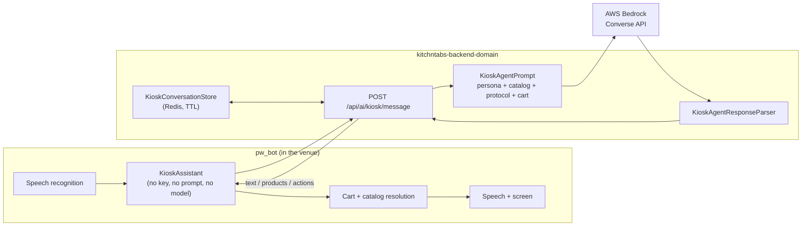

# Kiosk Conversational Agent — moved to the backend, running on AWS Bedrock

> **Status:** ✅ Implemented and verified end to end against the local backend and real Bedrock.
> **Branches:** `feat/kiosk-agent-bedrock` (`kitchntabs-backend-domain`) ·
> `feat/kiosk-agent-backend` (`pw_bot`).
> **Replaces:** the kiosk's direct OpenAI/Anthropic calls described in
> [PYTHON-KIOSK-SELF-SERVICE-VOICE.md](./PYTHON-KIOSK-SELF-SERVICE-VOICE.md).
> **Related:** [AI-TENANT-SETTINGS.md](./AI-TENANT-SETTINGS.md) (which settings exist) ·
> [AI-IMPORTS.md](./AI-IMPORTS.md) (the other Bedrock consumer).

---

## 1. What changed and why

The kiosk (`pw_bot`) used to be an AI client in its own right. Each machine held the
tenant's OpenAI or Anthropic API key, assembled the entire system prompt locally
(persona + catalog + ordering protocol + cart state), called the provider chosen by
`primary_llm_ai`, and parsed the reply.

That put four things in the wrong place:

| Problem | Consequence |
|---|---|
| A third-party API key sat on a physical machine in a venue | A stolen or imaged kiosk is a leaked, billing-linked credential |
| The prompt lived on each kiosk, in two provider-specific copies | A prompt fix required redeploying every kiosk, and the two copies had already drifted once |
| The menu context came from a snapshot fetched at login | A kiosk that logged in this morning quotes this morning's menu |
| Model choice was a per-tenant API key | No operator control over cost or quality |

All four move server-side. The kiosk now posts what it heard to
`POST /api/ai/kiosk/message` and gets back what to say, what to show and what to do —
the same `{text, products, actions}` contract it already understood, produced in
`kitchntabs-backend-domain` on **AWS Bedrock** with platform credentials.

**The kiosk keeps everything physical:** speech in (Vosk/ElevenLabs), speech out
(gTTS/ElevenLabs), the screen, the cart, catalog resolution for display, and creating
the tab. Those are unchanged.



---

## 2. The model

Fixed server-side by `BEDROCK_KIOSK_MODEL`, defaulting to **`us.amazon.nova-micro-v1:0`**
— the cheapest text model Bedrock offers, at **$0.035 / $0.14 per MTok**. A typical turn
with an 86-product menu costs ~7.2k input tokens, i.e. **~US$0.00025 per customer
utterance**.

Deliberately not a tenant setting, for the same reason `BEDROCK_MENU_MODEL` isn't: the
platform account pays for these tokens.

Verified callable on the KitchnTabs AWS account (us-east-2). Note the bare
`amazon.nova-micro-v1:0` id is **rejected** ("on-demand throughput isn't supported") —
the `us.` inference profile is required. Drop-in upgrades if answer quality proves
insufficient, cheapest first:

| Model id | Notes |
|---|---|
| `amazon.nova-lite-v1:0` | $0.06 / $0.24, on-demand (no `us.` prefix needed) |
| `us.amazon.nova-2-lite-v1:0` | Reads dense structure more reliably |
| `us.anthropic.claude-haiku-4-5-20251001-v1:0` | Best quality, priciest — Anthropic access on this account was granted after the menu-import benchmark ran |

Bedrock's **Converse API** is used rather than a vendor SDK precisely so that switching
is a config change, not a code change.

---

## 3. The endpoints

Authenticated with the same Sanctum token (or service-account API key) the kiosk already
uses for the catalog, so the tenant — and therefore the persona, the menu and the
conversation namespace — comes from the token, never from the request body.

| Verb | Route | Purpose |
|---|---|---|
| GET | `/api/ai/kiosk/config` | Is the agent enabled for this tenant, and on which model. Called at startup so the kiosk falls back to the offline stack *before* a customer is standing there |
| POST | `/api/ai/kiosk/message` | One turn |
| POST | `/api/ai/kiosk/reset` | End a conversation and forget its transcript |

### Request / response

```jsonc
// POST /api/ai/kiosk/message
{
  "message": "dame dos aguas",
  "conversation_id": "9f2c…",          // absent on the first turn; the backend mints one
  "cart": {                             // the kiosk's live cart, prompt context only
    "lines": [{"name": "Agua Mineral", "quantity": 2, "note": "", "modifiers": ["Sin gas"]}],
    "total": 3000
  }
}

// 200
{
  "success": true,
  "data": {
    "conversation_id": "9f2c…",
    "text": "Claro, dos aguas.",
    "products": [{"name": "Agua Mineral"}],
    "actions": [{"action": "add", "product_names": ["Agua Mineral"], "quantity": 2}],
    "meta": {"provider": "bedrock", "model": "us.amazon.nova-micro-v1:0",
             "usage": {"input_tokens": 7157, "output_tokens": 53, "total_tokens": 7210},
             "latency_ms": 1777, "recovered": false, "history_messages": 2}
  }
}
```

| Status | Meaning | Kiosk behaviour |
|---|---|---|
| `403` `AGENT_DISABLED` | Tenant has no assistant configured | Permanent for the session — leave conversational mode, don't retry per utterance |
| `502` `AGENT_UPSTREAM_ERROR` | The model call failed | Retryable — say "no te escuché bien" and keep the conversation open |
| `422` | Validation | — |

### Why the cart is sent, every turn

The kiosk owns the cart (it resolves names against the catalog, tracks modifier variants
and submits the tab), so it is the authority on what is in it. The model has to be *told*
rather than left to remember: without a ground-truth block it infers the cart from its own
previous replies, concludes an item it merely *said* it added is already there and — told
not to re-state unchanged items — stops emitting `add` actions entirely. That is exactly
how a conversation used to end with an empty cart and a customer being told "todavía no
tienes nada" after confirming.

---

## 4. Backend components

All under `kitchntabs-backend-domain`.

**`config/kiosk_agent.php`** — model, region, token/temperature limits, conversation TTL
and history cap, catalog cache TTL, the ordering-protocol path, and the fallback strings.
Merged by `AppDomainServiceProvider::boot()` alongside `config/selfservice.php`.

**`app/Services/AI/BedrockChatClient.php`** — text-chat wrapper over Converse. Two
details worth knowing: it passes explicit credentials **only when both env vars are set**,
so production falls through to the ECS task role instead of hard-failing; and it
normalizes the message list (drops empty content, merges same-role neighbours, never
starts on an `assistant` turn) because a trimmed history can otherwise violate Converse's
strict alternation and 400.

**`app/Services/AI/Kiosk/KioskAgentPrompt.php`** — assembles four blocks in this order:

1. **persona** — the tenant's `ai_agent_main_prompt`, with `{Tenant Name}` /
   `{Tenant Description}` resolved here (AI Tenant Settings stores them unresolved by
   design and leaves interpolation to the consuming agent — this is that agent);
2. **catalog** — the real menu;
3. **protocol** — `resources/prompts/kiosk_order_prompt.txt`, moved verbatim from
   `pw_bot/pw/kiosk_order_prompt.txt`. After the persona so it wins on output format;
4. **cart** — appended per request, never cached.

**`app/Services/AI/Kiosk/KioskCatalogContext.php`** — builds the menu block straight from
the database through the same `visibleThroughTenant` scope `/api/ecommerce/product` uses,
so the agent can never mention a product those credentials couldn't list. Cached per
tenant (300s default) because it would otherwise be rebuilt on every utterance.

**`app/Services/AI/Kiosk/KioskConversationStore.php`** — history in the cache (Redis),
keyed `kiosk_agent:conversation:{tenantId}:{conversationId}`, TTL 900s, trimmed to whole
turns so the window never opens on a dangling assistant reply. Nothing here is worth
keeping once the customer walks away, and an abandoned conversation must expire on its own.

**`app/Services/AI/Kiosk/KioskAgentResponseParser.php`** — the tolerant parser, ported
from the kiosk's `assistant_response.py`, including its central rule: a payload that is
malformed *somewhere other than* `"text"` still yields the spoken reply, **but never any
actions** — a broken payload must not become a kitchen ticket.

**`app/Services/AI/Kiosk/KioskAgentService.php`** — orchestrates a turn and owns the
enablement gate. Note it stores the **raw** model output in history, not the parsed text,
so the next turn sees exactly what it emitted last time (including the actions it claimed).

**Permissions** — the `access` middleware requires a `permissions` row per route name, so
`database/data/permissions.json` gained an `ai.kiosk` group and the three route names were
granted to every role that already has `api.ecommerce.product.getList` (exactly the
credential class a kiosk logs in as). Run after deploying:

```
php artisan db:seed --class="Domain\Database\Seeders\Extended\PermissionSeeder"
php artisan db:seed --class="Domain\Database\Seeders\Extended\RoleSeeder"
```

---

## 5. Tenant settings

`primary_llm_ai` keeps its role as the tenant's on/off switch for the assistant, but its
value no longer selects a vendor SDK or requires an API key:

| Value | Behaviour |
|---|---|
| *(empty)* | No assistant. Kiosk stays in detection + salute mode |
| `bedrock` | Assistant on (new, recommended) |
| `openai` / `anthropic` | Assistant on — **legacy values, identical behaviour**, kept so tenants configured before this change keep working |

`ai_openai_key` / `ai_anthropic_key` are no longer read by the kiosk or the agent. They
remain in the settings schema (still encrypted at rest) for tenant-owned integrations.
`ai_elevenlabs_key` is unchanged and still used **on the kiosk** — speech synthesis and
transcription did not move.

**A tenant with no key configured now gets a working assistant**, which was impossible
before.

---

## 6. Kiosk changes (`pw_bot`)

| File | Change |
|---|---|
| `pw/kitchntabs/agent_client.py` **(new)** | HTTP client for the three endpoints. `AgentError` carries a `spoken` fallback and a `disabled` flag, so a 403 ends conversational mode while a 502 is retried on the next utterance |
| `pw/kiosk_assistant.py` **(new)** | One assistant replacing both provider classes. Keeps the speech loop, the "hola" wake word, the SKIP interrupt, the inactivity timeout and the self-echo guard; delegates the turn itself |
| `pw/kitchntabs/cart.py` | `as_prompt_state()` (Spanish prompt text) → `to_agent_state()` (structured `{lines, total}` JSON). The wording now lives server-side |
| `pw/kitchntabs/session.py` | `ai_enabled` no longer requires a key. `ai_provider`, `openai_key`, `anthropic_key`, `agent_prompt`, `llm_api_key` and `resolved_agent_prompt` **removed** — a kiosk holds no LLM state at all |
| `webcam.py` | Builds a `KioskAgentClient` from the session token; "Terminar conversación"/"Finalizar pedido" now also reset the conversation server-side, so the next customer never inherits a transcript |
| **Deleted** | `pw/openai_assistant.py`, `pw/claude_assistant.py`, `pw/agent_prompt.py`, `pw/assistant_response.py`, `pw/kiosk_order_prompt.txt`, `pw/claude_system_prompt.txt` |
| `requirements.txt`, `pw_bot.spec` | `openai` and `anthropic` dependencies dropped; no prompt files bundled |
| `config*.yaml` | `OPEN_AI_KEY`, `OPEN_AI_MODEL`, `AI_PROVIDER`, `CLAUDE_*`, `KIOSK_ORDER_PROMPT_FILE` removed. New optional `KITCHNTABS_AGENT_TIMEOUT` (default 30s) |

A test asserts those files stay deleted and that no `import openai` / `import anthropic` /
prompt text reappears anywhere under `pw/` — two copies of the protocol is precisely the
drift this move was meant to end.

---

## 7. Verification performed

Everything below was executed, not assumed.

**Against real Bedrock and the real local catalog** (86-product tenant), through the
service layer:

- persona interpolated (no `{Tenant Name}` left), catalog present, protocol present and
  *after* the catalog, cart block present — 24,913-char system prompt;
- a question (`"¿qué es el Agua?"`) → correct answer, `products` populated, **no actions**;
- an order (`"dame dos Agua"`) → `add` action, quantity 2, same conversation;
- `"eso es todo"` → read-back ending in a question, **no `create_order`**;
- `"sí, confirmo"` → `create_order`;
- reset → 0 messages left in the store.

**Through real HTTP**, with a minted Sanctum token: `200` on config/message/reset,
`403 AGENT_DISABLED` for a tenant with no provider set, `422` on a missing message,
`401` unauthenticated.

**Through the kiosk's own Python client** against the running backend: config → catalog
fetch (87 products) → turn → cart mutation (`[('POS 01', 2)] total 19980`) → read-back →
`create_order` → reset.

**Test suites:**

- `pw_bot`: 425 passing across 13 files, including a rewritten `test_assistant_wiring.py`
  (27 checks driving the real `handle_utterance()` with a fake backend) and a new
  `test_agent_client.py` (32 checks on the HTTP contract).
- `kitchntabs-backend-domain`: new `tests/API/AI/KioskAgentTest.php`, 20 tests /
  105 assertions, all passing. Bedrock is faked; what is pinned is the prompt it is given,
  the gate, the parser and the conversation namespace.
- Full domain suite: 4 pre-existing failures in `OrdersFlowTest` / `ProductTest` /
  `TabsBasicFlowTest`, confirmed identical on a stashed tree — unrelated to this change.

---

## 8. Known limitations / follow-ups

1. **Nova Micro is a small model.** It handled the full protocol correctly in every case
   tested here, but it is the cheapest option by design. If read-backs or modifier
   handling degrade in the field, raise `BEDROCK_KIOSK_MODEL` (§2) — no code change.
2. **The catalog block is cached for 300s per tenant.** A menu edit reaches live kiosks
   within that window. `KioskCatalogContext::forget()` exists for an explicit bust;
   nothing calls it yet (a product-saved hook would be the natural place).
3. **No per-turn cost accounting is persisted.** Token usage is logged per turn
   (`Kiosk agent turn`) and returned in `meta`, but nothing aggregates it per tenant.
4. **`ai_agent_main_prompt` still ships with a hardcoded menu for at least one tenant**,
   carried over from the previous design — it now competes with the live catalog block
   injected beneath it and should be trimmed to persona/style only.
5. **Speech still runs on the kiosk.** Moving STT/TTS behind the backend is a separate,
   larger change (audio upload latency), not attempted here.
