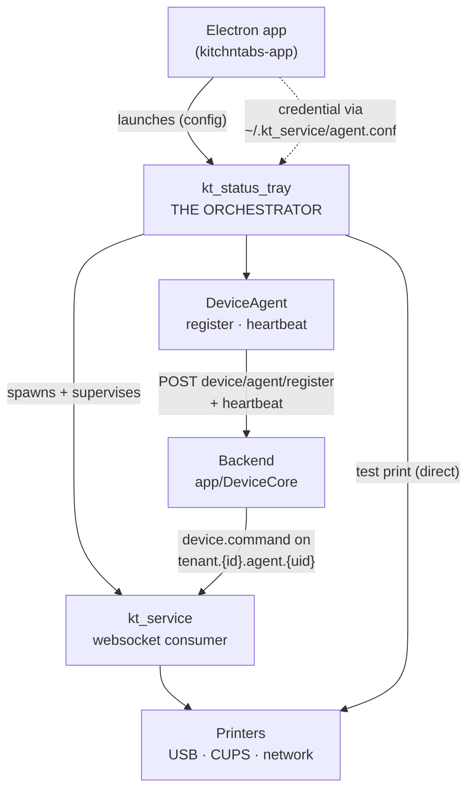
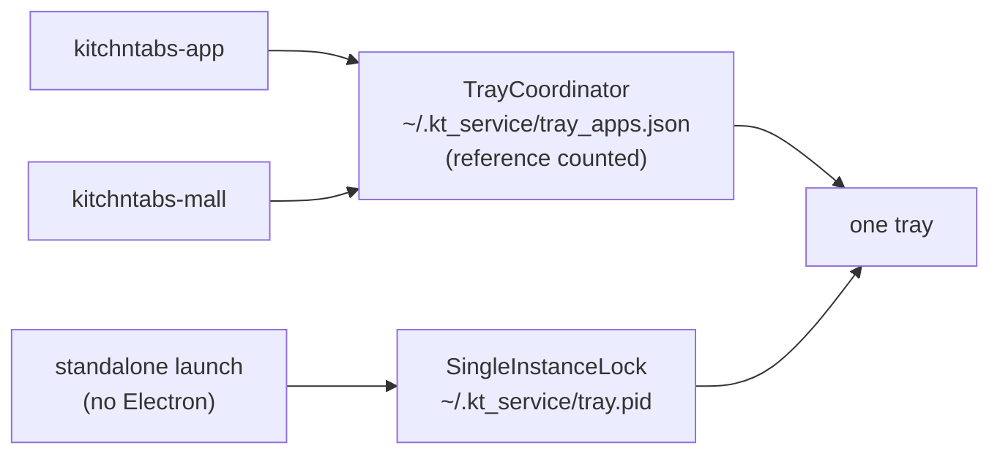
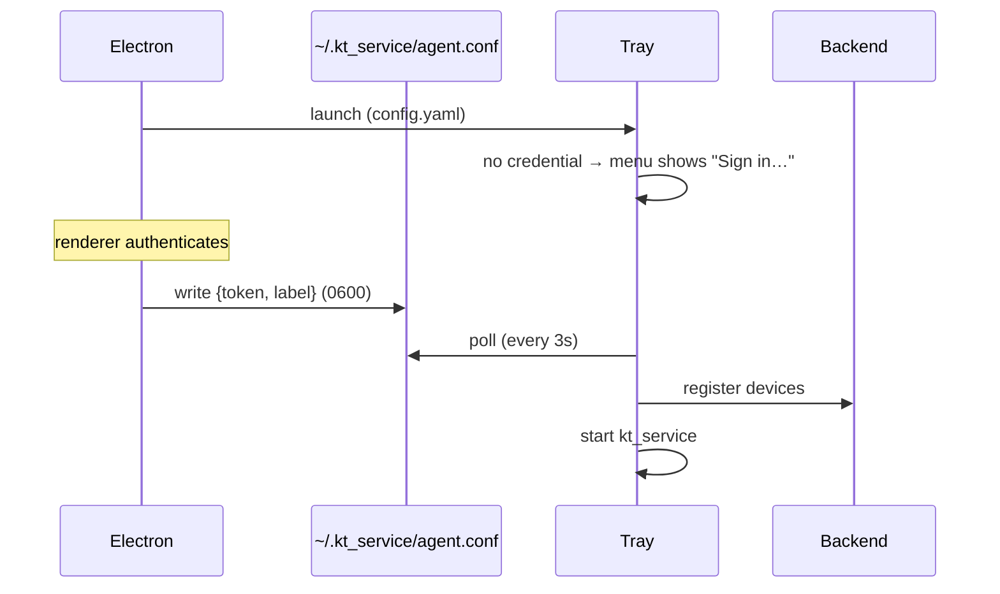

# KT Tray — the device orchestrator

> **Status:** ✅ Implemented and verified end to end on macOS against the local
> stack, including a physical print on a POS58 thermal printer.
> **Layer:** `dash-python-service` (`src/kt_status_tray.py`, `src/pinoywok/`) +
> `kitchntabs-frontend/apps/kitchntabs-app/electron/main` (launcher only).
> **Related:** [SYSTEM-DEVICES-FEATUE.md](./SYSTEM-DEVICES-FEATUE.md) (the
> backend device core this drives) ·
> [N5 — Desktop & Device Service](../N5-Desktop-Device-Service/) ·
> [N4 — Build Toolchain](../N4-Build-Toolchain/)

---

## 1. What it is

`kt_status_tray` is the **orchestrator** of a KitchnTabs terminal. It is not a
status widget with a printer list bolted on; it is the process that owns the
terminal's identity and lifecycle:

- **Owns device registration.** It discovers the attached hardware, registers it
  with the backend through `DeviceAgent`, and heartbeats to keep this terminal's
  presence alive.
- **Supervises the workers.** It starts, watches and restarts `kt_service` (the
  websocket consumer) and is the place any future worker is added.
- **Is the UI.** Service state, the registered printers, per-device test
  printing and settings — all in the tray icon's native menu.
- **Handles sign-in.** Email/password or a pasted ServiceAccount token, so the
  same binary works as an Electron companion or as a standalone install.

Electron launches it and nothing else.



---

## 2. Why the tray and not Electron

Electron used to spawn `kt_service` directly and hold a machine-wide,
reference-counted lock (`kt_service.json` plus a mkdir mutex) to stop several
KitchnTabs apps each starting one.

That put device registration wherever the token happened to be. Once
registration exists, "several apps might each start an agent" stops being a
duplicate-process problem and becomes a **correctness** problem:

> Two agents announcing the same `agent_uid` interleave heartbeats, and each
> announce marks the other's devices disconnected — because the two discovered
> slightly different sets.

One supervisor holding one `DeviceAgent` removes the question. And it is the
same process in standalone mode, where there is no Electron at all.

### What that changed

| Before | Now |
|---|---|
| Electron spawns `kt_service` | Electron launches the tray; the tray spawns `kt_service` |
| `kt_service` registers devices and heartbeats | `kt_service` **adopts** the tray's registration; the tray heartbeats |
| Electron reference-counts `kt_service` (~330 lines) | `TrayCoordinator` reference-counts the *tray*; `SingleInstanceLock` covers standalone |
| Tray = read-only status window | Tray = orchestrator |

---

## 3. Single instance, in two layers

One tray means one `DeviceAgent`. Two layers guarantee it, because they cover
different launches:



- **`TrayCoordinator`** (Electron) — first app to start spawns the tray, later
  apps register against it, last app out releases it.
- **`SingleInstanceLock`** (tray) — a **pid file, not a lock file**: a lock file
  left behind by a crash blocks every future start until someone deletes it,
  whereas a stale pid is detectable and reclaimable. Failing to acquire the lock
  is never fatal — a second tray is a lesser failure than no tray.

---

## 4. Credential handover

Electron cannot pass the token at launch: the tray starts at `app-ready`, and
the token only exists once the renderer has authenticated. Rather than invent an
IPC channel to a native process that a *different* app may have started, the
credential is written to the file the tray already reads.



`start-bg-service` / `stop-bg-service` from the renderer now write and clear
that file. Clearing it is the stop signal: the tray sees it vanish, stops the
supervised service and shows `Sign in…` again.

**Precedence:** `argv` → `KT_AGENT_TOKEN` → stored `agent.conf` → interactive
sign-in.

---

## 5. Sign-in

Two ways in, because terminals are provisioned two ways: a person signing in at
a till, and an operator pasting a ServiceAccount key into a headless box.

| Tab | Flow |
|---|---|
| **Email & password** | `POST /api/login` → Sanctum token. The backend's own message is surfaced verbatim ("Estas credenciales no coinciden…") — far more useful than a status code |
| **ServiceAccount token** | Verified with `GET /api/auth/getauth` **before** storing, so a typo fails at sign-in rather than looking like a device fault weeks later |

Built with **tkinter** — in the standard library, present on all three targets,
and shown only on demand, so no always-on window returns.

> ⚠️ **Tk and the tray backend cannot share the main thread.** Both drive a
> platform run loop (NSApplication on macOS, a message pump on Windows). A
> sign-in therefore *stops the icon*, runs the dialog on the main thread, and
> **rebuilds** the icon — a stopped `pystray.Icon` cannot be reused.

---

## 6. The UI is the menu

There is no overlay window and no settings dialog. A frameless always-on-top
window behaves differently on every platform — stacking, focus stealing,
multi-monitor placement, Wayland refusing to position it at all — whereas a
native tray menu looks and behaves the way each platform expects.

```
KitchnTabs — KitchnTabs-acde48001122
● Connected · up 1h11m
12 msgs   3 prints   1 tts
──────────────────────────────────
Printers (1 ready)
   ● POS58 Mostrador  ★
   ○ Canon_MF260
Test print  ▸
──────────────────────────────────
Account: kitchntabs-app
Service: running
Refresh devices
Restart service
Sign out
──────────────────────────────────
Settings  ▸   Printing [x] · Text to speech [x] · Notifications [x]
──────────────────────────────────
Quit
```

The menu is rebuilt wholesale on each tick (`Menu(callable)`), because
reconciling a live menu against hardware that comes and goes is far more code
than redrawing a dozen rows.

### The icon has three states, not two

| | Meaning |
|---|---|
| 🟢 | connected **and** at least one usable printer |
| 🟠 | connected but **no** usable printer |
| 🔴 | service down |

Amber is the one worth having. It is the state where **the app looks completely
healthy and nothing prints** — and a two-state icon renders that as green, which
is the most misleading thing this icon could do.

"Usable" means configured **and** active. A discovered but unconfigured printer
cannot receive a routed job, so it must never make the icon green.

### Device glyphs

`○` not configured · `⏸` configured but switched off · `✗` error · `●` ready.
Kept distinct deliberately: they look identical from outside and need
completely different fixes.

---

## 7. Test print goes straight to the hardware

The tray's test print calls `ThermalPrinter` directly rather than asking the
backend to dispatch a command.

That is the whole point: it answers *"is this printer physically working from
this machine"* with no websocket, no queue and no backend in the path to muddy
the result — and it works when the backend is unreachable, which is exactly when
someone reaches for it.

`config=None` is passed on purpose: the device's own `connection` carries the
USB vendor/product, CUPS queue or device path. The global
`PRINTER_VENDOR`/`PRINTER_PRODUCT` pair it replaces could only ever address one
printer.

> This same bug bit the *websocket* test path: `print_test_page()` built
> `ThermalPrinter` from the global config, so a command naming the POS58
> (`0fe6:811e`) was attempted against whatever `config.yaml` said (`04b8:0e20`)
> and failed with "device not found". Fixed by
> `print_test_page_on_device()`.

---

## 8. Supervision

`ServiceSupervisor` starts, watches and restarts the tray's children.

- **Restarts are throttled** to one per 10s. A service dying instantly (bad
  token, missing config) would otherwise spin, filling the log and hammering the
  API.
- **A manual restart bypasses the throttle** — it was asked for, not automatic.
- **`SIGKILL` after `SIGTERM` times out.** A wedged USB write will not answer a
  polite signal, and the tray must still be able to quit.
- Children run in **their own process group**, so a Ctrl-C aimed at the tray
  does not kill the workers out from under the shutdown path.

---

## 9. Why pystray, not PyQt6

Once every surface is a native tray menu, nothing is left for a GUI toolkit to
draw. PyQt6 cost **~100 MB** in the bundle to render a menu and composite one
small image.

| | PyQt6 | pystray + Pillow |
|---|---|---|
| Frozen binary | ~140 MB | **42 MB** |
| Backends | Qt everywhere | native: Cocoa / Shell_NotifyIcon / AppIndicator |
| Pillow | extra | already required for printing |

`pystray` and `PIL` were already *imported* by the old tray and never used — it
drew its icon with `QPainter`.

### Packaging

PyInstaller resolves imports statically, but **pystray picks its backend at
runtime by platform** — so the one that will actually be imported is never seen
and is silently omitted. The bundle then dies with `No module named
pystray._darwin` on the target machine. All three backends are declared as
hidden imports; the two that do not apply cost a few KB.

`tkinter` is only reachable through the sign-in dialog, so a missing hook does
not surface until someone tries to authenticate.

A `needsAssets` hook in `build-service.js` copies the tray icon into the
bundle's `assets/`, where `_asset_path()` finds it via `sys._MEIPASS`.

---

## 10. Local development

```bash
cd dash-python-service

brew install libusb            # REQUIRED — without it pyusb reports
                               # "No backend available" and USB printer
                               # discovery silently returns nothing
brew install python-tk@3.11    # Homebrew Python ships without _tkinter

python3.11 -m venv pw_env
./pw_env/bin/pip install -U pip setuptools wheel
./pw_env/bin/pip install -r requirements-macos-dev.txt
```

The venv **must** live at `dash-python-service/pw_env` — `getDevPythonEnvPath()`
in `electron/main/index.ts` resolves `pw_env/bin/python3` (or
`pw_env/Scripts/python.exe` on Windows) and the Electron dev flow will not find
it anywhere else.

`TrayCoordinator` falls back to running `kt_status_tray.py` from source via
`pw_env` when the PyInstaller binary is absent — which it always is while
developing. Without that fallback the tray silently never appeared in dev.

### Standalone

```bash
./kt_service/kt_status_tray                 # finds its bundled config
kt_status_tray /path/config.yaml <token>    # or pass both
```

---

## 11. Files

| Path | Role |
|---|---|
| `src/kt_status_tray.py` | The orchestrator: menu, icon, supervision, sign-in |
| `src/pinoywok/tray_auth.py` | Credential precedence, `POST /api/login`, token verification, the tkinter dialog |
| `src/pinoywok/service_supervisor.py` | `ServiceSupervisor` + `SingleInstanceLock` |
| `src/pinoywok/device_agent.py` | `DeviceAgent` — identity, register, heartbeat, `adopt_registration()` |
| `src/kt_service.py` | Websocket consumer; adopts the tray's registration |
| `assets/tray-icon.png` | 128px logo (the 2049px original is resampled on every repaint otherwise) |
| `electron/main/TrayCoordinator.ts` | Cross-app reference counting + the dev source fallback |

### Local state (`~/.kt_service/`)

| File | Written by | Contains |
|---|---|---|
| `agent.json` | tray | `agent_uid`, `node_id`, `tenant_id`, the device map. **No credentials** |
| `agent.conf` | tray / Electron | the bearer token, `0600` |
| `status.json` | `kt_service` | liveness, uptime, counters |
| `tray.pid` | tray | single-instance lock |
| `tray_apps.json` | Electron | cross-app reference count |

---

## 12. Verified

On macOS (Intel), against the local stack through the `api-dev` Cloudflare
tunnel, with a real POS58 (`0fe6:811e`) attached:

| Check | Result |
|---|---|
| Discovery | POS58 over USB + a CUPS queue, both passing backend validation |
| Registration | tray registers 2 devices; `kt_service` **adopts** rather than re-registering |
| Channels | subscribes to the per-agent **and** legacy channels |
| Credential handover | tray starts unauthenticated → Electron writes `agent.conf` → tray registers and starts `kt_service`, no IPC |
| Print from the React app | `device.command` → `kt_service` → **paper**, then `acked` |
| Test print from the tray | direct to hardware, **paper**, no backend |
| Single instance | second process refuses; stale pid reclaimed |
| Supervision | crashed child's exit code captured, restart throttled, manual restart bypasses |
| Frozen bundle | 42 MB, runs; `tray-icon.png` + `_tkinter` present in the archive |
| Menu | renders correctly signed-in, signed-out and service-down |

---

## 13. Known gaps

- **Settings toggles are cosmetic.** `kt_service` reads its own config; a shared
  settings file would make Printing / TTS / Notifications actually take effect.
- **`agent.conf` holds a bearer token at `0600`.** Adequate for a single-user
  till, not for a shared machine. An OS keychain would be better.
- **`legacy_print_broadcast` is not carried in `agent.json`**, so an adopting
  `kt_service` assumes it is on. Hearing a duplicate is recoverable — the
  handler ignores legacy prints once devices are registered — whereas not
  listening would lose tickets mid-migration.
- **Only `kt_service` is supervised.** `print_service` and `tts_service` are
  still invoked ad hoc by Electron over IPC; folding them in is the obvious next
  step.
- **tkinter bundling is verified on macOS only.** Windows and Linux hooks are
  declared but untested.
