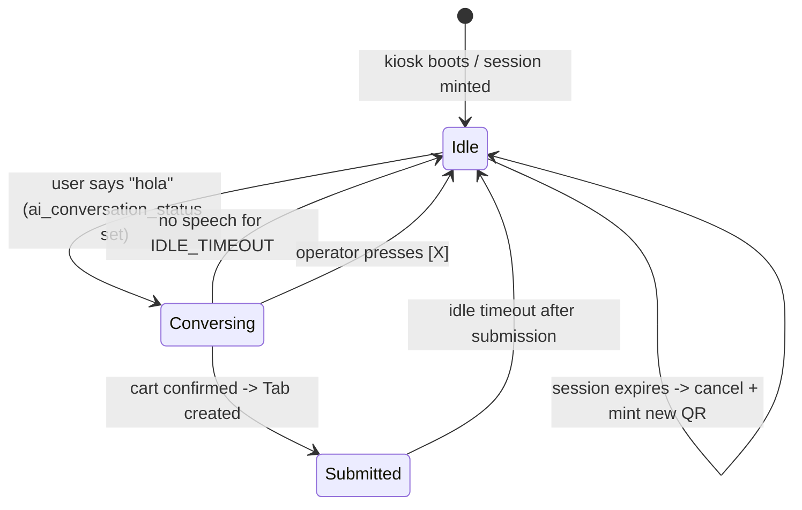
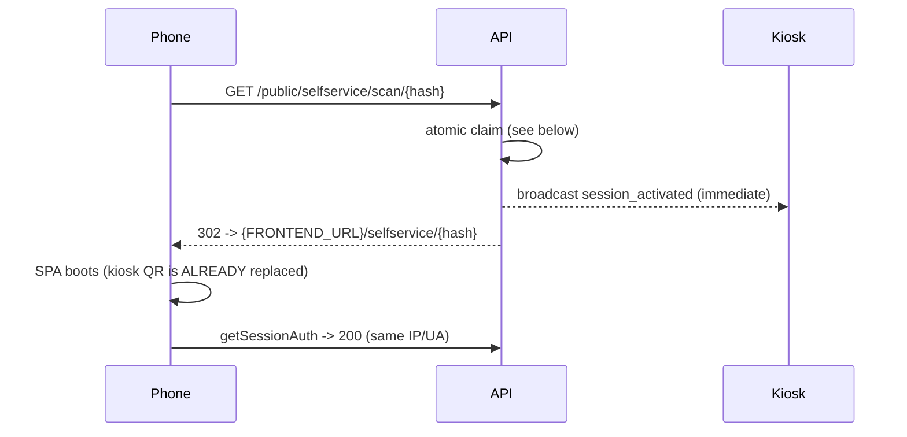
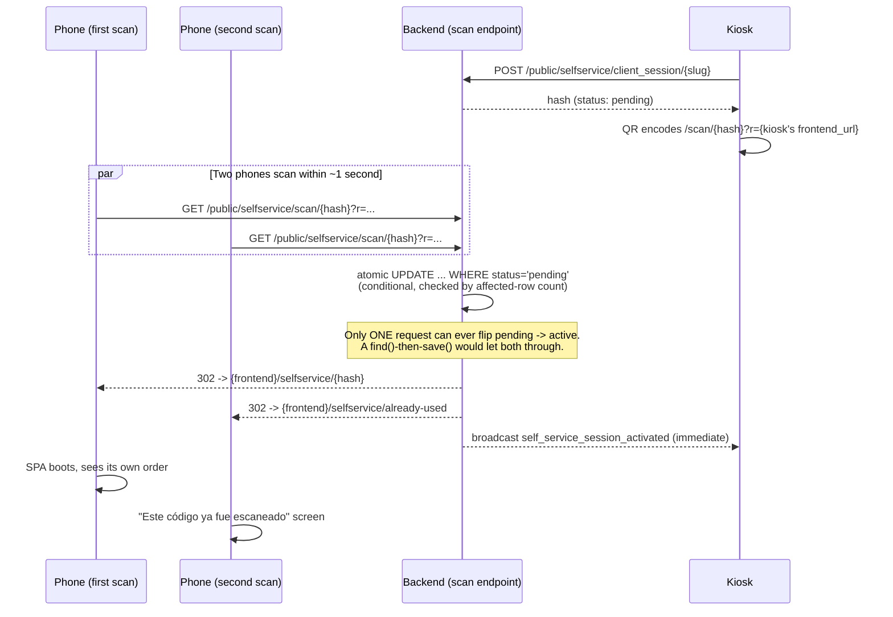
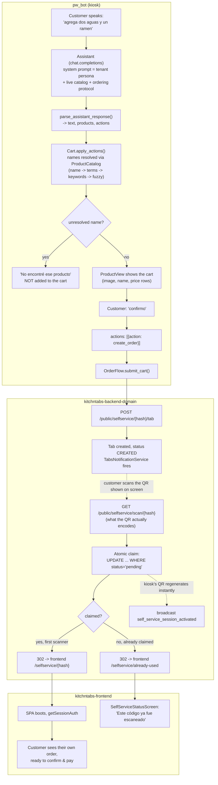

# Python Kiosk — Voice Ordering & Self-Service Session Lifecycle

> **Status:** 📋 Planned — not implemented.
> **Repos:** `pw_bot` (kiosk), `kitchntabs-backend-domain` (events), `kitchntabs-frontend` (self-service SPA).
> **Depends on:** the already-shipped kiosk work — tenant auth, live `ProductCatalog`
> (with the `terms` phonetic column), `SelfServiceQRManager`, and the chat-completions
> agent driven by `ai_agent_main_prompt`.
> **Related:** [F16 AI Agents](../F16-AI-Agents/F16-AI-Agents_AI_AGENTS_DOCUMENTATION.md) ·
> [F5 Self-Service](../F5-Customer-Self-Service/F5-Customer-Self-Service_SELFSERVICE_FEATURE.md)

---

## 1. Goal

Let a customer standing at the kiosk order **by voice** — "agrega dos botellas de agua
y un ramen", "quita el ramen", "ponle una nota al ramen" — and then scan the on-screen
QR to find that exact order already waiting on their phone, ready to confirm and pay.

Three sub-problems, in dependency order:

1. **Voice cart** — extract order actions from speech, resolve them against the real catalog.
2. **Session lifecycle** — one QR session per conversation, with idle expiry, a visible
   countdown, and a manual close.
3. **Realtime** — replace HTTP polling with websockets so a scanned QR is replaced
   *instantly*, closing the double-scan race.

---

## 2. Decisions already made

| Question | Decision | Consequence |
|---|---|---|
| What does the kiosk create on the session? | **A real Tab in `CREATED` status** via `POST /api/public/selfservice/{hash}/tab` | Reuses all existing self-service machinery; zero frontend work for the happy path. The kitchen receives `TabCreatedNotification` (socket) as soon as it is created. |

**Consequence to design around:** because the kitchen sees the tab immediately, a voice
misrecognition becomes a real ticket. The flow therefore requires an explicit spoken
confirmation before the POST (see §3.4).

---

## 3. Part 1 — Voice cart

### 3.1 Action schema

Extend the assistant JSON contract (currently `{text, products}`) with F16's action shape:

```json
{
  "text": "Listo, agregué dos aguas y un ramen.",
  "products": ["Agua Mineral", "Ramen Buldak"],
  "actions": [
    {"action": "add", "product_names": ["agua"], "quantity": 2},
    {"action": "add", "product_names": ["ramen"], "quantity": 1},
    {"action": "add_note", "product_names": ["ramen"], "note": "sin cebolla"},
    {"action": "remove", "product_names": ["ramen"]},
    {"action": "modify_quantity", "product_names": ["agua"], "quantity": 3}
  ]
}
```

Actions are **optional** — a pure question ("¿qué es el gohan?") returns none.

### 3.2 Where it plugs in

| File | Change |
|---|---|
| `pw/assistant_response.py` | Return `(text, products, actions)`. Already the single tolerant parse point — a malformed `actions` array must degrade to `[]`, never raise. |
| `pw/openai_assistant.py` · `pw/claude_assistant.py` | Add the action schema to `RESPONSE_FORMAT_INSTRUCTIONS`; pass parsed actions to the cart. |
| `pw/kitchntabs/cart.py` **(new)** | The cart itself. |
| `pw/product_view.py` | Add a quantity column + running total to the existing list rows. |

### 3.3 `Cart` design

Conversation-scoped, keyed by catalog `id` (already carried through
`ProductCatalog.resolve()` — nothing throws that identity away).

```
add(product, qty=1)        # merges into an existing line
remove(product)
set_quantity(product, qty) # qty <= 0 removes the line
add_note(product, text)
clear()
lines -> [{product, quantity, note}]
total  -> sum(price * quantity)
```

Every incoming `product_names` entry goes through `catalog.resolve_all()` first, so
"dos aguas" hits the real product via `name` → `terms` → `keywords` → fuzzy. **An
unresolved name is never added** — it is reported back so the agent can say
"no encontré ese producto".

Cleared when: the tab is submitted, the session is closed (manually or by idle), or
`ai_conversation_status` clears on conversation timeout.

### 3.4 Submission

Triggered by intent ("eso es todo", "confirmar") — **not** automatically on silence.

```
Agent: "Entonces son dos aguas y un ramen sin cebolla, ¿confirmo?"
User:  "sí"
  -> POST /api/public/selfservice/{hash}/tab
     { "order": { "items": [ {product_id, quantity, notes} ] } }
  -> Tab CREATED on the pinned session
  -> kiosk: "Listo, escanea el código para pagar"
```

Verified: `SelfServiceSession::byHash()` does **not** filter by status, so a `pending`
(unscanned) session accepts a tab. The customer scans afterwards and finds it waiting.

---

## 4. Part 2 — Session lifecycle

### 4.1 States



### 4.2 Rules

> ### ⚠️ The kiosk never closes a backend session
>
> **Issuing a new QR must not touch the previous session.** A customer who already
> scanned may still be using that session on their phone — reviewing, confirming or
> paying — long after the kiosk has moved on to the next person. Cancelling it from the
> kiosk would destroy a live order in someone's hand.
>
> "Closing" is therefore **local kiosk state only**: clear the cart, clear the screen,
> mint a fresh session for the next customer. The old session is simply abandoned and
> left alone. Unclaimed tabs and expired sessions are already handled by an existing
> server-side mechanism — the kiosk must not duplicate or pre-empt it.

- **One session per conversation.** Entering conversational mode refreshes the QR so
  the conversation starts on a clean, unscanned session.
- **Idle expiry.** After `KIOSK_SESSION_IDLE_TIMEOUT` seconds with no recognised speech,
  the kiosk clears local state and mints a **new** session. The previous one is left
  untouched. Prevents a walk-away customer's cart being inherited by the next person,
  without stranding a customer who is mid-checkout on their phone.
- **Pinning.** While a cart has contents, the QR must stop auto-regenerating. Today
  `SelfServiceQRManager` mints a new session the moment the current one leaves `pending`
  — with a cart in play that would silently retarget the cart at a session the customer
  is not looking at. Add `pin()` / `unpin()`.
- **No `POST .../cancel` anywhere in the kiosk.** If that call appears in a diff for this
  feature, it is a bug.

### 4.3 UI

| Element | Behaviour |
|---|---|
| **Idle countdown** | Small `mm:ss` label beside the QR, counting down to expiry. Only while a session is live and a cart or conversation is active. |
| **Close button `[X]`** | Large, next to the QR. The "next customer please" reset: clears the cart, **clears the subtitles and the product list** so the next customer cannot see the previous order, and mints a new QR. Does **not** cancel the backend session (see the box above). |

### 4.4 New config

```yaml
KIOSK_SESSION_IDLE_TIMEOUT: 120       # seconds of silence before a fresh QR is minted
KIOSK_SESSION_SHOW_COUNTDOWN: True
# No max-lifetime setting: session expiry is owned server-side, not by the kiosk.
```

---

## 5. Part 3 — Realtime (and the double-scan race)

### 5.1 What actually goes wrong today

Two people scan the same code within a second or two of each other.

**The backend already prevents data corruption.** `getSessionAuth` activates a `pending`
session and stores the client IP + user agent; a second client gets
**`403 CLIENT_IDENTITY_MISMATCH`** and can never join the first customer's session.

The problem is **when** the claim happens. Today the chain is:

```
scan -> browser opens URL -> downloads React SPA -> SPA boots
     -> SPA calls getSessionAuth -> session marked active -> broadcast
```

That is **seconds** of wall-clock time on venue wifi, during which the QR on screen is
still perfectly scannable. Polling every 6s makes it worse, but even instant websockets
cannot fix it — the backend does not yet *know* the code was scanned. The window is
owned by the SPA boot, not by the transport.

### 5.2 Fix: claim at HTTP-request time via a scan-redirect endpoint

Point the QR at a lightweight backend endpoint instead of directly at the SPA:

```
QR encodes:  {API_URL}/api/public/selfservice/scan/{hash}
```



The claim now lands **milliseconds** after the scan, before a single byte of JavaScript
is downloaded. The kiosk regenerates its QR while the customer's phone is still loading.

**The claim must be atomic**, or two simultaneous redirects both succeed:

```php
$claimed = SelfServiceSession::where('hash', $hash)
    ->where('status', SelfServiceSession::STATUS_PENDING)
    ->update(['status' => SelfServiceSession::STATUS_ACTIVE, 'meta->client_ip' => ..., ...]);

if ($claimed === 0) {
    // someone else got there first (or it expired)
    return redirect(FRONTEND_URL . '/selfservice/already-used');
}
```

A conditional `UPDATE ... WHERE status = 'pending'` returning an affected-row count is
the concurrency primitive — a `find()` then `save()` has a read-modify-write race.

Because the redirect binds IP + user agent, the SPA's subsequent `getSessionAuth` comes
from the *same* client and validates normally. No SPA change is needed for the happy path.

> ⚠️ **Prefetch risk — must be tested before shipping.** Some QR scanners, link
> previewers, messaging apps and security scanners issue a speculative `GET` on the URL.
> With claim-on-GET that would burn a session with no human present. Mitigations to
> evaluate: require a browser-like `Accept: text/html`, ignore known bot/prefetch user
> agents, or claim on a `?c=1` parameter that only the redirect target carries. Verify on
> real iOS and Android cameras before rollout.

### 5.3 Websockets are still needed — for the kiosk's *reaction*

The redirect makes the backend learn instantly; websockets make the **kiosk** learn
instantly instead of up to 6 seconds later. Both halves are required to close the window.

### 5.2 Websocket client for the kiosk

`kitchntabs-python-service/src/kt_service.py` already implements exactly the client
needed, against the same backend — reuse its approach rather than inventing one:

- raw **Pusher protocol over `websockets`**
- private-channel auth: `POST` to the broadcasting auth endpoint with `socket_id` +
  `channel_name`, via `aiohttp`
- `pusher:subscribe` with the returned auth token
- handles `pusher:connection_established`, `pusher:subscription_succeeded`,
  and `pusher:ping` → `pusher:pong`

**Channel:** `private-tenant.{tenant_id}.system` — the same channel the staff
`SelfServiceQRGenerator` already listens on.

**Event of interest:** session activation. The React QR generator matches it as:

```js
eventType === 'self_service_session_activated'
  || model === 'Domain\\App\\Models\\SelfService\\SelfServiceSession'
  || notificationClass?.includes('SelfServiceSessionActivated')
// payload: lastEvent.data.session_hash
```

The kiosk applies the same rule the SPA does: **only regenerate when
`data.session_hash` matches the hash currently on screen** — otherwise another
terminal's activation would wipe this kiosk's QR.

### 5.3 Integration shape

`webcam.py` is a synchronous pygame loop; the websocket client is asyncio. Run the
client on a **daemon thread with its own event loop**, pushing events onto a
`queue.Queue` that the main loop drains once per frame — the same pattern already used
for background login and catalog fetches. No async in the render path.

Polling stays as a **fallback**, at a much longer interval, so a websocket outage
degrades to today's behaviour instead of freezing the QR forever.

### 5.4 Frontend change

In the self-service SPA's session-auth error handling, map
`error_code === 'CLIENT_IDENTITY_MISMATCH'` (403) to a dedicated screen:

> **Este código ya fue escaneado**
> Por favor escanea el nuevo código en la pantalla.

Distinct from `404` (not found) and `410` (expired), which already have their own copy.

---

## 6. Work breakdown

| # | Task | Repo | Risk |
|---|---|---|---|
| 1 | `Cart` + tests | `pw_bot` | Low — pure logic |
| 2 | Action schema in parser + both assistants | `pw_bot` | Low |
| 3 | Quantity + total in `ProductView` rows | `pw_bot` | Low |
| 4 | Confirmation intent + `POST .../tab` | `pw_bot` | **Medium** — creates real kitchen tickets |
| 5 | Idle timer, countdown, `[X]` close, `pin()`/`unpin()` | `pw_bot` | Medium — timing/state edge cases |
| 6 | Pusher websocket client (thread + queue) | `pw_bot` | **High** — auth handshake, reconnect, thread safety |
| 7 | `CLIENT_IDENTITY_MISMATCH` / "already used" screen | `kitchntabs-frontend` | Low |
| 8 | Confirm the activation event actually broadcasts on session activation | `kitchntabs-backend-domain` | **Unverified — do this first** |
| 9 | **Scan-redirect endpoint** with atomic claim + broadcast (§5.2) | `kitchntabs-backend-domain` | **High** — concurrency + prefetch risk |
| 10 | Point the kiosk QR at the scan endpoint instead of the SPA URL | `pw_bot` | Low (one URL change) |
| 11 | New tenant settings for order wording (§7.2) | `kitchntabs-backend-domain` + `pw_bot` | Low — established pattern |

> **Task 8 is the gate.** The React generator listens for
> `self_service_session_activated`, but that it is *emitted* on activation has not been
> confirmed in backend code during this planning pass. If it is not, tasks 6 and the
> whole realtime fix depend on adding the broadcast. **Verify before estimating task 6.**

Suggested order: **8 → 1 → 2 → 3 → 5 → 4 → 6 → 7.** Tasks 1-3 are safe and independently
useful (a visible voice cart with no submission). Task 4 is the first one that touches
the kitchen. Task 6 is the largest and benefits from everything else being settled.

---

## 7. Resolved decisions

| Question | Decision |
|---|---|
| **Tab timing** | Created **on explicit intent** — the user asks for / confirms an order. Not live-synced, not on silence. This needs a dedicated action type (§7.1). |
| **Multiple tabs per session** | Ordering again after submitting creates a **second tab on the same session**. The session is not recycled by a submission. |
| **Guest mode** | No tenant → **no QR, no ordering, and no conversation at all**. The kiosk stays in detection + salute mode only. |
| **Confirmation wording** | **Tenant-configurable**, via new tenant settings with sensible defaults (§7.2). |

### 7.1 Order intent as an explicit action

The agent must distinguish "tell me about the ramen" from "order me a ramen". Add a
terminal action to the schema in §3.1:

```json
{"action": "create_order"}
```

Emitted only when the user asks to order or confirms a read-back. On receipt the kiosk
POSTs the current cart as a tab to the pinned session, then clears the cart (leaving the
session open — a further order becomes a second tab).

### 7.2 New tenant settings

Following the existing domain pattern (`config/pw_bot_tenant_settings.php`, merged by
`AppDomainServiceProvider::mergeDomainTenantSettings()`), all long-text with no `max:`
cap and a working default, appended to the agent's system prompt:

| Setting | Purpose | Default (es) |
|---|---|---|
| `pw_bot_order_confirm_prompt` | How the agent reads the cart back before creating the tab | "Entonces son {items}, ¿confirmo tu pedido?" |
| `pw_bot_order_created_message` | Spoken once the tab exists | "Listo, escanea el código para ver y pagar tu pedido." |
| `pw_bot_order_intent_hint` | Extra instructions on when to emit `create_order` | guidance on distinguishing questions from orders |

The kiosk reads these into `RuntimeSettings` alongside `ai_agent_main_prompt` and
`pw_bot_motion_greetings`, which already work this way.

---

## 8. Still open

Only one item remains, and it is an empirical question rather than a design choice:

1. **Prefetch on the scan endpoint** (§5.2). Some QR scanners, link previewers, messaging
   apps and security scanners issue a speculative `GET`. With claim-on-GET that would burn
   a session with no human present. **Test on real iOS and Android cameras before
   rollout**, and pick a mitigation (`Accept: text/html` requirement, bot-UA filtering, or
   claiming only on a parameter the redirect target carries).

Resolved and no longer in scope:

- *Idle expiry / unclaimed tabs / who cancels abandoned sessions* — an existing
  server-side mechanism handles these. The kiosk deliberately does nothing (§4.2).
- *`[X]` and privacy* — clears cart, subtitles and product list (§4.3).

`KIOSK_SESSION_MAX_LIFETIME` from §4.4 is therefore **dropped** — the kiosk has no
business enforcing a session ceiling it does not own.

---

## 9. Prerequisite fixes to fold in

Independent of this feature, both already identified and worth doing alongside:

- **`ai_agent_main_prompt` still embeds a hardcoded menu** with prices and links, now
  competing with the live catalog block injected beneath it. It should be trimmed to
  persona/style/venue-info only, or the agent will keep quoting stale prices.
- **The prompt does not know the kiosk has a screen** — the agent replied
  *"No puedo mostrar imágenes"* while the kiosk was displaying the product card. Add a
  line stating that products are shown visually alongside its reply.

---

# Implementation Report

> **Status:** ✅ Implemented (Parts 1 and half of Part 3) · 📋 Not started (Part 2, the rest of Part 3).
> Everything below reflects what was actually built and verified, as a supplement to the
> plan above — the plan is left intact as the design record; this section is the as-built
> reference.

## 10. What shipped vs. what didn't

| Plan item | Status | Notes |
|---|---|---|
| §3 Voice cart (add/remove/modify_quantity/add_note) | ✅ Shipped | `pw/kitchntabs/cart.py` |
| §3.1 Action schema (`actions` in the JSON contract) | ✅ Shipped | Both providers, via a shared prompt file |
| §3.4 Confirm-then-submit, `create_order` action | ✅ Shipped | `pw/kitchntabs/order_flow.py` |
| §7.1 `create_order` as an explicit terminal action | ✅ Shipped | Never fires on silence or a question |
| §7.2 Tenant-configurable order wording | ✅ Shipped | `pw_bot_order_confirm_prompt` / `pw_bot_order_created_message` |
| Product catalog as ground truth (F16-style resolution) | ✅ Shipped | `pw/kitchntabs/catalog.py`, plus a first-class `terms` column (not in the original plan - added mid-build, see §12) |
| OpenAI Assistants API removal | ✅ Shipped | Not in the original plan; done because the Assistants API is being deprecated and kept the kiosk's persona/knowledge in an OpenAI dashboard instead of tenant settings |
| §4 Session lifecycle (idle timer, countdown, `[X]` close) | 📋 Not started | `pin()`/`unpin()` exist (needed by order submission) but the idle timer, on-screen countdown and close button do not |
| §5.2 Scan-redirect endpoint (atomic claim) | ✅ Shipped | Race proven under real concurrency, see §11.3 |
| §5.4 Frontend "already used" screen | ✅ Shipped | Extended in scope: also covers `invalid`/`expired`, and the in-app 403 case |
| §5.3 Websocket client for the kiosk | 📋 Not started | The kiosk still polls the session every 6s; the backend now claims instantly (§11.3), but the kiosk's own QR still takes up to 6s to refresh |
| §5.2 Prefetch testing on the scan endpoint | 📋 Not started | Real iOS/Android testing still required before production rollout |

## 11. What was actually touched

### 11.1 `pw_bot` (kiosk)

| File | What changed |
|---|---|
| `pw/kitchntabs/cart.py` **(new)** | Conversation-scoped cart. Keyed by catalog `id` so repeated mentions merge instead of duplicating. Every action resolves through the catalog first - **an unresolved name is never added**, only reported back so the agent can say so. |
| `pw/kitchntabs/order_flow.py` **(new)** | The one path that turns a cart into a real Tab. Shared by both providers rather than duplicated - it is the single place in the kiosk that produces something a kitchen cooks and a customer pays for. |
| `pw/kitchntabs/catalog.py` **(new)** | Fetches the tenant's real, enabled products (`GET /api/ecommerce/product`) once per session. Provides the system-prompt catalog block and F16-style progressive name resolution: exact → `terms` (phonetic) → `keywords` → containment → fuzzy. |
| `pw/product_view.py` **(rewrite)** | Was a single, oversized image-only card scraping `og:image` from a hardcoded `pinoywok.cl` domain. Now an Android-list-style row (thumbnail · name+description · price) for up to 5 resolved catalog products, using the real `image_url` from the catalog. |
| `pw/openai_assistant.py` **(rewrite)** | Assistants API (`beta.threads`, a hardcoded `assistant_id`) → plain `chat.completions`. System prompt is now `tenant persona + live catalog + kiosk ordering protocol`, entirely tenant/catalog-driven. |
| `pw/claude_assistant.py` | Same catalog/cart/order wiring as the OpenAI path; unlike OpenAI this one didn't need an API migration. |
| `pw/assistant_response.py` **(new)** | Single tolerant JSON parser shared by both providers: `(text, products, actions)`. Recovers just the `"text"` field via regex when the rest of the payload is malformed (e.g. a stray comment), rather than discarding a correct answer. The recovery path deliberately returns **no actions** - a broken payload must never become an order. |
| `pw/agent_prompt.py` | Added `load_order_prompt()` / `set_order_prompt_file()` - loads and caches the ordering protocol from a file, overridable via config. |
| `pw/kiosk_order_prompt.txt` **(new)** | The kiosk's ordering protocol in English: output contract, full action schema, "a question is not an order," and the confirm-before-ordering rule stated as the most important rule on the page (an order goes straight to the kitchen). Also tells the model it has a screen, fixing an observed *"I can't show images"* reply. |
| `pw/kitchntabs/selfservice.py` | QR now points at the backend's `scan/{hash}` endpoint (not the SPA URL directly), carrying the kiosk's own `KITCHNTABS_FRONTEND_URL` as `?r=`. Added `pin()`/`unpin()` so a cart under construction stops the QR from auto-regenerating from underneath it. |
| `pw/kitchntabs/session.py` | Two new tenant-configurable settings surfaced into `RuntimeSettings`: `order_confirm_prompt`, `order_created_message`. |
| `webcam.py` | Builds the `Cart` + `OrderContext` alongside the catalog; `_on_cart_changed` pins/unpins the QR and mirrors cart contents onto `ProductView`. |
| `testing/test_cart.py`, `test_order_flow.py`, `test_catalog.py`, `test_assistant_response.py`, `test_assistant_wiring.py` **(new)** | 111 tests across the new modules, including every safety property in §11.2 below. |

### 11.2 `kitchntabs-backend-domain`

| File | What changed |
|---|---|
| `database/migrations/..._add_terms_to_products_table.php` **(new)** | `products.terms` - `longText`, nullable. Not in the original plan; added when voice ordering needed a real phonetic-matching column instead of overloading `keywords`. |
| `app/Models/ECommerce/Product.php`, `.../ProductResource.php`, `.../ProductRequest.php`, `.../ProductsFilter.php` | `terms` fillable, serialized, validated, and searchable (folded into `search`/`q`, plus its own `terms` filter). |
| `app/Helpers/Exports/NormalizedProductsExport.php`, `app/Jobs/Imports/NormalizedProductsImport.php` | `terms` added to the normalized export/import column set. The import guards with `array_key_exists('terms', $row)` rather than `?? null`, because `createOrUpdateProduct()` mass-assigns - a plain `?? null` would silently wipe every product's `terms` on the first re-import of an export taken before this column existed. |
| `config/pw_bot_tenant_settings.php` | Two new settings: `pw_bot_order_confirm_prompt`, `pw_bot_order_created_message` (alongside the pre-existing `pw_bot_motion_greetings`). |
| `config/ai_tenant_settings.php` | Removed the `max:2000` cap on `ai_agent_main_prompt` (and `pw_bot_motion_greetings`'s `max:4000`) - both are long-text fields in a JSON settings column, not fixed-width SQL columns. |
| `app/Http/Controllers/API/SelfService/SelfServiceSessionController.php` | New `scan($hash)` action - the race fix, see §11.3. |
| `routes/api/selfservice.php` | `GET public/selfservice/scan/{hash}`, declared before the `{sessionId}` wildcard. |
| `config/selfservice.php` **(new)** | `allowed_scan_redirect_origins` - the open-redirect allow-list, see §11.3. |
| `app/Providers/AppDomainServiceProvider.php` | Registers `pw_bot_tenant_settings.php` in the settings-merge list, and merges `config/selfservice.php` via a plain `mergeConfigFrom()`. |

### 11.3 `kitchntabs-frontend`

| File | What changed |
|---|---|
| `packages/kt-ecommerce/src/schemas/product.tsx` | `terms` field added to the product form (replacing a long-dead commented-out `metavoice` placeholder). |
| `apps/{kitchntabs-app,kitchntabs-web,kitchntabs-system}/src/i18n/{en,es}.tsx` | `terms` label in all six locale files. |
| `apps/kitchntabs-app/src/KitchnTabsWebBootstrap.tsx` | Routes `/selfservice/{already-used,invalid,expired}` to a session-less status screen **before** the session-hash regex runs - that regex isn't end-anchored, so `/selfservice/already-used` would otherwise match `"already"` as a 7-character hash and attempt a doomed session lookup. |
| `apps/kitchntabs-app/src/kt-selfservice/components/SelfServiceStatusScreen.tsx` **(new)** | The three status screens. Hardcoded Spanish copy (no i18n context is mounted at this point in the tree). |
| `apps/kitchntabs-app/src/components/selfservice/SelfServiceClientWrapper.tsx` | A `403`/`CLIENT_IDENTITY_MISMATCH` from `getSessionAuth` (e.g. a forwarded link) now redirects to the same `already-used` screen instead of a dead-end in-app error. |

## 12. The scan-redirect race fix, in detail

The original race - two customers scanning the same QR within a second of each other -
was never a data-integrity bug (`getSessionAuth` already rejects a second claimant with
`403`). The real defect was *timing*: the claim only happened after the customer's phone
had downloaded and booted the entire React SPA, seconds after the scan itself, during
which the code on the kiosk screen was still perfectly scannable.

**The fix moves the claim to the scan itself**, via a dedicated redirect endpoint the
kiosk's QR now encodes instead of the SPA URL directly:



**Verified, not assumed**, against the real running backend:

- A simulated race of 5 concurrent claims on one session: **exactly 1 won**, proving the
  conditional `UPDATE ... WHERE status = 'pending'` (checked by affected-row count) is a
  real concurrency guard, not just a plausible-looking one.
- All four real HTTP paths through `scan()`: first scan (claims and redirects), second
  scan on a different client (redirected to `already-used`, session untouched), the
  *same* client re-opening its own link (returns to its own session, not treated as a
  collision), and an unknown hash (`invalid`).

### 12.1 A second vulnerability found and fixed in the same endpoint

`scan()` is public and unauthenticated. Once it was extended to accept `?r=` (letting a
kiosk say where its own frontend lives, rather than trusting one hardcoded global), that
parameter became attacker-controlled input. Without validation, `?r=https://phish.example`
would have turned a trusted `kitchntabs.com` QR into an open redirect.

Fixed with an explicit allow-list (`config/selfservice.php`,
`allowed_scan_redirect_origins`): `r` is only honored when its host matches a configured
origin; anything else - missing, malformed, or unrecognized - falls back to the global
`app.frontend_url`, **never to the raw input**. Verified with a real malicious request
against the running backend: `?r=https://evil.example.com` was silently ignored and fell
through to the safe default.

## 13. End-to-end flow, as built



## 14. Verification performed this round

Everything below was actually executed, not assumed:

- **111 new Python tests** across cart, catalog, order flow, assistant-response parsing,
  and cross-provider wiring (256 total in the suite, all green).
- **A regression test that proves it can fail**: a prior patch silently broke
  `OpenAIAssistant` (indentation mismatch left it on the old 2-value parser contract)
  while every existing test still passed, because nothing exercised the assistants'
  actual response-handling code. `test_assistant_wiring.py` was written specifically to
  close that gap, and was verified by re-introducing the bug and confirming the test
  fails with the exact line number.
- **Backend `terms` column** verified end-to-end on the real dev database: saved a
  phonetic term, confirmed `search=padtai` resolves it via the model filter, confirmed
  the API resource serializes it.
- **Export/import column alignment** verified by invoking the real export class
  directly: headings count equals row-cell count (25 == 25) with `terms` at the correct
  index, for both a plain product row and a multi-row modifier-group product.
- **Scan-redirect race** verified under real concurrency (5 simultaneous claims, exactly
  1 winner) and all four real HTTP response paths, against the running Docker backend.
- **Open-redirect protection** verified with an actual malicious `?r=` value against the
  running backend, confirming it is ignored rather than followed.
- **Product image resolution bug** (a genuine bug shipped and then caught): the first
  version of `_extract_image_url()` looked for `gallery.primary_image` /
  `gallery.media[].original_url`, neither of which the API actually returns. Found by
  serializing a real product through the live `ProductResource`/`GalleryResource` and
  comparing shapes; the real fields are `gallery.primary_image_url` and
  `gallery.images[].url`. Fixed and pinned with a regression test built from the
  verified real payload.

## 15. Known gaps (carried forward from the plan, still open)

1. **The kiosk itself still polls**, at a 6-second interval. The backend now learns of a
   scan in milliseconds (§12); the kiosk's own QR takes up to 6 seconds to refresh in
   response. The websocket client described in plan §5.2/§5.3 was not built this round.
2. **No idle timer, on-screen countdown, or `[X]` close button** (plan §4). `pin()` /
   `unpin()` exist and are exercised by order submission, but nothing yet drives them
   from silence-timeout or an operator action.
3. **Prefetch behaviour on the scan endpoint is untested on real devices.** Some QR
   scanners, link previewers and messaging apps issue a speculative `GET`, which would
   burn a session with no customer present. Needs testing on real iOS/Android cameras
   before production rollout (plan §5.2, §8).
4. **The scan-redirect endpoint is local and undeployed.** It exists only in the
   `kitchntabs-backend-domain` working tree at the time of writing; it has not been
   pushed or deployed to any remote environment (including `api-dev`). Pointing a kiosk's
   `KITCHNTABS_API_URL` at a remote dev/staging server will not exercise this code until
   it is deployed there.
5. **`ai_agent_main_prompt` still needs trimming** (carried over from §9 above) - the
   hardcoded menu it contains competes with the live catalog block now injected beneath
   it in the system prompt.
