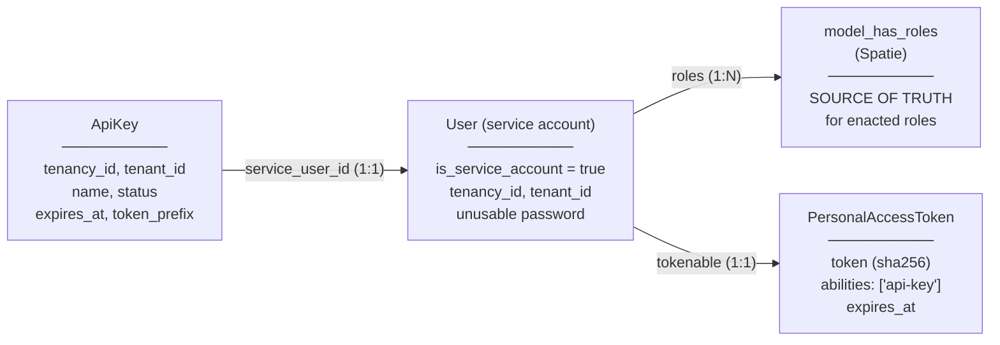
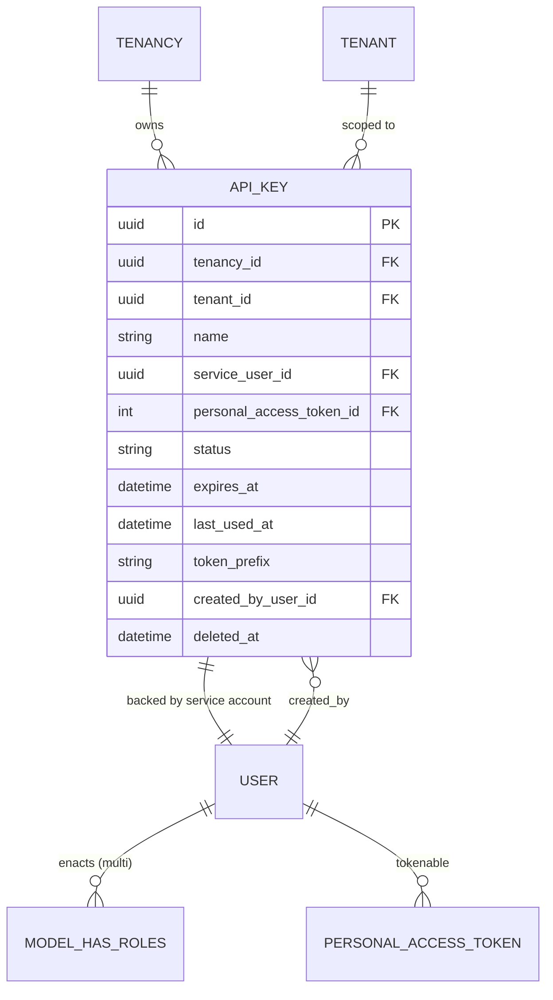
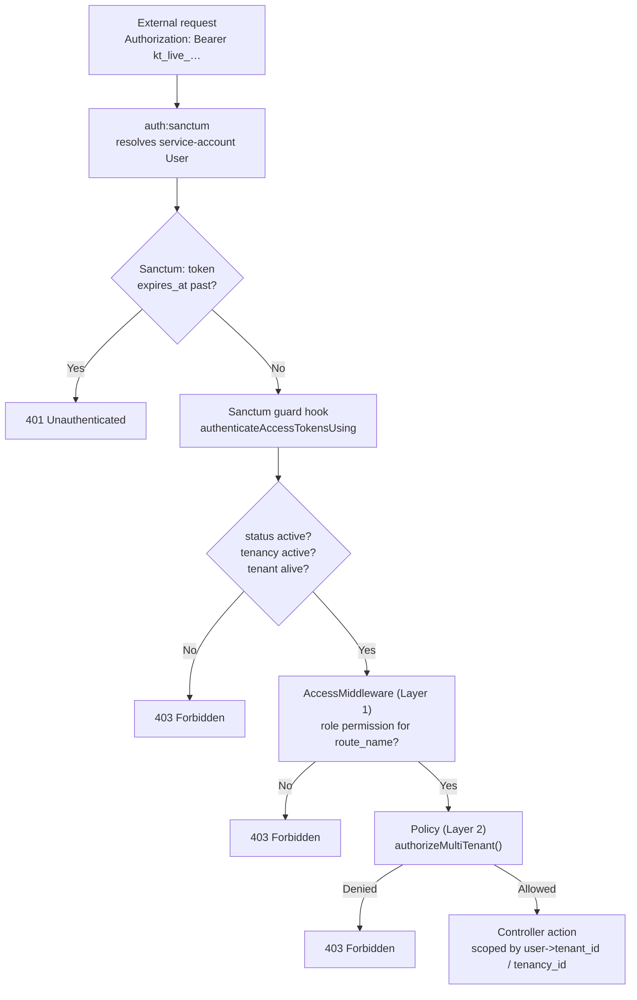

# Service Accounts API Keys

> **Status:** ✅ Implemented on branch `feat/service-accounts-api-keys` (backend complete, 16/16 feature tests passing). See [§16 Implementation notes](#16-implementation-notes) for deviations found while building.
> **Layer:** `dash-backend` **core** feature. No backend domain changes required. 
> (+ `dash-frontend-core/pakages/dash-admin`) for the base resourceConfig, schemas and components for the CRUD UI to be implemented in the specific frontends.
> (+ `kitchntabs-frontend/apps/kitchntabs-web`) to implment the ServiceAccounts module section in the specific frontend. kitchntabs-frontend/apps/kitchntabs-web/src/resources/private/tenancyResources.tsx
> **Related:** [F13 — Platform Multi-Tenancy](../F13-Platform-Multi-Tenancy/), [F14 — Auth & Access Control](../F14-Auth-Access-Control/)

---

## 1. Goal

Allow users holding a dedicated **`ServiceAccountManager`** role to issue and manage API keys, so
that external applications can consume tenant-scoped resources through the existing REST API,
governed by the existing role/permission system.

### Functional requirements

| # | Requirement |
|---|---|
| R1 | Managing API keys is gated by a **`ServiceAccountManager` role** carrying granular permissions — *not* by tenancy-admin status. |
| R2 | An API key is backed by a **service-account User**: virtually a user, with no login path. |
| R3 | A service account belongs to exactly **one tenant**, matching the existing User design. |
| R4 | A service account may hold **multiple roles**, matching the existing User design. |
| R5 | Tenant association is **immutable** after creation. |
| R6 | The **role set** is the only mutable field after creation. |
| R7 | Keys can be **enabled / disabled** without changing their value, and deleted. |
| R8 | Expiration chosen at creation: **1 day, 7 days, 30 days, Never**. |
| R9 | Validity is bounded by the **TenancyAccount's overall state**. |
| R10 | Service accounts must be **invisible to user listings** and **excluded from seat limits**. |

---

## 2. Design corrections applied to the draft

### dash-backend rest api resource

Register the resource as a new `service_accounts` sub-group nested inside the
existing **`system.*`** group in `dash-backend/routes/system.php:36`, which already carries
`access`. Route names become `api.system.service_accounts.{action}`.

This mirrors existing precedent in that same file: `System\UserController` and
`System\TenantController` also live under `system.*`, yet are **not** System-Admin-exclusive —
`UserController` explicitly branches on `!$request->user()->isSystemAdmin()` at
`dash-backend/app/Http/Controllers/API/System/UserController.php:67,318,369` to apply a reduced,
role-scoped view for non-System-Admin actors. `ApiKeyController` follows the same pattern: **System
Admin sees every service account across every tenancy; any other actor holding
`ServiceAccountManager` is scoped down to their own tenancy/tenant in `_setup()`** — access is
governed entirely by the permission system, not by the `system` URL prefix.

### Multiple roles associated to a service account.

The service account *is* a `User`, so Spatie's `model_has_roles` pivot already provides native multi-role support and is the single source of truth. A denormalised `api_keys.role_id` (or a parallel `api_key_role` pivot) would duplicate state and drift. Roles are read via `$apiKey->serviceUser->roles` and exposed by `ApiKeyResource`.
`updateRole()` accordingly becomes `updateRoles(array $roleIds)` using `syncRoles()`.

### Status enum naming

the enum is **`active | disabled`** 

## The central architecture

> The role/permission system operates on `User`s authenticated with a bearer token.
> Can we provision API keys **without** users, or do we need internal virtual users?

**Verdict: service-account Users are required — and this is the correct design, not a workaround.**

Sanctum can issue tokens to *any* model using `HasApiTokens`, so a standalone `ApiKey`
authenticatable is technically possible. It is nevertheless the wrong choice, because three hard
constraints in the existing codebase assume a concrete `App\Models\User`:

| # | Constraint | Location | Consequence of a non-User principal |
|---|---|---|---|
| 1 | Middleware **re-fetches a concrete User by ID**: `\App\Models\User::with('roles')->find($authUser->id)` | `dash-backend/app/Http/Middleware/AccessMiddleware.php:28` | Returns `null` → unconditional `abort(403)` |
| 2 | Policy trait **typehints `User`**: `authorizeMultiTenant(User $user, Model $model)` | `kitchntabs-backend-domain/app/Policies/Traits/MultiTenantAuthorizationTrait.php:53` | `TypeError`, not a clean denial |
| 3 | Controllers **read scope off the principal** (`$user->tenancy_id`, `$user->tenant_id`) | `.../API/Tenancy/TenancyUserController.php:27`, `TenancyTenantController.php` (~7 sites) | Null scope → data leak or hard failure |

A separate authenticatable would require rewriting the middleware, the policy trait, and every
controller reading tenant scope — across **both** core and domain.

A service-account User reuses **100% of both authorization layers with zero changes to either.**

### Existing precedent

The domain already defines two service-account roles that nothing currently creates users for:

```php
// kitchntabs-backend-domain/app/Models/Extended/Role.php:17-26
public const LEVEL_TENANT_SERVICE_ACCOUNT = 13;
public const LEVEL_MALL_SERVICE_ACCOUNT   = 14;
public const NAME_TENANT_SERVICE_ACCOUNT  = 'TenantServiceAccount';
public const NAME_MALL_SERVICE_ACCOUNT    = 'MallServiceAccount';
```

They are seeded by the domain `RoleSeeder` but never assigned. **This feature is what those roles
were anticipating.**

---

## 4. Architecture

A **service-account User** is a real `users` row flagged `is_service_account`, carrying
`tenancy_id` + `tenant_id` and one or more enacted roles, with an unusable password and no
interactive login path. A Sanctum personal access token issued to that user **is** the API key.



### Why 1:1 (one service-account User per key)

Per-key audit attribution comes for free — the audit trail already records `user_id`, so each key's
actions are individually traceable. A user shared across many keys would collapse that attribution
and make revocation coarse.

### How reach is resolved

Both `tenancy_id` **and** `tenant_id` are set on every service account, mirroring exactly how human
users are provisioned. **Reach is then determined purely by the role set**, using the unmodified
3-tier logic in `MultiTenantAuthorizationTrait`:

| Role in the set | Tier reached | Effective data reach |
|---|---|---|
| `TenancyAdmin` (1) | Tier 2 — `tenancy_id` match | **The whole tenancy** |
| `Tenant` (2) | Tier 3 — `tenant_id` match | The single pinned tenant |
| `User` (3), `TenantServiceAccount` (13), `Kitchen` (15), `Staff` (16) | Tier 3 | The single pinned tenant |

With multiple roles the effective reach is the **union**, and the effective level is the **minimum**
— `User::getLowestRoleLevel()` returns `$roles->min('level')`
(`dash-backend/app/Models/User.php:291`).

> ### ⚠️ Consequence to surface in the UI
>
> A key whose role set includes **`TenancyAdmin` reaches every tenant in the tenancy.** Tier 2 of
> `authorizeMultiTenant` matches on `tenancy_id` and never consults `tenant_id`.
>
> For such keys the **Tenant field is informational, not a security boundary.** The create form must
> warn whenever a tenancy-level role is selected.

---

## 5. The `ServiceAccountManager` role

A **new core role** whose sole purpose is to carry the granular API-key permissions (R1).

| Property | Value | Rationale |
|---|---|---|
| Constant | `Role::NAME_SERVICE_ACCOUNT_MANAGER = 'ServiceAccountManager'` | Added to `App\Models\Role` |
| Level | **`100`** | A **capability** role, not a hierarchy tier |
| Permissions file | `database/data/rolePermissions/serviceAccountManagerPermissions.json` | Contains **only** the `api.system.service_accounts.*` route names |
| Seeded by | core `RoleSeeder` | It is a core role, so it belongs in core files (see §9) |

### Why level 100 matters

Because `getLowestRoleLevel()` returns the **minimum** across a user's roles
(`dash-backend/app/Models/User.php:291`), a high level number (low authority) guarantees that
holding `ServiceAccountManager` **never raises** a user's effective privilege. It grants an
*ability*, not a *rank*. `Role::MAX_LEVEL` is `32766`, so 100 is well within range.

This composes cleanly with the escalation guard (§7). Worked examples:

| User's roles | Effective level | May mint keys with roles at level… |
|---|---|---|
| `TenancyAdmin`(1) + `ServiceAccountManager`(100) | **1** | ≥ 1 → TenancyAdmin, Tenant, User, Kitchen, Staff. **Never `System`(0)** |
| `Tenant`(2) + `ServiceAccountManager`(100) | **2** | ≥ 2 → Tenant, User, Kitchen, Staff. **Never TenancyAdmin(1)** |
| `User`(3) + `ServiceAccountManager`(100) | **3** | ≥ 3 → User, Kitchen, Staff only |
| `ServiceAccountManager`(100) **alone** | **100** | **Nothing** — no role exists at level ≥ 100 |

The delegation model is therefore self-limiting: **no user can ever mint a key more privileged than
itself**, regardless of which roles are combined.

> **The last row is intentional, not an oversight.** `ServiceAccountManager` is a pure capability
> grant with no rank of its own, so on its own it confers no minting power. It must be paired with a
> substantive role (`Tenant`, `TenancyAdmin`, …) that establishes *what* the holder may delegate.
> This makes the role safe to hand out broadly: it can only ever delegate authority its holder
> already independently possesses.

---

## 6. Data model



### Migration: `add_is_service_account_to_users_table`

| Column | Type | Notes |
|---|---|---|
| `is_service_account` | `boolean` | default `false`, **indexed** — filtered on every user listing |

### Migration: `create_api_keys_table`

| Column | Type | Notes |
|---|---|---|
| `id` | `uuid` (UUID7) | PK, matches core convention |
| `tenancy_id` | FK → `tenancies` | Owning account |
| `tenant_id` | FK → `tenants` | Scope target. **Immutable** (R5) |
| `name` | `string` | Human label. Immutable |
| `service_user_id` | FK → `users` | Backing account, `cascade` on delete |
| `personal_access_token_id` | FK → `personal_access_tokens` | Nullable; supports revoke/rotate |
| `status` | `enum('active','disabled')` | default `active` (R7) |
| `expires_at` | `datetime` nullable | `null` = Never (R8) |
| `last_used_at` | `datetime` nullable | Throttled write — see §8 |
| `token_prefix` | `string(16)` | e.g. `kt_live_a1b2c3` — full value is unrecoverable |
| `created_by_user_id` | FK → `users` | Audit |
| timestamps + `deleted_at` | | Soft deletes, matching core convention |

> **No `role_id` column** — roles live in `model_has_roles` on the service user.

### Models

**`App\Models\ApiKey`**

```php
use HasFactory, Filterable, QueryCacheable, SoftDeletes, HasUuids;

protected $casts = [
    'expires_at'   => 'datetime',
    'last_used_at' => 'datetime',
];

// Relations: tenancy(), tenant(), serviceUser(), createdBy()
// Accessor:  roles()  → $this->serviceUser->roles
// Helpers:   isExpired(), isUsable()
```

**`App\Models\User`** — add `is_service_account` to `$fillable`, cast to `boolean`, add
`scopeExcludingServiceAccounts()`.

**`App\Models\Role`** — add the `ServiceAccountManager` name/level constants (§5).

---

## 7. `ApiKeyService`

`app/Services/ServiceAccount/ApiKeyService.php`. All mutations wrapped in `DB::transaction()`.

| Method | Behaviour |
|---|---|
| `create()` | Validate every role in the set against the guard below; enforce plan limit; create the service User; `syncRoles($roles)`; issue the token; return plaintext **once** |
| `updateRoles(array $roleIds)` | Re-validate the guard for **every** role, then `syncRoles()`. Token untouched |
| `enable()` / `disable()` | Flip `status` only. **The token is never revoked**, so the key value survives a disable → enable cycle (R7) |
| `destroy()` | Delete tokens, soft-delete the key, soft-delete the service user |

### Service-account identity

```php
'email'              => "svc+{$uuid}@apikeys.internal",
'password'           => Hash::make(Str::random(64)),  // unusable
'email_verified_at'  => now(),                        // bypass the verification gate
'active'             => 1,
'is_service_account' => true,
'tenancy_id'         => $actor->tenancy_id,
'tenant_id'          => $validated['tenant_id'],
```

Synthetic emails are safe because `users.email` uniqueness is **already tenancy-scoped** via partial
unique indexes
(`dash-backend/database/migrations/2026_02_06_170000_change_users_email_unique_to_tenancy_scoped.php`),
so they can never collide across tenancies.

### Escalation guard

Enforced in **both** `ApiKeyRequest` and `ApiKeyService`, so it also holds for programmatic callers,
and re-validated on **every** role update — not only at creation.

```php
foreach ($roles as $role) {
    // 1. Never mint a key more privileged than yourself
    if ($role->level < $actor->level) {
        abort(403, 'Cannot issue an API key more privileged than your own role.');
    }
    // 2. System is never assignable, regardless of level arithmetic
    if ($role->name === Role::NAME_SYSTEM_ADMIN) {
        abort(403, 'System role cannot be assigned to a service account.');
    }
    // 3. Prevent self-replication: a key must never be able to mint more keys
    if ($role->name === Role::NAME_SERVICE_ACCOUNT_MANAGER) {
        abort(403, 'ServiceAccountManager cannot be assigned to a service account.');
    }
}
```

> Guard **3** is essential. Without it a key could be issued holding `ServiceAccountManager`,
> letting it mint further keys autonomously — an unbounded, unauditable privilege-propagation path.

---

## 8. Key validity enforcement — the Sanctum guard hook

> **Why not HTTP middleware.** An `ApiKeyGate` middleware would have to be added to *every*
> protected route group to be effective — including the domain's `ecommerce.*`, `tab.*`,
> `logistic.*`, `checkout.*` groups. That directly contradicts this feature's "no backend domain
> changes required" constraint, and any group missed later silently becomes a bypass.

Sanctum **v4.1.1** (confirmed in `composer.lock`) exposes
`Sanctum::authenticateAccessTokensUsing(callable $callback)`, a hook invoked by
`Laravel\Sanctum\Guard` at the moment a bearer token is resolved. Registering it **once** in a
service provider covers every authenticated route in core *and* domain, with **zero route changes**.

Registered in `App\Providers\AuthServiceProvider::boot()`:

```php
Sanctum::authenticateAccessTokensUsing(function ($accessToken, bool $isValid) {
    if (! $isValid) {
        return false;                       // preserve Sanctum's own expiry/ability verdict
    }

    $user = $accessToken->tokenable;

    if (! $user instanceof User || ! $user->is_service_account) {
        return true;                        // human users are unaffected
    }

    return app(ApiKeyService::class)->tokenIsUsable($accessToken);
});
```

`ApiKeyService::tokenIsUsable()` returns `false` unless **all** hold:

| Check | Requirement |
|---|---|
| An `api_keys` row exists for this token and is not soft-deleted | Key not deleted |
| `api_keys.status === 'active'` | R7 — enable/disable without rotating the key |
| Not past `api_keys.expires_at` | R8 — belt-and-braces over Sanctum's native `expires_at` check |
| Owning `Tenancy->isActive()` | **R9 — tenancy state bounds key validity** |
| Tenant not soft-deleted | Prevents orphaned keys |

This implements R9: **suspend a tenancy and all of its keys stop working immediately**, with no
token bookkeeping and no loss of key values on reactivation.

It also stamps `last_used_at`, **throttled to at most once per minute per key** via a cache lock —
never per request, to avoid a write on every API call.

> **Trade-off accepted:** a rejected key yields `401 Unauthenticated` for *all* rejection reasons,
> rather than the differentiated `401`/`403` a middleware could return. This is the correct
> semantic anyway — the credential itself is not currently valid — and it deliberately leaks less
> information to an external caller about *why* a key was refused.

### Expiration works with no config change

Sanctum **natively honours the per-token `expires_at` column**, independently of
`config/sanctum.php`'s `'expiration' => null`. `CheckTokenExpiration` is a deliberate pass-through
no-op and does not interfere. The `1 / 7 / 30 / Never` mapping therefore lands directly on the third
argument of `createToken()` — the same call already used at
`dash-backend/app/Http/Controllers/API/Auth/LoginController.php:71`:

```php
$expiresAt = $choice === 'never' ? null : now()->addDays((int) $choice);
$token = $serviceUser->createToken("apikey:{$name}", ['api-key'], $expiresAt);
// $token->plainTextToken — shown to the operator ONCE, never recoverable
```

### Request flow



---

## 9. API surface

### Controller

`App\Http\Controllers\API\System\ServiceAccount\ApiKeyController extends ReactAdminBaseController`,
with `ApiKeyRequest`, `ApiKeyFilter`, `ApiKeyPolicy`, `ApiKeyResource` — placed alongside the other
`API\System\*` controllers.

| Hook | Behaviour |
|---|---|
| `_setup()` | **3-tier scope** — see below |
| `_precreate()` | Escalation guard (§7) + plan limit |
| `_update()` | **Reject any change to `tenant_id`, `name`, or `expires_at`** (R5, R6) |
| `_delete()` | Revoke tokens, soft-delete key + service user |

#### 3-tier visibility scope

A two-tier scope (System Admin / everyone-else-by-tenancy) is **not sufficient**. Because R1
decouples this feature from tenancy-admin status, a `Tenant`-level (level 2) user holding
`ServiceAccountManager` belongs to exactly one tenant — yet a tenancy-wide scope would let them
see, disable, and delete service accounts belonging to **sibling tenants** in the same tenancy.

`_setup()` therefore mirrors `MultiTenantAuthorizationTrait`'s own 3-tier logic:

| Actor | Scope applied |
|---|---|
| `System` (0) | none — every service account, every tenancy |
| `TenancyAdmin` (1) | `where('tenancy_id', $user->tenancy_id)` |
| Any other level (2+) | `where('tenancy_id', …)->where('tenant_id', $user->tenant_id)` |

`ApiKeyPolicy` enforces the **same** three tiers on `manage`/`delete`, so a crafted ID cannot
bypass the list scope.

### Routes — `system.service_accounts` group

Added as a new nested prefix inside the existing `system.*` group in
`dash-backend/routes/system.php:36` (already `['access', 'auth:sanctum', 'verified']`), alongside
the other sub-prefixes (`role`, `tenant`, `user`, `subscription`, …), iterating
`config('react-admin-methods')` the same way:

```
GET    /api/system/service_accounts              → api.system.service_accounts.getList
POST   /api/system/service_accounts              → api.system.service_accounts.create
GET    /api/system/service_accounts/{id}         → api.system.service_accounts.getOne
PUT    /api/system/service_accounts/{id}         → api.system.service_accounts.update    (roles only)
DELETE /api/system/service_accounts/{id}         → api.system.service_accounts.delete
POST   /api/system/service_accounts/{id}/enable  → api.system.service_accounts.enable
POST   /api/system/service_accounts/{id}/disable → api.system.service_accounts.disable
```

Because the `system.*` group **does** run `AccessMiddleware`, the `ServiceAccountManager`
permissions are genuinely enforced at the route layer (R1) — exactly as they would have been under
`tenant.*`, but now consistent with your placement requirement. `ApiKeyPolicy` then adds Layer 2
ownership checks — defence in depth, not a substitute.

> **Note:** unlike `system.permissions` / `system.roles` / `system.tenants` (F14's Level-0-only
> System Context groups), `system.service_accounts` is **not** System-Admin-exclusive. Living under
> `/api/system/` is a URL-namespace choice, not an authority claim — access is gated purely by
> whether the actor holds the `ServiceAccountManager` permission set, same as `system.tenant` /
> `system.user` already work for non-System-Admin actors today.

### Permissions

Add a `system.service_accounts` group (level 100, matching the role) to
`database/data/systemPermissions.json` — following the catalog's `{context}.{resource}` naming
convention (see F14, e.g. `ecommerce.brand`, `tenant.roles`) — and the route names to:

- `serviceAccountManagerPermissions.json` **(new)** — the full set
- `systemAdminPermissions.json` — the full set

> Per F14's known pitfalls: these are **core** route names, so they belong in **core** role files
> only. Placing them in domain files (or vice versa) causes silent `whereIn` misses at seed time.

```bash
docker exec dash_image_app php artisan db:seed --class="PermissionSeeder"
docker exec dash_image_app php artisan db:seed --class="RoleSeeder"
docker exec dash_image_app php artisan db:seed --class="Domain\\Database\\Seeders\\Extended\\RoleSeeder"
docker exec dash_image_app php artisan cache:clear
```

The third command is **required**: the core `RoleSeeder` uses destructive `syncPermissions` and
would otherwise strip all domain permissions from every role.

---

## 10. Leak prevention — ships with the feature, not after

> **Not optional (R10).** Without these, every API key silently consumes a paid seat and appears in
> the UI as a phantom user.

| Target | Change | Why |
|---|---|---|
| `API/Tenancy/TenancyUserController::_setup` | add `->where('is_service_account', false)` | Currently scopes only by `tenancy_id` — service accounts would appear in the tenancy user list |
| `API/System/UserController` + any tenant user listing | same exclusion | Service accounts must not surface in any user CRUD |
| `HasSubscriptionLimits` / `PlanLimitsService` | exclude service accounts from the `max_users_per_tenant` count | `_precreate` calls `enforceLimit('max_users_per_tenant')` — **each key would otherwise consume a billable seat** |
| `UserResource`, user filters, `getForSelect` | exclude | Prevents leakage through React-Admin reference inputs |
| Plan limits | *(optional)* add `max_api_keys_per_tenancy` | Commercial control over key issuance |

A global scope on `User` is **not** recommended — it would silently break `ApiKeyService`,
the Sanctum guard hook, and `AccessMiddleware`'s own `User::find()`. Prefer explicit per-query exclusion at
the listing/counting sites above.

---

## 11. Frontend

Two layers, per the framework's base/app split:

| Layer | Package | Responsibility |
|---|---|---|
| **Base** | `dash-frontend-core/packages/dash-admin` | Reusable primitives: `ResourceTemplate`, the one-time secret reveal dialog component, and any generic multi-role/expiration form controls that aren't specific to KitchnTabs |
| **App** | `kitchntabs-frontend/apps/kitchntabs-web` | The actual `ResourceConfig` + schema for this feature, registered into the running app |

| File | Layer | Change |
|---|---|---|
| `packages/dash-admin/src/components/serviceAccount/ApiKeyRevealDialog.tsx` | Base | **New** — one-time secret reveal, reusable across any dash-frontend-core app |
| `apps/kitchntabs-web/src/resources/private/schemas/service_account.tsx` | App | **New** — Dash schema for this resource |
| `apps/kitchntabs-web/src/resources/private/tenancyResources.tsx` | App | Register the new schema; `roles: ["System", "ServiceAccountManager"]` |

Resource `model` is `system/service_accounts`, matching the backend route group (§9). Registering it
inside `tenancyResources.tsx` alongside `tenancy_tenant` / `tenancy_account` keeps it in the same
menu section as the rest of tenancy-facing administration, even though the API path itself lives
under `/api/system/`.

### Schema behaviour

| Field | Create | Edit |
|---|---|---|
| Tenant | `ReferenceInput`, tenants of current tenancy | **disabled** (R5) |
| Name | `TextInput`, required | **disabled** |
| Expiration | `SelectInput` — `1 / 7 / 30 / never` | **hidden** |
| Roles | **multi-select** `ReferenceArrayInput`, filtered to `level >= currentUser.level`, excluding `System` and `ServiceAccountManager` | **editable** (R6) |
| Status | — | enable/disable toggle |

### One-time reveal dialog

The plaintext token is **unrecoverable** after the create response. The create flow must surface it
in a modal with copy-to-clipboard and an explicit *"you will not see this value again"* warning. The
list view shows only `token_prefix` plus a masked remainder (`kt_live_a1b2c3••••••••`).

The form must also render an inline warning when a **tenancy-level role** is selected, explaining
that the key will reach every tenant in the account (§4).

---

## 12. Risks & open items

| ID | Item | Impact | Recommendation |
|---|---|---|---|
| **R1** | `TenancyAdmin` keys bypass the single-tenant pin | Medium — accepted by design | Inline UI warning; add an audit report listing tenancy-level keys |
| **R2** | `TenantServiceAccount` (13) currently **mirrors `normalUserPermissions.json` verbatim** and is a documented placeholder | Medium | Run a real permission review before issuing keys against it — otherwise it grants broad read access you may not intend |
| **R3** | Token prefix format | Low | Use `kt_live_…` so leaked keys are greppable in logs and detectable by secret scanners |
| **R4** | No per-key rate limiting in this plan | Medium | Follow-up: throttle by `api_keys.id` |
| **R5** | Deleting a tenant leaves keys pointed at it | Low | the Sanctum guard hook already rejects; add a cleanup job |
| **R6** | `TenancyResourceCleaner` already purges `personal_access_tokens` | Low | Verify it also cascades `api_keys` + service users on tenancy deletion |
| **R7** | `ServiceAccountManager` at level 100 collides with no existing core role, but domain roles start at 13 | Low | Confirm 100 stays free as domain roles evolve |

---

## 13. Build order

1. Migrations + models (`ApiKey`, `User.is_service_account`, `Role` constants)
2. `ServiceAccountManager` role + permission files + seeders
3. `ApiKeyService` + escalation guard — **with unit tests on escalation refusal first**
4. Sanctum guard hook (`authenticateAccessTokensUsing`) + registration
5. **Leak-prevention patches (§10)** — before any key exists in a real environment
6. Controller, routes, policy + reseed
7. Frontend resource + reveal dialog
8. Feature tests (§14)

---

## 14. Test matrix

| Scenario | Expected |
|---|---|
| `ServiceAccountManager` + `Tenant` user creates a `Tenant`-role key | `200`, scoped to the pinned tenant |
| User **without** `ServiceAccountManager` hits any api-keys route | `403` (via `AccessMiddleware`) |
| Key with `Tenant` role accesses a **sibling tenant** of the same tenancy | `403` |
| Key accesses a **different tenancy** | `403` |
| `Tenant`(2) actor attempts to mint a `TenancyAdmin`(1) key | `403` |
| Any actor attempts to mint a `System`(0) key | `403` |
| Any actor attempts to mint a `ServiceAccountManager` key | `403` (self-replication guard) |
| Actor attempts to *update* a key's roles to a higher privilege | `403` |
| Multi-role key `[Tenant, Kitchen]` | union of both roles' permissions |
| Key disabled → request | `403` |
| Key disabled then re-enabled → request | `200`, **same token value** |
| Key past `expires_at` → request | `401` |
| Tenancy suspended → request with a valid active key | `403` |
| Tenancy reactivated → same key | `200` |
| Change `tenant_id` / `name` / `expires_at` on update | `422` |
| Service accounts absent from `GET /api/tenancy/users` and `GET /api/system/users` | absent from payload |
| Service accounts do **not** count toward `max_users_per_tenant` | limit unaffected |
| Key deleted → request | `401` |

---

## 15. File manifest

### `dash-backend` (core)

```
database/migrations/
  ####_##_##_######_add_is_service_account_to_users_table.php     [new]
  ####_##_##_######_create_api_keys_table.php                     [new]

app/Models/
  ApiKey.php                                                      [new]
  User.php                                                        [modify: fillable, cast, scope]
  Role.php                                                        [modify: ServiceAccountManager constants]

app/Services/ServiceAccount/
  ApiKeyService.php                                               [new]

app/Providers/
  AuthServiceProvider.php                                         [modify: Sanctum guard hook]

app/Http/Controllers/API/System/ServiceAccount/
  ApiKeyController.php  ApiKeyRequest.php  ApiKeyFilter.php       [new]
  ApiKeyPolicy.php      ApiKeyResource.php                        [new]

app/Http/Controllers/API/Tenancy/
  TenancyUserController.php                                       [modify: exclude service accounts]
app/Http/Controllers/API/System/
  UserController.php                                              [modify: exclude service accounts]
app/Http/Controllers/Traits/
  HasSubscriptionLimits.php                                       [modify: exclude from seat count]

routes/system.php                                                 [modify: service_accounts group]

database/data/systemPermissions.json                              [modify: system.service_accounts group]
database/data/rolePermissions/serviceAccountManagerPermissions.json  [new]
database/data/rolePermissions/systemAdminPermissions.json         [modify]
database/seeders/RoleSeeder.php                                   [modify: seed new role]
```

### Frontend

dash-frontend-core/pakages/dash-admin for the base resourceConfig, schemas and components for the CRUD UI to be implemented in the specific frontends.

dash-frontend-core/packages/dash-admin/src/components/serviceAccount/ApiKeyRevealDialog.tsx  [new]

Partial resourceConfigs and schemas must be here:

dash-frontend-core/packages/dash-admin/src/resources...
dash-frontend-core/packages/dash-admin/src/schemas...

And implemented in the specific frontend modifying current architecture:

kitchntabs-frontend/apps/kitchntabs-web to implment the ServiceAccounts module section in the specific frontend.
kitchntabs-frontend/apps/kitchntabs-web/src/resources/private/tenancyResources.tsx  [modify: register]


---

## 16. Implementation notes

Five things the plan got wrong or under-specified, discovered while building. All are fixed in
the code; this section records *why*, so the reasoning is not lost.

### 16.1 Tenancy gating must use `account_status`, not `isActive()`

The plan said key validity follows `Tenancy->isActive()`. That helper is
`status === 'active'` — but `tenancies.status` **defaults to `'trial'`**, and there is a separate
`account_status` column (cast to `TenancyAccountStatus`) that is the real access lifecycle.

Gating on `isActive()` would have **silently killed every trial customer's API keys.**

The implementation gates on `getAccountStatus()->isDisabled()` instead: `ACTIVE`, `CANCELED` and
`EXPIRED` (grace period) all authenticate; only `SUSPENDED` and `SOFT_DELETED` are refused.
`test_trial_tenancy_keys_still_authenticate` is the regression guard.

### 16.2 The Sanctum hook is `authenticateAccessTokensUsing` (plural)

The plan named it `authenticateAccessTokenUsing`. The real API in Sanctum v4.1.1 is
`Sanctum::authenticateAccessTokensUsing()` (`vendor/laravel/sanctum/src/Sanctum.php:123`), invoked
from `Guard::isValidAccessToken()` at `Guard.php:132`. The singular name would have been a fatal
`Call to undefined method`.

That same call site also **confirms** the plan's claim that Sanctum natively honours a token's
`expires_at` independently of `config/sanctum.php`.

### 16.3 Visibility needs three tiers, not two

The plan scoped non-System-Admin actors by `tenancy_id` alone. Because R1 gates this feature on a
**capability role** rather than tenancy-admin status, a `Tenant`-level (level 2) holder of
`ServiceAccountManager` belongs to exactly one tenant — and a tenancy-wide scope would have let
them read, disable and delete **sibling tenants'** keys.

Both `ApiKeyController::_setup()` and `ApiKeyPolicy` now implement the same three tiers
(System → unscoped, TenancyAdmin → tenancy, everyone else → tenant), so a crafted id cannot bypass
the list scope.

### 16.4 `ServiceAccountManager` at level 100 grants no minting power alone

A consequence of the capability-role design worth stating plainly: since the escalation guard is
`role.level >= actor.level` and no role exists at level ≥ 100, a user holding *only*
`ServiceAccountManager` can delegate **nothing**. It must be paired with a substantive role that
establishes what the holder may delegate. `test_manager_role_alone_confers_no_minting_power` pins
this behaviour so it is not "fixed" by mistake later.

### 16.5 The frontend needed a new base-layer hook

The plan assumed a reveal dialog could simply be rendered. In practice `ResourceTemplateCreate`
owns the post-create dialog, so a resource had no way to substitute its own content.

Added `createSuccessDialog?: (data) => { title?, content? } | null` to
`IDashAutoAdminResourceConfig`, consumed by `ResourceTemplateCreate`. It is generic — any resource
whose API returns a write-once value can now surface it — and backwards compatible.

> **Production build caveat.** `kitchntabs-frontend` resolves `dash-admin` from the **published**
> `@dashadmin/dash-admin@1.3.44`. The new component and the `createSuccessDialog` hook live in
> `dash-frontend-core` source, so they work today under `LINK_DASH_CORE=true` (verified via HMR)
> but a **production build requires republishing `dash-admin` and bumping the dependency.**
> Until then an ambient declaration in `apps/kitchntabs-web/index.d.ts` keeps `tsc` green; delete
> it after the republish.

### 16.6 Environment notes

- `php artisan tinker` is broken in the dev container (`Psy\Configuration::setTrustProject()` not
  found — psysh version mismatch). Use `php artisan db:table` or direct `psql` for inspection.
- `SubscriptionPlanManagementTest::it_can_list_subscription_plans` fails on this branch. It is
  **pre-existing and unrelated** — verified by re-running it with this branch's service changes
  stashed, where it fails identically.

---

## 17. Complete implementation reference

This section documents the feature **as it actually shipped**, after the fixes in §16 and a further
round of bugs found by hands-on testing in the dev environment. Read this section for "what does
the code do today"; read §1–§14 for the design reasoning that motivated it. Where the two disagree,
this section is correct.

### 17.1 Final backend file manifest

```
dash-backend/
├── database/migrations/
│   ├── 2026_07_26_100000_add_is_service_account_to_users_table.php   [new]
│   └── 2026_07_26_100001_create_api_keys_table.php                   [new]
├── database/data/
│   ├── systemPermissions.json                                        [modified: +system.service_accounts group, 21 labels]
│   └── rolePermissions/
│       ├── serviceAccountManagerPermissions.json                     [new: exactly the 21 service_accounts routes]
│       └── systemAdminPermissions.json                                [modified: +21 service_accounts routes]
├── database/seeders/
│   └── RoleSeeder.php                                                 [modified: ServiceAccountManager role + permissions]
├── app/Models/
│   ├── ApiKey.php                                                     [new]
│   ├── User.php                                                       [modified: is_service_account, excludingServiceAccounts(), apiKey()]
│   └── Role.php                                                       [modified: NAME/LEVEL_SERVICE_ACCOUNT_MANAGER constants]
├── app/Services/
│   ├── ServiceAccount/ApiKeyService.php                               [new]
│   ├── Subscription/PlanLimitsService.php                             [modified: exclude service accounts from seat count]
│   └── Tenancy/
│       ├── TenancySubscriptionService.php                            [modified: same exclusion]
│       └── TenancyProvisioningService.php                            [modified: grant ServiceAccountManager on provisioning]
├── app/Http/
│   ├── Controllers/API/System/ServiceAccount/ApiKeyController.php    [new]
│   ├── Controllers/API/System/UserController.php                     [modified: exclude service accounts]
│   ├── Controllers/API/Tenancy/TenancyUserController.php             [modified: exclude service accounts]
│   ├── Requests/API/System/ApiKeyRequest.php                          [new]
│   ├── Resources/ApiKeyResource.php                                   [new]
│   └── ModelFilters/
│       ├── ApiKeysFilter.php                                          [new]
│       └── RolesFilter.php                                            [modified: assignable_for_service_account filter]
├── app/Policies/ApiKeyPolicy.php                                      [new]
├── app/Providers/AuthServiceProvider.php                              [modified: Sanctum guard hook, ApiKeyPolicy registration]
├── routes/system.php                                                 [modified: service_accounts route group]
├── lang/{en,es}/service_accounts.php                                  [new, mirrored into resources/lang/{en,es}/]
└── tests/Feature/
    ├── ServiceAccountApiKeyTest.php                                  [new, 26 tests]
    └── TenancyProvisioningIntegrationTest.php                         [modified: +1 test for the auto-granted role]
```

### 17.2 Final frontend file manifest

```
dash-frontend-core/packages/
├── dash-admin/src/
│   ├── components/serviceAccount/
│   │   ├── ApiKeyRevealDialog.tsx                                    [new: ApiKeyRevealContent]
│   │   └── ServiceAccountStatusSwitch.tsx                            [new]
│   ├── templates/ResourceTemplateCreate.tsx                          [modified: createSuccessDialog hook]
│   └── providers/i18n/
│       ├── mergeTranslations.ts                                      [new: recursive translation merge]
│       ├── languages.tsx                                             [modified: re-export mergeTranslations]
│       ├── en.ts                                                     [modified: serviceAccount.*, resource.tenancy.serviceAccounts.*]
│       └── es.ts                                                     [modified: same, Spanish]
└── dash-auto-admin/src/interfaces/
    └── IDashAutoAdminResourceConfig.ts                                [modified: createSuccessDialog type]

kitchntabs-frontend/apps/kitchntabs-web/
├── src/resources/private/
│   ├── schemas/service_account.tsx                                   [new]
│   └── tenancyResources.tsx                                          [modified: register the resource]
├── src/KitchnTabsWebPrivateApp.tsx                                    [modified: mergeTranslations() instead of shallow spread]
├── src/KitchnTabsWebPublicApp.tsx                                     [modified: same]
├── src/dash-admin-augment.d.ts                                        [new: module augmentation for mergeTranslations]
└── index.d.ts                                                        [modified: ambient decls for the two new dash-admin components]
```

> **Not implemented:** `kitchntabs-system`, `kitchntabs-mall`, and `kitchntabs-app` do not register this
> resource. Only `kitchntabs-web`'s `tenancyResources.tsx` was wired per the original scope.

---

### 17.3 API contract, as implemented

Base path: `/api/system/service_accounts` (route names `api.system.service_accounts.*`).

#### `GET /api/system/service_accounts` — list

Query params follow the standard React-Admin/dash-auto-admin convention
(`page`, `perPage`, `pagination`, `field`, `order`, plus `ApiKeysFilter` fields: `q`, `ids`, `name`,
`status`, `tenantId`, `tenancyId`, `roleId`). Response:

```json
{
  "data": [ /* array of ApiKeyResource, see shape below */ ],
  "current_page": 1, "first_page_url": "...", "prev_page_url": null,
  "next_page_url": null, "last_page_url": "...", "last_page": 1,
  "per_page": 10, "total": 1, "path": "..."
}
```

#### `GET /api/system/service_accounts/{id}` — single record

**Returns the resource bare — no `{ data: ... }` envelope.** This is the base controller's
`getOne()` convention (`ResponseHandler::json($data)`), unlike `create`/`update` below. A response
shape assumption here was the exact bug fixed in §17.7.2 — always verify against a real response
before trusting an assumed shape.

```json
{
  "id": "uuid", "name": "Totem", "status": "active",
  "tenancy_id": "uuid", "tenant_id": "uuid",
  "tenant": { "id": "uuid", "name": "Transbank - Main" },
  "role_ids": [3],
  "roles": [{ "id": 3, "name": "Tenant", "level": 2 }],
  "token_prefix": "4|TnmAyblV5DqN",
  "masked_token": "4|TnmAyblV5DqN••••••••",
  "expires_at": "2026-07-27T16:56:24-04:00",
  "expired": false,
  "last_used_at": null,
  "created_by": { "id": "uuid", "name": "Francisco Aranda " },
  "created_at": "2026-07-26T12:56:24-04:00",
  "updated_at": "2026-07-26T12:56:24-04:00",
  "plain_text_token": null
}
```

`plain_text_token` is `null` on every response except the one immediately following `create`.

#### `POST /api/system/service_accounts` — create

Request:

```json
{
  "name": "Totem",
  "tenant_id": "uuid",
  "expiration": "30",        // "1" | "7" | "30" | "never"
  "role_ids": [3]
}
```

`tenancy_id` is silently overridden from the actor (`ApiKeyRequest::prepareForValidation()`) unless
the actor is a System Admin explicitly targeting another tenancy.

Response: **wrapped** in `{ "data": { ...ApiKeyResource, "plain_text_token": "4|actualSecretHere..." } }`
via `ResponseHandler::reactAdmin($item, 201)`. This is the only response in the entire API that ever
carries a non-null `plain_text_token`.

#### `PUT /api/system/service_accounts/{id}` — update

Request:

```json
{ "role_ids": [3, 7] }
```

**Immutability is enforced by value comparison, not by field presence.** React-Admin submits the
whole record on save (it does not diff), so `tenant_id`, `name`, `expiration`, `expires_at` routinely
arrive on every update carrying their current values. `ApiKeyRequest::assertImmutableFieldsUnchanged()`
compares each against the stored row: an unchanged value passes silently, a genuine change is
rejected with `422`. The original design (`'tenant_id' => ['prohibited']`) failed on every real save
from the UI — see §17.7.1.

Response: wrapped via `ResponseHandler::reactAdmin($data)` (no plaintext token, obviously).

#### `DELETE /api/system/service_accounts/{id}`

Revokes the Sanctum token, soft-deletes the `api_keys` row, soft-deletes the backing service-account
user. Response: `{ "data": { "id": "uuid" } }`.

#### `POST /api/system/service_accounts/{id}/enable` / `.../disable`

No request body. Flips `status` only — **the Sanctum token is never touched**, so disabling and
re-enabling a key restores the exact same credential rather than forcing a rotation. Response:
wrapped `ApiKeyResource`.

#### Validation & authorization error shape

```json
{
  "message": "The tenant of an API key cannot be changed after creation. (and 1 more error)",
  "errors": { "tenant_id": ["..."], "name": ["..."] }
}
```

Every message string is translated via `lang/{locale}/service_accounts.php`, resolved through the
existing `SetLocaleFromHeader` middleware — i.e. it follows the request's `Accept-Language` header,
**not** the tenancy's `primary_language` setting. Changing that would affect every endpoint's error
messages app-wide, so it was left as-is; flagged here as a deliberate non-change, not an oversight.

---

### 17.4 Frontend implementation

#### Base layer (`dash-admin`)

**`ApiKeyRevealContent`** — the one-time secret reveal. Rendered as the `content` of the framework's
existing dialog service (`useDialog()` from `dash-dialog`) via a new `createSuccessDialog` hook on
`IDashAutoAdminResourceConfig`, rather than introducing a second dialog system. It uses
`useI18nBridge()`, **not** `useTranslate()` — `DialogServiceProvider` is mounted *above* `<Admin>` in
`DASHAppProviders.tsx`, so dialog content renders outside React Admin's i18n context and
`useTranslate()` silently resolves nothing there. `useI18nBridge()` is the framework's documented
escape hatch for exactly this (`AppMaterialMenu` uses the same pattern for the sidebar, which also
renders outside the Admin tree).

**`ServiceAccountStatusSwitch`** — deliberately **not** a `type: Boolean` schema field. Status isn't
part of the update payload (`ApiKeyRequest` only accepts `role_ids` on update), and toggling it via a
plain form save would either 422 or — worse — require loosening the update contract and reopening
"roles are the only mutable field." The switch instead calls `enable`/`disable` directly via
`useAxios()` and refreshes, following the same pattern as `TenantStoreStatus`'s `toggle-open` action
elsewhere in the codebase.

**`mergeTranslations()`** — a recursive translation-object merge (later source wins on leaves, arrays
replaced wholesale, not concatenated). Necessary because every app's shallow `{ ...core, ...app,
resource: { ...core.resource, ...app.resource } }` merge only unwraps **one** extra level: any
second-level key both core and an app populate (e.g. `resource.ecommerce`) gets replaced wholesale by
whichever side spreads last, silently dropping everything the other side defined underneath it. This
is what caused `resource.tenancy.serviceAccounts.*` to resolve to nothing until the merge itself was
fixed — adding the translation strings alone was not sufficient.

**`createSuccessDialog`** on `IDashAutoAdminResourceConfig` — `ResourceTemplateCreate` previously
always rendered a generic "created" dialog with no way for a resource to substitute its own content.
The new optional hook `(data) => { title?, content? } | null` lets a resource override both; returning
`null` keeps the default. A string `title` is treated as a translation key (self-fallback), matching
how labels behave everywhere else in the schema system.

#### App layer (`kitchntabs-web`)

`service_account.tsx` schema — the two invariants driving every field:

- **Tenant, name, expiration are `inCreate`-only.** The backend rejects any change to them, so
  exposing them as editable in the edit form would only ever produce `422`s.
- **`role_ids` is the only field the update payload accepts.** Everything else shown on the edit
  drawer (`masked_token`, `expires_at`, `last_used_at`, `created_at`, `status`) is either hidden from
  edit entirely or rendered through a component that bypasses the form (the status switch).

The roles multi-select passes `componentProps: { filter: { assignable_for_service_account: true } }`,
so the picker can never offer a role the backend's escalation guard would reject (`System`,
`ServiceAccountManager`) — enforced server-side in `RolesFilter`, not duplicated client-side, so it
cannot drift from `ApiKeyService::assertRolesAssignable()`.

**Production build caveat, unchanged from §16.5:** `kitchntabs-web` resolves `dash-admin` from the
published `@dashadmin/dash-admin@1.3.44`, which does not yet ship `createSuccessDialog`,
`ApiKeyRevealContent`, `ServiceAccountStatusSwitch`, or `mergeTranslations`. Everything above works
today under `LINK_DASH_CORE=true` (verified via HMR through the whole session). A production build
needs `dash-admin` republished and the dependency bumped; until then, `dash-admin-augment.d.ts` and
the ambient declarations in `index.d.ts` keep `tsc` green as a stopgap — delete all three once the
republish lands.

---

### 17.5 Provisioning integration

`TenancyProvisioningService::assignRoles()` grants every new tenancy owner `TenancyAdmin`, `Tenant`,
**and `ServiceAccountManager`** — not requested in the original plan, added afterward once the
question came up in practice: without it, every new signup would need a separate manual role grant
before they could issue their first API key. Since `ServiceAccountManager` is a pure capability role
(§5) that confers no data access on its own, there is no security reason to withhold it from the
account owner by default.

Verified against a real trial signup in the dev environment (not just the test suite): the
provisioned owner held all three roles immediately after the registration job completed.

---

### 17.6 Test coverage

**`tests/Feature/ServiceAccountApiKeyTest.php` — 26 tests:**

| Group | Tests |
|---|---|
| Delegation limits | own-level key succeeds; escalation refused; `System` never assignable; `ServiceAccountManager` self-replication blocked; the role alone confers no minting power; escalation re-checked on `updateRoles`, not just create |
| Scope isolation | a tenant belonging to a different tenancy is rejected (`422`), even for an otherwise-valid actor |
| Lifecycle | active key authenticates; disable refuses auth but preserves the credential, re-enable restores it (same token id); expired key refused; tenancy suspension disables all its keys, reactivation restores them; trial-status tenancies still authenticate (the `account_status` vs `isActive()` regression guard); destroy revokes the token and soft-deletes both rows |
| Expiration mapping | each of the four choices maps to the correct `expires_at` |
| Leak prevention | a key never increments `max_users_per_tenant`; service accounts excluded from `excludingServiceAccounts()` queries |
| HTTP contract | create/update responses carry the `{ data: ... }` envelope; a genuine change to an immutable field is rejected; a whole-record update carrying unchanged immutable values is **accepted**; validation messages follow `Accept-Language`; delete endpoint revokes and soft-deletes |
| Role picker | `assignable_for_service_account` excludes `System`/`ServiceAccountManager`; the filter is inert when the param is absent |
| Response shaping | `getOne`/`getList` return `role_ids` and never leak the raw `service_user` relation key |

**`tests/Feature/TenancyProvisioningIntegrationTest.php`** — one added test drives the real
`provisionTenancy()` entry point end-to-end and asserts the created owner holds all three roles.

Full Core suite: 634 passed, one pre-existing unrelated failure
(`SubscriptionPlanManagementTest::it_can_list_subscription_plans`), confirmed unrelated by re-running
it with this branch's changes stashed, where it fails identically.

---

### 17.7 Bugs found only by exercising the running feature

Everything in §16 was found by static review or writing tests. These four were found only by
actually clicking through the UI against the dev environment — recorded because none of them were
visible from reading the code in isolation.

#### 17.7.1 Whole-record updates made editing impossible

React Admin submits the **entire record** on save, not a diff. The original immutability enforcement
— `'tenant_id' => ['prohibited']` — rejects the field's mere *presence*, so it failed on every real
edit, since `tenant_id`/`name`/`expiration` arrive on every save carrying their unchanged current
values. **Editing roles was completely broken from the first click.** Fixed by comparing submitted
values against the stored row (`ApiKeyRequest::assertImmutableFieldsUnchanged()`) — unchanged passes,
changed is still rejected.

#### 17.7.2 `getOne()`/`getList()` never shaped through the resource

Neither `_postList()` nor `_postGetOne()` existed on `ApiKeyController`, so both endpoints returned
the **raw Eloquent model**: no top-level `role_ids`, and a leaked `service_user` key from the raw
`serviceUser()` relation. The edit form's roles multi-select reads `listAttribute` (`role_ids`) as its
source for every reference input — with the field entirely absent from the response, the select
rendered with nothing pre-selected. Since `role_ids` is required on update, saving with an
apparently-empty selection would have **silently wiped a key's actual roles on the very first edit**.
Fixed by adding both hooks, mirroring the existing `RoleController::_postList`/`_postGetOne` pattern
exactly.

Caught before it shipped further: the record involved in triage (`Totem`) was confirmed, by direct
query against the dev database, to still hold its `Tenant` role — the bug was caught before a save
actually went through.

#### 17.7.3 Eager-loaded `tenant` relation carried the entire settings blob

`ApiKeyController`'s eager loads originally loaded the bare `tenant`/`serviceUser`/`createdBy`
relations. `Tenant` carries a large `settings` JSON column (theme palette, alarm configuration,
feature flags — hundreds of keys), none of it used by this resource, pulled on every list request.
Column-limited to `tenant:id,name`, `serviceUser:id` (serviceUser is only ever read for its `roles`,
never serialized itself), `serviceUser.roles:id,name,level`, `createdBy:id,name,lastname,deleted_at`.
The same fix applies to `ApiKeyService::tokenIsUsable()`, which runs on **every** authenticated
service-account request via the Sanctum guard hook — the hottest path in the feature — trimmed to
`tenancy:id,account_status` and `tenant:id`, the only two fields it actually reads.

#### 17.7.4 Backend error messages were hardcoded English

Every `abort()` message in `ApiKeyService`/`ApiKeyController`/`ApiKeyRequest` was a literal English
string. Moved to `lang/{en,es}/service_accounts.php` (mirrored into `resources/lang/`, since Laravel
resolves that location first), resolved through the existing `SetLocaleFromHeader` middleware. A test
sends the same failing request with `es` and `en` `Accept-Language` headers and asserts the responses
differ and match each locale file exactly — guarding against the two files silently drifting into
identical strings.

---

### 17.8 Known follow-ups (not done, deliberately)

- **`kitchntabs-app` product-field translation staleness.** Unrelated to this feature, surfaced
  during adjacent i18n work: four `resource.ecommerce.products.fields.*` labels in `kt-ecommerce`'s
  product schema appeared untranslated in `kitchntabs-app`. Direct testing ruled out the translation
  content, the merge logic, and the schema key strings — all three checked out correct in isolation.
  The likely cause is `KitchnTabsWebPrivateApp.tsx`'s `translationsData` being built with
  `useMemo(() => {...}, [])` (empty deps), which can freeze the object across a live session predating
  the commit that added those keys. Descoped at the user's call as minor; not fixed on this branch.
- **Role picker level ceiling is stricter than the escalation guard.** `RoleController`'s
  `applyRoleVisibilityPolicy()` filters to `level > actor.level` (strict), while
  `ApiKeyService::assertRolesAssignable()` permits `level >= actor.level`. A same-level role the
  backend would allow never appears in the picker. Left as-is — it fails safe (under-offering, never
  over-offering) — but worth a decision if same-level delegation should be reachable from the UI.
- **`kitchntabs-app`, `kitchntabs-system`, `kitchntabs-mall` do not register this resource.** Only
  `kitchntabs-web` has a `service_account.tsx` schema and a `tenancyResources.tsx` entry. If any other
  app needs a service-accounts management UI, that integration is still open.
- **`dash-admin` republish**, per §17.4 — the production-build stopgap files listed there remain until
  it happens.
