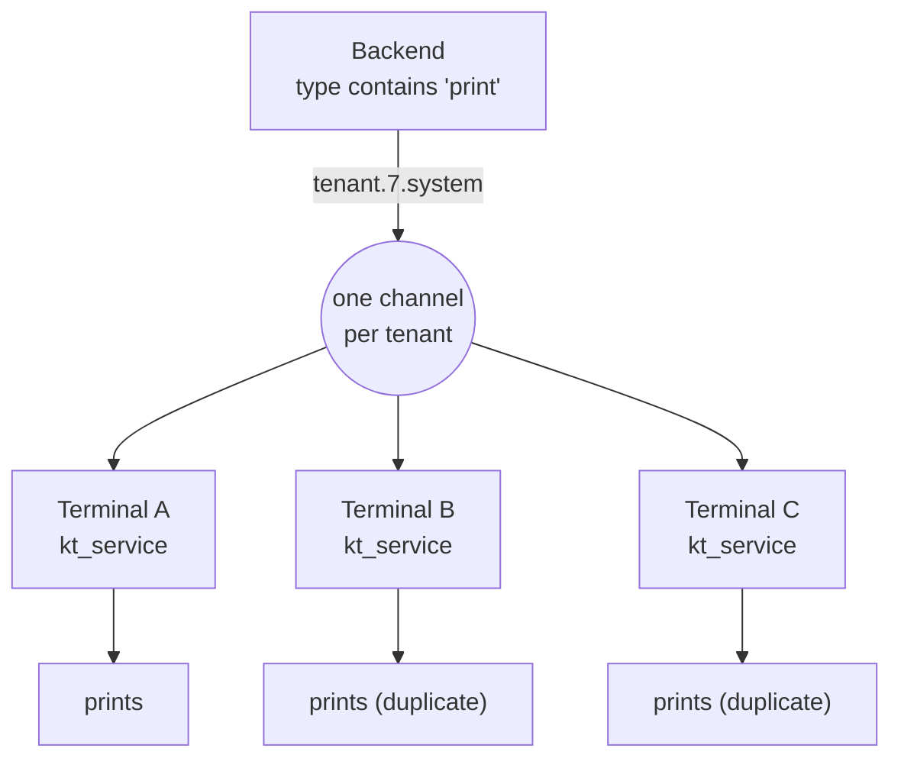
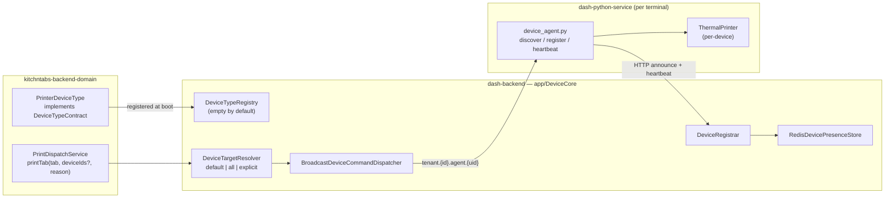
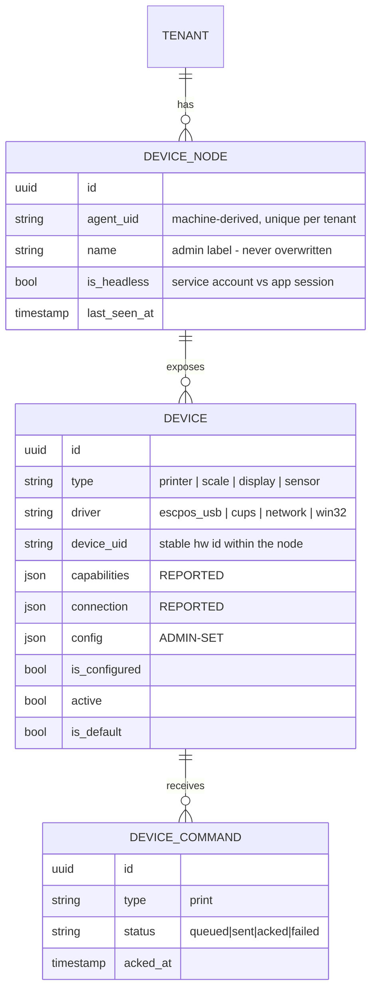
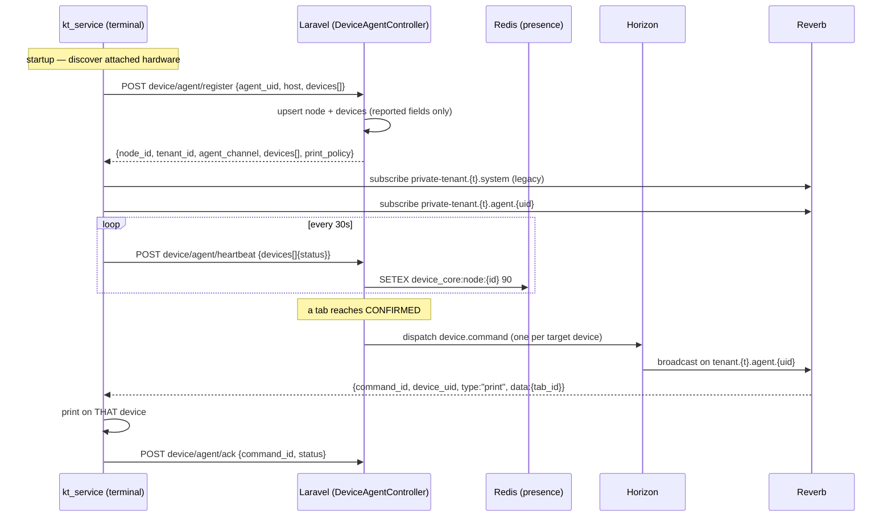
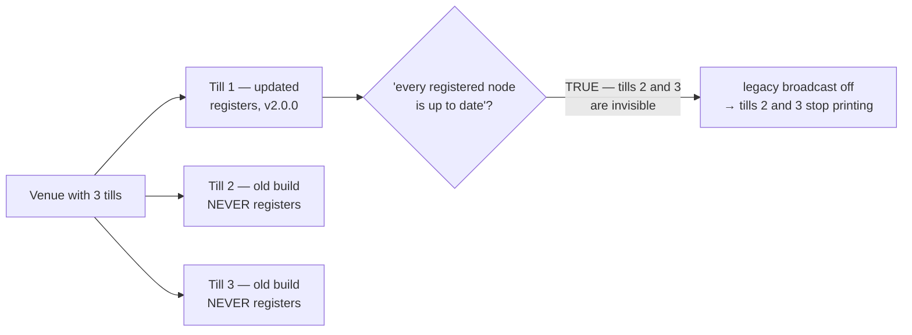
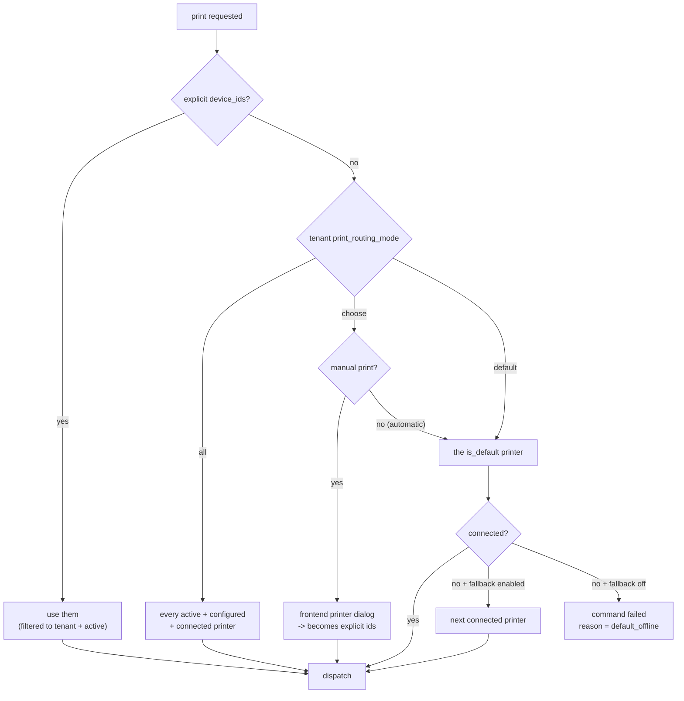

# System Devices — abstract device core, `kt-printers`, and the print-routing redesign

> **Status:** ✅ Implemented and verified end to end against the local stack.
> Backend (core + domain), the Python edge agent, and the `kt-devices` frontend
> package are all in place. 16 new feature tests pass; the full backend suite runs
> clean (3167 assertions, 0 failures). See [§14 Implementation notes](#14-implementation-notes)
> for what changed while building.
> **Layer:** `dash-backend` **core** (`app/DeviceCore`) + `kitchntabs-backend-domain`
> (the printer device type) + `dash-python-service` (the edge agent) +
> `kitchntabs-frontend` (`packages/kt-devices`).
> **Related:** [N5 — Desktop & Device Service](../N5-Desktop-Device-Service/) ·
> [F1 — Orders & Tabs](../F1-Orders-Tabs/) ·
> [F21 — Tenancy Management](../F21-Tenancy-Management/) ·
> [SERVICE-ACCOUNTS-API-KEYS.md](./SERVICE-ACCOUNTS-API-KEYS.md) ·
> [N4 Electron+Python build system](../N4-Build-Toolchain/N4-Build-Toolchain_ELECTRON_PYTHON_SERVICE_BUILD_SYSTEM.md)

---

## 1. The problem

Printing today is one hard-wired path with no notion of *which* printer.

| Entry point | What it does now |
|---|---|
| `TabsNotificationService::sendNotification()` (`kitchntabs-backend-domain/app/Services/Tabs/TabsNotificationService.php:397,483`) | sets `type = "print:speech:message"` on the tab notification |
| `TabController::printSaleNote()` (`.../API/Tabs/TabController.php:1847`) | broadcasts `TenantChannelMessageNotification` with `type: "print"` |
| `TenancyTenantController::sendTestPrint()` (`dash-backend/.../Tenancy/TenancyTenantController.php:632`) | notifies the tenant with `Domain\App\Notifications\System\TestPrintNotification` — **a class that does not exist**, so the `class_exists()` guard makes this a silent no-op today |

All three land on the single channel `tenant.{id}.system`. **Every** `dash-python-service`
subscribed to that tenant receives them and prints, because
`dash-python-service/src/kt_service.py:122` matches on `"print" in message_type`:

```python
if "print" in message_type:
    ...
    print_order(tab_id, _args.token.strip('"'), _args.log, _args.config)
```

And the printer itself is a single global pair of USB ids in `config.yaml`
(`PRINTER_VENDOR` / `PRINTER_PRODUCT`), read once in
`pinoywok/thermal_printer.py:103`.

### What breaks



- A tenant with two terminals prints **every ticket twice**.
- There is no way to target the kitchen printer vs. the counter printer.
- Nothing in the system knows which printers exist, whether they are online, or which
  one is the default.
- A `TenancyAdmin` managing several tenants has no device view at all.
- "The ticket never printed" is unanswerable — there is no record that anything was sent.

---

## 2. What this feature builds

A reusable **device core** in `dash-backend`, a **printer** device type in the KitchnTabs
domain, live device inventory and status for both admin audiences, and a print flow that
**resolves which printers to send to** from tenant policy — with each command addressed to
one specific terminal instead of shouted at the whole tenant.



The boundary follows the framework's standing rule — **the core owns the platform, the
domain owns the business**:

| Concern | Layer | Why |
|---|---|---|
| Device inventory, nodes, presence, command transport | **Core** | Every product with edge hardware needs this |
| "default / all / explicit" target resolution | **Core** | A future scale or label printer wants the same logic |
| What a *printer* is, how it's validated and configured | **Domain** | `kt-printers` — one device type among future many |
| The print payload (`tab_id`, sale-note path) | **Domain** | A tab is a business concept |

This is deliberately the same module shape as `dash-backend/app/AiAgentCore` (see the
VaneXa solution document, `vanexa-backend-domain/docs/SOLUTION_DOCUMENT.md` §3.3):
a self-contained core engine with contracts the domain overrides, registered from
`AppServiceProvider` *before* `AppDomainServiceProvider`.

### Why `app/DeviceCore` and not `packages/`

Forced by the dev runtime. `dash-backend-docker/docker-compose.yml` mounts core source
**directory by directory** — `app/`, `routes/`, `database/`, `bootstrap/`, `lang/`,
`public/`, `resources/`, `tests/` are live; `vendor/` and `config/` stay baked into the
image. A top-level `packages/` dir would be invisible without a rebuild. `app/` is already
mounted and already autoloaded as `App\`.

The same constraint dictates that the module carries its **own** `config/device_core.php`
and `database/migrations/`, merged and loaded from inside the module — a new key in the
app's top-level `config/` reads as `NULL` in the dev container no matter what `.env` says.

---

## 3. Design decisions

| Decision | Choice | Rationale |
|---|---|---|
| **Agent identity** | Stable machine-derived UID | Identity and authentication are separate concerns. The UID identifies the *terminal*; the bearer token only proves it may talk to the tenant. This is what lets a terminal keep its devices across logins, staff changes and token rotation. |
| **Agent authentication** | **Unchanged from today** | The Electron app keeps forwarding the logged-in user's token to `kt_service`. A headless install is given a hand-provisioned ServiceAccount key in the same `<token>` argv slot. No new credential flow, no enrollment endpoint, no Electron change. |
| **Presence** | HTTP heartbeat → `last_seen_at` + Redis TTL | Works headless, survives a Reverb restart, needs no presence-channel implementation in the Python client. |
| **Print routing** | Backend resolves targets, one command per device, per-agent channel | Keeps routing logic in one place instead of duplicated on every terminal, and a terminal only ever sees its own jobs. |
| **"Choose printer" mode** | Manual prints only | An automatic print on order CONFIRMED cannot block waiting for a human. Automatic prints use default-with-fallback regardless of the setting. |
| **When to auto-print** | Every marketplace on CONFIRMED | Uber previously printed on CREATED and everything else on CONFIRMED. Unified deliberately: one rule, configurable per tenant via `auto_print_statuses`. |

### Why no enrollment / pairing flow

An earlier shape of this design auto-issued a ServiceAccount key per terminal via a
`POST device/agent/enroll` endpoint. It was dropped: the terminal **already arrives holding
a valid bearer token**, so enrollment would add a credential-issuing path, a new capability
role, and a pairing UX to solve a problem that does not exist. Headless installs are rare
and are provisioned by hand in the existing
[ServiceAccounts](./SERVICE-ACCOUNTS-API-KEYS.md) UI.

The trade-off accepted: an app-backed terminal's token still expires with its user's
session — a pre-existing behaviour this feature does not change.

---

## 4. Data model



### `device_nodes` — one edge terminal

| Column | Notes |
|---|---|
| `id` uuid, `tenancy_id`, `tenant_id` | `tenant_id` is what `ResourceVisibility` scopes on |
| `agent_uid` | machine-derived, **unique with `tenant_id`**. The only identity anchor |
| `name` | admin-editable ("Caja 1") — **never** overwritten by an announce |
| `last_auth_user_id` | informational: which principal last announced |
| `is_headless` | derived from `User::is_service_account`. A headless node is *expected* to stay online; an app-backed one legitimately vanishes when staff close the app — the UI must read those two disconnections differently |
| `hostname`, `platform`, `arch`, `agent_version`, `app_version` | reported |
| `status`, `last_seen_at`, `last_ip`, `metadata` | |

### `devices` — one physical device

| Column | Notes |
|---|---|
| `id` uuid, `device_node_id`, `tenancy_id`, `tenant_id` | `tenant_id` denormalised so `scopeVisibleThroughTenant` works without a join |
| `type` | registry key — `printer` today |
| `driver` | `escpos_usb` \| `cups` \| `network` \| `win32` |
| `device_uid` | stable hardware identity within the node (`usb:04b8:0e20:SERIAL`, a CUPS queue name, `ip:port`). **unique(`device_node_id`, `device_uid`)** |
| `name`, `manufacturer`, `model` | reported; `name` admin-overridable |
| `capabilities` json | reported — `{paper_width_mm, raster, cut}` |
| `connection` json | reported — `{vendor_id, product_id, device_path, queue, host, port}` |
| `config` json | **admin-set** — copies, cut, encoding, ticket variant |
| `is_configured`, `active`, `is_default` | the flags the UI surfaces |
| `reported_status`, `last_seen_at`, `last_error` | |

### `device_commands` — the audit trail

`type`, `payload`, `status` (queued/sent/acked/failed), `issued_by_user_id`, `sent_at`,
`acked_at`, `error`. **Not** the presence source. It exists because *"the ticket never
printed"* is the support question this feature must finally be able to answer.

### The one rule `DeviceRegistrar` must never break

An announce may only write **reported** fields — `hostname`, `capabilities`, `connection`,
`manufacturer`, `model`, `reported_status`. It must never touch `name`, `config`, `active`,
`is_configured` or `is_default`.

> **A terminal reboot must not undo an admin's configuration.** This gets a dedicated test.

Devices absent from an announce are marked `reported_status = disconnected`, **never
deleted** — the same reasoning as `ai_agent_mcp_tools.is_available` in the AI core — so an
unplugged printer keeps its config and its default flag.

---

## 5. The four states the UI shows

| State | Source |
|---|---|
| **Connected / Disconnected** | node's Redis TTL alive **and** the device's own `reported_status` |
| **Configured / Not configured** | `is_configured` — set when an admin saves a config |
| **Active / Inactive** | `active` — admin toggle |
| **Default** | `is_default`, unique per `(tenant_id, type)` |

Presence: `RedisDevicePresenceStore` writes `device_core:node:{node_id}` with TTL
`device_core.heartbeat.ttl` (default **90s**; the agent heartbeats every **30s**).
`ReapStaleDeviceNodesCommand` — scheduled from the module's provider, exactly as
`AiAgentCoreServiceProvider::scheduleHealthChecks()` does — flips expired nodes and
broadcasts a `device.status` event on `tenant.{id}.system` so open Devices lists update
live.

---

## 6. The agent protocol



### Endpoints — `dash-backend/routes/device.php`

New file, `require`d from `routes/api.php` alongside `system.php` / `tenant.php`.
Group prefix `device`, name prefix `api.device.`.

| Route | Purpose |
|---|---|
| `POST device/agent/register` | Announce → upsert. The first announce from an unseen `agent_uid` creates the node — this *is* the bootstrap |
| `POST device/agent/heartbeat` | `{agent_uid, devices[]{device_uid, status, last_error}}` |
| `POST device/agent/ack` | `{command_id, status, error?}` |

> **Tenant scope comes from the authenticated principal (`$user->tenant_id`), never from
> the request body.** This is the rule the ServiceAccounts feature established, and it is
> exactly what makes one endpoint safe for both a user token and a service-account key.

### Headless provisioning (operator runbook, not code)

1. Create a ServiceAccount key in the existing UI, scoped to the tenant.
2. Give it a role that can reach **both** the three agent routes **and**
   `GET /api/tab/tab/{id}/download` — the sale-note PDF the printer actually fetches
   (`pinoywok/printer.py:67`).
3. Run `kt_service <SERVICE_ACCOUNT_KEY> <channel> <config.yaml> <log>`.

> ⚠️ A key that can `register` but cannot `download` registers cleanly, heartbeats
> cleanly, receives its print command — and prints nothing, silently. Check both.

### The per-agent channel

```php
// dash-backend/routes/channels.php
Broadcast::channel('tenant.{tenantId}.agent.{agentUid}', function (User $user, $tenantId, $agentUid) {
    if ($user->tenant_id != $tenantId) return false;

    // Any user of the tenant may listen — the same trust level tenant.{id}.system
    // already grants. It cannot be narrowed to "the node's own principal": with the
    // Electron app forwarding whichever user is currently logged in, a node has no
    // stable principal to bind to. The channel exists to stop terminals printing each
    // other's tickets, not to hide a tenant's data from its own staff.
    return DeviceNode::where('tenant_id', $tenantId)->where('agent_uid', $agentUid)->exists();
});
```

`BroadcastDeviceCommandDispatcher` reuses `AppNotificationBuilder::send()` with
`scope: "channel"`, `type: "device.command"` — no new event class, so it inherits the
existing **Horizon → Reverb** path. (Remember: broadcasts are queued. No Horizon, no
websocket messages, however healthy the socket looks.)

### ⚠️ Backwards compatibility is mandatory

Installed Electron builds sitting in real venues still key on `"print" in message_type` on
`tenant.{id}.system`. The legacy message keeps being emitted, gated by
`App\DeviceCore\Services\LegacyPrintPolicy`.

> Without this, deploying the backend blanks out printing at every venue that has not
> updated its app. This is the single highest-risk item in the feature.

**It is an operator setting, not auto-detection.** The obvious rule — "stop once every
node reports a new-enough agent" — is unsound, and dangerously so:



A terminal running a pre-DeviceCore build never calls `register()`, so it has no node row —
it is invisible to exactly the query that would decide it is safe to stop talking to it. The
first till to update would silently kill printing on the other two.

So the switch is the tenant setting **`legacy_print_broadcast`** (default `true`), turned off
by someone who can see the actual hardware. `LegacyPrintPolicy::isFullyUpgraded()` is offered
to that person as a *hint* — "every terminal we know about is up to date" — never as the
decision itself. `device_core.legacy_print_broadcast` remains as a global kill switch.

**The duplicate-suppression is on the agent side**: a terminal that has registered devices
ignores the legacy message outright (`kt_service.py`), so during the window where both are
being emitted it acts on the addressed command only.

---

## 7. Print routing



No target at all → the command is recorded `failed` with `reason = no_target` **and** a
`device.print.failed` notification goes to `tenant.{id}.system`, so staff learn about it in
the app instead of staring at a silent printer.

### Rewiring the three entry points

1. **`TabController::printSaleNote($id)`** — accepts optional `device_ids[]`, delegates to
   `PrintDispatchService`, returns the resolved targets so the UI can say *where* it printed.

2. **`TabsNotificationService::sendNotification()`** — **decouple printing from the
   notification type.** Drop `print:` from `$type` (leaving `speech:message`, which the
   alarm/TTS path actually consumes) and call
   `PrintDispatchService::printTab($tab, null, "auto:{$status}")` when the tenant's
   `auto_print_statuses` setting contains the new status.

   > Today, "does this print?" is encoded in a colon-joined string set in three places
   > (lines 397, 420, 483) that have already drifted apart — one of them commented out.
   > This is the change that turns marketplace-specific hardcoding into tenant configuration.

3. **`TenancyTenantController::sendTestPrint()`** — accepts optional `device_id` and
   dispatches a real `print` command with `test: true`, fixing the currently dead
   `class_exists(TestPrintNotification)` no-op. The per-device **Test** button in the new
   Devices list becomes the primary way to reach it.

---

## 8. Tenant settings — a Printing tab

Defined in `kitchntabs-backend-domain/config/printing_tenant_settings.php` and merged into
core's `config('tenants.setting_formats')` by
`AppDomainServiceProvider::mergeDomainTenantSettings()`, all with `'tab' => 'printing'`:

| id | type | default | notes |
|---|---|---|---|
| `print_routing_mode` | select `default` \| `all` \| `choose` | `default` | |
| `print_fallback_enabled` | boolean | `true` | off = print HERE or not at all |
| `auto_print_statuses` | multi-select of `Tab::STATUS_*` | `['CONFIRMED']` | every marketplace, one rule |
| `print_copies` | integer | `1` | a device's own `copies` overrides this |
| `legacy_print_broadcast` | boolean | `true` | keep on until every terminal is updated — see §6 |

**No frontend change was needed.** `DashAutoFormTabs` builds its tabs from the `tab` key, so
`'tab' => 'printing'` renders as its own sub-tab automatically — exactly as the existing
`'ai'` settings already do.

> An earlier design called for a `TenantPrinting.tsx` bridge component plus an edit to
> `TenantSettings.tsx`'s `tab !== 'colors'` filter. Both proved unnecessary once the existing
> config-merge seam was used, and the `Tenant::getDomainSettingFormats()` route was dropped in
> favour of the per-feature config file the AI settings already established.

> The schema is cached: `SystemRequestsCache` holds `/settings/formats` for 300s in
> IndexedDB. New fields do not appear immediately after a backend change.

---

## 9. `dash-python-service` — the edge agent

New `src/pinoywok/device_agent.py`:

- **`agent_uid()`** — derived from `uuid.getnode()` + `platform.node()`, persisted to
  `~/.kt_service/agent.json` (the directory `StatusManager` already creates,
  `status_manager.py:44`). **The file holds no credentials** — only the UID and the cached
  `node_id` / `device_uid → device_id` map. The token stays exactly where it is: `argv[1]`.
- **`discover_printers()`** — a new `ThermalPrinter.discover()` classmethod enumerating
  pyusb devices with printer interface class `0x07`, CUPS queues via `lpstat -p`,
  `win32print.EnumPrinters`, and `/dev/usb/lp*`. This is the first time the service looks
  at what is *actually* attached rather than one hardcoded vid/pid pair.
- **`register()`** on startup and on device change, then **`heartbeat_loop()`** every 30s.
  Both use `argv[1]`, so one code path serves an Electron-launched agent and a headless one.

Changes to existing files:

| File | Change |
|---|---|
| `pinoywok/thermal_printer.py` | **`ThermalPrinter` becomes per-device**: `__init__(self, config, device=None)` where `device` carries the descriptor's `connection`/`config`. `_load_config()` keeps the global `PRINTER_VENDOR`/`PRINTER_PRODUCT` only as the fallback for un-migrated installs. *The largest single change in the service.* |
| `kt_service.py:202` `receive_remote_ws_messages()` | Subscribes to exactly one channel from `argv` — must become a **list**: `private-tenant.{t}.system` (legacy) **and** `private-tenant.{t}.agent.{uid}`. Both values come from the `register` response, so **no Electron argv change is needed**. |
| `kt_service.py:104` `websocket_handler()` | New `type == "device.command"` branch: resolve the target locally by `device_uid`, print, `POST .../agent/ack`. The legacy `"print" in message_type` branch stays behind a config flag so a mid-rollout terminal still works. |
| `status_manager.py` | Gains `agent_uid` / `devices` so the system tray shows what is attached. |

**Electron: no changes.** `apps/kitchntabs-app/electron/main/index.ts:1127` keeps reading
`localStorage.auth_token` and calling `startPythonProcess(authToken, 'tenant.system')`.
The agent derives its own channel from the `register` response, so neither the argv
contract nor the spawn logic moves.

---

## 10. Frontend — Devices resource and printer picker

New workspace package `kitchntabs-frontend/packages/kt-devices` (tsup `bundle: false`,
wildcard `exports` **and** the matching `typesVersions` block — the subpath-import trap
documented in the `frontend-new-package` skill). A package rather than app-local code
because **both** `kitchntabs-web` (TenancyAdmin) and `kitchntabs-app` (TenantAdmin)
register the same resources — the exact situation that motivated `vx-lab`.

| Artifact | Purpose |
|---|---|
| `resources/deviceResources.tsx` | Both resources: **Printers** (Name · Status · Flags · Terminal · Restaurant, with **Test** / **Set default** row actions) and **Terminals**. `create: false` on both — devices exist because an agent announced them; nobody types a printer into the system by hand |
| `schemas/deviceSchema.tsx` | Reported fields (`device_uid`, `driver`, `connection`, `capabilities`) are read-only; only the label, config and three flags are editable — mirroring what `DeviceRequest` accepts |
| `components/DeviceStatusField.tsx` | The reachability chip, with `last_error` in a tooltip |
| `components/DeviceFlagsField.tsx` | Configured / Active / Default as three independent badges, shown only when true |
| `components/PrinterPickerDialog.tsx` | Opened by the manual print action when `print_routing_mode === 'choose'`; disconnected printers stay visible but unselectable, and the last pick is remembered |
| `components/useTabPrintFlow.tsx` | Decides whether a manual print asks or just prints. One place, so every caller behaves the same |
| `components/useDeviceStatusEvents.tsx` | Refreshes the list on `device.status` / `device.command.failed` |

Live status comes from subscribing to `tenant.{id}.system` `device.status` events via
`LaravelEchoContext` and calling `refresh()` — presence expiry is noticed by the reaper, not
by the terminal, so there is no event from the dead machine itself.

### One backend endpoint, two audiences

`DeviceController` calls `$this->model->visibleThroughTenant($request->user())` in
`_preList()` — copied from `AgentConfigController`. `ResourceVisibility` already gives a
`TenancyAdmin` **every tenant in the tenancy** when no `X-Tenant-Id` header is present, and
narrows to **one tenant** when the tenant switcher sets it. That is precisely the two views
this feature needs, with no second controller.

Wiring: `deviceResources` is registered in `KitchnTabsWebTenantPrivateResources.tsx`
(kitchntabs-web, tenant-level) and `KitchnTabsWebPrivateResources.tsx` (kitchntabs-app), with
`kt-devices` added to both apps' dependencies and i18n keys in all four locale files.

Both tab hooks now take optional `deviceIds` and pass them as `device_ids[]`:
`kt-tabs/.../tab2/hooks/useTabActions.tsx` (`printTab`) and
`kt-tabs/.../hooks/useTabActions.tsx` (`onPrint`) — the latter was a `console.log` TODO, so
one of the two tab lists had a Print button that did nothing at all.

---

## 11. Roles & permissions

Via `PermissionMigration`s, never hand-edited JSON (see the `dashadmin-permissions` skill).

| Migration | Grants |
|---|---|
| `dash-backend/database/migrations/permissions/…_add_device_core_permissions.php` | Standard CRUD set for `api.device.device.*` and `api.device.node.*`, plus custom `test` / `default` / `configure`, plus `api.device.agent.register\|heartbeat\|ack` — to `TenancyAdmin` and `Tenant` |
| `kitchntabs-backend-domain/database/migrations/permissions/…_add_device_agent_permissions.php` | The three agent routes to the **domain** roles that actually sit at a terminal: `Staff`, `Kitchen`, `TenantServiceAccount` |

`TenantServiceAccount` (`Domain\App\Models\Extended\Role:17-27`) is seeded but has never
been assigned to anything. The headless printer terminal is exactly what it was
anticipating — the same observation the ServiceAccounts feature made about it.

**No new device-agent capability role.** Every principal that can reach a terminal already
holds one of the roles above, so a dedicated role would never be independently assigned —
just a seeding liability.

---

## 12. Verification

**Backend (PHPUnit)**
- `DeviceRegistrar`: a re-announce never overwrites `name` / `config` / `active` /
  `is_default`; a vanished device becomes `disconnected`, not deleted.
- `DeviceTargetResolver`: `default` picks the flagged default; falls through when it is
  disconnected *and* fallback is on; does **not** fall through when off; `all` returns every
  connected device; `explicit` filters cross-tenant ids out; no-target records `failed`.
- Presence: TTL expiry flips a node to disconnected.
- Channel auth: an `agent_uid` from another tenant is rejected.
- **Both principal kinds**: the same `register` payload from a user token and from a
  service-account key produces the same node, scoped to the token's tenant, with
  `is_headless` differing. A key from another tenant cannot claim an existing `agent_uid`.

**Live stack** (`pnpm dash:start kitchntabs local`)

```bash
# user-token path (what Electron does)
curl -X POST localhost:25000/api/device/agent/register   -H "Authorization: Bearer $USER_TOKEN" -d @announce.json
curl -X POST localhost:25000/api/device/agent/heartbeat  -H "Authorization: Bearer $USER_TOKEN" -d @heartbeat.json
# headless path (hand-provisioned ServiceAccount key), same endpoints
curl -X POST localhost:25000/api/device/agent/register   -H "Authorization: Bearer $AGENT_KEY"  -d @announce.json
curl -X POST localhost:25000/api/device/device/$ID/test  -H "Authorization: Bearer $USER_TOKEN"
```

Confirm the command lands on `tenant.{id}.agent.{uid}` and **not** on `tenant.{id}.system`
(watch `storage/logs/reverb.log`). Horizon must be running or nothing broadcasts at all.

**Python** — dump descriptors on a machine with a real thermal printer, then a full round
trip: order → CONFIRMED → ticket on the default printer only. **Verify two terminals on one
tenant print once**, on the right device.

**Frontend** — `tsc --noEmit` per app against a pre-change baseline, then manual smoke of
the Devices list in both the tenancy-wide and switched-into-a-tenant views.

**Regression guard** — with `device_core.legacy_print_broadcast = true`, an *unmodified*
`kt_service` build must still print. Test this before deploying anything to production.

---

## 13. Out of scope

- `kt-kiosk-agent` adopting `DeviceCore` — the obvious second consumer; designed for, not built.
- Non-printer device types (scale, display, sensor): the registry and schema support them;
  no implementation ships here.
- Device-level firmware / update management.
- A pairing or enrollment UX (codes, auto-issued keys) — see §3.
- Migrating existing installs off `PRINTER_VENDOR` / `PRINTER_PRODUCT` in `config.yaml`;
  the fallback stays until every venue is on the new agent.

---

## 14. Implementation notes

Five things that were wrong in the design, or wrong on the first attempt, and cost real
debugging. All are fixed; recorded because each would have shipped silently.

### 14.1 `$request->validate()` strips unvalidated nested keys

`register` validated `devices.*.device_uid` and `devices.*.type` only, then built descriptors
from the **validated** array. Laravel returns only keys that have rules, so every device
arrived with `driver`, `connection` and `capabilities` removed — each one then failed
`PrinterDeviceType::validateDescriptor()` with "Missing driver", and the terminal registered
with **zero devices while the endpoint returned HTTP 200**.

> Validate for shape; read the payload from `$request->input()`. A validated array is not a
> filtered copy of the request, it is a *subset*.

### 14.2 Auto-detecting "everyone has upgraded" is unsound

Covered in §6. The short version: the terminals you need to keep supporting are exactly the
ones that cannot be counted, so the first till to update would have silently killed printing
on the rest. Replaced with an explicit operator setting.

### 14.3 The legacy broadcast has to fire *before* the no-target branch

On the day this ships every tenant has zero registered devices, so target resolution correctly
returns nothing for all of them. An early return on "no target" would have skipped the legacy
message and stopped printing everywhere at once. The broadcast is attempted first; the
no-target row is then recorded with `reason = legacy_only` and **no** staff notification —
"no device target" is expected while the legacy path is still covering, and alerting on it
would cry wolf on every order.

### 14.4 `getList()` serialises raw models, not the API Resource

`ReactAdminBaseController::getList()` returns Eloquent models directly and never applies
`$this->resource`. Anything only `DeviceResource` knew about — `node_name`, `agent_uid`,
`tenant_name` — was simply absent from every list response. Moved to model **appends**, which
work on every serialisation path. Each returns `null` unless its relation is eager-loaded, so
they cannot become an N+1.

The same method caches `getList` for 300s. Both device controllers call `disableCache()`: a
five-minute-old answer to "is this printer reachable" is worse than no answer, because someone
acts on it.

### 14.5 MUI v9 `Stack` rejects `alignItems` as a prop

`<Stack alignItems="center">` fails to typecheck against this MUI version's overloads (while
`direction` and `spacing` are fine). Use `sx={{ alignItems: 'center' }}`. Same family as the
pre-existing `Grid item xs` errors already in `dash-admin`.

### Verified end to end

Against the local stack, as a real `Staff` user (the domain role the agent permissions target)
and a real `TenancyAdmin`:

| Check | Result |
|---|---|
| `register` as Staff | 2 valid printers stored; malformed descriptor and unknown `scale` type both skipped |
| Admin CRUD as Staff | `403` — agent routes and device administration are correctly separate grants |
| Heartbeat → TTL → expiry | status flips `connected` → `disconnected` after 90s, and back on the next heartbeat |
| Heartbeat for an unknown agent | `404`, not silent auto-create |
| Manual print, `default` mode | **one** command, to the default printer only — the duplicate-printing bug |
| Explicit `device_ids` | inactive targets filtered out; a lone inactive target yields no command |
| Broadcast channels | `device.command` on `tenant.{id}.agent.{uid}`, legacy `print` on `tenant.{id}.system` |
| Ack | round-trips; a foreign command id returns `404` |
| Cross-tenant `agent_uid` claim | separate node created in the caller's own tenant; victim untouched |

16 feature tests in `dash-backend/tests/Feature/DeviceCoreTest.php`; full backend suite runs
clean (3167 assertions, 0 failures).
