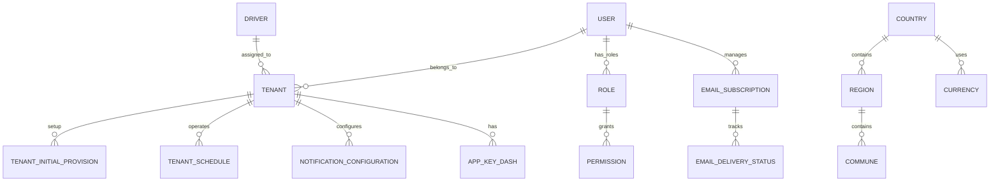

# KitchnTabs ER Diagram: Core Layer

**Core Infrastructure & Foundation Models**

The Core Layer provides the foundational infrastructure that all domain models depend on.

## Core Layer Models (17 total)

### User Management & Tenancy
- **User** — System users with authentication
- **Tenant** — Multi-tenant account/business entity
- **TenantInitialProvision** — Tenant setup & onboarding
- **TenantSchedule** — Tenant business hours/schedules
- **Role** — Role-based access control (RBAC)

### Geographic & Localization
- **Country** — Countries (master data)
- **Region** — Geographic regions/states
- **Commune** — Municipalities/communes
- **Language** — Supported languages
- **Currency** — Currencies & exchange

### Infrastructure & Configuration
- **AppKeyDash** — Application settings & keys
- **NotificationConfiguration** — Notification delivery config
- **EmailSubscription** — Email subscription management
- **EmailDeliveryStatus** — Email delivery tracking

### Operational
- **Driver** — Delivery drivers
- **Log** — System activity logging
- **Example** — Example data for testing

## ER Diagram: Core Layer Dependencies

## Key Relationships

### User & Tenant (Multi-Tenancy)
- Each **User** belongs to one or more **Tenants**
- **Tenant** is the primary business entity
- **Role** is tenant-scoped (different roles per tenant)
- **TenantInitialProvision** tracks setup progress
- **TenantSchedule** defines operating hours

### Geographic Hierarchy
- **Country** contains **Regions**
- **Region** contains **Communes**
- Used for ordering, shipping, pricing localization

### Localization & Currencies
- **Language** for multi-language support
- **Currency** for pricing, payments, reporting
- Both are global master data

### Notifications
- **NotificationConfiguration** — per-tenant notification settings
- **EmailSubscription** — user email preferences
- **EmailDeliveryStatus** — tracking delivery bounces/failures

### System Operations
- **Driver** — delivery personnel (scoped to tenant)
- **Log** — audit trail for all system activities
- **AppKeyDash** — feature flags, settings, API keys

## Critical Constraints

1. **Multi-Tenancy**: All tenant-scoped entities must have `tenant_id` foreign key
2. **User Isolation**: Users can only access data of tenants they belong to
3. **Role-Based Access**: Permissions are role-based and tenant-scoped
4. **Localization**: Currencies/languages are immutable master data
5. **Audit Trail**: All data modifications logged for compliance

## Design Patterns

- **Soft Deletes**: Uses Laravel's `SoftDeletes` for compliance
- **UUIDs**: Primary keys are UUIDs for security & scalability
- **Timestamps**: `created_at`, `updated_at` on all models
- **Scoping**: All queries filtered by tenant context
