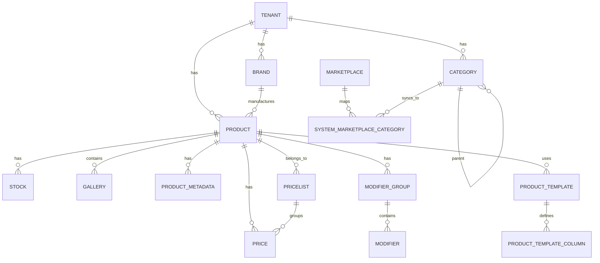
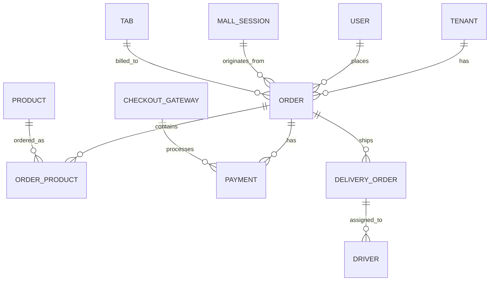
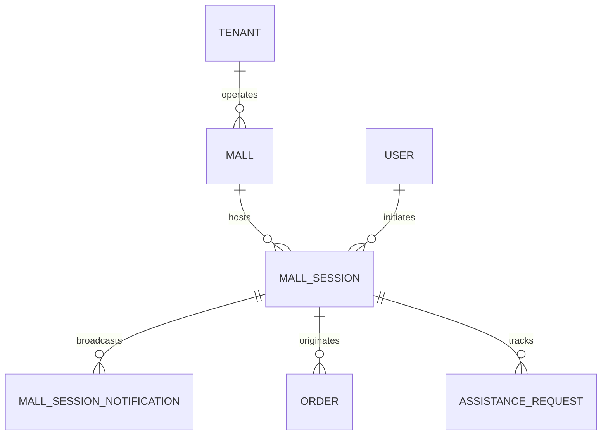
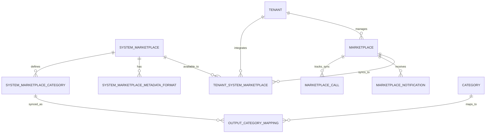
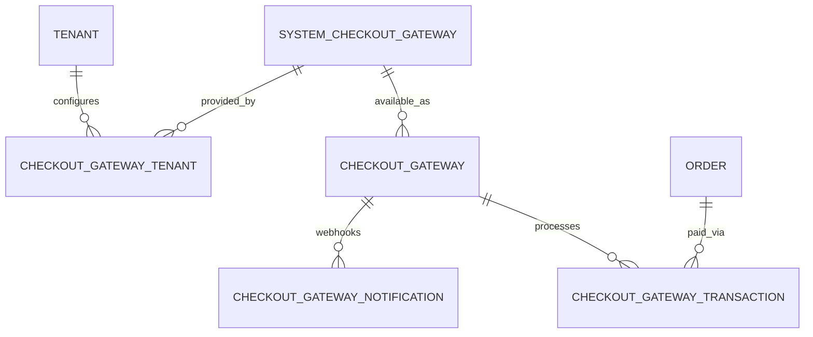
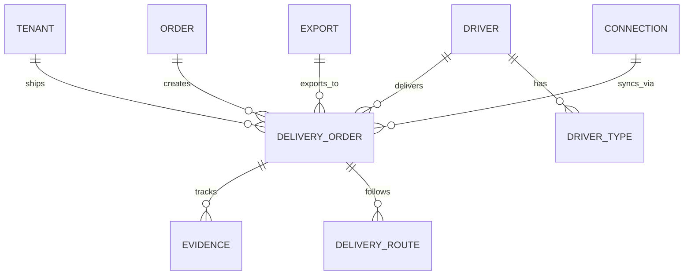
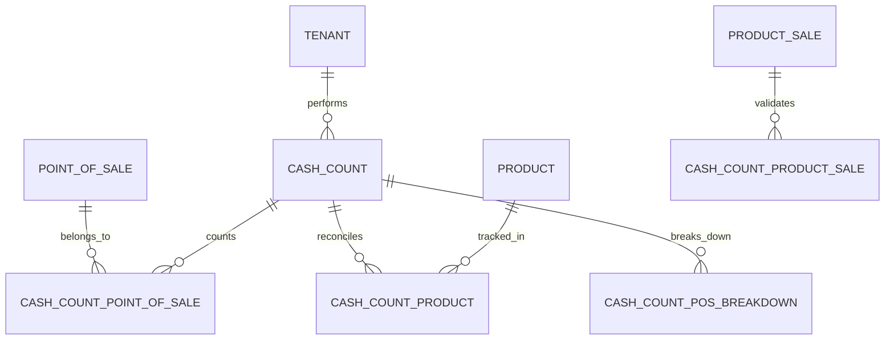
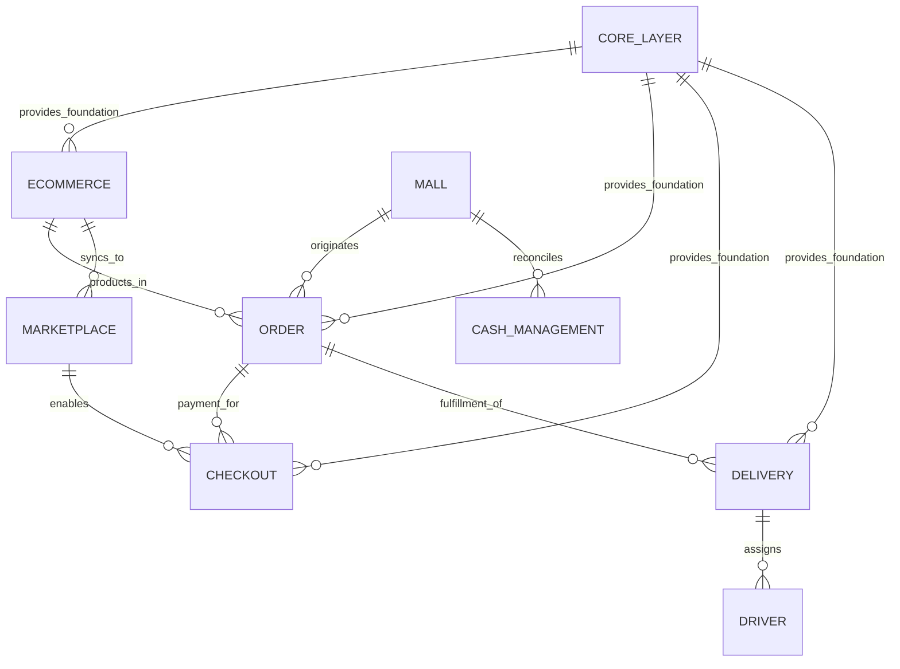

# KitchnTabs ER Diagram: Domain Layer

**Business Logic & Feature Models (158 total)**

The Domain Layer implements all business features and workflows on top of the Core Layer foundation.

## Domain Areas Overview

| Domain | Models | Purpose |
|--------|--------|---------|
| **E-Commerce** | 47 | Products, categories, pricing, inventory, templates |
| **Delivery & Logistics** | 41 | Orders, shipments, tracking, drivers, routes |
| **Order Management** | 3 | Orders, order items, payments |
| **Marketplace** | 9 | Third-party integrations (Jumpseller, Uber Eats, etc.) |
| **Checkout & Payment** | 5 | Payment gateways, transactions, notifications |
| **Cash Management** | 7 | Cash counts, register reconciliation |
| **Mall Operations** | 3 | Multi-store sessions, notifications |
| **Campaigns** | 1 | Marketing campaigns & promotions |
| **Tab & Session** | 1 | Table sessions (POS) |

## Detailed Domain ER Diagrams

### 1. E-Commerce & Products (47 models)

**Core Entities**: Product, Category, Brand, Stock, Price, Gallery

**Key Models**:
- **Product** — Base product entity
- **Category** — Hierarchical product categories
- **Stock** — Inventory levels by location
- **Price** — Multi-level pricing (base, promotional, tier)
- **Gallery** — Product images & media
- **ModifierGroup/Modifier** — Product customizations (sizes, toppings)
- **ProductTemplate** — Data structure definitions

---

### 2. Order Management (3 models)

**Core Entities**: Order, OrderProduct, Payment

**Key Models**:
- **Order** — Customer order with status machine
- **OrderProduct** — Order line items with modifiers
- **Payment** — Payment records, status tracking

---

### 3. Mall Operations (3 models)

**Core Entities**: Mall, MallSession, MallSessionNotification

**Key Models**:
- **Mall** — Multi-tenant food court entity
- **MallSession** — Customer session across stores
- **MallSessionNotification** — Real-time notifications (WebSocket)

---

### 4. Marketplace Integration (9 models)

**Core Entities**: SystemMarketplace, Marketplace, MarketplaceCall

**Key Models**:
- **SystemMarketplace** — Supported marketplaces (Uber Eats, Jumpseller, etc.)
- **TenantSystemMarketplace** — Tenant's marketplace connection
- **MarketplaceCall** — API call logs and sync history
- **MarketplaceNotification** — Webhook notifications

---

### 5. Checkout & Payment (5 models)

**Core Entities**: SystemCheckoutGateway, CheckoutGateway, CheckoutGatewayTransaction

**Key Models**:
- **SystemCheckoutGateway** — Payment providers (Stripe, Mercado Pago, Transbank, etc.)
- **CheckoutGatewayTenant** — Tenant's payment credentials
- **CheckoutGatewayTransaction** — Payment records
- **CheckoutGatewayNotification** — Webhook events

---

### 6. Delivery & Logistics (41 models)

**Core Entities**: DeliveryOrder, Driver, DriverType, Route

**Key Models**:
- **DeliveryOrder** — Shipment with tracking
- **Driver** — Delivery personnel
- **Evidence** — Proof of delivery (photos, signatures)
- **Export** — Integration with logistics (WMS, etc.)

---

### 7. Cash Management (7 models)

**Core Entities**: CashCount, CashCountPointOfSale, CashCountProduct

**Key Models**:
- **CashCount** — Register reconciliation session
- **CashCountPointOfSale** — POS register details
- **CashCountProduct** — Item-level counting
- **ProductSale** — Sales line items

---

## Summary Table

| Domain | Models | Key Entities | Purpose |
|--------|--------|--------------|---------|
| E-Commerce | 47 | Product, Category, Stock, Price | Product catalog & inventory |
| Delivery | 41 | DeliveryOrder, Driver, Route | Order fulfillment |
| Marketplace | 9 | SystemMarketplace, Marketplace | 3rd-party sync |
| Checkout | 5 | CheckoutGateway, Transaction | Payment processing |
| Order | 3 | Order, OrderProduct, Payment | Order lifecycle |
| Cash Mgmt | 7 | CashCount, PointOfSale | Register reconciliation |
| Mall | 3 | Mall, MallSession, Notification | Multi-store operations |
| Campaign | 1 | CampaignTracker | Marketing campaigns |
| Tab/POS | 1 | Tab | Table session management |

## Cross-Domain Relationships

## Data Flow

1. **Order Creation** → E-Commerce (products) → Order (line items) → Checkout (payment) → Delivery (fulfillment)
2. **Marketplace Sync** → SystemMarketplace (available) → TenantSystemMarketplace (configured) → MarketplaceCall (periodic sync)
3. **Multi-Store** → Mall (entity) → MallSession (customer) → Order (items) → CashManagement (reconciliation)

---

## Design Principles

- **Domain Isolation**: Each domain is loosely coupled, communicates via events/APIs
- **Tenant Scoping**: All entities inherit tenant context from Core Layer
- **Audit Trail**: All modifications logged for compliance & debugging
- **Event-Driven**: Domain changes trigger notifications (WebSocket, webhooks, etc.)
- **Scalability**: Models designed for horizontal scaling via partitioning
