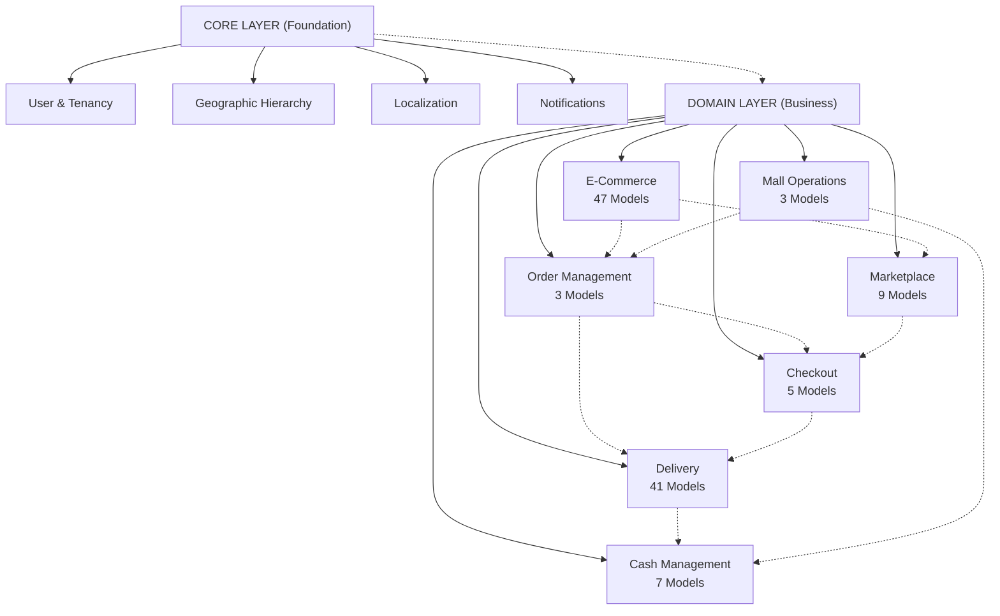

# N0: Architecture

**Foundation & System Architecture Documentation**

Comprehensive documentation of the KitchnTabs system architecture, including entity-relationship diagrams, data models, and design patterns.

## Overview

The KitchnTabs architecture is organized into two distinct layers:

- **Core Layer** — Foundation infrastructure (17 models)
- **Domain Layer** — Business features & workflows (158 models)

**Total: 175 Models** organized across 10 major domains

## Documents

### Core Layer Architecture
- **[Core Layer ER Diagram](N0-Architecture_ER_DIAGRAM_CORE_LAYER.md)** — Foundation models, multi-tenancy, user management, localization
  - User & Tenant (Multi-Tenancy)
  - Role-Based Access Control
  - Geographic Hierarchy (Countries, Regions, Communes)
  - Localization (Languages, Currencies)
  - Notifications & Email
  - System Configuration

### Domain Layer Architecture
- **[Domain Layer ER Diagram](N0-Architecture_ER_DIAGRAM_DOMAIN_LAYER.md)** — Business logic across 9 domains
  - **E-Commerce** (47 models) — Products, categories, inventory, pricing
  - **Delivery & Logistics** (41 models) — Order fulfillment, tracking, drivers
  - **Order Management** (3 models) — Order lifecycle & payments
  - **Marketplace Integration** (9 models) — 3rd-party platform sync
  - **Checkout & Payment** (5 models) — Payment processing & gateways
  - **Cash Management** (7 models) — Register reconciliation
  - **Mall Operations** (3 models) — Multi-store sessions
  - **Campaigns** (1 model) — Marketing & promotions
  - **Tab/POS** (1 model) — Table session management

## Architecture Overview



## Key Statistics

| Metric | Value |
|--------|-------|
| **Total Models** | 175 |
| **Core Layer** | 17 models |
| **Domain Layer** | 158 models |
| **Domains** | 9 major areas |
| **Multi-Tenancy** | Full tenant isolation |
| **Primary Key Type** | UUID v7 |
| **Soft Deletes** | Yes (Laravel SoftDeletes) |
| **Audit Trail** | Complete logging |

## Design Principles

### Multi-Tenancy
- All tenant-scoped entities inherit from `Tenant` context
- Users can access multiple tenants with different roles
- All queries automatically scoped by tenant context

### Scalability
- UUID primary keys for distributed systems
- Models designed for horizontal partitioning
- Event-driven architecture for loose coupling

### Compliance & Security
- Soft deletes for audit trail compliance
- Complete logging of data modifications
- Role-based access control (RBAC)
- Data encryption at rest & in transit

### Domain-Driven Design
- Clear separation between core & domain layers
- Domains communicate via events/APIs
- Bounded contexts prevent tight coupling

## Data Flow Examples

### Order Processing
```
Product (E-Commerce) 
  → Order (Order Management) 
  → Payment (Checkout)
  → Delivery (Logistics)
```

### Marketplace Synchronization
```
Marketplace Definition (System)
  → Tenant Configuration (Marketplace)
  → Periodic Sync (MarketplaceCall)
  → Webhook Notifications (MarketplaceNotification)
```

### Multi-Store Operations
```
Mall Entity (Mall Ops)
  → Customer Session (MallSession)
  → Order Placement (Order)
  → Cash Reconciliation (CashManagement)
```

## Layer Dependencies

```
┌─────────────────────────────────────┐
│         DOMAIN LAYER                │
│  E-Commerce, Order, Delivery, etc.  │
│  (158 models)                       │
└────────────────┬────────────────────┘
                 │
                 │ depends on
                 │
┌────────────────▼────────────────────┐
│         CORE LAYER                  │
│  Users, Tenants, Roles, Localization│
│  (17 models)                        │
└─────────────────────────────────────┘
```

## Database Schema Organization

### Core Layer Tables
```
users
tenants
roles
permissions
countries
regions
communes
languages
currencies
email_subscriptions
email_delivery_statuses
notification_configurations
drivers
app_key_dashes
logs
```

### Domain Layer Tables (by area)
**E-Commerce**: products, categories, brands, stocks, prices, galleries, modifiers, ...
**Delivery**: delivery_orders, drivers, routes, evidence, exports, ...
**Order**: orders, order_products, payments
**Marketplace**: marketplaces, marketplace_calls, system_marketplaces, ...
**Checkout**: checkout_gateways, checkout_gateway_transactions, ...
**Cash**: cash_counts, product_sales, pos_breakdowns, ...
**Mall**: malls, mall_sessions, mall_session_notifications, ...

## Related Documentation

- [Complete ER Diagrams](.) — Detailed relationship diagrams by layer
- [Epic Index](../EPIC_INDEX.md) — All epics and their documentation
- [Database Migrations](../../../kitchntabs-backend-domain/database/migrations/) — Migration history

## Quick Links

- **Models Directory**: `app/Models/`
- **Migrations Directory**: `database/migrations/`
- **Factories Directory**: `database/factories/`
- **Backend Repository**: `kitchntabs-backend-domain/`

---

**Last Updated**: 2026-06-26  
**Architecture Version**: 2.0 (Multi-Domain, Event-Driven)
