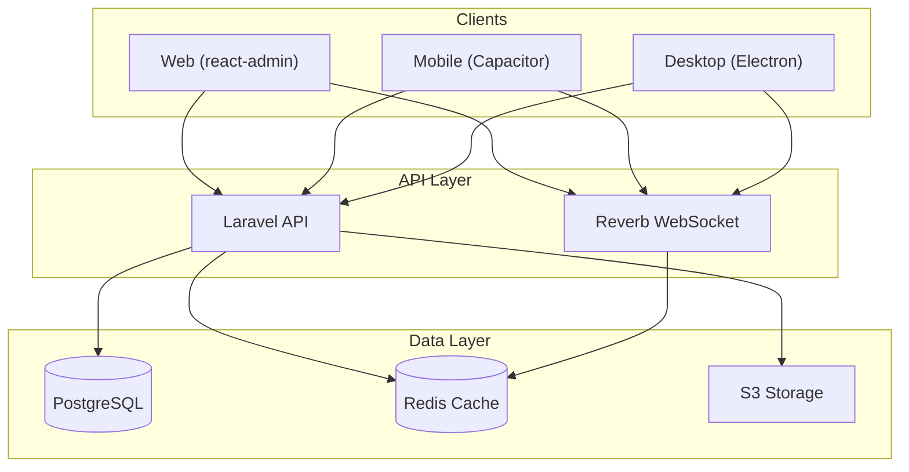
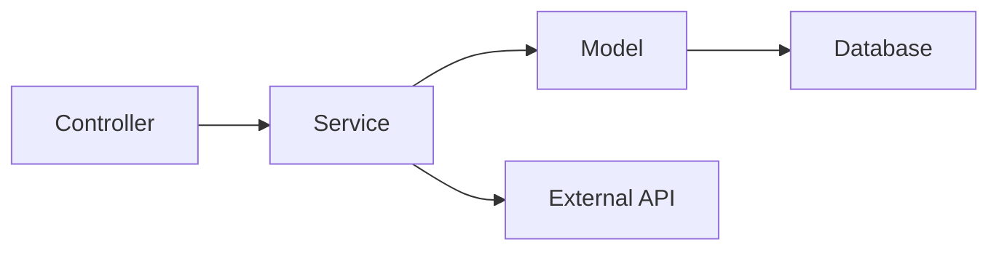
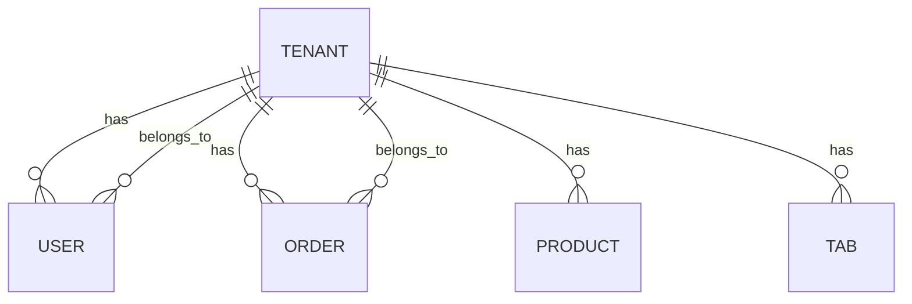
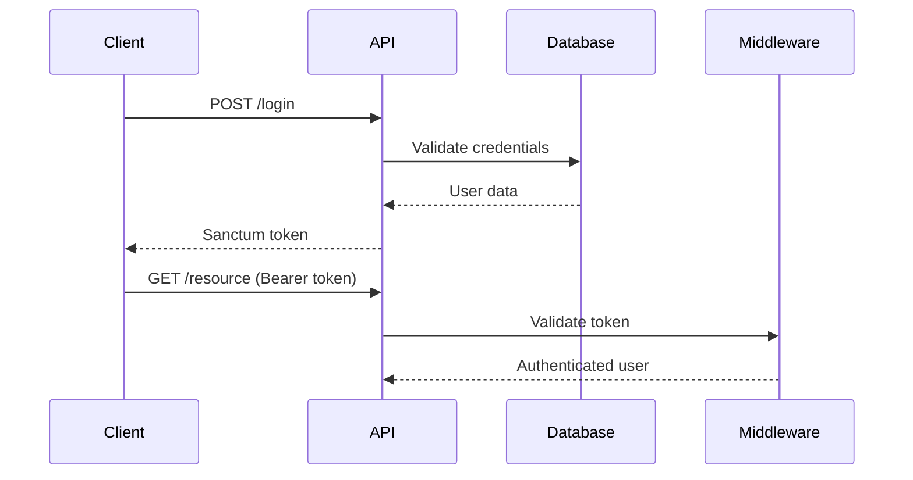

# DASH Backend Architecture Documentation

> **Version**: 1.0.0  
> **Last Updated**: December 2025

This document provides a comprehensive overview of the DASH backend architecture, focusing on the core/domain separation and multi-tenant design patterns.

---

## Table of Contents

1. [System Overview](#system-overview)
2. [Directory Structure](#directory-structure)
3. [Core/Domain Architecture](#coredomain-architecture)
4. [Multi-Tenancy Design](#multi-tenancy-design)
5. [Data Layer](#data-layer)
6. [Real-Time Architecture](#real-time-architecture)
7. [Security Model](#security-model)
8. [API Design](#api-design)
9. [Testing Architecture](#testing-architecture)

---

## System Overview

DASH Backend is a **Laravel-based multi-tenant API** implementing Domain-Driven Design principles. It serves as the foundation for e-commerce, POS, and restaurant management applications.

### Key Features

| Feature | Technology | Description |
|---------|------------|-------------|
| **Multi-Tenancy** | Custom Scoping | Data isolation via `tenant_id` foreign keys |
| **Real-time** | Laravel Reverb | WebSocket support with Redis scaling |
| **Authentication** | Laravel Sanctum | Token-based API authentication |
| **Authorization** | Spatie Permission | Role-based permissions at API level |
| **Audit Trails** | Spatie Activity Log | Comprehensive activity logging |
| **Media** | Spatie Media Library | S3-compatible file storage |

### Architecture Diagram



---

## Directory Structure

```
dash-backend/
├── app/                    # Core Laravel application
│   ├── Console/           # Artisan commands
│   ├── Events/            # Application events
│   ├── Http/              # Controllers, Middleware, Requests
│   │   ├── Controllers/API/
│   │   │   ├── Auth/      # Authentication endpoints
│   │   │   ├── Common/    # Shared endpoints
│   │   │   ├── Messaging/ # WebSocket controllers
│   │   │   ├── System/    # System admin endpoints
│   │   │   └── Tenant/    # Tenant-scoped endpoints
│   │   └── Middleware/    # Request middleware
│   ├── Models/            # Core Eloquent models
│   │   ├── Tenant.php     # Multi-tenant root
│   │   ├── User.php       # User authentication
│   │   ├── Permission.php # RBAC permissions
│   │   └── Role.php       # User roles
│   ├── Policies/          # Authorization policies
│   ├── Providers/         # Service providers
│   ├── Services/          # Application services
│   └── Traits/            # Reusable traits
│
├── domain/                 # Domain layer (business logic)
│   ├── app/
│   │   ├── Events/        # Domain events
│   │   ├── Http/          # Domain controllers
│   │   ├── Jobs/          # Async jobs
│   │   ├── Models/        # Domain models
│   │   │   ├── Tab/       # Restaurant tabs
│   │   │   ├── Order/     # Order management
│   │   │   ├── ECommerce/ # Products, categories
│   │   │   ├── Marketplace/
│   │   │   ├── Mall/      # Multi-store mall
│   │   │   └── ...
│   │   ├── Scopes/        # Query scopes
│   │   ├── Services/      # Domain services
│   │   └── Traits/        # Domain traits
│   ├── database/          # Domain migrations/seeders
│   ├── routes/            # Domain API routes
│   └── tests/             # Domain tests
│
├── config/                # Application configuration
├── database/              # Core migrations
│   └── migrations/
│       └── Modules/System/ # System table migrations
├── routes/                # API routes
│   ├── api.php           # Main API routes
│   ├── system.php        # System admin routes
│   ├── tenant.php        # Tenant routes
│   └── channels.php      # Broadcast channels
└── tests/                 # Core tests
```

---

## Core/Domain Architecture

The application follows a **modified Domain-Driven Design** pattern separating core framework concerns from business logic.

### Core Layer (`app/`)

Contains framework-level concerns:

- **Authentication/Authorization**: Login, registration, password reset
- **Base Models**: Tenant, User, Permission, Role
- **Infrastructure**: Middleware, Providers, base traits
- **System Administration**: Global settings, system users

### Domain Layer (`domain/`)

Contains business logic organized by bounded contexts:

| Context | Directory | Responsibility |
|---------|-----------|----------------|
| **Tabs** | `Models/Tab/` | Restaurant order management |
| **Orders** | `Models/Order/` | Order processing, payments |
| **E-Commerce** | `Models/ECommerce/` | Products, categories, pricing |
| **Marketplace** | `Models/Marketplace/` | Third-party integrations |
| **Mall** | `Models/Mall/` | Multi-store sessions |
| **Point of Sale** | `Models/PointOfSale/` | POS integrations |

### Service Layer Pattern



Example from `domain/app/Services/`:
- `ECommerce/` - Product sync, pricing calculations
- `Marketplace/` - Third-party API integrations

---

## Multi-Tenancy Design

### Tenant Model

The [Tenant](file:///Users/farandal/DASH-PW-PROJECT/dash-backend/app/Models/Tenant.php) model is the root of the tenancy hierarchy:

```php
class Tenant extends Model implements HasMedia
{
    protected $fillable = [
        'name',
        'public_id',
        'slug',
        'settings',     // JSON tenant settings
        'attributes',   // JSON custom attributes
    ];
}
```

### Data Isolation Strategy

Multi-tenancy is implemented via **column-based isolation** using `tenant_id` foreign keys:



### ResourceVisibility Trait

The [ResourceVisibility](file:///Users/farandal/DASH-PW-PROJECT/dash-backend/app/Traits/ResourceVisibility.php) trait provides automatic tenant scoping:

```php
trait ResourceVisibility
{
    public function scopeVisibleThroughTenant($query, User $user)
    {
        return $query->when(
            !$user->isSystemAdmin(), 
            fn() => $query->where('tenant_id', $user->tenant_id)
        );
    }
}
```

**Usage in Controllers:**

```php
// Only returns resources for the user's tenant
$tabs = Tab::visibleThroughTenant($user)->get();
```

### Tenant Settings & Attributes

Tenants have flexible JSON configuration:

```php
// Access tenant setting
$serviceFee = $tenant->setting('service_fee', 10);

// Access custom attribute
$timezone = $tenant->attribute('timezone', 'UTC');
```

---

## Data Layer

### Core Models

| Model | Location | Tenant Scoped | Key Relationships |
|-------|----------|---------------|-------------------|
| `Tenant` | `app/Models/` | No | hasMany Users, Marketplaces |
| `User` | `app/Models/` | Yes | belongsTo Tenant, hasRoles |
| `Permission` | `app/Models/` | No | Spatie Permission |
| `Role` | `app/Models/` | No | Spatie Role |

### Domain Models

| Model | Location | Tenant Scoped | Key Relationships |
|-------|----------|---------------|-------------------|
| `Tab` | `domain/app/Models/Tab/` | Yes | morphTo Order, belongsTo Tenant |
| `Order` | `domain/app/Models/Order/` | Yes | morphTo Brokerable, hasMany Items |
| `Product` | `domain/app/Models/ECommerce/` | Yes | belongsTo Category, hasMany Prices |
| `Marketplace` | `domain/app/Models/Marketplace/` | Yes | Through TenantSystemMarketplace |

### Polymorphic Relationships

The Order model uses polymorphic relationships for flexibility:

```php
// Brokerable: Marketplace, PointOfSale, or Tab
public function brokerable()
{
    return $this->morphTo();
}

// Tabable: Different tab sources
public function tabable()
{
    return $this->morphTo();
}
```

---

## Real-Time Architecture

### Laravel Reverb Setup

The application uses **Laravel Reverb** for WebSocket functionality:

**Configuration**: [config/reverb.php](file:///Users/farandal/DASH-PW-PROJECT/dash-backend/config/reverb.php)

```php
'reverb' => [
    'host' => env('REVERB_SERVER_HOST', '0.0.0.0'),
    'port' => env('REVERB_SERVER_PORT', 8080),
    'scaling' => [
        'enabled' => env('REVERB_SCALING_ENABLED', false),
        'server' => [
            'host' => env('REDIS_HOST', '127.0.0.1'),
        ],
    ],
]
```

### Broadcast Channels

**Channel definitions**: [routes/channels.php](file:///Users/farandal/DASH-PW-PROJECT/dash-backend/routes/channels.php)

| Channel Pattern | Purpose | Authorization |
|-----------------|---------|---------------|
| `user.{id}` | Private user messages | User ID match |
| `tenant.{tenantId}` | Tenant-wide broadcasts | Tenant membership |
| `tenant.{tenantId}.system` | System events | Tenant membership |
| `tenant.{tenantId}.chat` | Chat messages | Tenant membership |

### Event Broadcasting

```php
// Broadcasting a tenant event
broadcast(new TabStatusChanged($tab))
    ->toOthers()
    ->on('tenant.' . $tab->tenant_id);
```

---

## Security Model

### Authentication (Sanctum)



### Role-Based Authorization (Spatie)

**Roles** ([app/Models/Role.php](file:///Users/farandal/DASH-PW-PROJECT/dash-backend/app/Models/Role.php)):
- `SYSTEM_ADMIN` - Platform-level access
- `TENANT_ADMIN` - Full tenant access
- `TENANT_USER` - Limited tenant access

**Permission checking:**

```php
// In controller
$this->authorize('viewAny', Tab::class);

// In middleware
->middleware('can:manage-products');
```

### API-Level Permissions

The [Permission](file:///Users/farandal/DASH-PW-PROJECT/dash-backend/app/Models/Permission.php) model supports granular API method control:

```php
// Check if user can access specific API method
if ($user->can('products.create')) {
    // Allow product creation
}
```

---

## API Design

### Route Organization

| Route File | Prefix | Purpose |
|------------|--------|---------|
| `routes/api.php` | `/api` | Public and authenticated endpoints |
| `routes/system.php` | `/api/system` | System admin endpoints |
| `routes/tenant.php` | `/api/tenant` | Tenant-scoped endpoints |
| `domain/routes/api.php` | `/api` | Domain-specific endpoints |

### React-Admin Integration

The API follows React-Admin conventions via `config/react-admin-methods.php`:

| Method | HTTP | Path | Purpose |
|--------|------|------|---------|
| `getList` | GET | `/{resource}` | List with pagination |
| `getOne` | GET | `/{resource}/{id}` | Single resource |
| `create` | POST | `/{resource}` | Create resource |
| `update` | PUT | `/{resource}/{id}` | Update resource |
| `delete` | DELETE | `/{resource}/{id}` | Delete resource |

---

## Testing Architecture

### Test Structure

```
tests/
├── Feature/
│   └── DASH/
│       ├── Admin/        # Admin feature tests
│       ├── Auth/         # Authentication tests
│       ├── SystemAdmin/  # System admin tests
│       └── Email/        # Email verification tests
└── Unit/
    ├── Models/           # Model unit tests
    ├── Traits/           # Trait unit tests
    └── Http/             # Controller unit tests

domain/tests/             # Domain-specific tests
```

### Running Tests

```bash
# All tests
php artisan test

# Core tests only
php artisan test --testsuite=Core

# Domain tests only
php artisan test --testsuite=Domain

# Specific test file
php artisan test tests/Feature/DASH/Auth/LoginTest.php
```

---

## Appendix: Key Configuration Files

| File | Purpose |
|------|---------|
| [config/tenants.php](file:///Users/farandal/DASH-PW-PROJECT/dash-backend/config/tenants.php) | Tenant settings and attribute formats |
| [config/reverb.php](file:///Users/farandal/DASH-PW-PROJECT/dash-backend/config/reverb.php) | WebSocket server configuration |
| [config/permission.php](file:///Users/farandal/DASH-PW-PROJECT/dash-backend/config/permission.php) | Spatie Permission settings |
| [config/broadcasting.php](file:///Users/farandal/DASH-PW-PROJECT/dash-backend/config/broadcasting.php) | Broadcasting driver configuration |

---

> This documentation reflects the architecture as of December 2025. For specific implementation details, refer to the individual source files referenced throughout this document.
