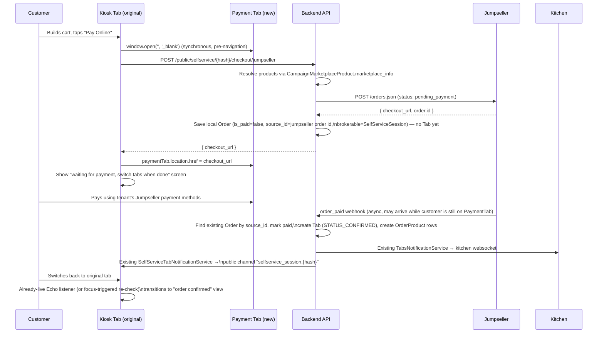

# Self-Service → Jumpseller Checkout — Implementation Plan

> Status: Proposed / not yet implemented.
> Lets a self-service kiosk customer (BYOD, mobile browser) pay for their order using the
> tenant's existing Jumpseller payment methods, when the tenant has Jumpseller active and the
> ordered products are synced.

---

## 1. Feasibility Summary

Confirmed against Jumpseller's official docs and live community usage (not just the bundled
OpenAPI export):

| Question | Answer | Source |
|---|---|---|
| Can we create an order via API and get a payable link back? | Yes — `POST /orders.json` with `status: "pending_payment"` returns `checkout_url` in the form `https://{store}.jumpseller.com/checkout?token=<token>` | [Manage Orders with Jumpseller](https://jumpseller.com/support/orders/), [docs/JUMPSELLER-API.md](../../../../../../docs/JUMPSELLER-API.md) |
| Is there a real `order_paid` webhook? | Yes, "Order Paid" is a documented event, and it's already wired up and proven in this codebase | [Store Webhooks](https://jumpseller.com/support/webhooks/), [JumpsellerService::handleWebhook()](../../../../../../kitchntabs-backend-domain/app/Services/ECommerce/Marketplaces/Jumpseller/JumpsellerService.php) |
| What's the real `products[]` payload shape? | `{ "id": <product_id>, "variant_id"?: <variant_id>, "qty": <quantity> }` — note `qty`, not `quantity` | [Community gist](https://gist.github.com/tiagomatos/a801f26735d336038b50778702754873) |
| Does Jumpseller support a custom return URL after payment? | **Not documented anywhere.** Assume the customer is left on Jumpseller's own page after paying. | n/a — this is why the design below never depends on a return redirect |
| Is the `checkout_url` page iframe-able? | **Unknown / not documented.** Irrelevant to this plan — we're using a new tab, not an iframe. | n/a |

**Verdict: feasible.** The mechanism is real, and — as discovered while researching this plan —
most of the supporting plumbing (real-time session notifications, brokerable-session scoping,
the webhook handler that creates the local Tab) already exists in this codebase for the inbound
Jumpseller-storefront-order case. This feature mostly *reuses* that, rather than building new
infrastructure.

---

## 2. Chosen UX Flow

Per direction: full-page redirect is wrong for this case (BYOD, the kiosk page itself is the
"app" the customer is using) — instead we open the Jumpseller checkout in a **second tab**,
keep the original kiosk tab alive on a waiting screen, and rely on the `order_paid` webhook
(not a return URL) to learn that payment succeeded. The customer is explicitly told to switch
back to the original tab.



Closing/abandoning the payment tab without paying is harmless — the pending local `Order` just
sits unpaid (mirrors Jumpseller's own "abandoned order" concept). No Tab, no kitchen
notification, nothing to clean up for v1.

---

## 3. Key Existing Infrastructure This Plan Reuses

Discovered while grounding this plan — this is what makes the feature small:

1. **`Order.brokerable_type` / `brokerable_id`** — already the mechanism that scopes an order to
   a self-service session (`brokerable_type = SelfServiceSession::class`, `brokerable_id =
   session->id`), used today by `SelfServiceTabsController::_preList`.
2. **`handleOrderPaid()`** in
   [OrdersServiceMethods.php](../../../../../../kitchntabs-backend-domain/app/Services/ECommerce/Marketplaces/Jumpseller/Traits/OrdersServiceMethods.php#L1182)
   already does everything needed once a Jumpseller order is paid: creates a `Payment` via
   `markOrderAsPaidViaMarketplace()`, creates `OrderProduct` rows, creates the `Tab` via
   `createTabForOrder()`, sets it to `Tab::STATUS_CONFIRMED`, and calls
   `$tabNotificationService->handleStatusChange($tab, Tab::STATUS_CONFIRMED, true)`.
3. **`TabsNotificationService::handleStatusChange()`** already calls
   `SelfServiceTabNotificationService::notifySession($tab, $newStatus)` internally
   ([TabsNotificationService.php:105](../../../../../../kitchntabs-backend-domain/app/Services/Tabs/TabsNotificationService.php#L105)).
4. **`SelfServiceTabNotificationService::notifySession()`** already checks
   `$tab->order->brokerable_type === SelfServiceSession::class`, persists a row in
   `self_service_session_notifications`, and broadcasts on the **public** channel
   `selfservice_session.{hash}` via `AppNotificationBuilder`
   ([SelfServiceTabNotificationService.php](../../../../../../kitchntabs-backend-domain/app/Services/Tabs/SelfServiceTabNotificationService.php)).
5. **The frontend already subscribes to that exact channel.**
   `SelfServiceEchoProvider`/`useSelfServiceEcho()`
   ([SelfServiceEchoContext.tsx](../../../../../../kitchntabs-frontend/apps/kitchntabs-app/src/kt-selfservice/contexts/SelfServiceEchoContext.tsx))
   connects to `selfservice_session.{hash}` as a public (no-auth) channel, and
   `NotificationListener` inside
   [SelfServiceTabsContext.tsx](../../../../../../kitchntabs-frontend/apps/kitchntabs-app/src/kt-selfservice/components/SelfServiceTabsContext.tsx#L11)
   already reacts to `lastEvent.event === 'selfservice_session_order_status_update'` by calling
   `refresh()` and showing a toast — today only wired for `list`/`view` modes, not `create`.

**The practical consequence:** if this feature preserves `brokerable_type =
SelfServiceSession::class` on the Order it creates, and the order-paid handler is fixed not to
skip a pre-existing order, the *entire* "tell the kiosk payment succeeded" loop already exists
and fires for free. No new broadcasting code, no new polling endpoint as the primary mechanism.

---

## 4. Backend Changes

### 4.1 New endpoint — initiate checkout

**Route** (in [routes/api/selfservice.php](../../../../../../kitchntabs-backend-domain/routes/api/selfservice.php), inside the existing
`public/selfservice` group):
```php
Route::post('/{hash}/checkout/jumpseller', [SelfServiceCheckoutController::class, 'createJumpsellerCheckout']);
Route::get('/{hash}/checkout/jumpseller/status', [SelfServiceCheckoutController::class, 'checkJumpsellerCheckoutStatus']);
```

**New controller**: `app/Http/Controllers/API/SelfService/SelfServiceCheckoutController.php`
(separate from `SelfServiceTabsController` on purpose — this isn't a react-admin CRUD resource,
and keeping it separate means zero risk to the existing "pay at counter" tab-creation path).

`createJumpsellerCheckout(Request $request, string $hash)`:
1. Resolve and validate the `SelfServiceSession` by hash (active, not expired — reuse whatever
   the existing session-validation logic does today).
2. Resolve the tenant's active Jumpseller `Marketplace`:
   ```php
   Marketplace::where('tenant_id', $session->tenant_id)
       ->where('active', true)
       ->whereHas('tenantSystemMarketplace.systemMarketplace', fn ($q) =>
           $q->where('class', JumpsellerService::class))
       ->first();
   ```
   404 if none — frontend falls back to the normal "Pay at Counter" flow.
3. Check the feature flag (see §4.4). 404/422 if disabled.
4. For each cart line item, resolve the Jumpseller product id via
   `CampaignMarketplaceProduct` (joined through the product's `CampaignMarketplace` for this
   marketplace), requiring `status === CampaignMarketplaceProduct::STATUS_PUBLISHED` and a
   non-null `marketplace_info['id']`. If the item has modifiers selected, resolve the
   Jumpseller **variant** id (see §4.2/§7 — this is the one piece that needs a live API spike).
   If *any* line item can't be resolved, return `422` with the list of unresolvable product
   names — do not call Jumpseller at all.
5. Build the order payload and call `JumpsellerService::createCheckoutOrder()` (new method,
   §4.2).
6. Persist a minimal local `Order` (no `Tab`, no `OrderProduct` rows yet — see §4.3 for why):
   - `tenant_id`, `source_id = (string) $jumpsellerOrderId`
   - `status = Order::STATUS_CREATED`, `is_paid = false`
   - `brokerable_type = SelfServiceSession::class`, `brokerable_id = $session->id`
   - `currency_id`, `total_amount` (from the Jumpseller response)
   - `data = ['checkout_url' => ..., 'source' => 'selfservice_jumpseller_checkout']`
7. Return `{ "checkout_url": "...", "order_id": <local order id> }`.

`checkJumpsellerCheckoutStatus(Request $request, string $hash)` — a thin fallback safety net
(§5.3), not the primary mechanism:
- Looks up the most recent self-service-checkout `Order` for this session
  (`brokerable_type = SelfServiceSession::class AND brokerable_id = session.id AND data->>'source' = 'selfservice_jumpseller_checkout'`, most recent first).
- Returns `{ is_paid, tab_id }` (`tab_id` null until the webhook creates one).

### 4.2 New service method — create the Jumpseller order

Add to `JumpsellerService` (new trait file
`app/Services/ECommerce/Marketplaces/Jumpseller/Traits/CheckoutServiceMethods.php`, composed
into the class alongside the existing `OrdersServiceMethods` etc.):

```php
public function createCheckoutOrder(array $resolvedLineItems, SelfServiceSession $session): array
{
    $payload = [
        'order' => [
            'status' => 'pending_payment',
            'shipping_required' => false,
            'products' => array_map(fn ($item) => array_filter([
                'id' => $item['jumpseller_product_id'],
                'variant_id' => $item['jumpseller_variant_id'] ?? null,
                'qty' => $item['quantity'],
            ]), $resolvedLineItems),
            'customer' => [
                'name' => $session->customer_name ?: 'Self-Service Customer',
            ],
        ],
    ];

    $response = $this->client->post('/orders.json', $payload);

    if ($response->failed()) {
        throw new Exception('Failed to create Jumpseller checkout order: ' . $response->body());
    }

    return $response->json()['order'];
}
```

Payload field names (`id`, `variant_id`, `qty`) are taken from the confirmed working example in
§1, not the bare OpenAPI export — **verify against a real sandbox call before merging** (see
§7.1).

### 4.3 Fix `handleOrderPaid()` to complete a pre-existing order instead of skipping it

This is the one surgical change to existing code, and it's required for two independent
reasons: (a) without it, payment confirmation for this new flow is silently swallowed, and (b)
it's what lets us preserve `brokerable_type = SelfServiceSession::class` instead of the
hardcoded `Marketplace::class` the "create new" branch uses today.

File:
[OrdersServiceMethods.php:1202-1246](../../../../../../kitchntabs-backend-domain/app/Services/ECommerce/Marketplaces/Jumpseller/Traits/OrdersServiceMethods.php#L1202-L1246)

**Today:**
```php
if ($existingOrder) {
    // ... always returns early ...
    return ['status' => 'info', 'message' => 'Paid webhook from jumpseller arrived twice, skipping', ...];
}

// Create new order with paid status
$order = new Order();
$order->tenant_id = ...;
$order->brokerable_type = get_class($this->marketplace); // always Marketplace::class
$order->brokerable_id = $this->marketplace->id;
...
$order->save();
```

**Change to:**
```php
if ($existingOrder && $existingOrder->is_paid) {
    // Genuine duplicate webhook (Jumpseller re-fires on shipment) — unchanged behavior.
    return ['status' => 'info', 'message' => 'Paid webhook from jumpseller arrived twice, skipping', 'order_id' => $existingOrder->id];
}

if ($existingOrder) {
    // Our own pre-created self-service checkout order — complete it, preserving its
    // existing brokerable_type/brokerable_id (SelfServiceSession) instead of overwriting it.
    $order = $existingOrder;
    $order->is_paid = true;
    $order->broker_status = $orderData['status'] ?? null;
    $order->data = array_merge($order->data ?? [], $orderData);
} else {
    $order = new Order();
    $order->tenant_id = $this->marketplace->tenantSystemMarketplace->tenant_id;
    $order->source_id = (string) $orderData['id'];
    $order->brokerable_type = get_class($this->marketplace);
    $order->brokerable_id = $this->marketplace->id;
    $order->is_paid = true;
    // ... rest of today's "create new" field assignments, unchanged ...
}

$order->status = JumpsellerService::ORDER_STATUS_PAID;
$order->save();

// Everything below this line (currency resolution skipped for the reused-order branch since
// it's already set; Payment creation via markOrderAsPaidViaMarketplace(); OrderProduct creation
// via findProductWithVariantSupport(); Tab creation via createTabForOrder(); notification via
// $tabNotificationService->handleStatusChange()) already exists today only in the "create new"
// path — hoist it so both branches run through it unchanged.
```

Net effect: this is a restructure (hoist shared logic above the branch), not new logic. The
"create new order" behavior for genuine Jumpseller-storefront orders is unchanged byte-for-byte
except for which branch it physically lives in.

### 4.4 Feature flag

Add a boolean inside the Jumpseller `Marketplace.connection_params` JSON, e.g.
`self_service_checkout_enabled`. No migration needed (`connection_params` is already JSON).
**Open item:** confirm how this should surface in the marketplace settings UI — check whether
`MarketplaceController::getSettings()` / `publishSettings()` are generic enough to expose an
extra toggle per marketplace type, or whether a small dedicated endpoint is simpler. Not
resolved by this round of research; resolve before frontend settings work starts.

### 4.5 No new database migrations

Everything above reuses existing columns (`Order.brokerable_type/id`, `Order.source_id`,
`Order.is_paid`, `Order.data`, `Marketplace.connection_params`). The only "new" persisted state
is the pre-payment `Order` shell, which uses the existing `orders` table.

---

## 5. Frontend Changes (`kt-selfservice`)

### 5.1 Trigger — new-tab handoff

In
[SelfServiceOrderCreateContext.tsx](../../../../../../kitchntabs-frontend/apps/kitchntabs-app/src/kt-selfservice/contexts/SelfServiceOrderCreateContext.tsx)
(today's cart submit calls `axios.post('/public/selfservice/${sessionHash}/tab', orderData)` at
line 340), add a parallel `payOnline()` action:

```ts
const payOnline = useCallback(async () => {
    // Must open synchronously inside the click handler — opening it after an `await`
    // gets blocked as a popup by most mobile browsers (notably iOS Safari).
    const paymentTab = window.open('', '_blank');

    try {
        const { data } = await axios.post(`/public/selfservice/${sessionHash}/checkout/jumpseller`, { items: cartItems });

        if (paymentTab) {
            paymentTab.location.href = data.checkout_url;
        } else {
            // Popup blocked anyway — fall back to a tappable link instead of a silent failure.
            setBlockedCheckoutUrl(data.checkout_url);
        }
        setAwaitingPayment(true);
    } catch (error) {
        paymentTab?.close();
        // Surface item-level validation errors (unsynced products) and offer "Pay at Counter" instead.
        notify(error.response?.data?.message ?? translate('selfservice.checkout.error'), { type: 'error' });
    }
}, [sessionHash, cartItems, axios, notify, translate]);
```

### 5.2 Waiting screen

New state in the create flow: `awaiting_payment`. Renders:
- "We opened Jumpseller's secure payment page in a new tab. Complete your payment there, then
  come back to **this** tab — we'll confirm automatically." + spinner.
- If `blockedCheckoutUrl` is set (popup blocked): a visible "Tap here to pay" link/button
  instead (a direct tap counts as a user gesture, so it won't be blocked).

### 5.3 Detecting payment confirmation — two complementary mechanisms

**Primary (passive):** the waiting screen calls `useSelfServiceEcho()` directly (the same hook
`NotificationListener` already uses — see §3.5) and watches for
`lastEvent.event === 'selfservice_session_order_status_update'`. On receipt, read `tab_id` from
the payload and route to the existing tab-view screen — no new endpoint needed for this path.

**Secondary (active, on tab focus):** mobile browsers throttle/suspend backgrounded tabs,
including websocket delivery — and this design explicitly tells the customer to switch away to
the payment tab and back. Relying on the live socket alone risks missing the event while
backgrounded. Add a `visibilitychange`/`focus` listener on the waiting screen that, when the
kiosk tab regains focus, calls `GET /public/selfservice/{hash}/checkout/jumpseller/status`
(§4.1) once as a catch-up check, independent of whether the socket event already fired.

```ts
useEffect(() => {
    const onFocus = () => checkStatusOnce(); // GETs the status endpoint, transitions if is_paid
    document.addEventListener('visibilitychange', onFocus);
    window.addEventListener('focus', onFocus);
    return () => { /* cleanup */ };
}, []);
```

### 5.4 Unsynced-cart fallback

If `createJumpsellerCheckout` returns 422 (unresolvable products), show which items aren't
available for online payment and offer the existing "Pay at Counter" submit (today's
`POST /public/selfservice/{hash}/tab` flow) as a one-tap fallback rather than blocking checkout
entirely.

---

## 6. File-by-File Change List

| File | Change |
|---|---|
| `kitchntabs-backend-domain/routes/api/selfservice.php` | Add 2 routes under `public/selfservice` |
| `kitchntabs-backend-domain/app/Http/Controllers/API/SelfService/SelfServiceCheckoutController.php` | **New** — initiate + status-check endpoints |
| `kitchntabs-backend-domain/app/Services/ECommerce/Marketplaces/Jumpseller/Traits/CheckoutServiceMethods.php` | **New** — `createCheckoutOrder()`, product/variant resolution |
| `kitchntabs-backend-domain/app/Services/ECommerce/Marketplaces/Jumpseller/JumpsellerService.php` | Compose the new trait into the class |
| `kitchntabs-backend-domain/app/Services/ECommerce/Marketplaces/Jumpseller/Traits/OrdersServiceMethods.php` | Restructure `handleOrderPaid()` per §4.3 |
| `kitchntabs-frontend/.../kt-selfservice/contexts/SelfServiceOrderCreateContext.tsx` | Add `payOnline()`, `awaiting_payment` state, popup-blocked fallback |
| `kitchntabs-frontend/.../kt-selfservice/components/...` (new waiting-screen component) | **New** — UI for §5.2/§5.3 |
| Marketplace settings (TBD, §4.4) | Add `self_service_checkout_enabled` toggle |

---

## 7. Open Risks — Resolve Before/During Implementation

1. **Variant/modifier → Jumpseller `variant_id` resolution.** `CampaignMarketplaceProduct.marketplace_info`
   stores the base product's Jumpseller id; I found no persisted mapping for individual
   variants. The publishing pipeline uses a SKU convention
   `{BASE_SKU}-{MODIFIER_GROUP_ID}-{OPTION_ID}` (see
   [JUMPSELLER.PUBLISHING.md](JUMPSELLER.PUBLISHING.md)) — likely need a live
   `GET /products/{id}/variants.json` lookup by SKU at checkout-build time. Spike this against a
   real synced product with modifiers before writing `CheckoutServiceMethods`.
2. **`products[]` payload schema** is sourced from a community example, not the formal schema —
   confirm `id`/`variant_id`/`qty` against a real sandbox order before relying on it in
   production.
3. **No documented return URL.** Confirmed absent from all available docs — the whole design
   above is built around *not* needing one. If Jumpseller ever adds one, it'd be a pure UX
   improvement, not a required fix.
4. **Feature-flag delivery mechanism** (§4.4) is unresolved — small spike needed on the
   marketplace settings UI/endpoints before frontend toggle work starts.
5. **Abandoned pending orders** are left unpaid indefinitely in v1 (no cleanup job). Acceptable
   initially since it mirrors Jumpseller's own "abandoned order" concept; revisit if it causes
   reporting noise.

---

## 8. Testing Plan

- **Unit**: `CheckoutServiceMethods::createCheckoutOrder()` against a mocked Jumpseller HTTP
  client (success, unsynced-product rejection, Jumpseller API failure).
- **Feature**: `handleOrderPaid()` — (a) no existing order → unchanged "create new" behavior
  (regression guard for genuine storefront orders), (b) existing unpaid order → completes and
  preserves `brokerable_type`, (c) existing already-paid order → still skips (regression guard
  for the duplicate-webhook quirk).
- **Manual E2E**: real tenant with Jumpseller synced products, real mobile browser (iOS Safari +
  Android Chrome specifically, for popup-blocking behavior), full flow including the
  popup-blocked fallback and the tab-switch-back recovery path.

## 9. Rollout

Ship behind the per-marketplace flag (§4.4), default OFF. Pilot with one tenant that has a fully
synced Jumpseller catalog (no variants, to start) before tackling the variant-resolution spike
in §7.1.
