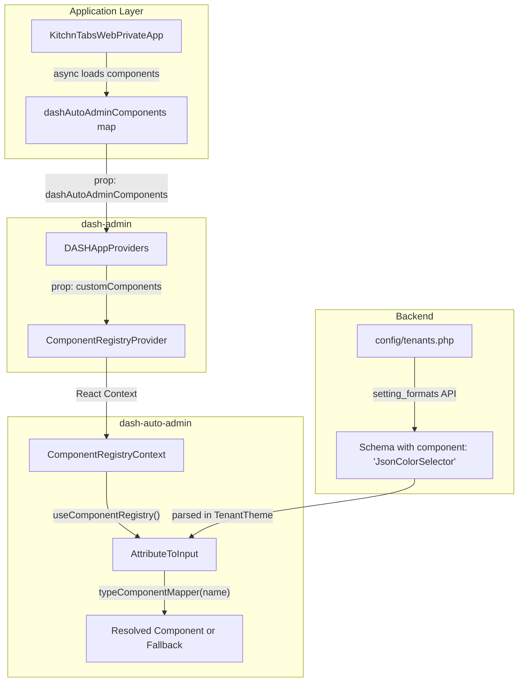

# Component Registry

The **Component Registry** is a React Context-based system in `dash-auto-admin` that allows applications to register custom field components at runtime and reference them by string name in schema definitions. This enables a decoupled architecture where the backend can define form schemas (including custom component types) without the frontend needing to hardcode every component mapping.

---

## Architecture Overview



## Core Components

### `ComponentRegistryProvider`

**Package**: `dash-auto-admin`  
**File**: `packages/dash-auto-admin/src/DashAutoAdminComponentRegistry.tsx`

The provider wraps the component tree and makes registered components available via React Context.

```tsx
import { ComponentRegistryProvider } from 'dash-auto-admin';

<ComponentRegistryProvider customComponents={myComponentMap}>
    {children}
</ComponentRegistryProvider>
```

**Props:**

| Prop | Type | Description |
|------|------|-------------|
| `customComponents` | `Record<string, React.FC<IDashAutoAdminCustomFieldComponent>>` | Map of component name → React component |
| `children` | `ReactNode` | Child elements |

**Behavior:**
- Initializes internal state by merging `defaultComponentMap` with `customComponents`
- Syncs with prop changes via `useEffect` (handles async loading)
- Provides `registerComponent()` and `registerComponents()` for runtime registration

---

### `useComponentRegistry()`

**Package**: `dash-auto-admin`  
**File**: `packages/dash-auto-admin/src/DashAutoAdminComponentRegistry.tsx`

Hook to access the registry from any component within the provider tree.

```tsx
import { useComponentRegistry } from 'dash-auto-admin';

const { components, registerComponent, registerComponents } = useComponentRegistry();
```

**Returns:**

| Property | Type | Description |
|----------|------|-------------|
| `components` | `Record<string, React.FC<...>>` | All registered components |
| `registerComponent` | `(type: string, component: React.FC) => void` | Register a single component |
| `registerComponents` | `(map: Record<string, React.FC>) => void` | Register multiple components |

---

### `IDashAutoAdminCustomFieldComponent`

**File**: `packages/dash-auto-admin/src/interfaces/IDashAutoAdminCustomFieldComponent.ts`

Interface that all custom field components must implement:

```typescript
interface IDashAutoAdminCustomFieldComponent {
    attribute: IDashAutoAdminAttribute;   // Schema attribute definition
    method: 'list' | 'view' | 'edit' | 'create';  // Current form mode
    resourceConfig: IDashAutoAdminResourceConfig;   // Resource configuration
    record?: any;        // Current record data
    locale?: string;     // Active locale
    options?: any;       // Additional options
    children?: JSX.Element;
    [x: string]: any;    // Extensible
}
```

---

## How Components Are Resolved

When `AttributeToInput` encounters an attribute with `type: 'custom'` and a string `component` property, it looks up the component in the registry:

```
Schema attribute → type: 'custom', component: 'JsonColorSelector'
    ↓
AttributeToInput calls typeComponentMapper('JsonColorSelector')
    ↓
useComponentRegistry().components['JsonColorSelector']
    ↓
Found? → Renders the component
Not found? → Renders fallback: "No component for JsonColorSelector"
```

**Relevant code in `AttributeToInput.tsx`:**

```typescript
const { components } = useComponentRegistry();

const typeComponentMapper = (type: string) => {
    const component = components[type];
    if (component) {
        return { custom: true, type: "component", component };
    }
    return { custom: true, type: "component", component: () => <>No component for {type}</> };
};
```

---

## Integration Guide

### Step 1: Create a Custom Component

Build a React component that implements `IDashAutoAdminCustomFieldComponent`:

```tsx
// components/MyCustomField.tsx
import React from 'react';
import { IDashAutoAdminCustomFieldComponent } from 'dash-auto-admin';
import { useFormContext } from 'react-hook-form';

const MyCustomField: React.FC<IDashAutoAdminCustomFieldComponent> = ({
    attribute,
    method,
    resourceConfig,
    record,
}) => {
    const { setValue, watch } = useFormContext();
    const value = watch(attribute.attribute);

    if (method === 'view' || method === 'list') {
        return <span>{JSON.stringify(value)}</span>;
    }

    return (
        <div>
            <label>{attribute.label || attribute.attribute}</label>
            <input
                type="text"
                value={value || attribute.default_value || ''}
                onChange={(e) => setValue(attribute.attribute, e.target.value)}
            />
        </div>
    );
};

export default MyCustomField;
```

### Step 2: Register Components (Async Loading Pattern)

In your application's private app component, load and register custom components:

```tsx
// KitchnTabsWebPrivateApp.tsx
const [dashAutoAdminComponents, setDashAutoAdminComponents] = React.useState<any>(null);

useEffect(() => {
    const loadAutoAdminComponents = async () => {
        try {
            const [
                JsonComp,
                JsonColorSelectorComp,
                JsonCssVarValuesComp,
                MyCustomFieldComp,
            ] = await Promise.all([
                import('dash-components/src/components/Json/Json'),
                import('dash-components/src/components/JsonColorSelector/JsonColorSelectorEnhanced'),
                import('dash-components/src/components/JsonColorSelector/JsonCssVarValues'),
                import('./components/MyCustomField'),
            ]);

            setDashAutoAdminComponents({
                "Json": JsonComp.default,
                "JsonColorSelector": JsonColorSelectorComp.default,
                "JsonCssVarValues": JsonCssVarValuesComp.default,
                "MyCustomField": MyCustomFieldComp.default,
            });
        } catch (error) {
            console.error('Failed to load auto admin components:', error);
            setDashAutoAdminComponents({});
        }
    };

    loadAutoAdminComponents();
}, []);
```

### Step 3: Pass to DASHAppProviders

The component map is wired through `DASHAppProviders` → `ComponentRegistryProvider`:

```tsx
<DASHAppProviders
    dashAutoAdminComponents={dashAutoAdminComponents}
    // ... other props
>
    {children}
</DASHAppProviders>
```

### Step 4: Reference in Schema (Frontend)

In a resource schema definition, reference the component by its registered name:

```tsx
// schemas/tenancy_tenant.tsx
const schema: IDashAutoAdminAttribute[] = [
    {
        attribute: 'settings.colors',
        label: 'Theme Colors',
        type: 'custom',
        component: 'JsonColorSelector',  // ← Matches the registry key
        tab: 'theme',
        inEdit: true,
        inCreate: false,
    },
    {
        attribute: 'settings.custom_data',
        label: 'Custom Data',
        type: 'custom',
        component: 'MyCustomField',      // ← Your custom component
        tab: 'settings',
    },
];
```

### Step 5: Reference in Schema (Backend — Dynamic Schemas)

For dynamic schemas served by the backend API (e.g., tenant setting formats), use the `component` key:

```php
// config/tenants.php
'setting_formats' => [
    [
        'id'            => 'theme_colors',
        'group'         => 'colors',
        'tab'           => 'colors',
        'attribute'     => 'settings.colors',
        'label'         => 'COLORS',
        'visible'       => true,
        'required'      => true,
        'custom'        => true,
        'type'          => 'custom',
        'component'     => 'JsonColorSelector',  // ← Must match a registered component
        'editable'      => true,
        'default_value' => ['primary-color--light' => '#8f00cb'],
        'description'   => null,
    ],
    [
        'id'            => 'meta',
        'group'         => 'meta',
        'tab'           => 'meta',
        'attribute'     => 'settings.meta',
        'label'         => 'META',
        'custom'        => true,
        'type'          => 'custom',
        'component'     => 'Json',               // ← JSON editor component
        'editable'      => true,
        'default_value' => '{}',
    ],
],
```

---

## Runtime Registration

Components can also be registered at runtime from anywhere within the provider tree:

```tsx
import { useComponentRegistry } from 'dash-auto-admin';

const MyPluginLoader: React.FC = () => {
    const { registerComponent, registerComponents } = useComponentRegistry();

    useEffect(() => {
        // Register a single component
        registerComponent('PluginField', MyPluginFieldComponent);

        // Register multiple at once
        registerComponents({
            'PluginFieldA': ComponentA,
            'PluginFieldB': ComponentB,
        });
    }, []);

    return null;
};
```

---

## Real-World Example: TenantTheme

The `TenantTheme` component demonstrates how the registry works with dynamic backend schemas:

1. **Backend** defines `setting_formats` in `config/tenants.php` with `component: 'JsonColorSelector'`
2. **API** returns these formats via the `/system/formats` endpoint
3. **`TenantTheme`** fetches the formats and passes them as a schema to `DashAutoFormTabs`
4. **`DashAutoFormTabs`** calls `AttributeToInput` for each attribute
5. **`AttributeToInput`** detects `type: 'custom'` + `component: 'JsonColorSelector'`
6. **`typeComponentMapper`** looks up `'JsonColorSelector'` in the registry → finds it → renders

```tsx
// TenantTheme.tsx (simplified)
const TenantThemeEdit: React.FC = ({ method, tenant }) => {
    const { formats } = useSystemRequestsCache();
    const [schema, setSchema] = useState(null);

    useEffect(() => {
        if (formats?.data?.setting_formats) {
            // Parse backend setting_formats into IDashAutoAdminAttribute[] schema
            const parsed = formats.data.setting_formats
                .filter(entry => entry.tab === 'colors')
                .map(entry => ({
                    ...entry,
                    fieldOptions: {
                        defaultValue: tenant.settings?.[entry.id] || entry.default_value,
                        fullWidth: true,
                    },
                }));
            setSchema(parsed);
        }
    }, [formats]);

    // DashAutoFormTabs internally uses AttributeToInput → useComponentRegistry()
    return <section>
        {schema && <DashAutoFormTabs schema={schema} resourceConfig={null} options={{ mode: method }} />}
    </section>;
};
```

---

## Built-in Registered Components

The following components are registered by default in `KitchnTabsWebPrivateApp`:

| Registry Key | Source | Description |
|---|---|---|
| `Json` | `dash-components` | JSON editor/viewer |
| `JsonColorSelector` | `dash-components` | Color picker for theme CSS variables |
| `JsonCssVarValues` | `dash-components` | CSS variable value editor |
| `UberStoreAvailability` | `kt-ecommerce` | Uber Eats store availability toggle |
| `BasicTokenGeneratorField` | `kt-ecommerce` | API token generator field |
| `NotificationPreferences` | `dash-components` | Notification channel preferences editor |

---

## Troubleshooting

### "No component for X" Error

This means `AttributeToInput` could not find a component with that name in the registry.

**Common causes:**

1. **Component not registered** — Ensure the component is included in the `dashAutoAdminComponents` map passed to `DASHAppProviders`
2. **Name mismatch** — The `component` value in the schema must exactly match the key in the registry (case-sensitive)
3. **Async loading race condition** — If the component tree remounts before async loading completes, the registry may be empty. The `ComponentRegistryProvider` includes a `useEffect` that syncs when `customComponents` prop changes, but ensure the parent component doesn't create a new object reference on every render
4. **Provider not in tree** — `useComponentRegistry()` requires `ComponentRegistryProvider` to be an ancestor. `DASHAppProviders` handles this automatically

### Debugging Registry Contents

Add this to any component within the provider tree:

```tsx
const { components } = useComponentRegistry();
console.log('Registered components:', Object.keys(components));
```

Or enable debug mode in `AttributeToInput` by setting `DEBUG = true` to see resolution logs:

```
🔧 AttributeToInput - custom type detected, input.component: JsonColorSelector
🔧 AttributeToInput - components available: ["Json", "JsonColorSelector", "JsonCssVarValues", ...]
🔧 AttributeToInput - typeComponentMapper result: { custom: true, type: "component", component: [Function] }
```
