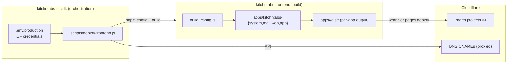
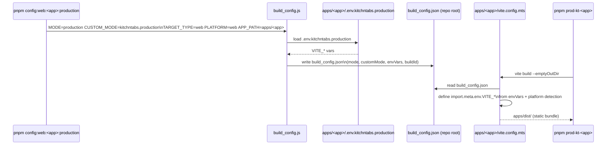
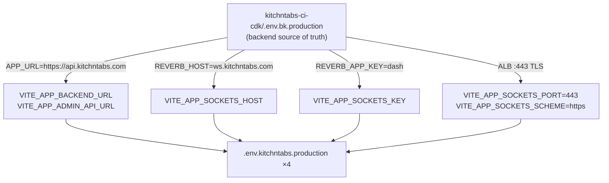
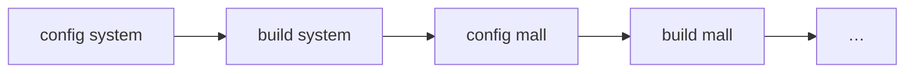
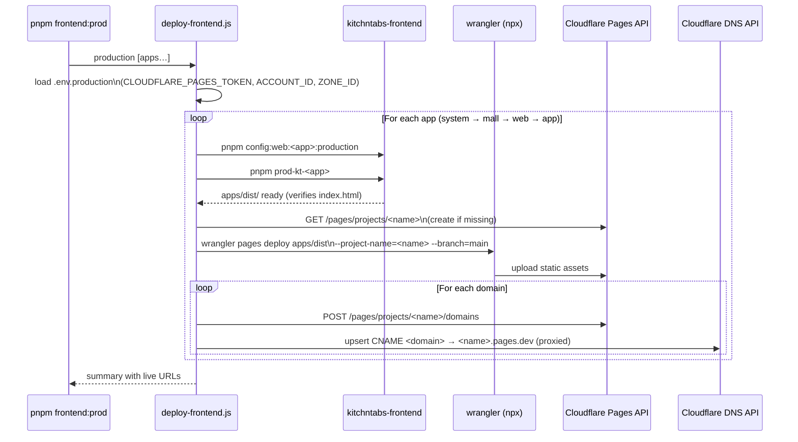
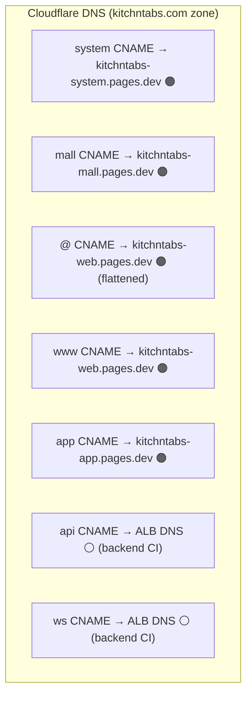

# KitchnTabs Frontend CI — Technical Architecture & Deployment Reference

> **Scope** — This document covers the frontend CI/CD pipeline for the KitchnTabs platform:
> the multi-app React monorepo (`kitchntabs-frontend`), the build-config generation system,
> per-app production environments, and the automated deployment to Cloudflare Pages with
> custom domains and DNS, orchestrated from `kitchntabs-ci-cdk`.

---

## Table of Contents

1. [Architecture Decision](#1-architecture-decision)
2. [Application Matrix](#2-application-matrix)
3. [Monorepo Layout](#3-monorepo-layout)
4. [The Build Config System](#4-the-build-config-system)
5. [Environment Files](#5-environment-files)
6. [The Shared build_config.json Constraint](#6-the-shared-build_configjson-constraint)
7. [Deployment Pipeline](#7-deployment-pipeline)
8. [Cloudflare Pages & DNS](#8-cloudflare-pages--dns)
9. [Commands Reference](#9-commands-reference)
10. [Backend Alignment](#10-backend-alignment)
11. [Caveats & Known Issues](#11-caveats--known-issues)

---

## 1. Architecture Decision

The frontend CI lives in **`kitchntabs-ci-cdk`** (not a separate project, not inside the
frontend repo) because that project already owns:

- The Cloudflare API credentials (`.env.production`)
- The Zone ID and Account ID
- The endpoint manifest (`outputs/endpoints.production.json`) that frontend envs must stay
  aligned with (API URL, WebSocket host)
- The established script pattern (`sync-cloudflare-dns.js`, `generate-endpoints.js`)

No CDK stacks are involved — Cloudflare Pages is not AWS. The deployment is a plain Node
script: [`scripts/deploy-frontend.js`](../kitchntabs-ci-cdk/scripts/deploy-frontend.js).



---

## 2. Application Matrix

| App key | Directory | Pages project | Production domain(s) | Purpose |
|---|---|---|---|---|
| `system` | `apps/kitchntabs-system` | `kitchntabs-system` | `system.kitchntabs.com` | System administration panel |
| `mall` | `apps/kitchntabs-mall` | `kitchntabs-mall` | `mall.kitchntabs.com` | Marketplace / mall app |
| `web` | `apps/kitchntabs-web` | `kitchntabs-web` | `kitchntabs.com` + `www.kitchntabs.com` | Public website |
| `app` | `apps/kitchntabs-app` | `kitchntabs-app` | `app.kitchntabs.com` | Tenant application |

The legacy `apps/kitchntabs` directory is the Electron/Capacitor shell — it is **not** part
of the web deployment pipeline (it ships as desktop/mobile builds).

---

## 3. Monorepo Layout

```
kitchntabs-frontend/
├── package.json               # Orchestration scripts (config + build per app)
├── build_config.js            # Generates build_config.json from MODE/CUSTOM_MODE/APP_PATH
├── build_config.json          # ⚠ SHARED, regenerated before every build
├── apps/
│   ├── kitchntabs-system/
│   │   ├── dist/                        # per-app Vite output
│   │   ├── .env.kitchntabs.local        # local dev env
│   │   ├── .env.kitchntabs.production   # production env (this CI)
│   │   ├── vite.config.mts              # outDir: ../dist/
│   │   └── src/
│   ├── kitchntabs-mall/
│   │   └── .env.kitchntabs.production
│   ├── kitchntabs-web/
│   │   └── .env.kitchntabs.production
│   ├── kitchntabs-app/
│   │   └── .env.kitchntabs.production
│   └── kitchntabs/            # Electron/Capacitor shell (not web-deployed)
└── packages/                  # Shared workspace packages

kitchntabs-ci-cdk/
├── scripts/deploy-frontend.js # Frontend CI orchestrator
└── .env.production            # CLOUDFLARE_PAGES_TOKEN, ACCOUNT_ID, ZONE_ID
```

---

## 4. The Build Config System

Every build is preceded by a **config generation step**. `build_config.js` reads
`MODE` / `CUSTOM_MODE` / `TARGET_TYPE` / `PLATFORM` / `APP_PATH` env vars, loads the
app-specific `.env.{CUSTOM_MODE}` file from `APP_PATH`, and writes a root-level
`build_config.json` that the app's `vite.config.mts` reads at build time.



**Critical rule:** never run `pnpm prod-kt-<app>` without first running the matching
`config:web:<app>:production` script. The build silently uses whatever
`build_config.json` was last written — including a stale dev config (the build banner
shows `MODE: development` / `CUSTOM_MODE: kitchntabs.local` when this happens).

### CUSTOM_MODE → env file resolution

| CUSTOM_MODE | File loaded (from APP_PATH) | Use |
|---|---|---|
| `kitchntabs.local` | `.env.kitchntabs.local` | Local dev against localhost backend |
| `kitchntabs.development` | `.env.kitchntabs.development` | Dev/staging backend |
| `kitchntabs.production` | `.env.kitchntabs.production` | Production (this CI) |

---

## 5. Environment Files

Each app has its own `.env.kitchntabs.production`. They share backend-facing values and
differ only in `VITE_APP_FRONTEND_URL` (and dev ports):

```ini
# Identical across all four apps — aligned with the deployed backend:
VITE_APP_BACKEND_URL=https://api.kitchntabs.com
VITE_APP_ADMIN_API_URL=https://api.kitchntabs.com/api
VITE_APP_SOCKETS_HOST=ws.kitchntabs.com
VITE_APP_SOCKETS_PORT=443        # ⚠ must be 443, not '' (empty defaults to 6001)
VITE_APP_SOCKETS_SCHEME=https
VITE_APP_SOCKETS_KEY=dash        # = backend REVERB_APP_KEY
VITE_APP_SOCKETS_BROADCASTER=pusher
VITE_APP_SOCKETS_AUTH_ENDPOINT=api/ws/auth

# Per app:
VITE_APP_FRONTEND_URL=https://system.kitchntabs.com    # system
VITE_APP_FRONTEND_URL=https://mall.kitchntabs.com      # mall
VITE_APP_FRONTEND_URL=https://kitchntabs.com           # web
VITE_APP_FRONTEND_URL=https://app.kitchntabs.com       # app
```



> **When the backend changes** (new API domain, new Reverb host/key), update all four
> `.env.kitchntabs.production` files and rebuild. VITE_* values are compiled into the
> static JS bundle at build time — they are not read at runtime.

---

## 6. The Shared build_config.json Constraint

Each app's `vite.config.mts` sets `outDir: "../dist/"`, which resolves **relative to the
vite root inside the app** — so every app writes to its own `apps/<app>/dist/` directory.
Output directories are NOT shared.

What IS shared is **`build_config.json` at the repo root**: every app's vite config reads
it at build time, and every `config:web:*` script overwrites it. Consequences:



- Config + build must run as an **atomic pair per app** — running another app's config
  script between them poisons the build with the wrong env
- Builds cannot safely run in parallel from the same checkout
- Deploys can happen any time after a build (each app's `dist/` persists), which is what
  `pnpm frontend:redeploy` (--skip-build) relies on
- `deploy-frontend.js` runs config → build → deploy sequentially per app

---

## 7. Deployment Pipeline

### 7.1 Full pipeline (per app, sequential)



### 7.2 What each step does

| Step | Tool | Idempotent | Notes |
|---|---|---|---|
| Config generation | `build_config.js` | ✔ | Writes root `build_config.json` |
| Vite build | `vite build --emptyOutDir` | ✔ | ~20–30 s per app, 16k+ modules |
| Pages project create | CF REST API | ✔ | Skipped if project exists |
| Asset upload | `npx wrangler pages deploy` | ✔ | Only changed files uploaded |
| Custom domain attach | CF REST API | ✔ | Skipped if already attached |
| DNS CNAME upsert | CF REST API | ✔ | `proxied: true`, TTL auto |

---

## 8. Cloudflare Pages & DNS

### 8.1 Domain → Project mapping



🟠 = proxied (orange cloud) — **required** for Pages custom domains; Cloudflare serves TLS.
⚪ = DNS-only (grey cloud) — backend records; the ALB's ACM cert serves TLS.

- The apex (`kitchntabs.com`) uses Cloudflare **CNAME flattening** — a CNAME at the zone
  root is valid on Cloudflare.
- TLS certificates for Pages custom domains are provisioned automatically by Cloudflare
  (takes a few minutes on first attach).
- SPA routing: Cloudflare Pages serves `index.html` for unmatched paths automatically when
  no `404.html` exists in the output — no `_redirects` file is needed for react-router.

### 8.2 Required token permissions

`CLOUDFLARE_PAGES_TOKEN` in `kitchntabs-ci-cdk/.env.production` needs:

| Scope | Permission |
|---|---|
| Account → Cloudflare Pages | **Edit** |
| Zone → DNS (kitchntabs.com) | **Edit** |

The existing `CLOUDFLARE_API_TOKEN` (DNS-only) is used as a fallback if
`CLOUDFLARE_PAGES_TOKEN` is unset, but it will fail on Pages API calls unless the Pages
permission has been added to it.

---

## 9. Commands Reference

### From `kitchntabs-ci-cdk/` (the CI entry points)

```bash
pnpm frontend:prod             # build + deploy ALL four apps
pnpm frontend:prod:system      # single app: system.kitchntabs.com
pnpm frontend:prod:mall        # single app: mall.kitchntabs.com
pnpm frontend:prod:web         # single app: kitchntabs.com + www
pnpm frontend:prod:app         # single app: app.kitchntabs.com
pnpm frontend:redeploy         # redeploy last build in apps/dist (no rebuild)
```

### From `kitchntabs-frontend/` (build-only, no deploy)

```bash
# Correct production builds (config + build):
pnpm build:web:kitchntabs-system:production
pnpm build:web:kitchntabs-mall:production
pnpm build:web:kitchntabs-web:production
pnpm build:web:kitchntabs-app:production

# Raw builds (use ONLY after the matching config script):
pnpm prod-kt-system | prod-kt-mall | prod-kt-web | prod-kt-app

# Config generation only:
pnpm config:web:kitchntabs-<app>:production
```

### First-time setup

```bash
# 1. Create the Cloudflare token (dash.cloudflare.com → My Profile → API Tokens):
#    Permissions: Account.Cloudflare Pages:Edit + Zone.DNS:Edit (kitchntabs.com)
# 2. Paste it into kitchntabs-ci-cdk/.env.production:
#    CLOUDFLARE_PAGES_TOKEN=<token>
# 3. Run the full pipeline:
cd kitchntabs-ci-cdk && pnpm frontend:prod
```

---

## 10. Backend Alignment

The frontend production envs are derived from the backend deployment. Keep them in sync:

| Backend (`.env.bk.production`) | Frontend (`.env.kitchntabs.production`) | Current value |
|---|---|---|
| `APP_URL` | `VITE_APP_BACKEND_URL` | `https://api.kitchntabs.com` |
| `APP_URL` + `/api` | `VITE_APP_ADMIN_API_URL` | `https://api.kitchntabs.com/api` |
| `REVERB_HOST` | `VITE_APP_SOCKETS_HOST` | `ws.kitchntabs.com` |
| `REVERB_APP_KEY` | `VITE_APP_SOCKETS_KEY` | `dash` |
| ALB HTTPS listener | `VITE_APP_SOCKETS_PORT` / `_SCHEME` | `443` / `https` |
| `RECAPTCHA_SITE_KEY` | `VITE_APP_RECAPTCHA_TOKEN` | `6Lfr…l1-H` |
| `FRONTEND_URL` | (must equal `web` app's `VITE_APP_FRONTEND_URL`) | `https://kitchntabs.com` |

> Also ensure the backend **CORS configuration** allows all four frontend origins:
> `https://kitchntabs.com`, `https://www.kitchntabs.com`, `https://system.kitchntabs.com`,
> `https://mall.kitchntabs.com`, `https://app.kitchntabs.com`.

---

## 11. Caveats & Known Issues

### 11.1 `VITE_APP_SOCKETS_PORT` must never be empty

`build_config.js` defaults an empty port to `6001`:
```js
const socketsPort = envVars.VITE_APP_SOCKETS_PORT || '6001';
```
An empty value produces `wss://ws.kitchntabs.com:6001` — unreachable (the ALB only
listens on 443). All production env files set `443` explicitly.

### 11.2 Stale `build_config.json`

Running `pnpm prod-kt-<app>` directly reuses the last-written config (possibly another
app's, or a dev config). Always go through `build:web:<app>:production` or the
`deploy-frontend.js` orchestrator. Check the build banner: it must print
`CUSTOM_MODE: kitchntabs.production`.

### 11.3 The OpenAI API key is in the public bundle

`VITE_APP_OPENAI_API_KEY` is compiled into the public JS — anyone can extract and abuse
it. Move OpenAI calls behind a backend endpoint and remove this var from the frontend
envs. Until then, set usage limits on the key in the OpenAI dashboard.

### 11.4 Sequential builds only

The shared root `build_config.json` makes parallel builds from one checkout unsafe. The
orchestrator builds and deploys strictly one app at a time (~2–3 min total for all four).

### 11.5 First custom-domain attach takes a few minutes

Cloudflare provisions a TLS certificate for each new Pages custom domain. The domain
may serve `522`/`525` errors for up to ~5 minutes after first attachment. Subsequent
deploys are instant (assets only).

### 11.6 `wrangler` runs via `npx`

No global install needed; `deploy-frontend.js` invokes `npx -y wrangler pages deploy`.
First run downloads wrangler (~10 s). Requires Node ≥ 20 (already required by the repo).

### 11.7 Apps named identically in package.json

`kitchntabs-system`, `kitchntabs-web` and `kitchntabs-app` all declare
`"name": "kitchntabs-app"` in their package.json. This breaks `turbo --filter` targeting
for web builds (only `kitchntabs-mall` is unique). The CI avoids turbo and uses
`cd apps/<dir> && pnpm build` instead. Consider renaming the packages.

---

*Document created 2026-06-11. Maintained alongside `kitchntabs-frontend` and
`kitchntabs-ci-cdk`. Update when apps, domains, or deployment procedures change.*
