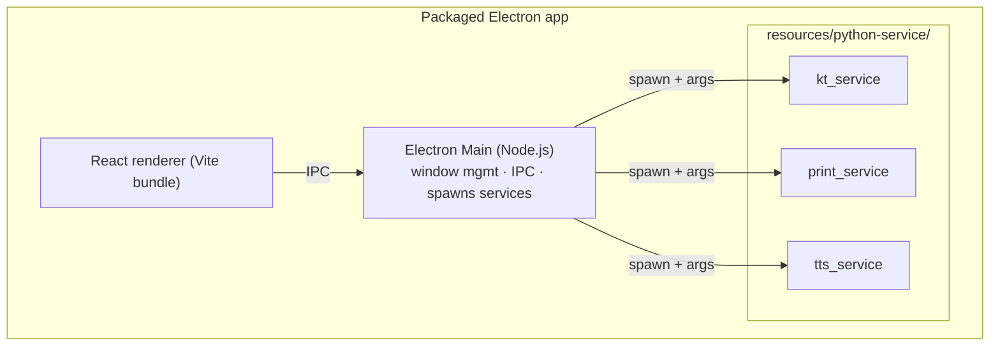
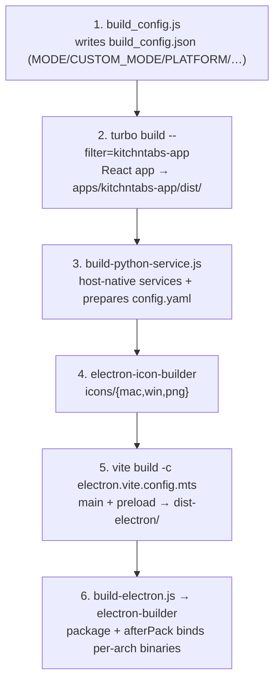

# Electron + Python Service Build & Binding System

How the desktop app is built and how the three Python sidecar services get
compiled for each target CPU and **bound into** the packaged Electron app.

> **Two repos are involved**
> - **`kitchntabs-frontend-refactored`** (the apps repo) — Electron shell, React
>   apps, build scripts (`build_config.js`, `build-python-service.js`,
>   `build-electron.js`, `electron-builder.config.js`).
> - **`dash-python-service`** — the three Python services and their
>   cross-compilation pipeline (`build-docker.js`, `docker/Dockerfile.linux-*`).
>
> Paths below are relative to whichever repo owns the file. The apps repo folder
> has historically also been called `dash-frontend`.

---


## Overview

The KitchnTabs application is a hybrid desktop application that combines:
- **Electron** - Cross-platform desktop shell
- **React (Vite)** - Frontend UI framework
- **Python Service (kt_service)** - Backend service for WebSocket communication and thermal printing

This document explains how these components are built and packaged together.

---

## 1. The three Python services

The desktop build ships **three** PyInstaller one-file executables, not one:

| Service | Role |
|---|---|
| `kt_service` | Main WebSocket client (Laravel Reverb/Pusher) → dispatches print/speech/events |
| `print_service` | Thermal (ESC/POS) printing, called directly for a print job |
| `tts_service` | Text-to-speech (gTTS + platform audio playback), headless CLI |

All three are produced from `dash-python-service/src/*.py` and end up in the
packaged app under `resources/python-service/`.



---

## 2. Two separate problems: **build** vs **bind**

The single most important thing to understand:

1. **Build** — PyInstaller **cannot cross-compile**. A binary built on macOS is
   a Mach-O file; a Raspberry Pi needs a Linux **ELF** file. So Linux ARM
   binaries are produced in Docker (`dash-python-service/build-docker.js`),
   *separately* and *ahead of* the Electron build, and cached in
   `dash-python-service/kt_service_builds/<arch>/`.
2. **Bind** — the Electron packager (`electron-builder.config.js`) copies the
   right per-arch binaries into the app. On Linux it does this in an `afterPack`
   hook that **prefers the Docker-built binary and silently falls back to the
   host-native binary** if the Docker one is missing.

> ⚠️ **The classic failure** (see §8): if you build a Debian/arm64 `.deb` on a
> Mac but never ran the Docker build for that arch, the bind step falls back to
> the **Mac Mach-O** `kt_service`/`print_service`. On the Pi the shell can't exec
> a Mach-O file and tries to interpret it as a script, producing:
> ```
> /opt/kitchntabs/resources/python-service/kt_service: 1: Syntax error: "(" unexpected
> ```

---

## 3. The Electron release pipeline

A full release script (e.g. `release:electron:kitchntabs-app:debian:arm64:production`)
chains these steps:



Representative script (arm64 production):

```jsonc
"release:electron:kitchntabs-app:debian:arm64:production":
  "cross-env VITE_PAGE_TRANSITIONS=false DISABLE_GPU=true pnpm config:electron:kitchntabs-app:production
   && turbo build --filter=kitchntabs-app --no-cache
   && node build-python-service.js
   && electron-icon-builder --input=./assets/logo-squared.png --output=./
   && vite build -c electron.vite.config.mts
   && cross-env AWS_PROFILE=kitchntabs NODE_OPTIONS=--max-old-space-size=8096
      node build-electron.js --config electron-builder.config.js --linux deb --arm64 --publish always"
```

- `VITE_PAGE_TRANSITIONS=false` / `DISABLE_GPU=true` are Raspberry-Pi
  performance flags (disable animations; disable Electron GPU accel). They are
  set on the ARM `.deb` scripts only.
- `--publish always` uploads the `.deb` to the S3 release bucket (needs
  `AWS_PROFILE`).

### `build-python-service.js` (step 3)

Runs from the apps repo. It:
- Verifies/builds the **host-native** services in `dash-python-service/kt_service/`
  (used for macOS/Windows packaging and as the afterPack fallback on Linux).
  For a Linux-ARM target on a non-ARM host it reports `Needs Linux ARM: false`
  and does **not** try to build ARM natively — those come from Docker (§4).
- Prepares the runtime config: copies `config.<CUSTOM_MODE>.yaml`
  → `apps/kitchntabs-app/config.yaml` (bundled into the app) **and**
  → `dash-python-service/config.<CUSTOM_MODE>.yaml`.

### `build-electron.js` (step 6)

Thin wrapper around `electron-builder` that works around pnpm-workspace
incompatibilities: it temporarily hides `pnpm-lock.yaml` / `pnpm-workspace.yaml`
and swaps in a minimal `package.json`, runs the packager, then restores
everything. It also loads AWS credentials when `AWS_PROFILE` is set.

---

## 4. Building the Linux binaries — `dash-python-service/build-docker.js`

Produces Linux ELF binaries for each target arch inside Docker, then extracts
them to `kt_service_builds/<arch>/`.

### Host-aware: native vs QEMU

The script compares each **target platform** to the **Docker host platform** and
only uses QEMU when they differ:

| Docker host | Target | Path |
|---|---|---|
| Mac M1 (`linux/arm64`) | `arm64` | **native** — default builder, no QEMU |
| Mac M1 (`linux/arm64`) | `armv7l` | QEMU + `docker-container` builder |
| Windows/Intel (`linux/amd64`) | `x64` | **native** |
| Windows/Intel (`linux/amd64`) | `arm64` / `armv7l` | QEMU + `docker-container` builder |

- **Native** builds use Docker Desktop's built-in `docker` driver
  (`desktop-linux`). Fast and reliable; no emulation.
- **Emulated** builds register QEMU (`multiarch/qemu-user-static`) and use a
  `docker-container` buildx builder named `kt-builder` (required for
  `--platform <foreign> --load`).

This matters because a Mac M1 building for a 64-bit Pi (arm64 → arm64) needs **no
emulation at all** — earlier versions of the script forced the fragile
`docker-container` path even for native builds.

### Commands

```bash
cd dash-python-service

# One arch (recommended when you know the Pi's OS bitness)
npm run build:docker:arm64:prod     # Pi 3B/4/5 running 64-bit OS
npm run build:docker:armv7l:prod    # Pi running 32-bit OS
npm run build:docker:x64            # Intel/AMD Linux

# Both Pi arches in one pass
npm run build:docker:debian         # armv7l + arm64, prod config

# Buster (older Raspberry Pi OS, GLIBC 2.28)
npm run build:docker:armv7l         # then set USE_BUSTER_BINARIES=true at package time
```

Config selection (`CONFIG_MAP` in `build-docker.js`):

| `--config` | File |
|---|---|
| `prod` / `production` | `config.kitchntabs.production.yaml` |
| `ngrok` | `config.kitchntabs.ngrok.yaml` |
| `dev` | `config.dev.yaml` |

### What each Dockerfile does

`docker/Dockerfile.linux-<arch>` starts from `python:3.11-slim-bookworm`
(pinned to the target platform), installs build deps + PyInstaller 6.3.0, copies
`src/` + the selected config, then runs PyInstaller **once per service** into
`/output/`. `build-docker.js` then `docker create` + `docker cp`s `/output/*`
into `kt_service_builds/<arch>/`.

> **tkinter exclusion (required).** `tts_service` and its audio deps can pull
> `tkinter` into PyInstaller's graph; the slim base has no Tcl/Tk data files, so
> PyInstaller's `_tkinter` hook crashes with
> `TypeError: expected str, bytes or os.PathLike object, not NoneType` and aborts
> the **whole** image (so `kt_service`/`print_service` never get extracted
> either). All four Dockerfiles therefore pass
> `--exclude-module tkinter --exclude-module _tkinter` to the `tts_service`
> build. None of the services use a GUI.

### Output layout

```
dash-python-service/
├── kt_service_builds/
│   ├── x64/        { kt_service, print_service, tts_service, config.yaml }
│   ├── arm64/      { kt_service, print_service, tts_service, config.yaml }
│   ├── armv7l/     { … }
│   └── armv7l-buster/ { … }
└── kt_service/     { host-native kt_service, print_service, tts_service }   # mac/win + fallback
```

### Verify the binaries are the right format

```bash
file kt_service_builds/arm64/kt_service
# Expect: ELF 64-bit LSB executable, ARM aarch64 …
#  NOT:   Mach-O 64-bit executable arm64   (that's a Mac binary — will fail on the Pi)

file kt_service_builds/armv7l/kt_service
# Expect: ELF 32-bit LSB executable, ARM, EABI5 …
```

---

## 5. Binding into the Electron app — `electron-builder.config.js`

### macOS / Windows — `extraResources`

The host-native binaries (from `dash-python-service/kt_service/`) are copied
straight in, because the packaging host is the target platform:

```js
extraResources: [
  // Windows: all *.exe services
  { from: '../dash-python-service/kt_service', to: 'python-service', filter: ['**/*.exe'] },
  // macOS: the three service binaries
  { from: '../dash-python-service/kt_service', to: 'python-service',
    filter: ['**/kt_service', '**/print_service', '**/tts_service'] },
  // config.yaml (prepared by build-python-service.js), icons, notification sounds
  { from: 'apps/kitchntabs-app/config.yaml', to: 'config.yaml' },
  { from: 'icons', to: 'icons' },
  { from: 'apps/kitchntabs-app/electron/assets', to: 'sounds', filter: ['*.mp3','*.wav','*.ogg'] },
]
```

### Linux — `afterPack` hook (the per-arch binder)

Linux is special: a single build invocation can target multiple arches, so the
binaries are selected **per package** in `afterPack`:

```js
const ARCH_MAP = {
  x64: 'x64', arm64: 'arm64',
  armv7l: useBusterBinaries ? 'armv7l-buster' : 'armv7l',
  1: 'x64', 3: 'arm64', 2: useBusterBinaries ? 'armv7l-buster' : 'armv7l', // electron-builder Arch enum
};

// for each of kt_service / print_service / tts_service:
const dockerBuildPath = `../dash-python-service/kt_service_builds/${mappedArch}/${service}`; // preferred
const nativeBuildPath = `../dash-python-service/kt_service/${service}`;                       // fallback
// copy dockerBuildPath if it exists, else nativeBuildPath (with a ⚠️ warning), chmod 755
```

Read the packager output — it tells you exactly what was bound:

```
🐍 Setting up Python services for Linux arm64 (arch=3)...
   ✅ tts_service: Using Docker-built binary for arm64      ← good
   ⚠️  kt_service: Using native build (may not work on arm64)   ← BAD: Mac binary on a Pi
   ⚠️  print_service: Using native build (may not work on arm64)
```

Any `⚠️ Using native build` line on a Linux ARM package means the Docker build
for that arch is missing — **stop and run `build-docker.js` for that arch**
(§4), then rebuild.

`USE_BUSTER_BINARIES=true` (set by the `:buster` release scripts) remaps
`armv7l` → `armv7l-buster` so the GLIBC 2.28 binaries are used.

---

## 6. Runtime — how Electron spawns the services

The Electron main process (`apps/kitchntabs-app/electron/main/index.ts`):

1. Loads `config.yaml` (dev: from `dash-python-service/`; packaged: from
   `resources/config.yaml`), parsed with `yaml`.
2. Resolves the service binaries under `resources/python-service/` (packaged) or
   `dash-python-service/` (dev).
3. Spawns a service on demand via a child process, streaming stdout/stderr back
   to the renderer over IPC. `tts_service` is spawned by the desktop TTS path;
   the Android app uses a native TTS plugin instead (see the frontend TTS docs).

`kt_service` argument shape:

```bash
kt_service <token> <channel> <config_file> <log_file>
# e.g.  kt_service "24|eJH…" "private-tenant.1.system" config.yaml log.txt
```

Config (`config.yaml`) drives host/port/scheme, auth endpoint, log path, and
printer USB vendor/product IDs.

---

## 7. Quick reference — full Debian workflow

```bash
# 1. Build the Linux binaries for the Pi's arch (once per arch, or when source changes)
cd dash-python-service
npm run build:docker:arm64:prod          # 64-bit Pi OS   (or :armv7l for 32-bit)
file kt_service_builds/arm64/kt_service   # confirm: ELF … ARM aarch64

# 2. Build + package the Electron app (binds the binaries via afterPack)
cd ../kitchntabs-frontend-refactored
pnpm release:electron:kitchntabs-app:debian:arm64:production
# watch for "✅ Using Docker-built binary" (not "⚠️ Using native build") for all 3 services
```

---

## 8. Troubleshooting

**`Syntax error: "(" unexpected` when a service starts on the Pi**
The bound binary is a **Mac Mach-O**, not Linux ELF — the afterPack fallback
kicked in because `kt_service_builds/<arch>/` was missing that service. Fix: run
`build-docker.js` for that arch (§4), confirm with `file`, rebuild the `.deb`,
and check the packager logs show `✅ Using Docker-built binary` for all three.

**`tts_service` build fails with `_tkinter` `TypeError: … not NoneType`**
A transitive import pulled `tkinter` into PyInstaller's graph on a slim base
with no Tcl/Tk. Ensure the Dockerfile's `tts_service` step has
`--exclude-module tkinter --exclude-module _tkinter` (§4). Because tts_service is
the last service built, its failure also blocks `kt_service`/`print_service`.

**`Config file not found: config.kitchntabs.prod.yaml`**
`build-docker.js`'s `CONFIG_MAP` must point `prod`/`production` at
`config.kitchntabs.production.yaml` (the real filename), not `…prod.yaml`.

**buildx: `containerd-shim-runc-v2: exec format error` / builder pinned to
`unix:///var/run/docker.sock`**
Docker Desktop's VM or the `kt-builder` `docker-container` builder is in a bad
state. First confirm the daemon itself is healthy:
`docker run --rm hello-world`. If that fails with `exec format error` on any
binary (e.g. `unpigz`), the Docker Desktop VM is corrupted → **Settings →
Troubleshoot → Clean/Purge data** (or reinstall). If only *buildx* fails,
`docker buildx rm kt-builder` and rebuild. Note: for a native build (Mac M1 →
arm64) the host-aware script skips `kt-builder` entirely, sidestepping this.

**Electron packaging hangs "Collecting node_modules" / pnpm errors**
`build-electron.js` hides the pnpm workspace files during packaging; if it was
interrupted, restore them:
`mv pnpm-lock.yaml.bak pnpm-lock.yaml && mv pnpm-workspace.yaml.bak pnpm-workspace.yaml`.

---

## 9. File map

```
kitchntabs-frontend-refactored/
├── build_config.js               # writes build_config.json (env → build)
├── build-python-service.js       # host-native services + config.yaml prep
├── build-electron.js             # electron-builder wrapper (pnpm workaround, AWS)
├── electron-builder.config.js    # extraResources (mac/win) + afterPack binder (linux)
├── electron.vite.config.mts      # builds main + preload
└── apps/kitchntabs-app/
    ├── config.yaml               # runtime config (bundled)
    └── electron/main/index.ts    # spawns the 3 services at runtime

dash-python-service/
├── build-docker.js               # host-aware cross-compile → kt_service_builds/<arch>/
├── docker/Dockerfile.linux-{x64,arm64,armv7l,armv7l-buster}
├── config.kitchntabs.production.yaml
├── config.kitchntabs.ngrok.yaml
├── src/{kt_service,print_service,tts_service}.py
├── kt_service/                   # host-native binaries (mac/win + linux fallback)
└── kt_service_builds/<arch>/     # Docker-built Linux binaries (linux afterPack source)
```
