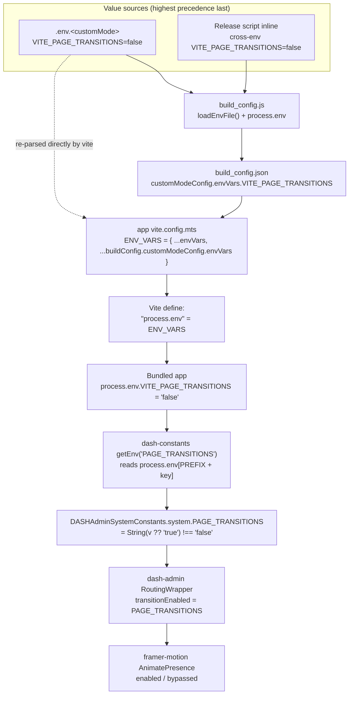
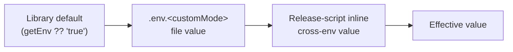
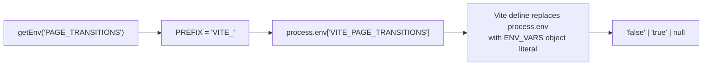
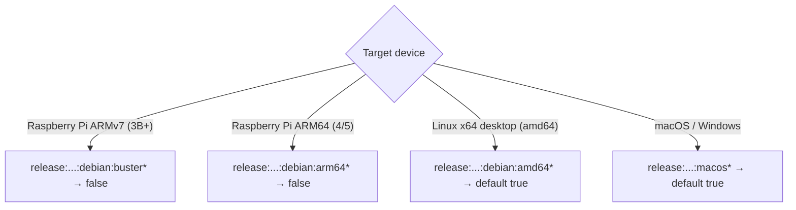
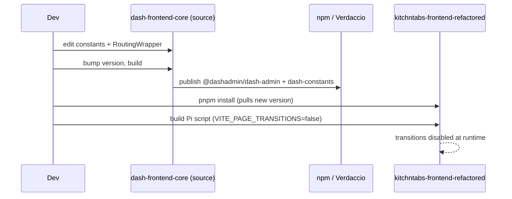
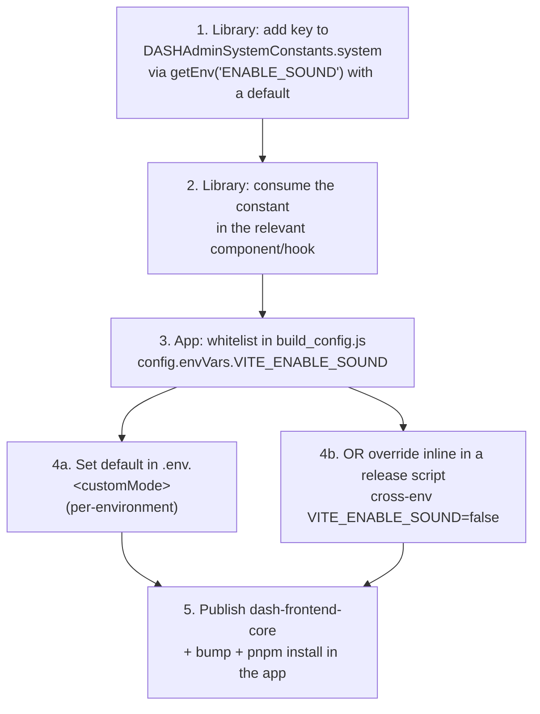
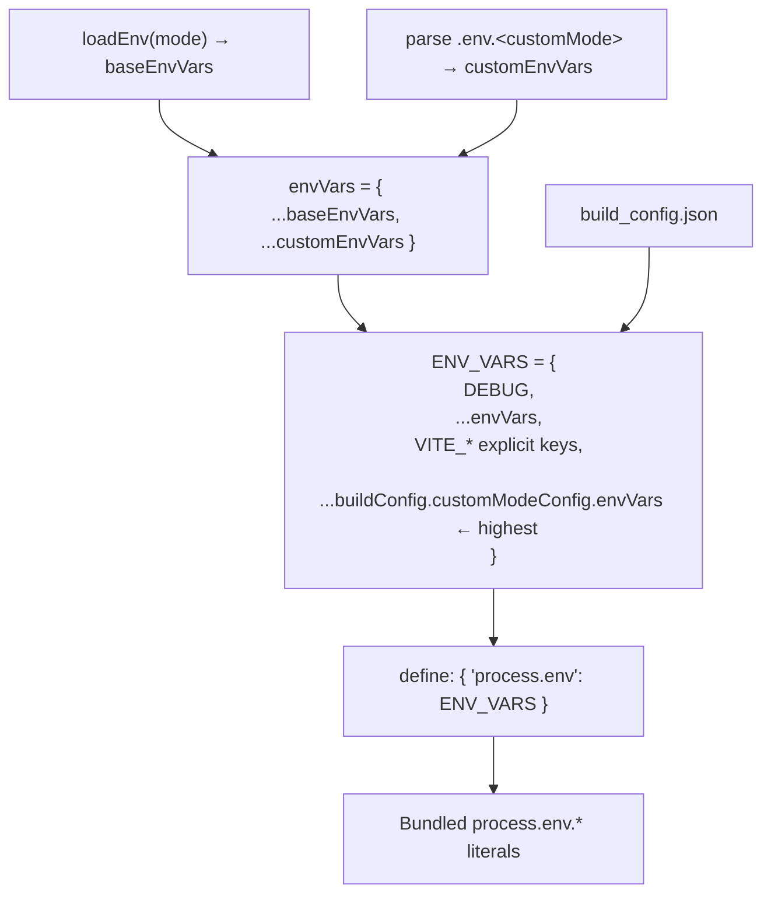

# Environment Configuration System

## Technical Documentation

> **Version:** 1.0
> **Last Updated:** July 1, 2026
> **Scope:** How build-time environment keys flow from `.env` / build scripts into the running Dash / KitchnTabs UI, and how to add new keys.

---

## 1. Overview

Dash apps are configured by **environment keys** (e.g. `VITE_APP_BACKEND_URL`,
`VITE_PAGE_TRANSITIONS`). A key can be set in three places, and the system merges
them with a well-defined precedence so a single flag can be:

- a **default** baked into the shared library (`dash-constants`),
- an **environment default** in a per-mode `.env.<customMode>` file, or
- a **per-build override** passed inline by a release script (e.g. disable page
  transitions for a Raspberry Pi build).

Two repositories participate:

| Repo | Role |
| --- | --- |
| **dash-frontend-core** | Owns the *source* library (`dash-constants`, `dash-admin`). Defines how a key is **read** (`getEnv`) and its **default**. |
| **kitchntabs-frontend-refactored** | Consumes the *published* `@dashadmin/*` packages. Owns the *build pipeline* (`build_config.js`, app `vite.config.mts`, `.env.*`, release scripts) that **injects** the key value. |

> **Golden rule:** the library decides *how a key is read and its default*; the app
> build pipeline decides *what value is injected* for a given environment.

---

## 2. End-to-end data flow



### Precedence (last wins)



Because `build_config.js` reads `process.env.VITE_X || envVars.VITE_X` and the app's
`ENV_VARS` spreads `...buildConfig.customModeConfig.envVars` **after** the raw `.env`
parse, an inline `cross-env` value overrides the `.env` file, which overrides the
library default.

---

## 3. The `getEnv` prefix contract

`dash-constants` resolves every key through `getEnv`:

```ts
export const getEnv = (key: string) => {
  const PREFIX = process.env.ENV_PREFIX
    || process.env.NEXT_PUBLIC_ENV_PREFIX
    || process.env.VITE_ENV_PREFIX
    || process.env.REACT_ENV_PREFIX
    || 'VITE_';                 // default in Vite apps
  return process.env[PREFIX + key] || null;
};
```

So `getEnv('PAGE_TRANSITIONS')` reads **`process.env.VITE_PAGE_TRANSITIONS`** in a Vite
build. The whole `process.env` object is replaced at build time by Vite's
`define: { "process.env": ENV_VARS }`, so this dynamic lookup resolves against the
injected object literal — no `process` exists at runtime in the browser.



---

## 4. Worked example — `PAGE_TRANSITIONS` (Raspberry Pi)

**Goal:** disable framer-motion route animations on low-powered devices
(Raspberry Pi 3B+/4/5) while keeping them on for desktop/macOS.

### 4.1 Library side (dash-frontend-core)

`packages/dash-constants/src/DASHAdminSystemConstants.tsx`:

```ts
// Defaults to true when unset; only the literal "false" turns it off.
PAGE_TRANSITIONS: String(getEnv('PAGE_TRANSITIONS') ?? 'true').toLowerCase() !== 'false',
```

`packages/dash-admin/src/RoutingWrapper.tsx`:

```ts
import { DASHAdminSystemConstants } from "dash-constants";
// ...
let transitionEnabled = DASHAdminSystemConstants.system.PAGE_TRANSITIONS;
return transitionEnabled
  ? <AnimatePresence>…animated routes…</AnimatePresence>
  : <Routes …>{children}</Routes>;   // no animation
```

### 4.2 Build side (kitchntabs-frontend-refactored)

`build_config.js` — capture the key so it persists into `build_config.json`:

```js
config.envVars = {
  // …existing keys…
  VITE_PAGE_TRANSITIONS: process.env.VITE_PAGE_TRANSITIONS || envVars.VITE_PAGE_TRANSITIONS,
};
```

`package.json` — the Raspberry Pi (Linux ARM `.deb`) release scripts set it on the
**config step** (which persists it into `build_config.json`):

```json
"release:electron:kitchntabs:debian:buster:dev":
  "cross-env VITE_PAGE_TRANSITIONS=false pnpm config:electron:kitchntabs:development && …"
```

> ℹ️ `cross-env` only sets the variable for its immediate command — that is intentional.
> `build_config.js` runs in that step and **writes the value into `build_config.json`**,
> which the later `vite build` step reads. The value does not need to survive the whole
> `&&` chain.

### 4.3 Which builds disable transitions?



Only the **ARM `.deb`** (Raspberry Pi) scripts carry `VITE_PAGE_TRANSITIONS=false`.
`amd64` and `macOS` keep the default (animations on).

### 4.4 Cross-repo propagation

Because KitchnTabs consumes the **published** `@dashadmin/*` packages, the library
change must be published before it reaches the app:



See **DEVELOPMENT.md** (dash-frontend-core) for the publish + version-bump workflow.

---

## 5. Recipe — adding a new environment key

Follow these steps to introduce any future flag, e.g. `VITE_ENABLE_SOUND`.



### 5.1 Boolean parsing convention

Prefer the robust, default-aware form (never throws, unlike `JSON.parse`):

```ts
// default TRUE:
FLAG: String(getEnv('FLAG') ?? 'true').toLowerCase() !== 'false',
// default FALSE:
FLAG: String(getEnv('FLAG') ?? 'false').toLowerCase() === 'true',
```

Avoid `JSON.parse(getEnv('FLAG'))` for new keys — it throws on non-JSON strings
(`yes`, `on`, …). The `String(... ).toLowerCase()` pattern tolerates booleans and
strings alike.

### 5.2 Where each key lives

| Concern | File | Repo |
| --- | --- | --- |
| Read + default | `packages/dash-constants/src/DASHAdminSystemConstants.tsx` | dash-frontend-core |
| Consume | component/hook (e.g. `RoutingWrapper.tsx`) | dash-frontend-core |
| Whitelist / capture | `build_config.js` → `config.envVars` | kitchntabs-frontend-refactored |
| Per-env default | `apps/kitchntabs-app/.env.<customMode>` | kitchntabs-frontend-refactored |
| Per-build override | release script `cross-env VITE_KEY=…` | kitchntabs-frontend-refactored |
| Injection | `apps/kitchntabs-app/vite.config.mts` → `define: { "process.env": ENV_VARS }` | kitchntabs-frontend-refactored |

---

## 6. Injection internals (app `vite.config.mts`)



Key lines (kitchntabs `apps/kitchntabs-app/vite.config.mts`):

- `ENV_VARS` assembly — spreads `...envVars` then `...(buildConfig.customModeConfig?.envVars || {})`.
- `define: { "process.env": ENV_VARS }` — replaces `process.env` in the bundle.

All three `dash-frontend-core` apps (`dash-app`, `dash-web`, `dash-system`) use the
identical `define: { "process.env": ENV_VARS }` mechanism, so the same keys work there.

---

## 7. Environment key reference

| Key (`VITE_` prefixed at build) | `getEnv` name | Default | Purpose |
| --- | --- | --- | --- |
| `VITE_PAGE_TRANSITIONS` | `PAGE_TRANSITIONS` | `true` | framer-motion route animations; `false` on Raspberry Pi |
| `VITE_APP_BACKEND_URL` | `APP_BACKEND_URL` | `http://localhost:8000` | REST API base |
| `VITE_APP_SOCKETS_ENABLED` | `APP_SOCKETS_ENABLED` | `false` | websockets on/off |
| `VITE_APP_SOCKETS_HOST` | `APP_SOCKETS_HOST` | window host | Reverb/Pusher host |
| `VITE_ENABLE_TENANT_LOGIC` | `ENABLE_TENANT_LOGIC` | `true` | multi-tenant behaviour |
| `VITE_DEFAULT_PER_PAGE` | `DEFAULT_PER_PAGE` | `null` | list pagination size |

> Extend this table whenever a new key is added (see §5).

---

## 8. Troubleshooting

### Flag has no effect at runtime

```bash
# 1. Confirm it reached build_config.json
cat build_config.json | grep VITE_PAGE_TRANSITIONS

# 2. Confirm it's in the bundle (production)
grep -o "VITE_PAGE_TRANSITIONS[^,}]*" apps/kitchntabs-app/dist/assets/*.js | head

# 3. Confirm the app uses the NEW published library
cat node_modules/@dashadmin/dash-admin/package.json | grep '"version"'
```

Most common cause in KitchnTabs: the app still has the **old published** library
version. Republish `dash-frontend-core` and `pnpm install` (see DEVELOPMENT.md).

### `JSON.parse` crash on a flag

An older key used `JSON.parse(getEnv('X'))`. If `X` is set to a non-JSON string it
throws. Migrate that key to the `String(... ).toLowerCase()` convention (§5.1).

---

## 9. Related Documentation

- [N4-Build-Toolchain_ELECTRON_BUILD_AND_CONFIG_SYSTEM.md](./N4-Build-Toolchain_ELECTRON_BUILD_AND_CONFIG_SYSTEM.md) — `CUSTOM_MODE`, YAML config, Python services
- [N4-Build-Toolchain_MULTI_ARCHITECTURE_BUILD_SYSTEM.md](./N4-Build-Toolchain_MULTI_ARCHITECTURE_BUILD_SYSTEM.md) — ARM/x64 build matrix
- `dash-frontend-core/DEVELOPMENT.md` — publish + version-bump workflow for `@dashadmin/*`

---

*Document generated for the KitchnTabs / Dash build system.*
