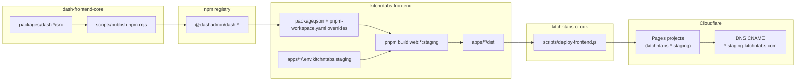

# Frontend Package Publishing & Staging Deployment

**Epic**: [N4: Build Toolchain](index.md)
**Repos**: `dash-frontend-core`, `kitchntabs-frontend`, `kitchntabs-ci-cdk`
**Status**: ✅ Implemented and verified (web/system/app staging sites live)

---

## Table of Contents

1. [Overview](#overview)
2. [Architecture](#architecture)
3. [Publishing `dash-frontend-core` to npm](#1-publishing-dash-frontend-core-to-npm)
4. [Bumping the consumer (`kitchntabs-frontend`)](#2-bumping-the-consumer-kitchntabs-frontend)
5. [The duplicate-instance trap: `react-router`](#the-duplicate-instance-trap-react-router)
6. [Staging environment config](#3-staging-environment-config)
7. [Deploying to Cloudflare Pages](#4-deploying-to-cloudflare-pages)
8. [Full redeploy sequence](#5-full-redeploy-sequence)
9. [`LINK_DASH_CORE` — development-mode linking](#link_dash_core--development-mode-linking)
10. [Known limitations](#known-limitations)
11. [Troubleshooting](#troubleshooting)

---

## Overview

Three frontend apps (`kitchntabs-web`, `kitchntabs-system`, `kitchntabs-app`) can be built and deployed
to a **staging** environment on Cloudflare Pages, independent of production:

| App | Staging URL | Production URL |
|---|---|---|
| kitchntabs-web | `web-staging.kitchntabs.com` | `kitchntabs.com` / `www.kitchntabs.com` |
| kitchntabs-system | `system-staging.kitchntabs.com` | `system.kitchntabs.com` |
| kitchntabs-app | `app-staging.kitchntabs.com` | `app.kitchntabs.com` |

Staging is a real transpiled build (same code, same build pipeline as production) with only the backend
target swapped — it points at `api-dev.kitchntabs.com` / `ws-dev.kitchntabs.com` instead of the
production API.

This is not a separate deploy mechanism invented for staging — it extends the **existing** production
Cloudflare Pages pipeline (`kitchntabs-ci-cdk/scripts/deploy-frontend.js`), which already builds and
publishes `kitchntabs-web`/`system`/`app`/`mall` to production.

## Architecture



## 1. Publishing `dash-frontend-core` to npm

`kitchntabs-frontend` consumes the shared design-system/framework packages (`dash-admin`,
`dash-components`, `dash-auth`, etc.) from npm under the `@dashadmin/` scope. If `dash-frontend-core`'s
source has changed since the last publish, it must be republished **before** building any consumer app —
otherwise the consumer's `node_modules` still has the old code, which can fail the build outright if new
source references a component that was never published (this happened during the first staging rollout —
`ApiKeyRevealDialog` existed locally but not on the registry, breaking every build, staging and
production alike).

```bash
cd dash-frontend-core
NPM_TOKEN=<npm token with publish rights to the @dashadmin org> node scripts/publish-npm.mjs --version 1.3.45
```

### Why a dedicated script, not `pnpm publish`

Every package's **committed** `package.json` intentionally uses an unscoped name (`dash-admin`, not
`@dashadmin/dash-admin`) and bare `workspace:*` cross-package dependencies (`"dash-utils": "workspace:*"`).
This is required for two reasons:

- Internal source files import the bare name (`import { x } from 'dash-utils'`), and
- `tsup` auto-externalizes (excludes from the bundle) anything it finds as a literal key in
  `dependencies`/`peerDependencies` — so the dependency key must match the import string exactly, or the
  build tries to bundle a sibling package and fails with `Could not resolve "dash-utils"`.

`scripts/publish-npm.mjs` handles the scope transformation **transiently, per package**, without ever
touching the committed source:

1. Builds all packages (`pnpm turbo build --filter='./packages/*'`).
2. For each package: rewrites an **in-memory copy** of `package.json` — `name` → `@dashadmin/<name>`,
   every internal `workspace:*` cross-dependency → `@dashadmin/<dep>`, sets the target version — writes
   that to disk, runs `npm publish`, then **always restores the original file** in a `finally` block
   (success or failure).
3. Publishes every package under `packages/*` at the same version, including the tooling packages
   (`dash-eslint`, `dash-prettier`, `dash-tsconfig`) — the whole family moves in lockstep.

> **Do not** hand-edit package `name` fields to publish manually. Renaming a package's own `name` field
> breaks pnpm's workspace resolution for every *other* package that depends on it via `workspace:*`
> (`ERR_PNPM_WORKSPACE_PKG_NOT_FOUND`), and — because `tsup`'s externalization is keyed off the
> dependency *key* string — also breaks the build for any package whose cross-dependency key no longer
> matches what its own source imports. Fixing this properly (rather than reverting) means using pnpm's
> workspace-alias syntax, `"dash-utils": "workspace:@dashadmin/dash-utils@*"`, which is exactly what the
> script's transient rewrite equivalent achieves automatically. There is no reason to do this by hand —
> use the script.

### A note on `.npmrc` / `publishConfig`

Each package's `package.json` previously carried a stale `publishConfig.registry` pointing at
`http://localhost:4873` — a local Verdaccio instance used for `pnpm publish:local` (local QA), left over
and never cleaned up. `publishConfig.registry` **overrides any CLI `--registry` flag**, so a stray one of
these silently misdirects a real publish attempt (`ECONNREFUSED` if nothing is listening on 4873, or a
publish into the wrong place if it is). `publish-npm.mjs` doesn't hit this — it sets `publishConfig` in
its own in-memory rewrite before calling `npm publish`, overriding whatever's on disk.

## 2. Bumping the consumer (`kitchntabs-frontend`)

A published version bump on the registry does **not** automatically flow into a consumer build. Two
places pin the version, and **both** must be updated:

1. **`package.json`** — each `dash-*` dependency uses npm's alias syntax:
   ```json
   "dash-admin": "npm:@dashadmin/dash-admin@^1.3.45"
   ```
2. **`pnpm-workspace.yaml`**, `overrides:` block — this **wins over** the range in `package.json`:
   ```yaml
   overrides:
     '@dashadmin/dash-admin': ^1.3.45
     dash-admin: 'npm:@dashadmin/dash-admin@^1.3.45'
     # ...one pair per dash-* package
   ```

`pnpm update <pkg> --latest` does **not** rewrite the version embedded inside an `npm:` alias string —
it silently no-ops on the alias form. The reliable way to bump is a direct string replace across both
files, then reinstall:

```bash
cd kitchntabs-frontend
# bump every occurrence of the old version to the new one in package.json and pnpm-workspace.yaml
pnpm install
pnpm list dash-admin   # confirm the resolved version actually moved
```

If `pnpm list dash-admin` still shows the old version after `pnpm install`, the workspace override in
`pnpm-workspace.yaml` was missed — check there first.

## The duplicate-instance trap: `react-router`

A `dash-frontend-core` republish (or even just a `pnpm install` churn on the lockfile) can surface a
runtime crash that has nothing to do with the version bump itself:

```
Error: useLocation() may be used only in the context of a <Router> component.
```

...even though a `<Router>` genuinely is rendered. This hit all three staging apps after the very first
1.3.45 rollout.

**Root cause:** `pnpm-workspace.yaml`'s `overrides:` pins `react-router`/`react-router-dom` to a single
*version string* (`7.17.0`), but that's not the same as a single *physical copy on disk*. pnpm's
`node-linker=hoisted` mode still keys each install by its full peer-dependency resolution — and
`react-router-dom` peer-depends on `react`/`react-dom`. Several `dash-*` packages declare `react` with a
loose, unpinned range in their own `dependencies` (not `peerDependencies`), so whenever more than one
resolved React version exists anywhere in the graph, pnpm creates a **second, physically distinct**
`react-router-dom@7.17.0` instance alongside the pinned one:

```bash
find node_modules/.pnpm -maxdepth 1 -iname "react-router-dom@*"
# react-router-dom@7.17.0_react-dom@18.3.1_react@18.3.1__react@19.2.8
# react-router-dom@7.17.0_react-dom@19.2.8_react@19.2.8__react@19.2.8
# ...
```

Different bundle chunks can resolve to different physical copies, so the React Context object one
component's `<Router>` creates isn't the same object another component's `useLocation()` recognizes.

**This is the exact same class of bug already solved for four other context-creating libraries** —
`vite.config.mts` in each app already force-pins `@tanstack/react-query`, `react-admin`, `ra-core`, and
`react-hook-form` to one absolute path via `resolve.alias`, specifically to prevent this. `react-router`
was simply missing from that list. The fix follows the identical pattern, added to all three apps'
`vite.config.mts`:

```ts
{ find: "react-router-dom", replacement: path.resolve(currentPath, "../../node_modules/react-router-dom") },
// Exact-match regex, NOT a plain string: react-router-dom's own dist imports the real subpath
// "react-router/dom" internally. A plain-string alias prefix-matches subpaths too, so it would
// append "/dom" onto this raw filesystem path and bypass react-router's own package.json
// "exports" map resolution for it — ENOENT on a literal .../react-router/dom file that doesn't exist.
{ find: /^react-router$/, replacement: path.resolve(currentPath, "../../node_modules/react-router") },
```

**Verifying the fix actually worked**, rather than assuming: the invariant error string
`"may be used only in the context of a <Router>"` is compiled directly into react-router's source, so a
grep across every built chunk in `dist/` shows exactly how many physical copies got bundled —

```bash
grep -rl "may be used only in the context of a" apps/kitchntabs-web/dist/js/
# should return exactly ONE file (the vendor-react-router chunk)
```

— one hit means one instance; more than one means the duplication is still happening somewhere.

> If a future `dash-frontend-core` publish introduces a similar crash for some *other* context-based
> library, the fix is the same shape: add a `resolve.alias` entry forcing that package to one absolute
> path, in all three apps' `vite.config.mts`, next to the existing four.

## 3. Staging environment config

Per-app, git-ignored env files (`**/.env*` is ignored repo-wide; only `.env.template` is tracked) —
these exist only on disk where someone has created them, not from a fresh clone:

- `apps/kitchntabs-web/.env.kitchntabs.staging`
- `apps/kitchntabs-system/.env.kitchntabs.staging`
- `apps/kitchntabs-app/.env.kitchntabs.staging`

Each is a copy of that app's `.env.kitchntabs.production`, with only the backend target changed (values
match the working `.env.kitchntabs.tunnel` files, which already proved these dev endpoints reachable):

```env
VITE_ENV_PREFIX='VITE_'
VITE_APP_ENV='staging'

VITE_APP_FRONTEND_URL=https://<web|system|app>-staging.kitchntabs.com
VITE_APP_BACKEND_URL=https://api-dev.kitchntabs.com
VITE_APP_ADMIN_API_URL=https://api-dev.kitchntabs.com/api

# WebSocket — same tunnel host that fronts the API
VITE_APP_SOCKETS_HOST=ws-dev.kitchntabs.com
VITE_APP_SOCKETS_PORT=443
VITE_APP_SOCKETS_SCHEME=https
VITE_APP_SOCKETS_KEY=dash
VITE_APP_SOCKETS_ENABLED=true
VITE_APP_SOCKETS_BROADCASTER=pusher
VITE_APP_SOCKETS_AUTH_ENDPOINT=api/ws/auth

# ...everything else (feature flags, sidebar widths, recaptcha, release stage)
# copied verbatim from that app's own .env.kitchntabs.production
```

`build_config.js` already treats `MODE=staging` as a first-class value (validated against
`development|staging|production`) and resolves a `CUSTOM_MODE` suffix of `staging` to its own
`customModeConfigs` bucket (`debugMode: true`, `hotReload: false`) — no changes were needed there or in
any `vite.config.mts`.

New root `package.json` scripts (mirroring the existing `:production` pattern):

```json
"config:web:kitchntabs-web:staging": "cross-env MODE=staging CUSTOM_MODE=kitchntabs.staging TARGET_TYPE=web PLATFORM=web APP_PATH=apps/kitchntabs-web node build_config.js",
"build:web:kitchntabs-web:staging": "pnpm config:web:kitchntabs-web:staging && pnpm prod-kt-web",
```
(and the equivalent pair for `kitchntabs-system` / `kitchntabs-app`, reusing the existing mode-agnostic
`prod-kt-*` build scripts unchanged).

To build locally:

```bash
cd kitchntabs-frontend
pnpm build:web:kitchntabs-web:staging
pnpm build:web:kitchntabs-system:staging
pnpm build:web:kitchntabs-app:staging
```

## 4. Deploying to Cloudflare Pages

`kitchntabs-ci-cdk/scripts/deploy-frontend.js` already does everything a deploy needs, for production:
build → ensure the Cloudflare Pages project exists (creates it if not) → `wrangler pages deploy` → attach
the custom domain → upsert a proxied DNS CNAME. Staging reuses it via three new entries in its `APPS`
registry:

```js
'web-staging': {
  appDir: 'apps/kitchntabs-web',
  configScript: 'config:web:kitchntabs-web:staging',
  buildScript: 'prod-kt-web',
  pagesProject: 'kitchntabs-web-staging',   // separate Pages project from production
  domains: ['web-staging.kitchntabs.com'],
},
// 'system-staging', 'app-staging' follow the same shape
```

And convenience scripts in `kitchntabs-ci-cdk/package.json`:

```json
"frontend:staging": "node scripts/deploy-frontend.js production web-staging system-staging app-staging",
"frontend:staging:web": "node scripts/deploy-frontend.js production web-staging",
"frontend:staging:system": "node scripts/deploy-frontend.js production system-staging",
"frontend:staging:app": "node scripts/deploy-frontend.js production app-staging",
"frontend:staging:redeploy": "node scripts/deploy-frontend.js production web-staging system-staging app-staging --skip-build"
```

The `production` argument here selects which `.env.<environment>` file supplies **Cloudflare API
credentials** (`CLOUDFLARE_PAGES_TOKEN`, `CLOUDFLARE_ACCOUNT_ID`, `CLOUDFLARE_ZONE_ID`) — it is unrelated
to which *apps* get deployed (that's the app-key list after it). Reusing `production`'s credentials for a
staging deploy is intentional, not a shortcut: it's the same Cloudflare account and the same
`kitchntabs.com` zone either way.

```bash
cd kitchntabs-ci-cdk
pnpm frontend:staging              # build + deploy all three
pnpm frontend:staging:redeploy     # reuse the dist/ already built, just re-deploy
```

CORS required **no backend change** — `dash-backend/config/cors.php` already has
`allowed_origins_patterns: ['#^https://([a-z0-9-]+\.)?kitchntabs\.com$#']`, explicitly commented as
covering staging/preview subdomains.

### Fixed along the way

`deploy-frontend.js` and `scripts/env-sync.js` both hardcoded a stale sibling-repo directory name,
`kitchntabs-frontend-refactored`, left over from a repo rename — the real directory is
`kitchntabs-frontend`. Both now point at the correct path.

## 5. Full redeploy sequence

```bash
# Only needed if dash-frontend-core source changed since the last publish:
cd dash-frontend-core
NPM_TOKEN=*** node scripts/publish-npm.mjs --version <next-version>

cd ../kitchntabs-frontend
# bump the version in package.json AND pnpm-workspace.yaml's overrides block, then:
pnpm install
pnpm list dash-admin   # sanity check the version actually moved

# Always:
pnpm build:web:kitchntabs-web:staging
pnpm build:web:kitchntabs-system:staging
pnpm build:web:kitchntabs-app:staging

# Good habit after any dash-frontend-core version bump — confirms no duplicate
# context-library instance got bundled (see "The duplicate-instance trap" above):
grep -rl "may be used only in the context of a" apps/kitchntabs-web/dist/js/      # expect exactly 1 file
grep -rl "may be used only in the context of a" apps/kitchntabs-system/dist/js/   # expect exactly 1 file
grep -rl "may be used only in the context of a" apps/kitchntabs-app/dist/js/      # expect exactly 1 file

cd ../kitchntabs-ci-cdk
pnpm frontend:staging:redeploy   # --skip-build, deploys the dist/ just built
```

---

## `LINK_DASH_CORE` — development-mode linking

A separate, **dev-only** mechanism from everything above — not what makes staging builds work, and not
usable for any real build. Documented here because it's easy to conflate the two.

**What it does:** an opt-in flag, `LINK_DASH_CORE=true`, that makes the Vite **dev server** resolve
`dash-*` imports straight to `../dash-frontend-core/packages/<pkg>/src` (live TypeScript source) instead
of the installed `node_modules/@dashadmin/*` package. It exists so a `dash-frontend-core` source edit is
visible instantly in a running `kitchntabs-web` (etc.) dev server, without a publish → version bump →
reinstall cycle in between.

**Where it's implemented:** `kitchntabs-frontend/vite-plugins/dashCoreSrcAliases.mts`, wired into every
app's `vite.config.mts` via `resolve.alias` (must be spread first, so it wins over static alias entries
like `@dash-styles-src`).

**How to use it** — any of the `:linked` dev scripts:

```bash
pnpm dev:web:kitchntabs-web:development:linked
pnpm dev:web:kitchntabs-web:tunnel:linked
```

which just set `LINK_DASH_CORE=true` ahead of the normal dev script (`cross-env LINK_DASH_CORE=true pnpm dev:web:kitchntabs-web:development`).

**Why it's dev-only, by design, not by oversight:**

```ts
// dashCoreSrcAliases.mts
export function getDashCoreSrcAliases(appDir: string, isDevelopment: boolean): DashCoreSrcAliasResult {
  if (!isDevelopment || process.env.LINK_DASH_CORE !== "true") {
    return { aliases: [], exclude: [], enabled: false };
  }
  // ...
}
```

`isDevelopment` is computed from the Vite `mode`, so a `staging` or `production` build always evaluates
this to `false` regardless of the env var — the aliasing simply cannot activate outside a dev server.
This is a deliberate safety rail: a real build must only ship what has actually been published and
reviewed, never whatever happens to be sitting uncommitted in a developer's local `dash-frontend-core`
checkout.

**Packages covered** (`DASH_CORE_SRC_PACKAGES`): `dash-admin`, `dash-admin-state`, `dash-app-common`,
`dash-auto-admin`, `dash-axios-hook`, `dash-utils`, `dash-constants`, `dash-dialog`, `dash-components`,
`dash-auth`, `dash-boilerplate`, `dash-info`, `dash-interfaces`, `dash-styles`. Tooling packages
(`dash-modal`, `dash-icons`, `dash-eslint`, `dash-prettier`, `dash-tsconfig`) are deliberately excluded —
always resolved from `node_modules` whether linking is active or not.

**Requires** `dash-frontend-core` checked out as a sibling directory of `kitchntabs-frontend` (i.e. both
under the same parent, e.g. `.../KITCHNTABS/dash-frontend-core` and `.../KITCHNTABS/kitchntabs-frontend`).
If the sibling isn't found, it logs a warning and falls back to normal `node_modules` resolution rather
than failing the dev server.

---

## Known limitations

1. **`api-dev.kitchntabs.com` / `ws-dev.kitchntabs.com` are not an always-on service.** They're a
   Cloudflare Tunnel to a developer's local Docker backend (`dash-backend-docker`, port 25000) — see
   `dash-backend-docker/scripts/cloudflare-tunnel.js` and `kitchntabs-ci-cdk/WORKSPACE_SETUP.md`. The
   staging *sites* are permanently hosted on Cloudflare Pages, but every API call will fail whenever
   nobody's local backend + tunnel (`pnpm dash:start kitchntabs.tunnel --tunnel`) is running. This is
   inherent to targeting `api-dev` specifically, not something the deploy pipeline can fix.
2. **All `@dashadmin/*` packages publish in lockstep**, one shared version across the whole family
   (including tooling packages). There's no mechanism for publishing a single package independently.
3. **Cloudflare credentials live in a git-ignored `.env.production`** at the `kitchntabs-ci-cdk` root —
   not present on a fresh clone/machine; must be created from `CLOUDFLARE_PAGES_TOKEN` /
   `CLOUDFLARE_ACCOUNT_ID` / `CLOUDFLARE_ZONE_ID` before `pnpm frontend:staging` can run there.

## Troubleshooting

| Symptom | Cause | Fix |
|---|---|---|
| `Could not resolve "dash-utils"` (or any `dash-*`) during a `dash-frontend-core` package build | A package's `name` was hand-renamed to `@dashadmin/...`, breaking `tsup`'s dependency-key-based externalization | Revert to the bare name; use `scripts/publish-npm.mjs` for real publishes, never a manual rename |
| `ERR_PNPM_WORKSPACE_PKG_NOT_FOUND` on `pnpm install` in `dash-frontend-core` | Same as above — some other package's `workspace:*` dependency key no longer matches a real package name | Revert every renamed `package.json`, `pnpm install` again |
| `pnpm publish` tries to hit `http://localhost:4873` | Stale `publishConfig.registry` in that package's `package.json` (old Verdaccio local-QA leftover) | Remove the `registry` key from `publishConfig`, or just use `scripts/publish-npm.mjs`, which overrides it anyway |
| `409 Conflict — Failed to save packument` on `npm publish` | Publishing under the wrong (unscoped) package name, or a genuine transient registry hiccup on package creation | Confirm the name being published is `@dashadmin/<name>`; retry once for transient errors |
| Consumer build still resolves the old `dash-*` version after a publish + `pnpm install` | `pnpm-workspace.yaml`'s `overrides:` block still pins the old version — it wins over `package.json` | Bump the version there too (both the `@dashadmin/dash-x` key and the `dash-x: 'npm:@dashadmin/dash-x@...'` alias key), then `pnpm install` |
| Staging site loads but every API call fails | The local `api-dev`/`ws-dev` tunnel isn't running | Start it: `pnpm dash:start kitchntabs.tunnel --tunnel` from `dash-backend-docker` |
| `Frontend repo not found at .../kitchntabs-frontend-refactored` | Pre-existing stale path in `deploy-frontend.js`/`env-sync.js` | Already fixed — both now reference `kitchntabs-frontend` |
| `useLocation() may be used only in the context of a <Router> component` at runtime, page otherwise loads | Two physical `react-router-dom` instances in the dependency graph (see [The duplicate-instance trap](#the-duplicate-instance-trap-react-router)) | Already fixed — `vite.config.mts` in all three apps force-pins `react-router`/`react-router-dom` to one path, same as `react-admin`/`ra-core`/`react-hook-form`. If it recurs after a future publish, re-verify with the `grep -rl "may be used only in the context of a"` check in that section |
| `[vite:load-fallback] Could not load .../node_modules/react-router/dom: ENOENT` | The `react-router` alias was a plain string (prefix-matches subpaths) instead of an exact-match regex, so `react-router-dom`'s internal `"react-router/dom"` import got `/dom` appended onto a raw filesystem path | Use `{ find: /^react-router$/, ... }`, not `{ find: "react-router", ... }` — see the code block in the duplicate-instance section |

---

*Related: [N3: Infrastructure & CI/CD](/docs/N3-Infrastructure-and-CI/CD/) for the Cloudflare/DNS layer generally.*
