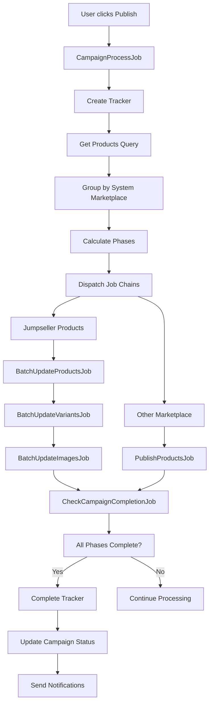
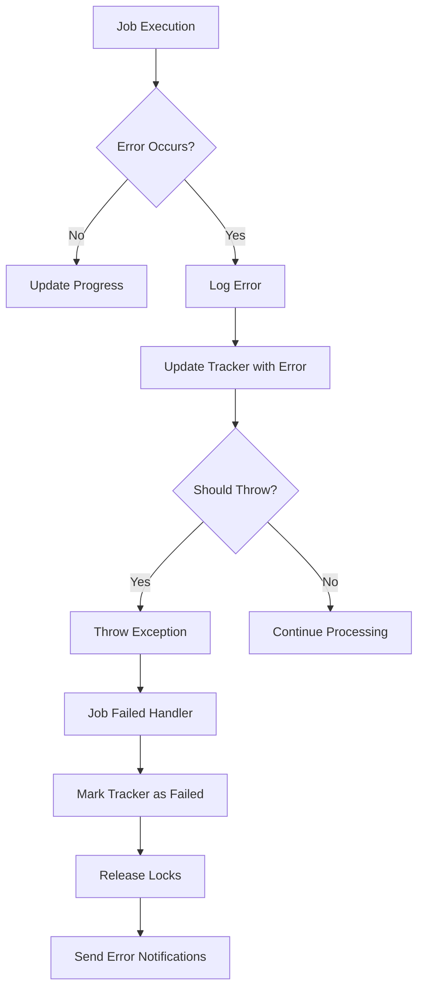

# Campaign Publishing System - Technical Documentation

## Overview
The Campaign Publishing System is a multi-phase job processing framework designed to handle the publication, pausing, and finishing of e-commerce products across various marketplaces. The system uses Laravel's job queue system with progress tracking, error handling, and marketplace-specific implementations.

## Architecture

### Core Components
- Campaign Process Job - Main orchestrator
- Marketplace-Specific Jobs - Handle individual marketplace operations
- Tracker Service - Progress monitoring and status management
- Notification Service - User notifications and status updates

### System Flow
```
User Action (Publish/Pause/Finish)
    ↓
CampaignProcessJob (Main Orchestrator)
    ↓
Product Grouping by System Marketplace
    ↓
Phase-Based Job Dispatch
    ↓
Marketplace-Specific Processing
    ↓
Progress Tracking & Completion Check
```

## Main Components

### 1. CampaignProcessJob
**Location:** `DASH-PW-PROJECT/dash-backend/domain/app/Jobs/ECommerce/Campaigns/CampaignProcessJob.php`

**Purpose:** Main orchestrator that coordinates the entire campaign processing workflow.

#### Key Features:
- Unified entry point for all campaign actions (publish, pause, finish, republish)
- Lock management to prevent concurrent operations
- Progress tracking initialization
- Marketplace-specific job dispatching
- Error handling and recovery

#### Constructor Parameters:
```php
public function __construct(
    $user,                              // User initiating the action
    Campaign $campaign,                 // Campaign to process
    string $action,                     // Action: 'publish', 'pause', 'finish', 'republish'
    $forceAction = false,              // Override locks
    $campaignMarketplaceProductScopes = [], // Product filtering scopes
    $chunkSize = 5                     // Batch size for processing
)
```

#### Process Flow:
1. Lock Acquisition: Prevents concurrent operations on the same campaign
2. Tracker Creation: Creates progress tracking record
3. Product Querying: Gets products based on action type
4. Marketplace Grouping: Groups products by system marketplace
5. Job Dispatching: Creates marketplace-specific job chains
6. Completion Monitoring: Tracks progress and finalizes when complete

### 2. Marketplace-Specific Jobs

#### Base Job Structure
All marketplace jobs inherit common functionality through the ActionJobCommonTrait:

**Location:** `DASH-PW-PROJECT/dash-backend/domain/app/Jobs/ECommerce/CampaignMarketplaceProducts/ActionJobCommonTrait.php`

#### Common Properties:
```php
protected $user;                    // User initiating action
protected $campaignMarketplaceProducts; // Products to process
protected $shouldNotify;           // Send notifications flag
protected $shouldThrowErrors;      // Error handling mode
protected $isRecursiveDispatch;    // Rate limiting flag
protected $trackerId;              // Progress tracker ID
protected $marketplace;            // Marketplace identifier
protected $phase;                  // Current processing phase
protected $trackerService;         // Progress tracking service
```

#### Jumpseller Implementation

##### Batch Jobs:
- BatchUpdateProductsJob - Product data phase
- BatchUpdateVariantsJob - Variants phase
- BatchUpdateImagesJob - Images phase
- BatchPauseProductsJob - Pause products
- BatchFinishProductsJob - Delete products

##### Phase Configuration:
```php
// In JumpsellerService
public static function getProcessPhases($action = 'publish'): array
{
    return match($action) {
        'publish', 'republish' => [
            'product_data' => BatchUpdateProductsJob::class,
            'variants' => BatchUpdateVariantsJob::class,
            'images' => BatchUpdateImagesJob::class
        ],
        'pause' => [
            'processing' => BatchPauseProductsJob::class
        ],
        'finish' => [
            'processing' => BatchFinishProductsJob::class
        ],
        default => [
            'processing' => PublishProductsJob::class
        ]
    };
}
```

### 3. Progress Tracking System
**Location:** `DASH-PW-PROJECT/dash-backend/domain/app/Services/Campaign/CampaignTrackerService.php`

#### Tracker Creation Points:

Trackers are created at two levels:

1. **Campaign-level operations** (via `CampaignProcessJob`):
   - Full campaign publish/pause/finish operations
   - Created in the orchestrator job

2. **Individual product operations** (via `CampaignProductController`):
   - Individual product delete/publish/pause/finish
   - Created in the controller before dispatching jobs
   - Returns `tracker_id` in API response for frontend polling

#### Key Methods:
```php
// Create new tracker
public function createTracker(Campaign $campaign, string $action, $user): CampaignTracker

// Initialize phases
public function initializeTrackerPhases(int $trackerId, array $phases, array $metadata = []): void

// Update progress
public function updatePhaseProgress(int $trackerId, string $phase, int $processed, int $successful, int $failed): void

// Complete tracker
public function completeTracker(int $trackerId): void

// Handle failures
public function failTracker(int $trackerId, string $errorMessage): void
```

#### Progress Data Structure:
```json
{
    "id": 123,
    "status": "active|completed|failed",
    "progress": 75.5,
    "phases_status": {
        "product_data": {"processed": 10, "successful": 8, "failed": 2},
        "variants": {"processed": 5, "successful": 5, "failed": 0},
        "images": {"processed": 0, "successful": 0, "failed": 0}
    },
    "metadata": {
        "campaign_name": "Summer Sale",
        "total_products": 15,
        "started_at": "2024-01-15T10:30:00Z"
    }
}
```

#### Per-Product Progress Updates

Marketplace service traits (DeleteServiceMethods, PublishServiceMethods, PauseServiceMethods, FinishServiceMethods) now update tracker progress after each product is processed:

```php
// In marketplace service trait methods
foreach ($campaignMarketplaceProducts as $product) {
    try {
        $this->processProduct($product);
        $successCount++;
    } catch (Exception $e) {
        $failedCount++;
    }
    
    $processedCount++;
    
    // Update tracker progress after each product
    if ($trackerService && $trackerId) {
        $trackerService->updateProgress(
            $trackerId,
            'processing',
            $processedCount,
            $successCount,
            $failedCount
        );
    }
}

// Mark tracker as completed when done
if ($trackerService && $trackerId) {
    $trackerService->completeTracker($trackerId, $failedCount > 0);
}
```

## Detailed Process Flows

### Publishing Flow


### Error Handling Flow


## API Endpoints

### Campaign Controller
**Location:** `DASH-PW-PROJECT/dash-backend/domain/app/Http/Controllers/API/ECommerce/CampaignController.php`

#### Key Endpoints:
```
// Publish campaign
POST /api/campaigns/{campaign}/publish
Response: { "message": "Campaign publishing started", "tracker_id": 123 }

// Pause campaign  
POST /api/campaigns/{campaign}/pause
Response: { "message": "Campaign pausing started", "tracker_id": 124 }

// Finish campaign
POST /api/campaigns/{campaign}/finish  
Response: { "message": "Campaign finishing started", "tracker_id": 125 }
```

### Campaign Product Controller
**Location:** `DASH-PW-PROJECT/dash-backend/domain/app/Http/Controllers/API/ECommerce/CampaignProductController.php`

#### Individual Product Operation Endpoints:
```
// Delete products (creates tracker, dispatches job)
DELETE /api/ecommerce/campaign/{id}/product?action=delete
Response: { "message": "Se notificará al finalizar la eliminación.", "tracker_id": 123, "total_products": 41 }

// Finish products (creates tracker, dispatches job)
DELETE /api/ecommerce/campaign/{id}/product?action=finish
Response: { "message": "Se notificará al finalizar la eliminación.", "tracker_id": 124, "total_products": 41 }

// Publish individual products (creates tracker, dispatches job)
POST /api/ecommerce/campaign/{id}/product/publish
Response: { "message": "Se notificará al finalizar.", "tracker_id": 125, "total_products": 10 }

// Pause individual products (creates tracker, dispatches job)
POST /api/ecommerce/campaign/{id}/product/pause
Response: { "message": "Se notificará al finalizar.", "tracker_id": 126, "total_products": 10 }

// Get progress
GET /api/campaigns/{campaign}/progress?action=publish
Response: { "success": true, "data": { "progress": 75.5, "status": "active" } }

// Force reset campaign
POST /api/campaigns/{campaign}/force-reset
Response: { "message": "Campaign reset successfully", "cleared_trackers": 2 }
```

## Configuration

### Queue Configuration

#### Queues Used:
- campaigns - General campaign operations
- campaign-publishing-phase - Phase-specific operations

#### Job Timeouts:
- CampaignProcessJob: 7200 seconds (2 hours)
- BatchUpdateProductsJob: 3600 seconds (1 hour)
- PublishProductsJob: 900 seconds (15 minutes) - allows ~300-450 products
- DeleteProductsJob: 600 seconds (10 minutes) - allows ~300 products
- PauseProductsJob: 600 seconds (10 minutes) - allows ~200-300 products
- FinishProductsJob: 600 seconds (10 minutes) - allows ~200-300 products
- ManageFinishedProductsJob: 600 seconds (10 minutes)
- ManagePausedProductsJob: 600 seconds (10 minutes)
- ManagePreparedProductsJob: 600 seconds (10 minutes)
- ManagePublishedProductsJob: 600 seconds (10 minutes)
- UpdateProductsWithPresaleJob: 600 seconds (10 minutes)

**Note:** Jumpseller requires individual API calls per product (~2-3 seconds each), so timeouts are calculated based on expected product counts.

### Rate Limiting

#### Jumpseller Rate Limits:
- 500ms delay between API calls
- Automatic retry with exponential backoff
- Rate limit detection and delayed job dispatch

```php
// Rate limiting implementation
if ($delay->isFuture() && !$this->isRecursiveDispatch) {
    PublishProductsJob::dispatch(/* ... */)->delay($delay);
    continue;
}
```

## Database Schema

### Campaign Tracker Table
```sql
CREATE TABLE campaign_trackers (
    id BIGINT PRIMARY KEY,
    campaign_id BIGINT NOT NULL,
    marketplace_id BIGINT NULL,
    action VARCHAR(50) NOT NULL,
    status ENUM('active', 'completed', 'failed') DEFAULT 'active',
    progress DECIMAL(5,2) DEFAULT 0.00,
    phases_status JSON NULL,
    metadata JSON NULL,
    error_message TEXT NULL,
    started_at TIMESTAMP NULL,
    completed_at TIMESTAMP NULL,
    created_at TIMESTAMP DEFAULT CURRENT_TIMESTAMP,
    updated_at TIMESTAMP DEFAULT CURRENT_TIMESTAMP ON UPDATE CURRENT_TIMESTAMP
);
```

### Campaign Marketplace Product Table
```sql
CREATE TABLE campaign_marketplace_products (
    id BIGINT PRIMARY KEY,
    campaign_marketplace_id BIGINT NOT NULL,
    product_id BIGINT NOT NULL,
    status ENUM('pending', 'published', 'paused', 'errored', 'finished') DEFAULT 'pending',
    marketplace_info JSON NULL,
    error_message TEXT NULL,
    published_at TIMESTAMP NULL,
    created_at TIMESTAMP DEFAULT CURRENT_TIMESTAMP,
    updated_at TIMESTAMP DEFAULT CURRENT_TIMESTAMP ON UPDATE CURRENT_TIMESTAMP
);
```

## Monitoring and Debugging

### Logging

#### Log Channels:
- Campaign operations: `Log::info('Campaign operation', $context)`
- API calls: `$this->getLogger()->info('API call', $context)`
- Errors: `Log::error('Error message', $context)`

#### Key Log Points:
- Job start/completion
- API request/response
- Progress updates
- Error conditions
- Rate limiting events

### Debug Mode
Enable debug mode in CampaignProcessJob:

```php
$debug = true; // Set to true for debugging

if ($debug) {
    // Clear locks before processing
    $lockKey = "{$this->action}_campaign_lock_{$this->campaign->id}";
    Cache::forget($lockKey);
}
```

### Progress Monitoring

#### Frontend Integration:
```javascript
// Poll for progress updates
const pollProgress = async (trackerId) => {
    const response = await fetch(`/api/tracker/${trackerId}/progress`);
    const data = await response.json();
    
    if (data.success) {
        updateProgressBar(data.data.progress);
        
        if (data.data.status === 'completed') {
            showSuccess('Campaign completed successfully');
        } else if (data.data.status === 'failed') {
            showError('Campaign failed: ' + data.data.error_message);
        } else {
            setTimeout(() => pollProgress(trackerId), 2000);
        }
    }
};
```

## Error Handling Strategies

### 1. Graceful Degradation
```php
try {
    $this->processProduct($product);
} catch (Exception $e) {
    if ($this->shouldThrowErrors) {
        throw $e; // Fail fast mode
    } else {
        Log::error('Product processing failed', ['error' => $e->getMessage()]);
        // Continue with next product
    }
}
```

### 2. Retry Logic
```php
// Automatic retry for rate limiting
if ($delay->isFuture() && !$this->isRecursiveDispatch) {
    self::dispatch(/* same parameters */)->delay($delay);
    return;
}
```

### 3. Lock Management
```php
// Prevent concurrent operations
$lockKey = "{$action}_campaign_lock_{$campaign->id}";
$lock = Cache::lock($lockKey, 7200);

if (!$lock->get()) {
    if ($forceAction) {
        Cache::forget($lockKey);
        $lock = Cache::lock($lockKey, 7200);
    } else {
        throw new Exception('Another operation is in progress');
    }
}
```

## Performance Considerations

### 1. Chunking Strategy
```php
// Process products in chunks
if ($chunkSize > 0) {
    $chunks = $products->chunk($this->chunkSize);
    foreach ($chunks as $chunk) {
        // Process chunk
    }
} else {
    // Process all at once
}
```

### 2. Memory Management
```php
// Clear model cache periodically
if ($processed % 100 === 0) {
    $campaignMarketplaceProduct->refresh();
}
```

### 3. Database Optimization
```php
// Eager load relationships
$products = $productsQuery->with([
    'campaignMarketplace.marketplace.tenantSystemMarketplace.systemMarketplace'
])->get();
```

## Security Considerations

### 1. Authorization
```php
// Check permissions before processing
$this->authorize('publish', $campaign);
```

### 2. Input Validation
```php
// Validate campaign state
if (!in_array($campaign->status, [Campaign::STATUS_PENDING, Campaign::STATUS_PAUSED])) {
    throw new Exception('Campaign cannot be published in current state');
}
```

### 3. Rate Limiting
```php
// Respect marketplace rate limits
usleep(500000); // 0.5 seconds between requests
```

## Troubleshooting Guide

### Common Issues
1. Products not updating prices
   - Check parseProduct method in marketplace service
   - Verify price formatting and currency handling
   - Review API payload logs

2. Jobs getting stuck
   - Check queue worker status
   - Review lock management
   - Verify database connections

3. Rate limiting errors
   - Increase delays between API calls
   - Implement exponential backoff
   - Check marketplace API limits

4. Memory issues
   - Reduce chunk sizes
   - Add memory cleanup
   - Monitor memory usage

### Debug Commands
```bash
# Check queue status
php artisan queue:work --queue=campaigns

# Clear failed jobs
php artisan queue:flush

# Monitor job progress
php artisan horizon:status

# Clear campaign locks
php artisan cache:clear
```

## Future Enhancements

### 1. Marketplace Abstraction
Create a unified marketplace interface:

```php
interface MarketplaceInterface
{
    public function publishProducts(array $products): array;
    public function pauseProducts(array $products): array;
    public function finishProducts(array $products): array;
    public function getProcessPhases(string $action): array;
}
```

### 2. Advanced Progress Tracking
- Real-time progress updates via WebSockets
- Detailed phase breakdowns
- Performance metrics

### 3. Batch Operations
- Bulk product operations
- Parallel processing
- Advanced error recovery

### 4. Monitoring Dashboard
- Campaign operation overview
- Performance metrics
- Error analytics
- Resource utilization

This documentation provides a comprehensive overview of the Campaign Publishing System, covering architecture, implementation details, and operational procedures for maintaining and extending the system.