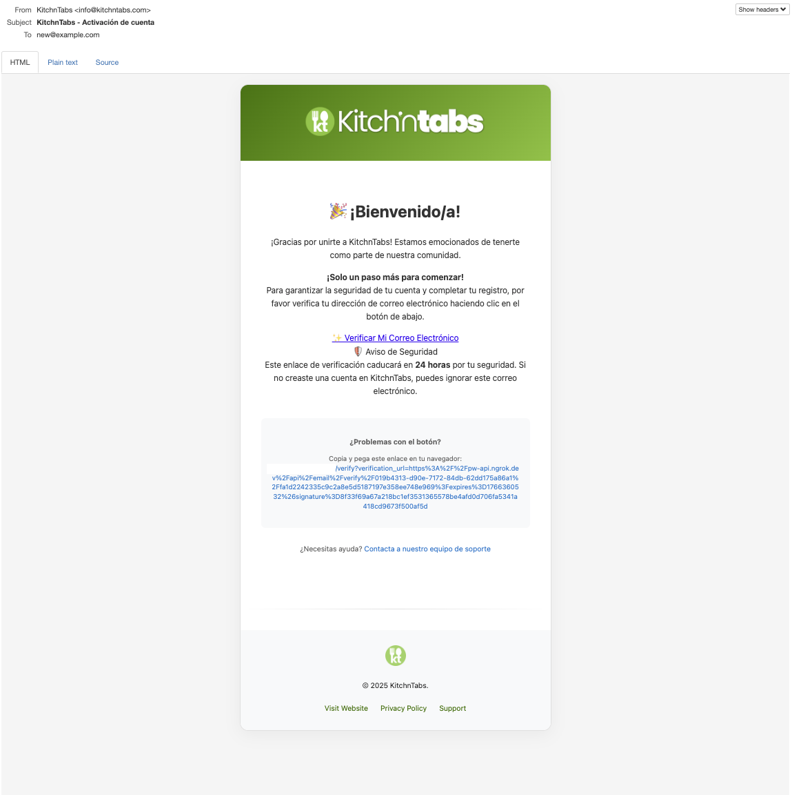
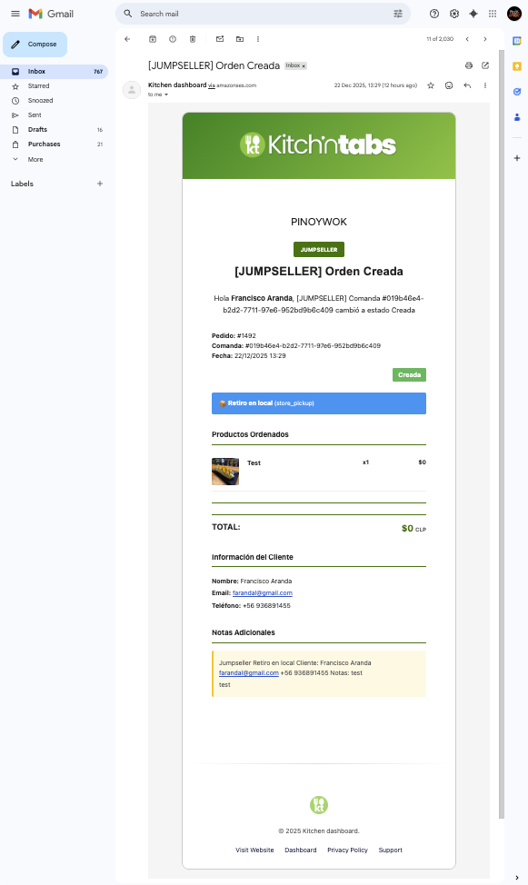

# KitchnTabs Email Sending Practices for AWS SES Review.



**Document Version:** 1.0  - December 22, 2025  
**Contact:** Francisco Aranda <farandal@gmail.com> - <info@kitchntabs.com>
**Website:** https://kitchntabs.com

---

## Table of Contents

1. [Summary](#1-summary)
2. [Company & Platform Overview](#2-company--platform-overview)
3. [Email Sending Practices](#3-email-sending-practices)
4. [Recipient List Management](#4-recipient-list-management)
5. [Email Categories & Examples](#5-email-categories--examples)
6. [Email Flow Diagrams](#6-email-flow-diagrams)
7. [Bounce & Complaint Handling](#7-bounce--complaint-handling)
8. [Unsubscribe Management](#8-unsubscribe-management)
9. [Technical Infrastructure](#9-technical-infrastructure)
10. [Quality Assurance](#10-quality-assurance)
11. [Email Templates](#11-email-templates)

---

## 1. Summary

**KitchnTabs** is a B2B SaaS platform that provides restaurant and food court management solutions to businesses in Latin America, primarily Chile. 

Our platform sends transactional and operational emails that are essential to business operations.

Critical transaction notifications are sent to inform end customers about delivery progress when KitchnTabs tenants (food courts, restaurant) opt for the manual delivery feature using the KitchnTabs delivery module. In these cases, we send emails to customers who purchased through third-party marketplace payment gateways, such as Jumpseller.

These users opt-in to receive update notifications during the payment flow, and KitchnTabs uses this consent to inform them about order progress and delivery status.

In such scenarios, we include an option for these third-party users to unsubscribe from receiving future emails from us.


- **Nature of Emails:** 100% transactional emails (no marketing/promotional content)
- **Primary Recipients:** 
  - Business users (restaurant staff, administrators)
  - End customers (who have explicitly consented via marketplace checkout)
- **Volume:** Low to moderate (estimated 50-500 emails/day depending on order volume)
- **Languages:** Spanish (primary), English (secondary)
- **Consent:** All recipients have explicitly opted-in or consented via transactional relationships


## 2. Company & Platform Overview

### 2.1 About KitchnTabs

KitchnTabs is a comprehensive restaurant management platform consisting of:

- **Kitchntabs API:** Laravel-based API providing multi-tenant architecture, role-based permissions, real-time WebSocket messaging, orders and delivery management.
- **Kitchntabs Dashboard:** React-based admin dashboard for business users
- **Mall/Food Court System:** QR-based ordering system for food courts
- **Marketplace Integrations:** Jumpseller, Uber Eats, and other e-commerce platforms.

### 2.2 Business Model

```
┌─────────────────────────────────────────────────────────────────────────┐
│                         KITCHNTABS ECOSYSTEM                            │
├─────────────────────────────────────────────────────────────────────────┤
│                                                                         │
│  ┌─────────────────┐      ┌─────────────────┐      ┌─────────────────┐  │
│  │  RESTAURANT A   │      │  RESTAURANT B   │      │  RESTAURANT C   │  │
│  │   (Tenant)      │      │   (Tenant)      │      │   (Tenant)      │  │
│  └────────┬────────┘      └────────┬────────┘      └────────┬────────┘  │
│           │                        │                        │           │
│           └────────────────────────┼────────────────────────┘           │
│                                    │                                    │
│                                    ▼                                    │
│                        ┌───────────────────────┐                        │
│                        │   KITCHNTABS PLATFORM  │                       │
│                        │   (Multi-Tenant SaaS)  │                       │
│                        └───────────────────────┘                        │
│                                    │                                    │
│              ┌─────────────────────┼─────────────────────┐              │
│              ▼                     ▼                     ▼              │
│     ┌─────────────┐       ┌─────────────┐       ┌─────────────┐         │
│     │ Dashboard   │       │ Marketplace │       │ Food Court  │         │
│     │ (Business)  │       │ Integration │       │ (Customer)  │         │
│     └─────────────┘       └─────────────┘       └─────────────┘         │
│                                                                         │
└─────────────────────────────────────────────────────────────────────────┘
```

### 2.3 User Types

| User Type | Description | Email Frequency |
|-----------|-------------|-----------------|
| **Tenant Admin** | Restaurant owner/manager | 1-5 emails/week |
| **Tenant Staff** | Kitchen/front-of-house staff | 1-10 emails/day (order notifications) |
| **End Customer** | Customer placing orders via marketplace | 1-3 emails/order (status updates) |

---

## 3. Email Sending Practices

### 3.1 Email Frequency

| Email Category | Frequency | Trigger |
|----------------|-----------|---------|
| **Order Status Updates** | Per order (3-5 per order lifecycle) | Order state changes |
| **Password Reset** | On-demand | User request |
| **Account Verification** | Once per user | Registration |
| **Export Notifications** | As needed | User-initiated exports |
| **Low Stock Alerts** | Daily digest | Inventory threshold breach |
| **Import Notifications** | As needed | Bulk import completion |

### 3.2 Email Volume Estimates

| Period | Expected Volume | Notes |
|--------|-----------------|-------|
| **Daily** | 50-500 emails | Depends on order volume per tenant |
| **Weekly** | 350-3,500 emails | Business days see higher volume |
| **Monthly** | 1,500-15,000 emails | Seasonal variations apply |

### 3.3 Sending Patterns

```
       Email Volume Distribution (Typical Day (estimation))
       
Emails│                    ████                    
  60 │                   █████                    
     │                  ███████                   
  40 │                 ██████████                
     │               ███████████████              
  20 │            █████████████████████           
     │         ███████████████████████████        
   0 │────────────────────────────────────────────
       00  04  08  12  16  20  24   Hour (Local Time)
       
       Peak hours: 12:00-14:00, 19:00-21:00 (meal times)
```

---

## 4. Recipient List Management

### 4.1 How Recipients Are Added

#### Business Users (Tenant Staff/Admins)

```
┌─────────────────────────────────────────────────────────────────────────┐
│                    BUSINESS USER REGISTRATION FLOW                      │
├─────────────────────────────────────────────────────────────────────────┤
│                                                                         │
│  ┌─────────────────┐                                                    │
│  │ System Admin    │                                                    │
│  │ Creates Tenant Account │                                             │
│  └────────┬────────┘                                                    │
│           │                                                             │
│           ▼                                                             │
│  ┌─────────────────────────────────────────────────────────────────┐    │
│  │  REGISTRATION FORM                                              │    │
│  │  ✓ Email address (required)                                     │    │
│  │  ✓ Terms of Service acceptance (required)                       │    │
│  │  ✓ Email notification preferences (configurable)                │    │
│  └─────────────────────────────────────────────────────────────────┘    │
│           │                                                             │
│           ▼                                                             │
│  ┌─────────────────────────────────────────────────────────────────┐    │
│  │  📧 VERIFICATION EMAIL SENT                                     │    │
│  │  Subject: "Verificar cuenta"                                    │    │
│  │  Action: User clicks verification link                          │    │
│  └─────────────────────────────────────────────────────────────────┘    │
│           │                                                             │
│           ▼                                                             │
│  ┌─────────────────────────────────────────────────────────────────┐    │
│  │  ✅ EMAIL VERIFIED                                              │    │
│  │  User is now able to receive operational emails                 │    │
│  └─────────────────────────────────────────────────────────────────┘    │
│                                                                         │
└─────────────────────────────────────────────────────────────────────────┘
```

#### End Customers (Marketplace Orders)

```
┌─────────────────────────────────────────────────────────────────────────┐
│                    END CUSTOMER EMAIL CONSENT FLOW                      │
│                        (Jumpseller Integration)                         │
├─────────────────────────────────────────────────────────────────────────┤
│                                                                         │
│  ┌─────────────────┐                                                    │
│  │ Customer Places │                                                    │
│  │ Order on        │                                                    │
│  │ Marketplac      │  #e.g: Jumpseller                                  │
│  └────────┬────────┘                                                    │
│           │                                                             │
│           ▼                                                             │
│  ┌─────────────────────────────────────────────────────────────────┐    │
│  │  JUMPSELLER CHECKOUT                                            │    │
│  │  ✓ Customer provides email                                      │    │
│  │  ✓ Customer accepts Jumpseller Terms of Service                 │    │
│  │  ✓ Jumpseller TOS includes consent for order status emails      │    │
│  └─────────────────────────────────────────────────────────────────┘    │
│           │                                                             │
│           ▼                                                             │
│  ┌─────────────────────────────────────────────────────────────────┐    │
│  │  WEBHOOK TO KITCHNTABS                                          │    │
│  │  Jumpseller sends order data including:                         │    │
│  │  - customer.email                                               │    │
│  │  - customer.notification_preferences                            │    │
│  └─────────────────────────────────────────────────────────────────┘    │
│           │                                                             │
│           ▼                                                             │
│  ┌─────────────────────────────────────────────────────────────────┐    │
│  │  KITCHNTABS PROCESSES ORDER                                     │    │
│  │  ✓ Order status emails sent ONLY if customer consented          │    │
│  │  ✓ Email sent from tenant's configured sending address          │    │
│  └─────────────────────────────────────────────────────────────────┘    │
│                                                                         │
└─────────────────────────────────────────────────────────────────────────┘
```

### 4.2 Email List Hygiene

| Practice | Implementation |
|----------|----------------|
| **No purchased lists** | All recipients are organic (business users or marketplace customers) |
| **Email verification** | Business users must verify email before receiving notifications |
| **Consent-based** | End customers consent via marketplace checkout process |
| **Regular cleanup** | Inactive accounts flagged after 6 months of no activity |

---

## 5. Email Categories & Examples

### 5.1 Email Notifications Catalog

| # | Email Type | Trigger | Recipients | Subject Example |
|---|------------|---------|------------|-----------------|
| 1 | **Order Status Update** | Order state changes | Kitchen Staff, Tenant Admins | "Nueva Orden #12345" |
| 2 | **Marketplace Order Update** | Order status change | End Customer | "¡Actualización de tu pedido!" |
| 3 | **Password Reset** | User request | Requesting User | "Restablecer contraseña" |
| 4 | **Account Verification** | New registration | New User | "Verificar cuenta" |
| 5 | **Account Verified** | Email confirmed | User | "¡Cuenta verificada exitosamente!" |
| 6 | **Welcome Email** | After verification | New User | "Bienvenido a KitchnTabs" |
| 7 | **Export Completed** | Data export finishes | Requesting User | "Exportación completada" |
| 8 | **Product Import Result** | Bulk import completes | Tenant Admins | "Importación completada" |
| 9 | **Low Stock Alert** | Stock below threshold | Tenant Admins | "Alerta de stock bajo" |
| 10 | **Private Message** | Internal messaging | Specific User | "Mensaje privado" |

### 5.2 Order Status Email Lifecycle

For a typical order, the customer receives emails at these stages:

```
ORDER LIFECYCLE EMAIL SEQUENCE
══════════════════════════════════════════════════════════════════════════

 TIME     STATUS              EMAIL SENT?    SUBJECT
 ─────    ──────              ───────────    ───────────────────────────
 
 T+0      CREATED             ✅ Yes         "¡Pedido recibido!"
          (Order placed)
          
 T+5min   CONFIRMED           ✅ Yes         "¡Tu pedido ha sido confirmado!"
          (Restaurant accepts)
          
 T+15min  IN_PREPARATION      ✅ Yes         "Tu pedido está en preparación"
          (Kitchen starts)
          
 T+30min  PREPARED            ✅ Yes         "¡Tu pedido está listo!"
          (Ready for pickup)
          
 T+45min  SHIPPED/PICKED_UP   ✅ Yes         "Tu pedido está en camino"
          (Out for delivery)
          
 T+60min  DELIVERED           ✅ Yes         "¡Pedido entregado!"
          (Customer received)

══════════════════════════════════════════════════════════════════════════

Note: Not all orders go through all stages. Some orders are pickup-only,
      some are cancelled. Each status change triggers a notification.
```

---

## 6. Email Flow Diagrams

### 6.1 Marketplace Order Email Flow

```
┌─────────────────────────────────────────────────────────────────────────────────┐
│                     MARKETPLACE ORDER EMAIL NOTIFICATION FLOW                   │
└─────────────────────────────────────────────────────────────────────────────────┘

  CUSTOMER                 MARKETPLACE              KITCHNTABS              TENANT
  ────────                  ──────────              ──────────              ──────
      │                          │                      │                      │
      │  1. Place Order          │                      │                      │
      │  (with email consent)    │                      │                      │
      ├─────────────────────────>│                      │                      │
      │                          │                      │                      │
      │                          │  2. Webhook: order_paid                     │
      │                          ├─────────────────────>│                      │
      │                          │                      │                      │
      │                          │                      │  3. Create Tab/Order │
      │                          │                      ├─────────────────────>│
      │                          │                      │                      │
      │                          │                      │  4. Notify Staff     │
      │                          │                      │  📧 Email + 📱 Push  │
      │                          │                      ├─────────────────────>│
      │                          │                      │                      │
      │  5. Order Confirmation   │                      │                      │
      │  📧 Email                │                      │                      │
      │<──────────────────────────────────────────────-─┤                      │
      │                          │                      │                      │
      │                          │                      │  6. Staff Updates    │
      │                          │                      │     Status to        │
      │                          │                      │     IN_PREPARATION   │
      │                          │                      │<─────────────────────┤
      │                          │                      │                      │
      │  7. Status Update        │                      │                      │
      │  📧 "En preparación"     │                      │                      │
      │<──────────────────────────────────────────────-─┤                      │
      │                          │                      │                      │
      │                          │  8. Sync back to Jumpseller                 │
      │                          │<────────────────────-┤                      │
      │                          │                      │                      │
```

### 6.2 User Registration Email Flow

```
┌─────────────────────────────────────────────────────────────────────────────────┐
│                     USER REGISTRATION EMAIL FLOW                                │
└─────────────────────────────────────────────────────────────────────────────────┘

  NEW USER                    KITCHNTABS                   AWS SES
  ────────                    ──────────                   ───────
      │                           │                           │
      │  1. Register Account      │                           │
      │  (email, password, TOS)   │                           │
      ├──────────────────────────>│                           │
      │                           │                           │
      │                           │  2. Generate verification │
      │                           │     token & store user    │
      │                           │                           │
      │                           │  3. Send verification     │
      │                           │     email via SES         │
      │                           ├──────────────────────────>│
      │                           │                           │
      │                           │        4. Email Delivered │
      │                           │<──────────────────────────┤
      │                           │                           │
      │  5. 📧 Verification Email │                           │
      │  "Verificar cuenta"       │                           │
      │<──────────────────────────┤                           │
      │                           │                           │
      │  6. Click Verification    │                           │
      │     Link                  │                           │
      ├──────────────────────────>│                           │
      │                           │                           │
      │                           │  7. Mark email verified   │
      │                           │     in database           │
      │                           │                           │
      │                           │  8. Send welcome email    │
      │                           ├──────────────────────────>│
      │                           │                           │
      │  9. 📧 Welcome Email      │                           │
      │  "Bienvenido!"            │                           │
      │<──────────────────────────┤                           │
      │                           │                           │
```

### 6.3 Password Reset Email Flow

```
┌─────────────────────────────────────────────────────────────────────────────────┐
│                     PASSWORD RESET EMAIL FLOW                                   │
└─────────────────────────────────────────────────────────────────────────────────┘

  USER                        KITCHNTABS                   AWS SES
  ────                        ──────────                   ───────
      │                           │                           │
      │  1. Request Password      │                           │
      │     Reset                 │                           │
      ├──────────────────────────>│                           │
      │                           │                           │
      │                           │  2. Check email exists    │
      │                           │  3. Generate reset token  │
      │                           │     (expires in 60 min)   │
      │                           │                           │
      │                           │  4. Send reset email      │
      │                           ├──────────────────────────>│
      │                           │                           │
      │  5. 📧 Reset Email        │                           │
      │  "Restablecer contraseña" │                           │
      │<──────────────────────────┤                           │
      │                           │                           │
      │  6. Click Reset Link      │                           │
      ├──────────────────────────>│                           │
      │                           │                           │
      │                           │  7. Validate token        │
      │                           │  8. Show reset form       │
      │                           │                           │
      │  9. Submit New Password   │                           │
      ├──────────────────────────>│                           │
      │                           │                           │
      │                           │  10. Update password      │
      │                           │  11. Invalidate token     │
      │                           │                           │
```

### 6.4 Bulk Export Email Flow

```
┌─────────────────────────────────────────────────────────────────────────────────┐
│                     BULK EXPORT EMAIL NOTIFICATION FLOW                         │
└─────────────────────────────────────────────────────────────────────────────────┘

  TENANT ADMIN                KITCHNTABS                   AWS SES
  ────────────                ──────────                   ───────
      │                           │                           │
      │  1. Request Product       │                           │
      │     Export                │                           │
      ├──────────────────────────>│                           │
      │                           │                           │
      │  2. 🔌 WebSocket:         │                           │
      │  "Export Started"         │                           │
      │<──────────────────────────┤                           │
      │                           │                           │
      │                           │  [Background Job Runs]    │
      │                           │  Processing 1000s of      │
      │                           │  products...              │
      │                           │                           │
      │  3. 🔌 Progress Updates   │                           │
      │  "10%... 50%... 90%..."   │                           │
      │<──────────────────────────┤                           │
      │                           │                           │
      │                           │  4. Generate Excel file   │
      │                           │  5. Upload to S3          │
      │                           │  6. Generate signed URL   │
      │                           │                           │
      │                           │  7. Send completion email │
      │                           ├──────────────────────────>│
      │                           │                           │
      │  8. 📧 Export Email       │                           │
      │  "Exportación completada" │                           │
      │  [Download Link]          │                           │
      │<──────────────────────────┤                           │
      │                           │                           │
```

---

## 7. Bounce & Complaint Handling

### 7.1 Bounce Handling Architecture

```
┌─────────────────────────────────────────────────────────────────────────────────┐
│                     BOUNCE & COMPLAINT HANDLING ARCHITECTURE                    │
└─────────────────────────────────────────────────────────────────────────────────┘

                          ┌─────────────────┐
                          │    AWS SES      │
                          └────────┬────────┘
                                   │
           ┌───────────────────────┼───────────────────────┐
           │                       │                       │
           ▼                       ▼                       ▼
    ┌─────────────┐         ┌─────────────┐         ┌─────────────┐
    │   Bounce    │         │  Complaint  │         │  Delivery   │
    │   Event     │         │   Event     │         │   Event     │
    └──────┬──────┘         └──────┬──────┘         └──────┬──────┘
           │                       │                       │
           └───────────────────────┼───────────────────────┘
                                   │
                                   ▼
                          ┌─────────────────┐
                          │   Amazon SNS    │
                          │    Topic        │
                          └────────┬────────┘
                                   │
                                   ▼
                          ┌─────────────────┐
                          │ KitchnTabs API  │
                          │  /api/webhooks/ │
                          │  ses-feedback   │
                          └────────┬────────┘
                                   │
           ┌───────────────────────┼───────────────────────┐
           │                       │                       │
           ▼                       ▼                       ▼
    ┌─────────────┐         ┌─────────────┐         ┌─────────────┐
    │  Hard Bounce│         │ Soft Bounce │         │  Complaint  │
    │  → Suppress │         │ → Retry 3x  │         │ → Suppress  │
    │    Forever  │         │   then      │         │   + Log     │
    │             │         │   Suppress  │         │             │
    └─────────────┘         └─────────────┘         └─────────────┘
                                   │
                                   ▼
                          ┌─────────────────┐
                          │ email_statuses  │
                          │    table        │
                          │                 │
                          │ - email         │
                          │ - status        │
                          │ - bounce_type   │
                          │ - suppressed_at │
                          └─────────────────┘
```

### 7.2 Bounce Type Handling

| Bounce Type | Action | Retention |
|-------------|--------|-----------|
| **Hard Bounce** (permanent) | Immediately suppress email | Permanent |
| **Soft Bounce** (temporary) | Retry up to 3 times over 24h | Suppress after 3 failures |
| **Complaint** | Immediately suppress + log for review | Permanent |


### 7.3 Email Sending Check

Before sending any email, the system check:

### 7.3 Email Sending Check

Before sending any email, the system performs the following checks:

```pseudocode
FUNCTION shouldSendEmail(email, notificationType):
    // Step 1: Check email delivery status (bounce/complaint suppression)
    statusRecord = QUERY EmailDeliveryStatus WHERE email == email
    
    IF statusRecord EXISTS AND statusRecord.status == 'suppressed':
        LOG "Email suppressed: " + email + " (reason: " + statusRecord.bounce_type OR statusRecord.complaint_type + ")"
        RETURN false
    
    // Step 2: Check user notification preferences (opt-in/opt-out)
    userPreferences = QUERY UserNotificationPreferences WHERE email == email
    
    IF userPreferences EXISTS:
        preference = userPreferences.getPreference(notificationType)
        
        IF preference == 'opt_out':
            LOG "User opted out of " + notificationType + " notifications: " + email
            RETURN false
        
        ELSE IF preference == 'opt_in':
            // Explicit opt-in, proceed
            LOG "User explicitly opted in for " + notificationType + ": " + email
        
        ELSE:
            // Default behavior: assume opt-in for transactional emails
            LOG "No explicit preference for " + notificationType + ", assuming opt-in: " + email
    
    ELSE:
        // No preferences found, assume opt-in for transactional emails
        LOG "No preferences found for " + email + ", assuming opt-in"
    
    // All checks passed
    RETURN true
```

- Suppressed emails (due to bounces/complaints) are never sent
- Users who have explicitly opted out of specific notification types are respected
- Transactional emails default to opt-in unless explicitly opted out

---

## 8. Unsubscribe Management

### 8.1 User Preference Center

Business users can manage their notification preferences through the platform:

```
┌─────────────────────────────────────────────────────────────────────────────────┐
│                     USER NOTIFICATION PREFERENCES                               │
│                         (Dashboard Settings)                                    │
└─────────────────────────────────────────────────────────────────────────────────┘

  ┌──────────────────────────────────────────────────────────────────────────────┐
  │  NOTIFICATION PREFERENCES                                                    │
  │                                                                              │
  │  Order Notifications                                                         │
  │  ├── ☑ New order alerts                              [Email] [Push] [Socket] │
  │  ├── ☑ Order status changes                          [Email] [Push] [Socket] │
  │  └── ☑ Order cancellations                           [Email] [Push] [Socket] │
  │                                                                              │
  │  Inventory Notifications                                                     │
  │  ├── ☑ Low stock alerts                              [Email] [─────] [Socket]│
  │  └── ☑ Import/Export completion                      [Email] [─────] [Socket]│
  │                                                                              │
  │  System Notifications                                                        │
  │  ├── ☑ Password changes                              [Email] [─────] [─────] │
  │  └── ☐ Marketing updates                             [Email] [─────] [─────] │
  │                                                                              │
  │                                              [Save Preferences]              │
  └──────────────────────────────────────────────────────────────────────────────┘
```

### 8.2 Unsubscribe Methods

| Method | Implementation | Notes |
|--------|----------------|-------|
| **Preference Center** | In-app settings page | Full control over notification types |
| **Email Footer Link** | List-Unsubscribe header | One-click unsubscribe for specific categories |
| **Reply-based** | Not implemented | Low priority for transactional emails |

### 8.3 End Customer Unsubscribe


- Transactional emails (order updates) are essential for order fulfillment for tenant users. no unsuscribable.
- For marketplace customers, end customers, email includes unsuscribe option, to do not receive future emails from the platform. 

---

## 9. Technical Infrastructure

### 9.1 Email Sending Architecture

```
┌─────────────────────────────────────────────────────────────────────────────────┐
│                     EMAIL SENDING INFRASTRUCTURE                                │
└─────────────────────────────────────────────────────────────────────────────────┘

  ┌─────────────────────────────────────────────────────────────────────────────┐
  │                          APPLICATION LAYER                                  │
  │                                                                             │
  │  ┌──────────────┐     ┌──────────────────────┐     ┌──────────────────────┐ │
  │  │ Notification │────>│ AppNotificationBuilder│────>│ Laravel Mail Queue  │ │
  │  │   Classes    │     │   (Central Router)    │     │    (Redis)          │ │
  │  └──────────────┘     └──────────────────────┘     └──────────┬───────────┘ │
  │                                                                 │           │
  └─────────────────────────────────────────────────────────────────┼───────────┘
                                                                    │
                                                                    ▼
  ┌─────────────────────────────────────────────────────────────────────────────┐
  │                          QUEUE PROCESSING                                   │
  │                                                                             │
  │  ┌──────────────────────────────────────────────────────────────────────┐   │
  │  │                     Laravel Horizon                                  │   │
  │  │                                                                      │   │
  │  │  ┌────────────┐  ┌────────────┐  ┌────────────┐  ┌────────────┐      │   │
  │  │  │  default   │  │   emails   │  │   exports  │  │ notifications     │   │
  │  │  │   queue    │  │   queue    │  │   queue    │  │    queue          │   │
  │  │  └────────────┘  └─────┬──────┘  └────────────┘  └────────────┘      │   │
  │  │                        │                                             │   │
  │  └────────────────────────┼─────────────────────────────────────────────┘   │
  │                           │                                                 │
  └───────────────────────────┼─────────────────────────────────────────────────┘
                              │
                              ▼
  ┌─────────────────────────────────────────────────────────────────────────────┐
  │                          TRANSPORT LAYER                                    │
  │                                                                             │
  │  ┌──────────────────────────────────────────────────────────────────────┐   │
  │  │                     Laravel Mail with SES Driver                     │   │
  │  │                                                                      │   │
  │  │  config/mail.php:                                                    │   │
  │  │  'default' => env('MAIL_MAILER', 'ses'),                             │   │
  │  │  'from' => ['address' => 'info@kitchntabs.com']                      │   │
  │  │                                                                      │   │
  │  └──────────────────────────────────────────────────────────────────────┘   │
  │                                                                             │
  └─────────────────────────────────────────────────────────────────────────────┘
                              │
                              ▼
  ┌─────────────────────────────────────────────────────────────────────────────┐
  │                          AWS SERVICES                                       │
  │                                                                             │
  │  ┌──────────────┐     ┌──────────────┐     ┌──────────────┐                 │
  │  │   AWS SES    │────>│   AWS SNS    │────>│  CloudWatch  │                 │
  │  │  (Sending)   │     │  (Feedback)  │     │   (Metrics)  │                 │
  │  └──────────────┘     └──────────────┘     └──────────────┘                 │
  │                                                                             │
  └─────────────────────────────────────────────────────────────────────────────┘
```

## 10. Quality Assurance

### 10.1 Email Quality Checklist

| Check | Status | Implementation |
|-------|--------|----------------|
| ✅ Valid From address | Implemented | Verified domain |
| ✅ Clear subject lines | Implemented | Descriptive, no spam triggers |
| ✅ Plain text alternative | Implemented | All emails have text version |
| ✅ Unsubscribe header | Planned | List-Unsubscribe header |
| ✅ Mobile-responsive | Implemented | All templates responsive |
| ✅ Proper encoding | Implemented | UTF-8 throughout |
| ✅ No broken images | Implemented | CDN-hosted images (s3) |

### 10.2 Content Guidelines

- **No promotional content** in transactional emails
- **Clear sender identification** (company name, logo)
- **Relevant, expected content** based on user action
- **Spanish language** with proper localization
- **Contact information** in footer

---

## 11. Notifications Catalog: 


## Channel Legend

| Icon | Channel | Description |
|:----:|---------|-------------|
| 🔌 | **Socket** | Real-time notification via WebSocket |
| 📧 | **Email** | Email notification |
| 💾 | **Database** | Stored in database for history/retrieval |
| 📱 | **Push (FCM)** | Mobile push notification via Firebase |

---

## Orders & Tabs

### Order Status Notification

| Property | Value |
|----------|-------|
| **Name** | Tab Channel Notification |
| **Subject** | "Nueva Orden #123" / "Orden Actualizada" |
| **When it occurs** | When an order is created, confirmed, in preparation, prepared, delivered, or closed |
| **Target** | Kitchen staff, waitstaff, and administrators |
| **Channels** | 🔌 Socket • 📧 Email • 💾 Database • 📱 Push |

---

### Tab Status Notification

| Property | Value |
|----------|-------|
| **Name** | Tab Status Notification |
| **Subject** | "Estado de Orden Actualizado" |
| **When it occurs** | When a tab/order status changes |
| **Target** | Public (POS displays) |
| **Channels** | 🔌 Socket |

---

## Mall / Food Court

### Mall Session Order Status

| Property | Value |
|----------|-------|
| **Name** | Mall Session Order Status Notification |
| **Subject** | "Tu orden está en preparación" / "Tu orden está lista" |
| **When it occurs** | When a restaurant updates the status of a customer's order in a food court |
| **Target** | Customer (via their session) |
| **Channels** | 🔌 Socket • 💾 Database |

---

### Mall Order Created

| Property | Value |
|----------|-------|
| **Name** | Mall Session Tab Creation Notification |
| **Subject** | "Nueva orden recibida" |
| **When it occurs** | When a customer places an order at a food court via QR code |
| **Target** | Restaurant staff |
| **Channels** | 🔌 Socket • 💾 Database • 📱 Push |

---

### Mall Order Updated

| Property | Value |
|----------|-------|
| **Name** | Mall Order Updated Notification |
| **Subject** | "Actualización de pedido" |
| **When it occurs** | When any update is made to a mall order |
| **Target** | Restaurant staff and managers |
| **Channels** | 🔌 Socket • 💾 Database • 📱 Push |

---

### Mall Store Assistance Request

| Property | Value |
|----------|-------|
| **Name** | Mall Store Assistance Notification |
| **Subject** | "Cliente solicita asistencia" |
| **When it occurs** | When a customer requests help from a restaurant at a food court |
| **Target** | Restaurant staff |
| **Channels** | 🔌 Socket • 📱 Push |

---

### Mall Session Notification

| Property | Value |
|----------|-------|
| **Name** | Mall Session Notification |
| **Subject** | "Notificación de sesión" |
| **When it occurs** | General mall session events |
| **Target** | Customer session |
| **Channels** | 🔌 Socket • 📱 Push |

---

## E-Commerce / Product Management

### Product Import Completed

| Property | Value |
|----------|-------|
| **Name** | Product Import Notification |
| **Subject** | "Importación masiva completada" |
| **When it occurs** | When a bulk product import job finishes successfully |
| **Target** | Tenant users and administrators |
| **Channels** | 🔌 Socket • 📧 Email • 💾 Database |

---

### Product Import Validation

| Property | Value |
|----------|-------|
| **Name** | Validate Product Import Notification |
| **Subject** | "Validación de importación completada" |
| **When it occurs** | When product import validation finishes |
| **Target** | Tenant users and administrators |
| **Channels** | 🔌 Socket • 📧 Email • 💾 Database |

---

### Product Import Progress

| Property | Value |
|----------|-------|
| **Name** | Product Import Progress Notification |
| **Subject** | "Progreso de importación: X%" |
| **When it occurs** | During product import to show progress updates |
| **Target** | User who initiated the import |
| **Channels** | 🔌 Socket |

---

### Product Import Error

| Property | Value |
|----------|-------|
| **Name** | Product Import Error Notification |
| **Subject** | "Error en importación de productos" |
| **When it occurs** | When product import encounters errors |
| **Target** | Tenant users and administrators |
| **Channels** | 🔌 Socket • 📧 Email • 💾 Database |

---

### Product Export Completed

| Property | Value |
|----------|-------|
| **Name** | Product Export Notification |
| **Subject** | "Exportación de productos completada" |
| **When it occurs** | When a product export job finishes successfully |
| **Target** | Tenant users and administrators |
| **Channels** | 🔌 Socket • 📧 Email |

---

### Product Export Progress

| Property | Value |
|----------|-------|
| **Name** | Product Export Progress Notification |
| **Subject** | "Progreso de exportación: X%" |
| **When it occurs** | During product export to show progress |
| **Target** | Tenant users and administrators |
| **Channels** | 🔌 Socket |

---

### Product Export Error

| Property | Value |
|----------|-------|
| **Name** | Product Export Error Notification |
| **Subject** | "Error en exportación de productos" |
| **When it occurs** | When product export encounters errors |
| **Target** | Tenant users and administrators |
| **Channels** | 🔌 Socket |

---

### Low Stock Alert

| Property | Value |
|----------|-------|
| **Name** | Low Stock Notification |
| **Subject** | "Alerta de stock bajo" |
| **When it occurs** | When a product's stock falls below the configured threshold |
| **Target** | Tenant administrators |
| **Channels** | 🔌 Socket • 📧 Email • 💾 Database |

---

### POS Product Update

| Property | Value |
|----------|-------|
| **Name** | Point of Sale Product Upserted Notification |
| **Subject** | "Producto actualizado desde POS" |
| **When it occurs** | When a product is created or updated from the Point of Sale system |
| **Target** | Tenant users |
| **Channels** | 🔌 Socket |

---

### POS Products Batch Update

| Property | Value |
|----------|-------|
| **Name** | Point of Sale Products Upserted Notification |
| **Subject** | "Productos actualizados desde POS" |
| **When it occurs** | When multiple products are synced from the Point of Sale system |
| **Target** | Tenant users |
| **Channels** | 🔌 Socket |

---

### POS Stock Types Sync

| Property | Value |
|----------|-------|
| **Name** | Sync Point of Sale Stock Types Notification |
| **Subject** | "Tipos de stock sincronizados" |
| **When it occurs** | When stock types are synchronized from POS |
| **Target** | Tenant users |
| **Channels** | 🔌 Socket |

---

### POS Pricelists Sync

| Property | Value |
|----------|-------|
| **Name** | Sync Point of Sale Pricelists Notification |
| **Subject** | "Listas de precios sincronizadas" |
| **When it occurs** | When pricelists are synchronized from POS |
| **Target** | Tenant users |
| **Channels** | 🔌 Socket |

---

### Normalized Import Message

| Property | Value |
|----------|-------|
| **Name** | Normalized Import Message Notification |
| **Subject** | "Mensaje de importación" |
| **When it occurs** | During normalized product import process |
| **Target** | User who initiated the import |
| **Channels** | 🔌 Socket |

---

### Normalized Import Progress

| Property | Value |
|----------|-------|
| **Name** | Normalized Import Progress Notification |
| **Subject** | "Progreso de importación normalizada" |
| **When it occurs** | During normalized import to show progress |
| **Target** | User who initiated the import |
| **Channels** | 🔌 Socket |

---

## Campaigns / Marketplace Publishing

### Campaign Product Import

| Property | Value |
|----------|-------|
| **Name** | Campaign Marketplace Product Import Notification |
| **Subject** | "Importación de productos a campaña completada" |
| **When it occurs** | When products are imported/published to a marketplace campaign |
| **Target** | Tenant users and administrators |
| **Channels** | 🔌 Socket • 📧 Email • 💾 Database |

---

### Campaign Product Status

| Property | Value |
|----------|-------|
| **Name** | Campaign Marketplace Product Status Notification |
| **Subject** | "Estado de producto en marketplace actualizado" |
| **When it occurs** | When a product's status changes in a marketplace (published, paused, error, etc.) |
| **Target** | Tenant users and administrators |
| **Channels** | 🔌 Socket |

---

### Campaign Status Update

| Property | Value |
|----------|-------|
| **Name** | Campaign Status Notification |
| **Subject** | "Estado de campaña actualizado" |
| **When it occurs** | When a campaign's overall status changes |
| **Target** | Tenant users |
| **Channels** | 🔌 Socket • 💾 Database |

---

### Campaign Tracker

| Property | Value |
|----------|-------|
| **Name** | Campaign Tracker Notification |
| **Subject** | "Actualización de seguimiento de campaña" |
| **When it occurs** | During campaign processing to track progress |
| **Target** | Tenant users and administrators |
| **Channels** | 🔌 Socket |

---

### Campaign Job Completion

| Property | Value |
|----------|-------|
| **Name** | Job Completion Notification |
| **Subject** | "Trabajo de campaña completado" |
| **When it occurs** | When a campaign background job finishes |
| **Target** | Tenant users and administrators |
| **Channels** | 🔌 Socket |

---

### Product Removal Reminder

| Property | Value |
|----------|-------|
| **Name** | Removal Reminder Notification |
| **Subject** | "Recordatorio: Productos por eliminar de campaña" |
| **When it occurs** | Reminder before products are automatically removed from a campaign |
| **Target** | Tenant users and administrators |
| **Channels** | 🔌 Socket • 📧 Email • 💾 Database |

---

### Manual Product Upsert

| Property | Value |
|----------|-------|
| **Name** | Manual Upsert Notification |
| **Subject** | "Productos actualizados manualmente en marketplace" |
| **When it occurs** | When products are manually updated/published to a marketplace |
| **Target** | Tenant administrators |
| **Channels** | 📧 Email |

---

### Manual Product Republish

| Property | Value |
|----------|-------|
| **Name** | Manual Republish Notification |
| **Subject** | "Productos republicados en marketplace" |
| **When it occurs** | When products are manually republished to a marketplace |
| **Target** | Tenant administrators |
| **Channels** | 📧 Email |

---

## Messaging / Communication

### Private Message

| Property | Value |
|----------|-------|
| **Name** | Private Message Notification |
| **Subject** | "Mensaje privado" |
| **When it occurs** | When a private message is sent to a specific user |
| **Target** | Specific user |
| **Channels** | 🔌 Socket • 📧 Email • 💾 Database |

---

### Tenant Channel Message

| Property | Value |
|----------|-------|
| **Name** | Tenant Channel Message Notification |
| **Subject** | "Mensaje del canal" |
| **When it occurs** | When a message is broadcast to a tenant channel |
| **Target** | All users in the tenant channel |
| **Channels** | 🔌 Socket • 📧 Email • 💾 Database |


## Authentication

### Password Reset

| Property | Value |
|----------|-------|
| **Name** | Reset Password Notification |
| **Subject** | "Restablecer contraseña" |
| **When it occurs** | When a user requests a password reset |
| **Target** | The user who requested the reset |
| **Channels** | 📧 Email |

---

## Summary by Channel

### Email Notifications (📧)

| Notification | Target |
|--------------|--------|
| Tab Channel Notification | Kitchen, Staff, Admin |
| Product Import Notification | Tenant Users, Admin |
| Validate Product Import Notification | Tenant Users, Admin |
| Product Import Error Notification | Tenant Users, Admin |
| Product Export Notification | Tenant Users, Admin |
| Low Stock Notification | Tenant Admin |
| Campaign Marketplace Product Import | Tenant Users, Admin |
| Removal Reminder Notification | Tenant Users, Admin |
| Manual Upsert Notification | Tenant Admin |
| Manual Republish Notification | Tenant Admin |
| Private Message Notification | Specific User |
| Tenant Channel Message | Tenant Channel Users |
| User Test Message Notification | Tenant Users |
| Reset Password Notification | Requesting User |

---

## Target Audience Reference

| Target | Description |
|--------|-------------|
| **Tenant Admin** | Business owner or administrator of a tenant/store |
| **Tenant User** | Regular staff member of a tenant |
| **Kitchen** | Kitchen staff (cooks, prep) |
| **Staff** | Front-of-house staff (waiters, cashiers) |
| **Admin** | System or store administrator |
| **Customer** | End customer placing orders |
| **Public** | All connected clients (displays, screens) |

---


## 12. Email Templates



### 12.1 Order Status Update Email

**Subject:** "¡Actualización de tu pedido!"

```html
┌─────────────────────────────────────────────────────────────────────────────────┐
│                                                                                 │
│                              [COMPANY LOGO]                                     │
│                                                                                 │
│                     ┌─────────────────────────┐                                 │
│                     │      JUMPSELLER         │                                 │
│                     └─────────────────────────┘                                 │
│                                                                                 │
│                  ¡Actualización de tu pedido!                                   │
│                                                                                 │
│  ─────────────────────────────────────────────────────────────────────────────  │
│                                                                                 │
│  Hola Juan, te informamos que el estado de tu pedido ha cambiado.               │
│                                                                                 │
│  Pedido: #12345                                                                 │
│  Fecha: 22/12/2025 14:30                                                        │
│                                                                                 │
│                                                  ┌──────────────────┐           │
│                                                  │ EN PREPARACIÓN   │           │
│                                                  └──────────────────┘           │
│                                                                                 │
│  ─────────────────────────────────────────────────────────────────────────────  │
│                                                                                 │
│  PRODUCTOS ORDENADOS                                                            │
│  ──────────────────────────────────────────                                     │
│                                                                                 │
│  🍕 Pizza Margherita .......................... x2 ........... $15.990          │
│  🥤 Coca-Cola 500ml ........................... x2 ........... $3.000           │
│                                                                                 │
│  ─────────────────────────────────────────────────────────────────────────────  │
│                                                                                 │
│  Subtotal: $18.990                                                              │
│  Envío: $2.990                                                                  │
│  TOTAL: $21.980                                                                 │
│                                                                                 │
│  ─────────────────────────────────────────────────────────────────────────────  │
│                                                                                 │
│  INFORMACIÓN DE ENVÍO                                                           │
│  ──────────────────────────────────────────                                     │
│                                                                                 │
│  Av. Providencia 1234, Santiago                                                 │
│  Llegada estimada: 22/12/2025 15:00                                             │
│                                                                                 │
│  ─────────────────────────────────────────────────────────────────────────────  │
│                                                                                 │
│  Si tienes preguntas, contáctanos en contact@restaurant.cl                      │
│                                                                                 │
│                              © 2025 KitchnTabs                                  │
│                                                                                 │
└─────────────────────────────────────────────────────────────────────────────────┘
```

### 12.2 Password Reset Email

**Subject:** "Restablecer contraseña"

```html
┌─────────────────────────────────────────────────────────────────────────────────┐
│                                                                                 │
│                              [COMPANY LOGO]                                     │
│                                                                                 │
│                     Recuperación de contraseña                                  │
│                                                                                 │
│  ─────────────────────────────────────────────────────────────────────────────  │
│                                                                                 │
│  A continuación, verás un enlace para restablecer tu contraseña.                │
│  Cuando hagas click en aquel enlace te dirigirá a realizar los                  │
│  cambios necesarios para recuperar tu contraseña.                               │
│                                                                                 │
│                     ┌─────────────────────────┐                                 │
│                     │  Recuperar contraseña   │                                 │
│                     └─────────────────────────┘                                 │
│                                                                                 │
│  Este enlace expirará en 60 minutos.                                            │
│                                                                                 │
│  Si no solicitaste este cambio, puedes ignorar este correo.                     │
│                                                                                 │
│                              © 2025 KitchnTabs                                  │
│                                                                                 │
└─────────────────────────────────────────────────────────────────────────────────┘
```


### 12.3 Welcome Email

**Subject:** "¡Bienvenido a KitchnTabs!"

```html
┌─────────────────────────────────────────────────────────────────────────────────┐
│                                                                                 │
│                              [COMPANY LOGO]                                     │
│                                                                                 │
│                       ¡Bienvenido Juan!                                         │
│                                                                                 │
│  ─────────────────────────────────────────────────────────────────────────────  │
│                                                                                 │
│  Nombre del usuario: juan@example.com                                           │
│                                                                                 │
│  Tu cuenta ha sido creada exitosamente. Ya puedes ingresar                      │
│  y comenzar a usar la plataforma.                                               │
│                                                                                 │
│                     ┌─────────────────────────┐                                 │
│                     │  Ingresar al sistema    │                                 │
│                     └─────────────────────────┘                                 │
│                                                                                 │
│                              © 2025 KitchnTabs                                  │
│                                                                                 │
└─────────────────────────────────────────────────────────────────────────────────┘
```

### 12.4 Export Completed Email

**Subject:** "Exportación completada"

```html
┌─────────────────────────────────────────────────────────────────────────────────┐
│                                                                                 │
│                              [COMPANY LOGO]                                     │
│                                                                                 │
│                       Export Completed                                          │
│                                                                                 │
│  ─────────────────────────────────────────────────────────────────────────────  │
│                                                                                 │
│  Your export has been completed successfully.                                   │
│                                                                                 │
│  ┌─────────────────────────────────────────────────────────────────────────┐    │
│  │  📁 File: products_export_2025-12-22.xlsx                               │    │
│  │  ⏰ Completed: Dec 22, 2025 at 14:30                                    │    │
│  └─────────────────────────────────────────────────────────────────────────┘    │
│                                                                                 │
│                     ┌─────────────────────────┐                                 │
│                     │  📊 Download Excel File │                                 │
│                     └─────────────────────────┘                                 │
│                              (2.5 MB)                                           │
│                                                                                 │
│  ─────────────────────────────────────────────────────────────────────────────  │
│                                                                                 │
│  🔒 Important Information:                                                      │
│  • Download links are temporary and will expire after 24 hours                  │
│  • Please download your file as soon as possible                                │
│                                                                                 │
│                              © 2025 KitchnTabs                                  │
│                                                                                 │
└─────────────────────────────────────────────────────────────────────────────────┘
```


# AWS SES Bounce & Complaint Handling - Implementation Summary

## Overview
Complete implementation of AWS SES bounce and complaint handling architecture with automatic email suppression to protect sender reputation.

## Architecture Components

### 1. Service Layer
**Service**: `EmailBounceService`

**Key Methods**:
- `processBounce(array $bounceData)` - Process bounce notification from SES
- `processComplaint(array $complaintData)` - Process complaint notification from SES
- `shouldSuppressEmail(string $email, ?int $tenantId = null)` - Check if email should be suppressed
- `getSuppressionStatus(string $email, ?int $tenantId = null)` - Get detailed suppression info
- `removeSuppression(string $email, ?int $tenantId = null)` - Manual suppression removal
- `getTenantStatistics(int $tenantId)` - Get tenant email statistics

**Suppression Logic**:
- Hard bounces: Immediate suppression
- Soft bounces: Suppress after 3 attempts
- Complaints: Immediate suppression

### 3. AWS Infrastructure (CDK)
**Template**: `kitchntabs-ci-cdk/lib/templates/ses-notification-template.ts`

**Resources Created**:
1. **SNS Topics**:
   - `{project}-{env}-ses-bounces` - For bounce notifications
   - `{project}-{env}-ses-complaints` - For complaint notifications

2. **Lambda Function**: `{project}-{env}-ses-bounce-handler`
   - Runtime: Node.js 18.x
   - Handler: index.handler
   - Environment variables: WEBHOOK_URL, WEBHOOK_SECRET
   - Permissions: CloudWatch Logs
   - Subscribed to both SNS topics

3. **CloudWatch Log Groups**:
   - `/aws/lambda/{project}-{env}-ses-bounce-handler`
   - Retention: 7 days

**Lambda Code**: `kitchntabs-ci-cdk/lambda/ses-bounce-handler/index.js`
- Parses SNS messages
- Extracts bounce/complaint data
- POSTs to Laravel webhook with authentication

### 4. API Layer
**Controller**: `SesWebhookController`

**Endpoints**:
1. `POST /api/webhooks/ses/notifications` - Public webhook (X-Webhook-Secret authentication)
2. `GET /api/webhooks/ses/check-email/{email}` - Check email status (auth:sanctum)
3. `POST /api/webhooks/ses/remove-suppression` - Remove suppression (auth:sanctum)
4. `GET /api/webhooks/ses/statistics` - Get statistics (auth:sanctum)


**Filtering Logic**:
```php

FUNCTION filterSuppressedEmails(users: Collection<User>): Collection<User>
    IF users.isEmpty() THEN
        RETURN users
    END IF
    
    bounceService = getInstance(EmailBounceService)
    emails = users.pluck('email').filter().unique().values()
    
    IF emails.isEmpty() THEN
        RETURN users
    END IF
    
    suppressedEmails = empty array
    
    FOR EACH email IN emails DO
        IF bounceService.shouldSuppressEmail(email) THEN
            suppressedEmails.add(email)
        END IF
    END FOR
    
    IF suppressedEmails.isEmpty() THEN
        RETURN users
    END IF
    
    RETURN users.reject(user -> suppressedEmails.contains(user.email))
END FUNCTION
```

## References

- [AWS SES Bounce Handling](https://docs.aws.amazon.com/ses/latest/dg/notification-contents.html)
- [AWS SNS Documentation](https://docs.aws.amazon.com/sns/latest/dg/welcome.html)
- [Laravel Notifications](https://laravel.com/docs/11.x/notifications)


# Email Unsubscribe System Documentation

## Overview

The Email Unsubscribe System provides CAN-SPAM Act and GDPR-compliant unsubscribe functionality for marketing emails sent through the Kitchntab platform. 

Kitchentab does not send marketing or promotional emails in its current stage, nevertheless the system handles the technical possibility for future scenarios.

In general, the system allows its users to opt-out notifications by user profile, though maintaining the reception of critical transactional emails.


### Subscription Types

| Type | Description | Use Case |
|------|-------------|----------|
| `marketing` | Marketing emails, newsletters, promotions | promotional campaigns |
| `transactional` | Critical order/account emails | Payment confirmations, password resets |

Its important to highlight that at the current stage of this project, we do not suscribe or send any kind of marketing or promotional content. 

### Unsubscribe Reasons

- `too_many_emails` - Receiving too many emails
- `not_relevant` - Content not relevant/interesting
- `never_subscribed` - Never signed up for emails
- `privacy_concerns` - Privacy concerns
- `other` - Other reason (with optional feedback)

### 3. Controller

**Controller**: `UnsubscribeController`

**Endpoints**:

| Method | Endpoint | Description |
|--------|----------|-------------|
| GET | `/unsubscribe/{token}` | Show unsubscribe confirmation page |
| POST | `/unsubscribe/{token}` | Process unsubscribe request |
| POST | `/unsubscribe/{token}/resubscribe` | Process resubscribe request |
| GET | `/api/subscriptions/statistics` | Admin: Get subscription stats |

**Request Validation**:
```php
POST /unsubscribe/{token}
{
    "reason": "too_many_emails",  // Required: one of the enum values
    "feedback": "Optional text"   // Optional: max 500 chars
}
```

### 4. Routes

| Method | Endpoint | Description |
|--------|----------|-------------|
| GET | /unsubscribe/{token} | Show unsubscribe confirmation page |
| POST | /unsubscribe/{token} | Process unsubscribe request |
| POST | /unsubscribe/{token}/resubscribe | Process resubscribe request |
| GET | /api/subscriptions/statistics | Admin: Get subscription stats (system admin, token authentication) |

### 5. Views

| View | Purpose |
|------|---------|
| `confirm` | Unsubscribe confirmation form |
| `success` | Successful unsubscribe message |
| `already-unsubscribed` | Already unsubscribed message |
| `invalid` | Invalid/expired token error |
| `resubscribed` | Successful resubscribe message |

### 6. Email Layout Integration

The unsubscribe link is automatically added to the email footer:


```blade
@if(isset($unsubscribeUrl))
    <a href="{{ $unsubscribeUrl }}">
        Unsubscribe from these emails
    </a>
@endif
```


## API Examples

### Get Subscription Statistics

```bash
curl -X GET "https://api.kitchntabs.com/api/subscriptions/statistics" \
  -H "Authorization: Bearer YOUR_API_TOKEN" \
  -H "Accept: application/json"
```

**Response**:
```json
{
    "total_subscriptions": 1250,
    "subscribed": 1100,
    "unsubscribed": 150,
    "by_type": {
        "marketing": 1000,
        "transactional": 150,
        "all": 100
    },
    "unsubscribe_reasons": {
        "too_many_emails": 80,
        "not_relevant": 45,
        "never_subscribed": 15,
        "privacy_concerns": 10
    }
}
```

### Unsubscribe Flow


```
┌─────────────────────────────────────────────────────────────┐
│                    UNSUBSCRIBE FLOW                          │
└─────────────────────────────────────────────────────────────┘

1. EMAIL SENT
   ├─ EmailSubscription record created/retrieved
   ├─ Unique token generated (if new)
   ├─ Unsubscribe URL added to email footer
   └─ Email delivered to customer

2. CUSTOMER CLICKS "UNSUBSCRIBE"
   ├─ Redirected to /unsubscribe/{token}
   ├─ Token validated
   ├─ Confirmation form shown
   │   ├─ Reason dropdown (5 options)
   │   └─ Optional feedback textarea
   └─ Customer submits form

3. UNSUBSCRIBE PROCESSED
   ├─ Record updated: is_subscribed = false
   ├─ Metadata saved: reason, feedback, IP, timestamp
   ├─ Event logged
   └─ Success page shown

4. NEXT EMAIL ATTEMPT
   ├─ AppNotificationBuilder checks subscription
   ├─ Email filtered out (not sent)
   ├─ Log entry created
   └─ User no longer receives marketing emails

5. OPTIONAL: RESUBSCRIBE
   ├─ User clicks resubscribe link
   ├─ Record updated: is_subscribed = true
   └─ User receives emails again
```

```bash
curl -X POST "https://api.kitchntabs.com/unsubscribe/{token}" \
  -H "Content-Type: application/json" \
  -d '{
    "reason": "too_many_emails",
    "feedback": "I receive order updates too frequently"
  }'
```

**Response**:
```json
{
    "message": "You have been successfully unsubscribed",
    "email": "customer@example.com"
}
```


---

## Compliance

### CAN-SPAM Act Requirements ✓

- ✅ Clear unsubscribe mechanism in every marketing email
- ✅ Process unsubscribe requests within 10 business days (instant in our case)
- ✅ Physical address included in email footer (from tenant data)
- ✅ Identify message as advertisement (via email content)
- ✅ Honor opt-out requests promptly

### GDPR Requirements ✓

- ✅ Right to be forgotten (unsubscribe removes from marketing list)
- ✅ Consent tracking (opt-out model with timestamp)
- ✅ Data portability (subscription data can be exported)
- ✅ Audit trail (IP, user agent, timestamp tracking)
- ✅ Clear privacy information (linked in email footer)

---
